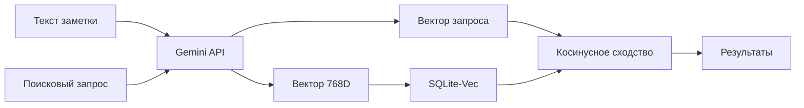

# 🏗️ Архитектура POC: Семантический поиск на SQLite

> Добро пожаловать в документацию проекта! Здесь объясняется, как работает векторный поиск от начала до конца.

---

## 📖 Оглавление

### 🎓 Основы

1. [**Что такое эмбеддинги?**](01_embeddings_basics.md)  
   Векторные представления текста и почему они работают

2. [**Gemini API для эмбеддингов**](02_gemini_api.md)  
   Модели, лимиты, task types и MRL

3. [**SQLite-Vec: хранение векторов**](03_sqlite_vec.md)  
   Как расширение sqlite-vec работает с BLOB

---

### 🔍 Поиск

4. [**Типы поиска**](04_search_types.md)  
   Векторный, полнотекстовый и их отличия

5. [**Гибридный поиск (RRF)**](05_hybrid_search_rrf.md)  
   Reciprocal Rank Fusion — лучшее из двух миров

---

### 🏛️ Архитектура проекта (старая версия)

6. [**Структура проекта**](06_project_architecture.md)  
   Разделение на semantic_core и domain (прежняя архитектура)

7. [**Поток данных: от текста до результата**](07_data_flow.md)  
   Полный цикл: добавление → индексация → поиск (прежняя архитектура)

---

### ✂️ Работа с большими документами

8. [**Стратегия нарезки (Chunking)**](08_chunking_strategy.md)  
   Как обойти лимит 2000 токенов с помощью SimpleTextSplitter

9. [**Parent-Child Retrieval**](09_parent_child_retrieval.md)  
   Ищем по чанкам, возвращаем целые документы

---

### 🏗️ SOLID Рефакторинг (новая архитектура)

10. [**SOLID Архитектура (Фаза 1)**](10_solid_refactoring.md)  
    От прототипа к библиотеке: разделение на независимые слои

---

## 🚀 Быстрый старт

```bash
# Установка зависимостей
poetry install

# Настройка .env
cp .env.example .env
# Добавь свой GEMINI_API_KEY

# Запуск тестов
poetry run python main.py
```

---

## 📊 Ключевые концепции



---

## 💡 Зачем это нужно?

Обычный поиск по ключевым словам **не понимает смысл**:

- Запрос "как написать цикл" **не найдёт** заметку про "for loop"
- Запрос "рецепт борща" **не найдёт** заметку про "украинский суп"

**Семантический поиск** решает эту проблему, находя по **смыслу**, а не по буквам!

---

## 🎯 Начни отсюда

1. Сначала прочитай [**Что такое эмбеддинги**](01_embeddings_basics.md)
2. Потом изучи [**Как работает Gemini API**](02_gemini_api.md)
3. Дальше по порядку из оглавления ⬆️

---

**← [Вернуться в README](../../README.md)**

Приятного изучения! 🚀
