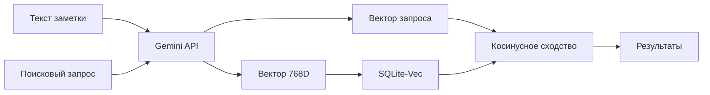

# 🏗️ Архитектура POC: Семантический поиск на SQLite

> Добро пожаловать в документацию проекта! Здесь объясняется, как работает векторный поиск от начала до конца.

---

## 📝 Руководство по стилю

**[Как писать документацию в этом пакете](00_documentation_style_guide.md)**  
Минимум кода, максимум объяснений — стандарт для всех документов серии

---

## 🗺 Навигация по фазам проекта

Проект развивался итеративно через **14 фаз**. Каждая фаза решала конкретную архитектурную задачу и документирована отдельно.

---

### 📚 Phase 0: Basics & Legacy

**[Phase 0: Basics](phase_0_basics/)** — Основы семантического поиска *(файлы не созданы)*  
Эмбеддинги, SQLite-Vec, типы поиска, RRF

**[Phase 0: LEGACY](phase_0_legacy/)** — Старая архитектура до SOLID  
Monolithic design, SimpleTextSplitter, прежний data flow

---

### 🏗️ Phase 1-3: SOLID Foundation

**[Phase 1: SOLID Refactoring](phase_1_solid/)**  
Превращение прототипа в библиотеку: интерфейсы, DI, чистая архитектура

**[Phase 2: Storage Layer](phase_2_storage/)**  
PeeweeVectorStore с гибридным поиском, RRF и фильтрацией по метаданным

**[Phase 3: Integration Layer](phase_3_integration/)**  
Descriptor magic для `Article.search`, автоиндексация через method patching

---

### 🧠 Phase 4: Smart Parsing

**[Phase 4: Smart Parsing & Granular Search](phase_4_smart_parsing/)**  
AST-парсинг Markdown, изоляция кода, иерархический контекст, chunk-level поиск

---

### 💰 Phase 5: Batching & Economics

**[Phase 5: Async Batching & Cost Optimization](phase_5_batching/)**  
Асинхронная векторизация, Google Batch API (50% экономия), production optimizations

---

### 🖼️ Phase 6: Multimodal

**[Phase 6: Multimodal Processing](phase_6_multimodal/)**  
Обработка изображений, аудио и видео через Gemini Vision/Audio API, resilience patterns

---

### 📊 Phase 7-8: Operations

**[Phase 7: Observability Layer](phase_7_observability/)**  
Семантическое логирование с эмодзи, secret redaction, context propagation

**[Phase 8: CLI & Configuration](phase_8_cli/)**  
Production-ready CLI (Typer + Rich), единая конфигурация через TOML + env

---

### 🤖 Phase 9: RAG

**[Phase 9: RAG Integration](phase_9_rag/)**  
Retrieval-Augmented Generation, LLM provider abstraction, интерактивный чат с slash-командами

---

### 🔄 Phase 10-11: Production Polish

**[Phase 10: Batch API Integration](phase_10_batch_api/)**  
Реальный Batch API клиент, миграция на text-embedding-004

**[Phase 11: Documentation](phase_11_documentation/)**  
Кросс-платформенная совместимость (Windows), публичная документация, truthiness trap

---

### 🌐 Phase 12: Flask Web

**[Phase 12: Flask Web Application](phase_12_flask/)** *(в паузе, отдельная ветка)*  
Веб-интерфейс для поиска, загрузки документов, RAG-чата с HTMX

---

### 🏁 Phase 13-14: Total Audit & Crisis Fix

**[Phase 13: Total Visual Check](phase_13_audit/)**  
E2E аудит всех систем, FTS refactoring, context window, embedding cache integration

**[Phase 14: Media Content Crisis](phase_14_media_crisis/)** *(в разработке)*  
Multi-chunk media architecture, multilingual analysis, SmartSplitter для OCR

---

## 🚀 Быстрый старт

```bash
# Установка зависимостей
poetry install

# Настройка .env
cp .env.example .env
# Добавь свой GEMINI_API_KEY

# Основные команды CLI
semantic ingest notes/           # Загрузить документы
semantic search "SOLID principles"  # Поиск
semantic chat                    # RAG-чат
```

---

## 📊 Ключевые концепции



---

## 💡 Зачем это нужно?

Обычный поиск по ключевым словам **не понимает смысл**:

- Запрос "как написать цикл" **не найдёт** заметку про "for loop"
- Запрос "рецепт борща" **не найдёт** заметку про "украинский суп"

**Семантический поиск** решает эту проблему, находя по **смыслу**, а не по буквам!

---

## 🎯 Рекомендуемый порядок изучения

**Для новичков:**
1. [Phase 0: Basics](phase_0_basics/) — базовые концепции *(если файлы будут созданы)*
2. [Phase 1: SOLID](phase_1_solid/) — архитектурные принципы
3. [Phase 2: Storage](phase_2_storage/) — как работает поиск
4. [Phase 4: Smart Parsing](phase_4_smart_parsing/) — обработка контента

**Для разработчиков:**
1. [Phase 1-3](phase_1_solid/) — архитектурный фундамент
2. [Phase 5](phase_5_batching/) — production оптимизации
3. [Phase 7-8](phase_7_observability/) — operations и CLI
4. [Phase 13](phase_13_audit/) — реальные проблемы и решения

**Для пользователей медиа:**
1. [Phase 6: Multimodal](phase_6_multimodal/) — обработка изображений, аудио, видео
2. [Phase 14: Media Crisis](phase_14_media_crisis/) — multi-chunk архитектура
3. [Phase 4: Smart Parsing](phase_4_smart_parsing/) — SmartSplitter для кода

**Для RAG applications:**
1. [Phase 9: RAG Integration](phase_9_rag/) — вопрос-ответ к базе знаний
2. [Phase 12: Flask](phase_12_flask/) — веб-интерфейс для RAG
3. [Phase 13: Embedding Cache](phase_13_audit/) — оптимизация запросов

---

## 📚 Другие ресурсы

- **[Публичная документация](../../docs/README.md)** — гайды для пользователей библиотеки
- **[Планы фаз](../ideas/)** — технические отчёты по каждой фазе разработки
- **[Тесты](../../tests/README.md)** — 645+ unit/integration/e2e тестов

---

**← [Вернуться в README](../../README.md)**

Приятного изучения! 🚀
