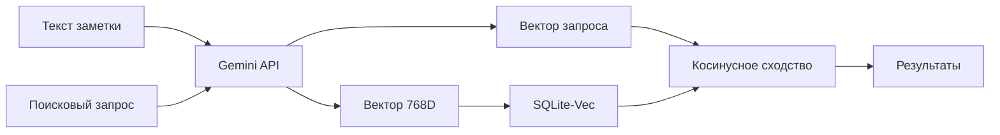

# 🏗️ Архитектура POC: Семантический поиск на SQLite

> Добро пожаловать в документацию проекта! Здесь объясняется, как работает векторный поиск от начала до конца.

---

## 📝 Руководство по стилю

**[Как писать документацию в этом пакете](00_documentation_style_guide.md)**  
Минимум кода, максимум объяснений — стандарт для всех документов серии

---

## 📖 Оглавление

### 🎓 Основы

1. [**Что такое эмбеддинги?**](01_embeddings_basics.md)  
   Векторные представления текста и почему они работают

2. [**Gemini API для эмбеддингов**](02_gemini_api.md)  
   Модели, лимиты, task types и MRL

3. [**SQLite-Vec: хранение векторов**](03_sqlite_vec.md)  
   Как расширение sqlite-vec работает с BLOB

---

### 🔍 Поиск

4. [**Типы поиска**](04_search_types.md)  
   Векторный, полнотекстовый и их отличия

5. [**Гибридный поиск (RRF)**](05_hybrid_search_rrf.md)  
   Reciprocal Rank Fusion — лучшее из двух миров

---

### 🏛️ [LEGACY] Старая архитектура (до SOLID рефакторинга)

> ⚠️ **Устарело:** Эти документы описывают архитектуру до Phase 1-3.  
> Актуальная архитектура — см. раздел "SOLID Рефакторинг" ниже.

6. [**[LEGACY] Структура проекта**](06_LEGACY_project_architecture.md)  
   Разделение на semantic_core и domain (прежняя архитектура)

7. [**[LEGACY] Поток данных**](07_LEGACY_data_flow.md)  
   Полный цикл: добавление → индексация → поиск (прежняя архитектура)

8. [**[LEGACY] Стратегия нарезки**](08_LEGACY_chunking_strategy.md)  
   Устаревший SimpleTextSplitter (замена — SmartSplitter)

9. [**[LEGACY] Parent-Child Retrieval**](09_LEGACY_parent_child_retrieval.md)  
   Концепция осталась, реализация изменилась

---

### 🏗️ SOLID Рефакторинг (новая архитектура)

10. [**SOLID Архитектура (Фаза 1)**](10_solid_refactoring.md)  
    От прототипа к библиотеке: разделение на независимые слои

11. [**Storage Layer: Peewee + RRF + Фильтры (Фаза 2)**](11_storage_layer_phase2.md)  
    Реализация хранилища с гибридным поиском и фильтрацией по метаданным

---

### 🎩 Integration Layer: ORM + Семантика (Фаза 3)

12. [**Descriptor Protocol: Магия атрибутов класса**](12_descriptor_protocol.md)  
    Как `Article.search` превращается в объект с методами поиска

13. [**Method Patching: Автоматическая индексация**](13_method_patching.md)  
    Патчинг save() и delete_instance() для автоиндексации без SignalModel

14. [**SearchProxy и DocumentBuilder: От ORM к семантике**](14_orm_to_semantic.md)  
    Превращаем Article в Document, ищем, возвращаем обратно Article

---

### 🧠 Smart Parsing & Granular Search (Фаза 4)

15. [**Smart Parsing Architecture**](15_smart_parsing.md)  
    AST-парсинг Markdown, ChunkType enum, иерархия заголовков и структурные метаданные

16. [**Smart Splitting Strategy**](16_smart_splitting.md)  
    Интеллектуальное разделение контента: изоляция кода, группировка текста, сохранение иерархии

17. [**Hierarchical Context Strategy**](17_hierarchical_context.md)  
    Обогащение эмбеддингов breadcrumbs: от плоских чанков к структурному контексту

18. [**Granular Search & Storage Evolution**](18_granular_search.md)  
    Поиск по индивидуальным чанкам, фильтрация по типу/языку, SQL оптимизация и ChunkResult API

---

### 💰 Async Batching & Cost Optimization (Фаза 5)

19. [**API Key Management: Разделение биллинга**](19_api_key_management.md)  
    GoogleKeyring и изоляция затрат между синхронной и асинхронной векторизацией

20. [**Async Processing: От блокировки к очереди**](20_async_processing.md)  
    Режим mode='async', статусы чанков (PENDING/READY/FAILED) и неблокирующая загрузка

21. [**Google Batch API: 50% экономия**](21_batch_api_economics.md)  
    Почему batch processing дешевле в 2 раза, trade-offs и JSONL формат

22. [**BatchManager: Локальная оркестрация**](22_batch_manager.md)  
    SQLite как очередь задач, flush_queue/sync_status и жизненный цикл батч-заданий

23. [**Schema Evolution: Миграция без downtime**](23_schema_evolution.md)  
    Автоматическое добавление колонок через ALTER TABLE и backward compatibility

24. [**Production Optimizations: От прототипа к масштабу**](24_production_optimizations.md)  
    Partial failures handling, производительность bulk_update_vectors и готовность к миллионам чанков

---

### 🖼️ Multimodal Processing (Фаза 6)

25. [**Media Processing Architecture**](25_media_processing_architecture.md)  
    Архитектура обработки изображений: sync/async режимы, DTO и интеграция в SemanticCore

26. [**Gemini Vision Integration**](26_gemini_vision_integration.md)  
    Анализ изображений через Gemini Vision API: structured JSON output и расчёт токенов

27. [**Resilience Patterns**](27_resilience_patterns.md)  
    Паттерны устойчивости: retry с backoff, классификация ошибок и graceful degradation

28. [**Rate Limiting**](28_rate_limiting.md)  
    Token Bucket алгоритм для контроля RPM и защиты от 429

29. [**Media Queue Processor**](29_media_queue_processor.md)  
    Персистентная очередь задач: MediaTaskModel, пакетная обработка и мониторинг

30. [**Audio Analysis Architecture**](30_audio_analysis_architecture.md)  
    GeminiAudioAnalyzer: транскрипция, 32kbps оптимизация, 83 минуты в одном запросе

31. [**Video Multimodal Analysis**](31_video_multimodal_analysis.md)  
    GeminiVideoAnalyzer: кадры + аудио в одном запросе, режимы извлечения кадров

32. [**Media Optimization Strategies**](32_media_optimization_strategies.md)  
    Утилиты audio.py/video.py: сжатие, пресеты качества, FFmpeg dependency

33. [**Markdown-Media Integration**](33_markdown_media_integration.md)  
    Обогащение IMAGE_REF чанков через Vision API: контекст из документа, резолв путей

34. [**Audio & Video in Markdown**](34_audio_video_in_markdown.md)  
    Детекция аудио/видео ссылок по расширению, AUDIO_REF и VIDEO_REF чанки

---

### 📊 Observability Layer (Фаза 7)

35. [**Semantic Logging Architecture**](35_semantic_logging.md)  
    Dual-mode logging: Console (INFO+) для разработчика, File (TRACE) для AI-агентов

36. [**Visual Semantics in Logs**](36_visual_semantics_logs.md)  
    EMOJI_MAP: мгновенная идентификация модуля и уровня через эмодзи

37. [**Context Propagation with bind()**](37_context_propagation.md)  
    Проброс batch_id, doc_id через весь pipeline без thread-local storage

38. [**Secret Redaction in Logs**](38_secret_redaction.md)  
    SensitiveDataFilter: автоматическое маскирование API-ключей

39. [**Diagnostics & Debugging**](39_diagnostics_debugging.md)  
    dump_debug_info(), check_config(), trace_ai() и error_with_context()

---

### 🖥 CLI & Configuration (Фаза 8)

40. [**Unified Configuration**](40_unified_configuration.md)  
    SemanticConfig: Pydantic Settings с TOML + env, единый источник правды

41. [**CLI Architecture**](41_cli_architecture.md)  
    Typer + Rich: быстрый --help, lazy initialization, красивый вывод

42. [**CLI Commands**](42_cli_commands.md)  
    ingest, search, docs — три основные команды для повседневной работы

43. [**Queue & Worker Commands**](43_queue_worker_commands.md)  
    queue status/flush/retry, worker run-once/start — операционные команды для async-обработки

---

### 🤖 RAG Integration (Фаза 9)

44. [**RAG Engine Architecture**](44_rag_engine_architecture.md)  
    Оркестратор вопрос-ответа: поиск → контекст → LLM → ответ с источниками

45. [**LLM Provider Abstraction**](45_llm_provider_abstraction.md)  
    BaseLLMProvider интерфейс, GeminiLLMProvider и возможность подключить любую LLM

46. [**RAG Chat CLI**](46_rag_chat_cli.md)  
    Интерактивный REPL для вопросов к базе знаний из терминала

47. [**Chat History Management**](47_chat_history_management.md)  
    Управление историей чата: стратегии LastNMessages, TokenBudget и автотримминг

48. [**Context Compression**](48_context_compression.md)  
    Сжатие истории через LLM summarization: ContextCompressor и AdaptiveWithCompression

49. [**Slash Commands**](49_slash_commands.md)  
    Интерактивные команды чата: /search, /sources, /model и управление сессией

---

### 🔄 Batch API Integration (Фаза 10)

50. [**Batch API: От заглушки к реальности**](50_batch_api_implementation.md)  
    Реализация GeminiBatchClient, новый SDK, формат JSONL и проблема совместимости моделей

51. [**Миграция на gemini-embedding-001**](51_model_migration.md)  
    Почему нельзя смешивать модели, MRL и план полной переиндексации

---

### 📚 Documentation (Фаза 11)

52. [**Documentation Architecture**](52_documentation_architecture.md)  
    Две папки doc/ и docs/: разделение аудиторий, стилевые правила, структура публичной документации

53. [**Cross-Platform Compatibility: Windows Support**](53_windows_compatibility.md)  
    Python версии, CLI-парсинг, PowerShell vs Bash, пути и кодировки

54. [**Python Truthiness Trap: Когда пустой объект — не None**](54_python_truthiness_trap.md)  
    Коварный баг с `__len__()` и `if not obj:`, E2E тесты для слэш-команд

---

### 🌐 Flask Web Application (Фаза 12)

55. [**Flask Integration**](55_flask_integration.md)  
    Интеграция SemanticCore в веб-приложение: Application Factory, DI через extensions, HTTP logging

56. [**Query Cache Architecture**](56_query_cache.md)  
    Кэширование эмбеддингов запросов: экономия API-вызовов, автокомплит, статистика

57. [**Search Interface Architecture**](57_search_interface.md)  
    HTMX + Flask: интеллектуальный поиск с фильтрами, Markdown рендеринг, Score визуализация

58. [**Content Management Architecture**](58_content_management.md)  
    Drag-n-Drop загрузка, UUID-именование, sync/async индексация, управление документами

59. [**RAG Chat Web Architecture**](59_rag_chat_web.md)  
    Интерактивный чат через HTMX, персистентные сессии, визуализация источников

---

## 🚀 Быстрый старт

```bash
# Установка зависимостей
poetry install

# Настройка .env
cp .env.example .env
# Добавь свой GEMINI_API_KEY

# Запуск тестов
poetry run python main.py
```

---

## 📊 Ключевые концепции



---

## 💡 Зачем это нужно?

Обычный поиск по ключевым словам **не понимает смысл**:

- Запрос "как написать цикл" **не найдёт** заметку про "for loop"
- Запрос "рецепт борща" **не найдёт** заметку про "украинский суп"

**Семантический поиск** решает эту проблему, находя по **смыслу**, а не по буквам!

---

## 🎯 Начни отсюда

1. Сначала прочитай [**Что такое эмбеддинги**](01_embeddings_basics.md)
2. Потом изучи [**Как работает Gemini API**](02_gemini_api.md)
3. Дальше по порядку из оглавления ⬆️

---

**← [Вернуться в README](../../README.md)**

Приятного изучения! 🚀
