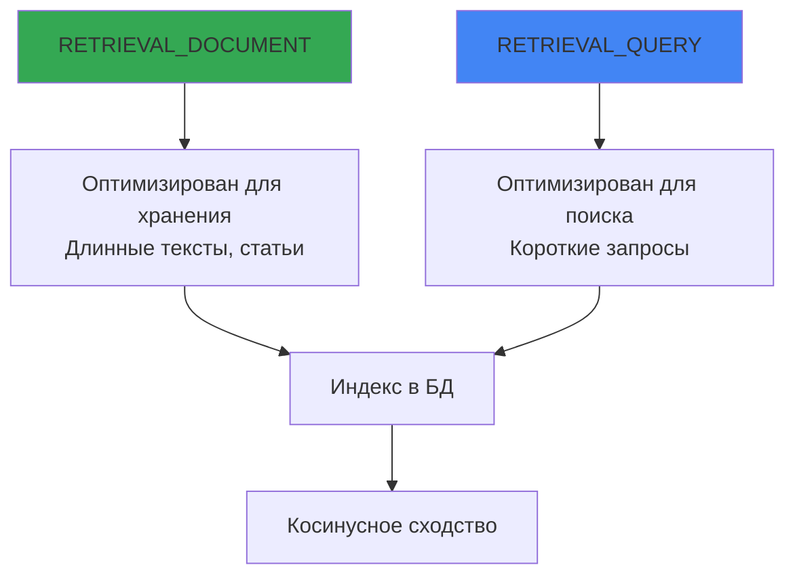
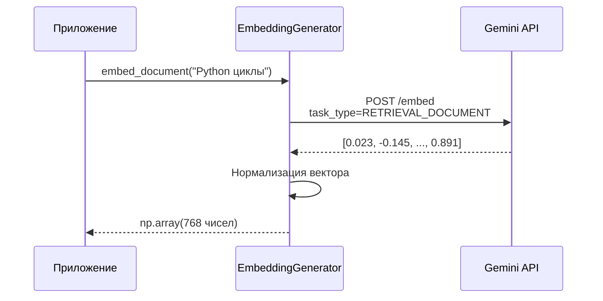

# 🤖 Gemini API для генерации эмбеддингов

## 📌 Что используется в проекте

Мы используем **Google Gemini API** (через AI Studio) для генерации векторов.

**Модель**: `models/text-embedding-004`  
**Библиотека**: `google-generativeai` (Python SDK)

---

## 🔑 Настройка API

### 1. Получение API-ключа

1. Перейди на [Google AI Studio](https://aistudio.google.com/apikey)
2. Создай новый API-ключ
3. Добавь в `.env`:

```env
GEMINI_API_KEY=твой_ключ_здесь
```

### 2. Инициализация в коде

```python
# config.py
from pydantic_settings import BaseSettings

class Settings(BaseSettings):
    gemini_api_key: str  # Обязательный параметр
    embedding_model: str = "models/text-embedding-004"
    embedding_dimension: int = 768  # MRL-режим
```

---

## 🎯 Task Types: асимметричный поиск

Gemini поддерживает **разные типы задач** для оптимизации векторов:

```python
from semantic_core import EmbeddingGenerator

gen = EmbeddingGenerator()

# Для документов (то, что индексируем)
doc_vector = gen.embed_document("Python — язык программирования")
# task_type="RETRIEVAL_DOCUMENT"

# Для запросов (то, что ищем)
query_vector = gen.embed_query("как написать цикл?")
# task_type="RETRIEVAL_QUERY"
```

### 📊 Разница между task types



**Почему это важно?**
- Запросы обычно **короткие** ("найди рецепт борща")
- Документы — **длинные** (вся статья о борще)
- Разные task types учитывают эту асимметрию!

---

## 📏 Размерность векторов (MRL)

### Matryoshka Representation Learning

Gemini поддерживает **уменьшение размерности** без потери качества:

```python
# Полная размерность (не используем)
full_vector = gen.embed_document(text)  # 768 чисел

# MRL: обрезаем до 768 (уже реализовано в API)
# output_dimensionality=768
```

**Наш выбор**: 768 измерений (оптимальный баланс скорость/качество)

| Размерность | Качество | Скорость | Размер БД |
|-------------|----------|----------|-----------|
| 256         | ⭐⭐      | 🚀🚀🚀    | 💾        |
| **768**     | ⭐⭐⭐    | 🚀🚀      | 💾💾      |
| 3072        | ⭐⭐⭐⭐  | 🚀        | 💾💾💾💾  |

---

## ⚠️ Важные лимиты

### 1. **Лимит токенов на запрос: ~2000**

```python
# ❌ Слишком длинный текст (>2000 токенов)
huge_text = "..." * 10000
vector = gen.embed_document(huge_text)  # Может обрезаться!

# ✅ Разумный размер
normal_text = "Python — язык программирования для анализа данных"
vector = gen.embed_document(normal_text)
```

**Рекомендация**: Для длинных документов используй chunking (разбивку на части).

### 2. **Rate Limits (бесплатный tier)**

- **15 запросов в минуту**
- **1500 запросов в день**

Для production нужен платный API или другая модель.

---

## 🔢 Пример работы с API

### Реализация в проекте

```python
# semantic_core/embeddings.py
import google.generativeai as genai

class EmbeddingGenerator:
    def __init__(self):
        genai.configure(api_key=settings.gemini_api_key)
        self.model_name = "models/text-embedding-004"
        self.dimension = 768
    
    def embed_document(self, text: str) -> np.ndarray:
        result = genai.embed_content(
            model=self.model_name,
            content=text,
            task_type="RETRIEVAL_DOCUMENT",  # ← Для индексации
            output_dimensionality=self.dimension  # ← MRL
        )
        
        embedding = np.array(result['embedding'], dtype=np.float32)
        return self._normalize_vector(embedding)
    
    def embed_query(self, text: str) -> np.ndarray:
        result = genai.embed_content(
            model=self.model_name,
            content=text,
            task_type="RETRIEVAL_QUERY",  # ← Для поиска
            output_dimensionality=self.dimension
        )
        
        embedding = np.array(result['embedding'], dtype=np.float32)
        return self._normalize_vector(embedding)
```

---

## 📊 Поток данных



---

## 🎓 Альтернативные модели

### Можно использовать:

| Модель | Размерность | Лимит токенов | Цена |
|--------|-------------|---------------|------|
| **text-embedding-004** | 768 (MRL) | ~2000 | Free/Paid |
| text-embedding-005 (будущее) | 1024? | ? | ? |
| OpenAI text-embedding-3-small | 1536 | 8191 | $0.02/1M |
| Sentence Transformers (локально) | 384-768 | ∞ | Бесплатно |

**Для POC**: Gemini отлично подходит (быстро, бесплатно, качественно).

---

## ⚙️ Без классификации

**Важно**: `text-embedding-004` — это **только эмбеддинг-модель**, без встроенной классификации.

Если нужна классификация (например, определить категорию текста), используй отдельную модель:
```python
# Это НЕ наш случай!
# genai.classify_text(...)  # Такого метода нет
```

Наш поиск основан **только на векторном сходстве**, без предопределённых категорий.

---

## 🔗 Следующий шаг

Теперь узнай, [**как векторы хранятся в SQLite**](03_sqlite_vec.md) →
