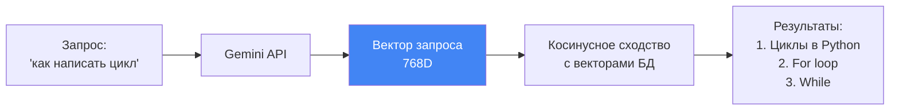

# 🔎 Типы поиска: векторный vs полнотекстовый

## 📌 Два подхода к поиску

В нашем проекте используется **гибридный поиск**, комбинирующий два метода:

1. **Векторный поиск** (семантический) — по смыслу
2. **Полнотекстовый поиск** (FTS5) — по ключевым словам

---

## 🧠 Векторный поиск (Semantic Search)

### Суть

Ищет по **смыслу**, а не по точным словам.

```python
results = Note.vector_search("как написать цикл", limit=5)
```

### Как работает



### SQL-запрос

```sql
SELECT 
    main.id,
    vec_distance_cosine(vec.embedding, ?) as distance
FROM notes main
INNER JOIN notes_vec vec ON main.id = vec.id
ORDER BY distance ASC
LIMIT 5;
```

### Примеры

| Запрос | Найдёт |
|--------|--------|
| "цикл в программировании" | "for loop", "while", "итерация" |
| "рецепт борща" | "украинский суп", "свекла", "варка" |
| "AI ассистент" | "ChatGPT", "виртуальный помощник", "бот" |

### Плюсы ✅

- **Понимает синонимы**: "цикл" = "loop" = "итерация"
- **Кросс-языковой**: "собака" близко к "dog"
- **Учитывает контекст**: "банк денег" ≠ "банк скамейка"

### Минусы ❌

- **Медленнее FTS** (линейное сканирование)
- **Нет точного совпадения**: может пропустить редкие термины
- **Зависит от API**: нужен интернет для Gemini

---

## 📝 Полнотекстовый поиск (FTS5)

### Суть

Ищет **точные слова и их формы** через инвертированный индекс.

```python
results = Note.fulltext_search("скрипт", limit=5)
```

### Как работает


### SQL-запрос

```sql
SELECT 
    main.id,
    fts.rank as rank
FROM notes main
INNER JOIN notes_fts fts ON main.id = fts.rowid
WHERE notes_fts MATCH 'скрипт'
ORDER BY rank
LIMIT 5;
```

### Создание FTS-таблицы

```sql
CREATE VIRTUAL TABLE notes_fts USING fts5(
    id UNINDEXED,
    title,
    content,
    content=notes,
    content_rowid=id
);
```

**Автообновление через триггеры**:

```sql
CREATE TRIGGER notes_fts_insert 
AFTER INSERT ON notes BEGIN
    INSERT INTO notes_fts(rowid, title, content)
    VALUES (new.id, new.title, new.content);
END;
```

### Синтаксис FTS5

```python
# Простой поиск
Note.fulltext_search("python")

# Логические операторы
Note.fulltext_search("python AND цикл")
Note.fulltext_search("python OR javascript")
Note.fulltext_search("python NOT java")

# Префиксный поиск
Note.fulltext_search("програм*")  # программирование, программа

# Фразовый поиск
Note.fulltext_search('"for loop"')
```

### Плюсы ✅

- **Очень быстрый**: O(log n) через индекс
- **Точное совпадение**: найдёт редкие термины
- **Не нужен интернет**: всё локально
- **Поддержка морфологии**: "программа" найдёт "программирование"

### Минусы ❌

- **Не понимает синонимы**: "цикл" ≠ "loop"
- **Нет семантики**: "борщ" не найдёт "украинский суп"
- **Чувствителен к формулировке**: "как написать цикл" ≠ "создание циклов"

---

## ⚖️ Сравнение

| Критерий | Векторный поиск | Полнотекстовый FTS5 |
|----------|-----------------|---------------------|
| **Скорость** | 🐢 Медленно (50-300ms) | 🚀 Быстро (<10ms) |
| **Синонимы** | ✅ Понимает | ❌ Не понимает |
| **Точность** | ⭐⭐⭐ Смысловая | ⭐⭐⭐⭐ Буквальная |
| **Интернет** | ⚠️ Нужен (Gemini) | ✅ Не нужен |
| **Редкие термины** | ❌ Может пропустить | ✅ Найдёт точно |
| **Размер БД** | +3KB на вектор | +~30% на индекс |

---

## 🎯 Когда использовать что?

### Векторный поиск

- **Вопросно-ответные системы**: "как сделать X?"
- **Семантический анализ**: "найди похожие статьи"
- **Кросс-языковой поиск**: русский запрос → английские статьи

### Полнотекстовый поиск

- **Поиск по тегам**: "#срочно", "#код"
- **Точные термины**: "SQLAlchemy", "React.useEffect"
- **Префиксы**: "програм*" → программирование

### Гибридный поиск (наш подход!)

Комбинирует оба метода через **RRF** (Reciprocal Rank Fusion):
- FTS5 находит точные совпадения (#срочно)
- Вектор находит по смыслу (скрипт обработки данных)
- RRF объединяет результаты → **лучшее из двух миров**!

---

## 📊 Пример результатов

**Запрос**: "срочный скрипт"

### Только векторный поиск

```
1. Улучшение алгоритма поиска     (близко по смыслу к "скрипт")
2. Скрипт обработки данных        (точное слово "скрипт")
3. Циклы в Python                 (тоже про код)
```

### Только FTS5

```
1. Скрипт обработки данных  (#срочно, "скрипт" — оба слова есть!)
2. (других результатов может не быть)
```

### Гибридный (RRF)

```
1. Скрипт обработки данных        (топ в обоих методах!)
2. Улучшение алгоритма поиска     (#срочно найден через FTS)
3. Циклы в Python                 (вектор + релевантность)
```

---

## 🔗 Следующий шаг

Узнай подробнее, [**как работает гибридный поиск (RRF)**](05_hybrid_search_rrf.md) →
