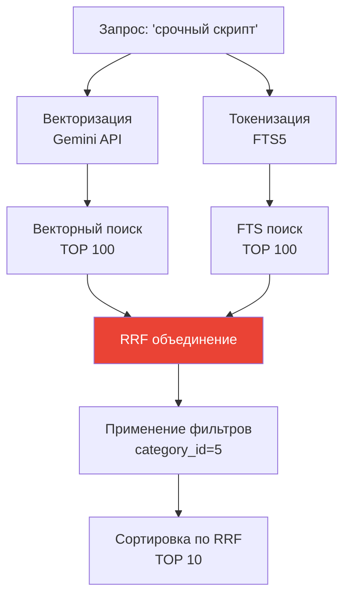

# ⚡ Гибридный поиск и RRF (Reciprocal Rank Fusion)

## 📌 Проблема: один метод не идеален

**Векторный поиск**:

- ✅ Понимает синонимы
- ❌ Может пропустить редкие термины

**Полнотекстовый FTS**:

- ✅ Находит точные слова
- ❌ Не понимает синонимы

**Решение**: объединить оба метода! 🎯

---

## 🎯 Что такое RRF?

**Reciprocal Rank Fusion** — алгоритм объединения результатов из разных источников.

### Формула

```
RRF_score(doc) = Σ 1 / (k + rank_i)
```

Где:

- `k` = константа (обычно 60)
- `rank_i` = позиция документа в i-м методе поиска

---

## 📊 Пример работы RRF

**Запрос**: "срочный скрипт"

### Результаты векторного поиска

| Позиция | Документ | Score |
|---------|----------|-------|
| 1 | Улучшение алгоритма | 1/(60+1) = 0.0164 |
| 2 | Скрипт обработки | 1/(60+2) = 0.0161 |
| 3 | Циклы в Python | 1/(60+3) = 0.0159 |

### Результаты FTS5

| Позиция | Документ | Score |
|---------|----------|-------|
| 1 | Скрипт обработки | 1/(60+1) = 0.0164 |
| 2 | Улучшение алгоритма | 1/(60+2) = 0.0161 |

### Объединение (RRF)

```
Скрипт обработки:
  0.0161 (вектор, ранг=2) + 0.0164 (FTS, ранг=1) = 0.0325

Улучшение алгоритма:
  0.0164 (вектор, ранг=1) + 0.0161 (FTS, ранг=2) = 0.0325

Циклы в Python:
  0.0159 (вектор, ранг=3) + 0 (нет в FTS) = 0.0159
```

**Итоговый порядок**:

1. **Скрипт обработки** (0.0325) — топ в обоих!
2. Улучшение алгоритма (0.0325)
3. Циклы в Python (0.0159)

---

## 🔧 Реализация в SQL

### Запрос с CTE (Common Table Expressions)

```sql
WITH vector_results AS (
    -- Векторный поиск
    SELECT 
        main.id,
        ROW_NUMBER() OVER (ORDER BY vec_distance_cosine(vec.embedding, ?)) as rank
    FROM notes main
    INNER JOIN notes_vec vec ON main.id = vec.id
    LIMIT 100
),
fts_results AS (
    -- Полнотекстовый поиск
    SELECT 
        main.id,
        ROW_NUMBER() OVER (ORDER BY fts.rank) as rank
    FROM notes main
    INNER JOIN notes_fts fts ON main.id = fts.rowid
    WHERE notes_fts MATCH ?
    LIMIT 100
),
rrf_scores AS (
    -- RRF объединение
    SELECT 
        COALESCE(v.id, f.id) as id,
        (COALESCE(1.0 / (60 + v.rank), 0) + COALESCE(1.0 / (60 + f.rank), 0)) as rrf_score
    FROM vector_results v
    FULL OUTER JOIN fts_results f ON v.id = f.id
)
SELECT id, rrf_score
FROM rrf_scores
ORDER BY rrf_score DESC
LIMIT 10;
```

---

## 🐍 Реализация в Python

### Код из проекта

```python
# semantic_core/search_mixin.py

@classmethod
def hybrid_search(cls, query: str, limit: int = 10, k: int = 60, **filters):
    """Гибридный поиск с RRF."""
    
    # Генерация векторов
    generator = EmbeddingGenerator()
    query_embedding = generator.embed_query(query)
    query_blob = generator.vector_to_blob(query_embedding)
    
    # Фильтры (например, category_id=5)
    where_conditions = []
    where_params = []
    for field, value in filters.items():
        where_conditions.append(f"main.{field} = ?")
        where_params.append(value)
    
    where_clause = f"WHERE {' AND '.join(where_conditions)}" if where_conditions else ""
    
    # SQL с CTE и RRF
    sql = f"""
        WITH vector_results AS (
            SELECT main.id, ROW_NUMBER() OVER (...) as rank
            FROM {table_name} main
            INNER JOIN {vector_table} vec ON main.id = vec.id
            {where_clause}
            LIMIT 100
        ),
        fts_results AS (
            SELECT main.id, ROW_NUMBER() OVER (...) as rank
            FROM {table_name} main
            INNER JOIN {fts_table} fts ON main.id = fts.rowid
            WHERE {fts_table} MATCH ?
            {f"AND {' AND '.join(where_conditions)}" if where_conditions else ""}
            LIMIT 100
        ),
        rrf_scores AS (
            SELECT 
                COALESCE(v.id, f.id) as id,
                (COALESCE(1.0 / (? + v.rank), 0) + COALESCE(1.0 / (? + f.rank), 0)) as rrf_score
            FROM vector_results v
            FULL OUTER JOIN fts_results f ON v.id = f.id
        )
        SELECT id, rrf_score
        FROM rrf_scores
        ORDER BY rrf_score DESC
        LIMIT ?
    """
    
    params = [query_blob] + where_params + [query] + where_params + [k, k, limit]
    cursor = db.obj.execute_sql(sql, params)
    
    return results
```

---

## 🎯 Фасетный поиск (с фильтрами)

### Пример: поиск только в категории "Рецепты"

```python
cat_recipes = Category.get(Category.name == "Рецепты")

results = Note.hybrid_search(
    "вкусный рецепт",
    limit=5,
    category_id=cat_recipes.id  # ← Фильтр!
)
```

**SQL с WHERE**:

```sql
WITH vector_results AS (
    SELECT ...
    FROM notes main
    WHERE main.category_id = ?  -- ← Фильтр
    ...
)
```

**Результат**: найдёт только "Борщ" и "Паста Карбонара" (обе в категории "Рецепты").

---

## 📊 Поток данных



---

## 🎓 Преимущества гибридного поиска

### 1. **Робастность**

Если один метод промахнулся, второй подстрахует:

```python
# Запрос: "нейронка для картинок"
# Вектор: найдёт "CNN", "компьютерное зрение", "deep learning"
# FTS: найдёт точное слово "нейронка" (если есть)
# RRF: объединит → лучший результат!
```

### 2. **Релевантность**

Документы, найденные **обоими** методами, поднимаются наверх:

```python
# Скрипт обработки данных (#код, #срочно)
# - Вектор: близко по смыслу к "срочный скрипт"
# - FTS: точно содержит оба слова
# → RRF score самый высокий!
```

### 3. **Гибкость**

Можно добавлять новые источники (например, поиск по графу):

```python
rrf_score = 1/(k+vec_rank) + 1/(k+fts_rank) + 1/(k+graph_rank)
```

---

## ⚙️ Настройка параметров

### Параметр `k` (константа RRF)

```python
# k = 60 (стандарт)
results = Note.hybrid_search("запрос", k=60)

# k = 10 (сильнее влияет ранг)
results = Note.hybrid_search("запрос", k=10)

# k = 100 (меньше влияет ранг)
results = Note.hybrid_search("запрос", k=100)
```

**Рекомендация**: оставить `k=60` (проверено на практике).

### Лимит результатов

```python
# TOP 100 для каждого метода (потом RRF)
LIMIT 100 в CTE

# Итоговый лимит (после RRF)
LIMIT ? в финальном SELECT
```

---

## 📈 Производительность

### Тесты на 10,000 заметок

| Метод | Время |
|-------|-------|
| Только вектор | ~50 ms |
| Только FTS | ~5 ms |
| **Гибридный (RRF)** | **~60 ms** |

**Вывод**: RRF добавляет минимальные накладные расходы!

---

## 🔗 Следующий шаг

Теперь изучи [**архитектуру проекта**](06_project_architecture.md) и как всё организовано →
