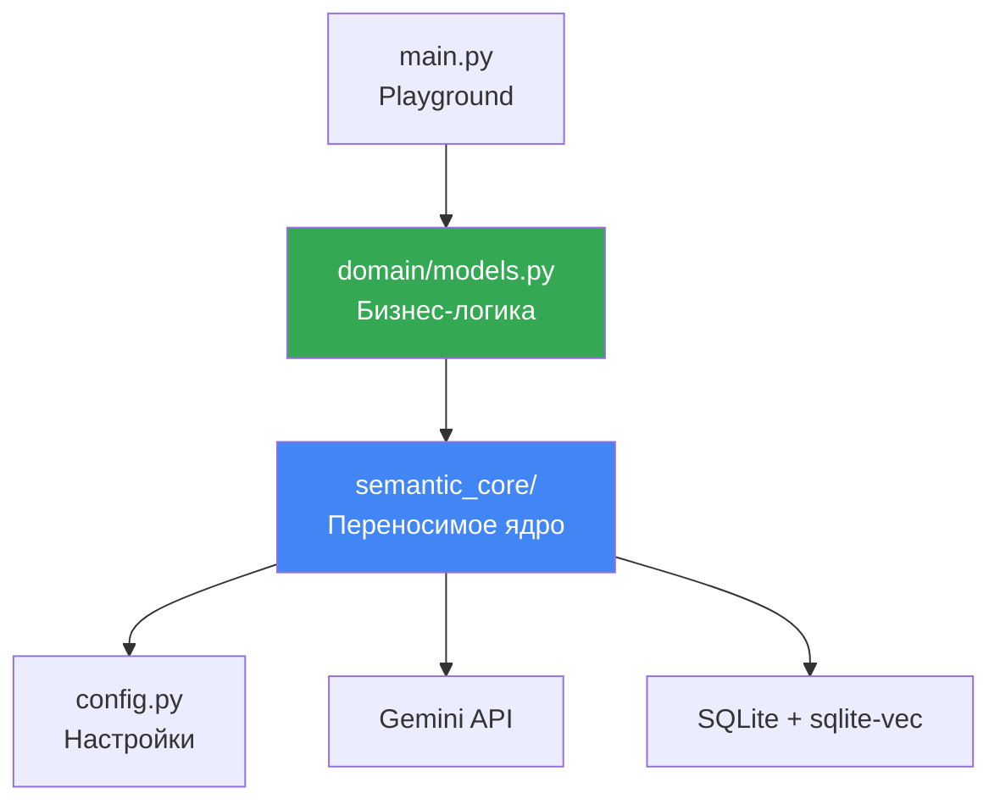
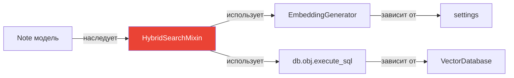
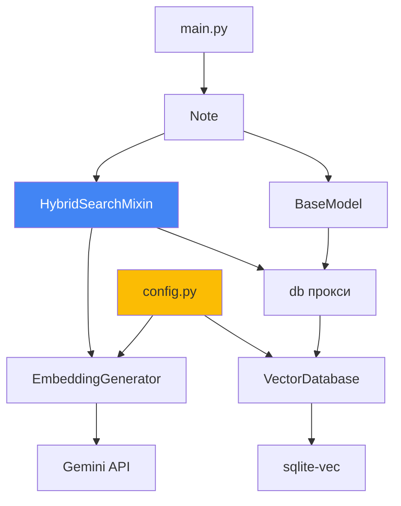

# 🏛️ Архитектура проекта: разделение на слои

## 📌 Философия: SOLID + DRY + YAGNI

Проект построен по принципам:
- **SRP** (Single Responsibility) — каждый модуль отвечает за одно
- **DRY** (Don't Repeat Yourself) — переиспользуемое ядро
- **YAGNI** (You Aren't Gonna Need It) — только необходимое

---

## 📂 Структура проекта

```
poc_vector_sqlite/
│
├── semantic_core/           # ← Переносимое ядро
│   ├── __init__.py
│   ├── database.py          # Инициализация БД + sqlite-vec
│   ├── embeddings.py        # Генерация эмбеддингов через Gemini
│   └── search_mixin.py      # Миксин для добавления поиска
│
├── domain/                  # ← Бизнес-логика (заметки)
│   ├── __init__.py
│   └── models.py            # Note, Category, Tag
│
├── config.py                # ← Настройки через Pydantic
├── main.py                  # ← Playground для тестов
│
├── doc/                     # ← Документация
│   ├── architecture/        # Эта серия документов
│   └── researches/          # Исследования технологий
│
├── pyproject.toml           # Зависимости (Poetry)
├── .env.example             # Шаблон конфигурации
└── .gitignore
```

---

## 🎯 Слои архитектуры



---

## 🧱 Слой 1: semantic_core (переносимое ядро)

### Назначение

**Реюзабельный** пакет для семантического поиска. Можно копировать в другие проекты!

### Модули

#### 1. `database.py` — Инфраструктура БД

```python
from peewee import DatabaseProxy

# Прокси для отложенной инициализации
db = DatabaseProxy()

def init_database(db_path) -> VectorDatabase:
    """Инициализирует БД с sqlite-vec."""
    database = VectorDatabase(db_path, pragmas={...})
    db.initialize(database)  # Привязываем к прокси
    return database

def create_vector_table(model_class):
    """Создаёт виртуальную таблицу vec0."""
    ...

def create_fts_table(model_class, text_columns):
    """Создаёт FTS5 с автообновлением через триггеры."""
    ...
```

**Ответственность**: только подключение и создание таблиц.

#### 2. `embeddings.py` — Генератор векторов

```python
class EmbeddingGenerator:
    def embed_document(self, text: str) -> np.ndarray:
        """task_type=RETRIEVAL_DOCUMENT для индексации."""
        ...
    
    def embed_query(self, text: str) -> np.ndarray:
        """task_type=RETRIEVAL_QUERY для поиска."""
        ...
    
    @staticmethod
    def vector_to_blob(vector: np.ndarray) -> bytes:
        """Конвертация в BLOB для SQLite."""
        return vector.tobytes()
```

**Ответственность**: только работа с Gemini API.

#### 3. `search_mixin.py` — Инъекция поиска

```python
class HybridSearchMixin:
    """Добавляет методы поиска любой Peewee-модели."""
    
    def get_search_text(self) -> str:
        """АБСТРАКТНЫЙ: переопределить в модели!"""
        raise NotImplementedError
    
    def update_vector_index(self):
        """Обновляет векторный индекс для self."""
        ...
    
    @classmethod
    def vector_search(cls, query, limit):
        """Чисто векторный поиск."""
        ...
    
    @classmethod
    def fulltext_search(cls, query, limit):
        """FTS5 поиск."""
        ...
    
    @classmethod
    def hybrid_search(cls, query, limit, **filters):
        """Гибридный RRF поиск с фильтрами."""
        ...
```

**Ответственность**: только логика поиска, без привязки к конкретным моделям.

---

## 🎨 Слой 2: domain (бизнес-логика)

### Назначение

**Конкретная реализация** для вашей предметной области (заметки).

### Модели

```python
# domain/models.py

class Note(HybridSearchMixin, BaseModel):
    """Заметка с семантическим поиском."""
    
    title = CharField()
    content = TextField()
    category = ForeignKeyField(Category)
    
    def get_search_text(self) -> str:
        """Реализация абстрактного метода."""
        return f"Категория: {self.category.name}\n{self.title}\n{self.content}"
```

**Ключевая идея**: `Note` **не знает**, как работает векторный поиск! Миксин инъектирует эту логику.

---

## ⚙️ Слой 3: config.py (настройки)

### Pydantic Settings

```python
from pydantic_settings import BaseSettings

class Settings(BaseSettings):
    gemini_api_key: str  # Обязательный
    sqlite_db_path: Path = Path("./vector_store.db")
    embedding_model: str = "models/text-embedding-004"
    embedding_dimension: int = 768
    
    class Config:
        env_file = ".env"

settings = Settings()
```

**Ответственность**: валидация и загрузка конфигурации из `.env`.

---

## 🧪 Слой 4: main.py (playground)

### Назначение

Тестовый скрипт для проверки всех функций.

### Функции

```python
def initialize_database():
    """Инициализация + создание таблиц."""
    ...

def seed_data():
    """Наполнение тестовыми данными."""
    ...

def test_vector_search():
    """Тест 1: векторный поиск."""
    ...

def test_fulltext_search():
    """Тест 2: FTS5 поиск."""
    ...

def test_faceted_search():
    """Тест 3: фасетный поиск (с фильтром)."""
    ...

def test_hybrid_search():
    """Тест 4: гибридный RRF."""
    ...
```

---

## 🔄 Принцип работы: Dependency Injection



**Миксин** — это "надстройка", которая добавляет функциональность **любой** модели!

---

## 🎓 Пример переноса в другой проект

### Шаг 1: Копируем ядро

```bash
cp -r semantic_core/ ../my_new_project/
cp config.py ../my_new_project/
```

### Шаг 2: Создаём свои модели

```python
# my_new_project/domain/models.py

class Article(HybridSearchMixin, BaseModel):
    """Статья в блоге."""
    
    title = CharField()
    body = TextField()
    author = ForeignKeyField(User)
    
    def get_search_text(self) -> str:
        return f"{self.title}\n{self.body}\nАвтор: {self.author.name}"
```

### Шаг 3: Готово!

```python
# Сразу работает!
Article.hybrid_search("статья про AI", limit=10)
```

**Ноль изменений** в `semantic_core`! 🎉

---

## 📊 Диаграмма зависимостей



---

## ✅ Преимущества такой архитектуры

1. **Переносимость**: `semantic_core` работает везде
2. **Тестируемость**: каждый слой можно тестировать отдельно
3. **Расширяемость**: легко добавить новые модели
4. **Читаемость**: ясно, где что находится

---

## 🔗 Следующий шаг

Теперь проследи [**полный путь данных от текста до результата**](07_data_flow.md) →
