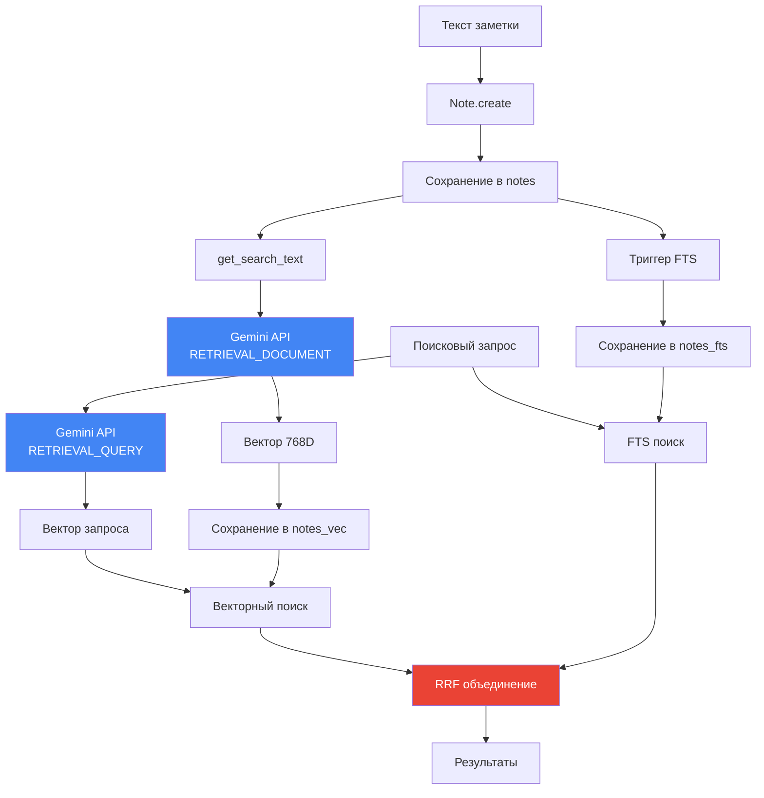

# 🔄 Поток данных: от текста до результата поиска

## 📌 Полный цикл работы системы

Рассмотрим два сценария:
1. **Добавление заметки** (индексация)
2. **Поиск по запросу** (retrieval)

---

## ➕ Сценарий 1: Добавление заметки

### Последовательность шагов

```mermaid
sequenceDiagram
    participant User as Пользователь
    participant Main as main.py
    participant Note as Note модель
    participant Mixin as HybridSearchMixin
    participant Gen as EmbeddingGenerator
    participant API as Gemini API
    participant DB as SQLite
    
    User->>Main: note = Note.create(...)
    Main->>Note: Создание в БД
    Note->>DB: INSERT INTO notes
    
    Main->>Mixin: note.update_vector_index()
    Mixin->>Note: get_search_text()
    Note-->>Mixin: "Категория: Python\nЦиклы в Python\nfor и while..."
    
    Mixin->>Gen: embed_document(text)
    Gen->>API: POST /embed (task=RETRIEVAL_DOCUMENT)
    API-->>Gen: [0.023, -0.145, ..., 0.891]
    Gen->>Gen: Нормализация вектора
    Gen-->>Mixin: np.array(768)
    
    Mixin->>Mixin: vector_to_blob()
    Mixin->>DB: INSERT INTO notes_vec (id, embedding)
    
    Note: Триггеры автообновляют FTS
    DB->>DB: INSERT INTO notes_fts (title, content)
```

### Код

```python
# main.py
note = Note.create(
    title="Циклы в Python",
    content="for и while — основные циклы",
    category=cat_python
)

# Индексация
generator = EmbeddingGenerator()
note.update_vector_index(generator)
```

### Детальный разбор

#### Шаг 1: Создание записи в БД

```python
# domain/models.py
note = Note.create(...)
# SQL: INSERT INTO notes (title, content, category_id) VALUES (?, ?, ?)
```

**Таблицы**:
- ✅ `notes` — запись создана
- ⏳ `notes_vec` — пусто (векторов ещё нет)
- ✅ `notes_fts` — триггер автоматически добавил (title, content)

#### Шаг 2: Формирование текста для индексации

```python
# domain/models.py
def get_search_text(self) -> str:
    return f"Категория: {self.category.name}\n{self.title}\n{self.content}"
```

**Результат**:
```
Категория: Python
Циклы в Python
for и while — основные циклы
```

Контекст категории **улучшает** семантический поиск!

#### Шаг 3: Генерация эмбеддинга

```python
# semantic_core/embeddings.py
vector = gen.embed_document(text)

# Внутри:
result = genai.embed_content(
    model="models/text-embedding-004",
    content=text,
    task_type="RETRIEVAL_DOCUMENT",  # ← Для индексации!
    output_dimensionality=768
)

embedding = np.array(result['embedding'], dtype=np.float32)
embedding = embedding / np.linalg.norm(embedding)  # Нормализация
```

**Результат**: `np.array([0.023, -0.145, ..., 0.891])` — 768 чисел.

#### Шаг 4: Сохранение в векторную таблицу

```python
# semantic_core/search_mixin.py
blob = gen.vector_to_blob(vector)  # vector.tobytes()

db.obj.execute_sql(
    "INSERT INTO notes_vec (id, embedding) VALUES (?, ?)",
    (note.id, blob)
)
```

**Таблицы**:
- ✅ `notes` — запись
- ✅ `notes_vec` — вектор сохранён (3 КБ BLOB)
- ✅ `notes_fts` — индекс

---

## 🔍 Сценарий 2: Поиск по запросу

### Последовательность шагов

```mermaid
sequenceDiagram
    participant User as Пользователь
    participant Main as main.py
    participant Note as Note.hybrid_search()
    participant Gen as EmbeddingGenerator
    participant API as Gemini API
    participant DB as SQLite
    
    User->>Main: results = Note.hybrid_search("как написать цикл")
    Main->>Note: hybrid_search(query)
    
    Note->>Gen: embed_query(query)
    Gen->>API: POST /embed (task=RETRIEVAL_QUERY)
    API-->>Gen: [0.034, -0.112, ..., 0.765]
    Gen->>Gen: Нормализация
    Gen-->>Note: query_vector
    
    Note->>Note: vector_to_blob(query_vector)
    
    par Параллельный поиск
        Note->>DB: Векторный поиск (CTE)
        DB-->>Note: vector_results (id, rank)
    and
        Note->>DB: FTS поиск (CTE)
        DB-->>Note: fts_results (id, rank)
    end
    
    Note->>DB: RRF объединение (CTE)
    DB-->>Note: rrf_scores (id, score)
    
    Note->>DB: SELECT * WHERE id IN (...)
    DB-->>Note: List[Note]
    
    Note-->>Main: [Note1, Note2, Note3]
    Main-->>User: Результаты
```

### Код

```python
# main.py
results = Note.hybrid_search("как написать цикл", limit=5)

for note in results:
    print(note.title)
```

### Детальный разбор

#### Шаг 1: Векторизация запроса

```python
# semantic_core/search_mixin.py
query_vector = gen.embed_query("как написать цикл")

# Внутри:
result = genai.embed_content(
    model="models/text-embedding-004",
    content="как написать цикл",
    task_type="RETRIEVAL_QUERY",  # ← Для поиска!
    output_dimensionality=768
)
```

**Отличие от документа**: `RETRIEVAL_QUERY` оптимизирован для коротких запросов!

#### Шаг 2: Векторный поиск

```sql
-- CTE: vector_results
SELECT 
    main.id,
    ROW_NUMBER() OVER (ORDER BY vec_distance_cosine(vec.embedding, ?)) as rank
FROM notes main
INNER JOIN notes_vec vec ON main.id = vec.id
LIMIT 100;
```

**Результат**:
```
id | rank
---|-----
1  | 1     ← "Циклы в Python" (distance=0.12)
2  | 2     ← "Работа со списками" (distance=0.34)
7  | 3     ← "Улучшение алгоритма" (distance=0.45)
```

#### Шаг 3: FTS поиск

```sql
-- CTE: fts_results
SELECT 
    main.id,
    ROW_NUMBER() OVER (ORDER BY fts.rank) as rank
FROM notes main
INNER JOIN notes_fts fts ON main.id = fts.rowid
WHERE notes_fts MATCH 'как написать цикл'
LIMIT 100;
```

**Результат**:
```
id | rank
---|-----
1  | 1     ← Слово "цикл" найдено точно
```

#### Шаг 4: RRF объединение

```sql
-- CTE: rrf_scores
SELECT 
    COALESCE(v.id, f.id) as id,
    (COALESCE(1.0 / (60 + v.rank), 0) + COALESCE(1.0 / (60 + f.rank), 0)) as rrf_score
FROM vector_results v
FULL OUTER JOIN fts_results f ON v.id = f.id;
```

**Результат**:
```
id | rrf_score
---|----------
1  | 0.0328    ← Топ в обоих! (1/(60+1) + 1/(60+1))
2  | 0.0161    ← Только вектор (1/(60+2) + 0)
7  | 0.0159    ← Только вектор (1/(60+3) + 0)
```

#### Шаг 5: Финальная выборка

```sql
SELECT id, rrf_score
FROM rrf_scores
ORDER BY rrf_score DESC
LIMIT 5;
```

```python
# Преобразование в объекты модели
ids = [1, 2, 7, ...]
notes = Note.select().where(Note.id.in_(ids))

# Сортировка по порядку RRF
id_to_obj = {obj.id: obj for obj in notes}
results = [id_to_obj[id_] for id_ in ids]
```

---

## 📊 Временная шкала выполнения

```
0ms   ────────────────────────────────────────────── 60ms
│                                                       │
├─ Векторизация запроса (Gemini API) ──────────── 30ms
│
├─ Векторный поиск (SQLite) ─────────────────────  15ms
│
├─ FTS поиск (SQLite) ────────────────────────────   5ms
│
├─ RRF объединение ───────────────────────────────   5ms
│
└─ Финальная выборка ─────────────────────────────   5ms
```

**Самое долгое**: запрос к Gemini API (~30ms на простой текст).

---

## 🎯 Оптимизация потока

### 1. Кэширование эмбеддингов запросов

```python
# Будущее улучшение
query_cache = {}

def cached_embed_query(text):
    if text in query_cache:
        return query_cache[text]
    
    vector = gen.embed_query(text)
    query_cache[text] = vector
    return vector
```

### 2. Батч-индексация

```python
# Вместо:
for note in notes:
    note.update_vector_index()

# Лучше:
texts = [note.get_search_text() for note in notes]
vectors = gen.batch_embed_documents(texts)  # Одним запросом!

for note, vector in zip(notes, vectors):
    save_vector(note.id, vector)
```

---

## 🔄 Диаграмма полного цикла



---

## 🎓 Ключевые выводы

1. **Два task types**: DOCUMENT для индексации, QUERY для поиска
2. **Три таблицы**: notes (данные), notes_vec (векторы), notes_fts (индекс)
3. **Параллельный поиск**: вектор + FTS одновременно
4. **RRF объединение**: лучшее из обоих методов
5. **Нормализация**: векторы всегда нормализованы для косинусного сходства

---

## 🎉 Поздравляю!

Ты прошёл весь путь от основ эмбеддингов до полного понимания архитектуры!

Теперь ты можешь:
- ✅ Объяснить, как работает семантический поиск
- ✅ Модифицировать код под свои нужды
- ✅ Переносить `semantic_core` в другие проекты
- ✅ Оптимизировать производительность

**Удачи в твоих проектах!** 🚀

---

### 🔗 Дополнительные ресурсы

- [Исследование Gemini Embedding v4](../researches/Исследование%20Gemini%20Embedding%20v4_%20Отчет.md)
- [SQLite-Vec: индексы и поиск](../researches/Sqlite-vec_%20Векторные%20индексы%20и%20гибридный%20поиск.md)
- [Интеграция с ORM](../researches/Интеграция%20SQLite-Vec%20с%20ORM%20Python.md)
