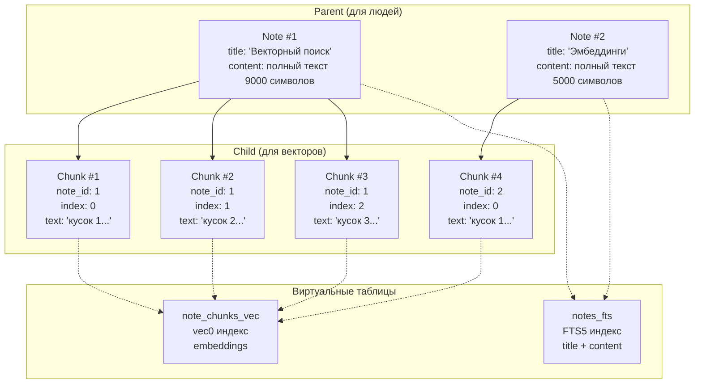
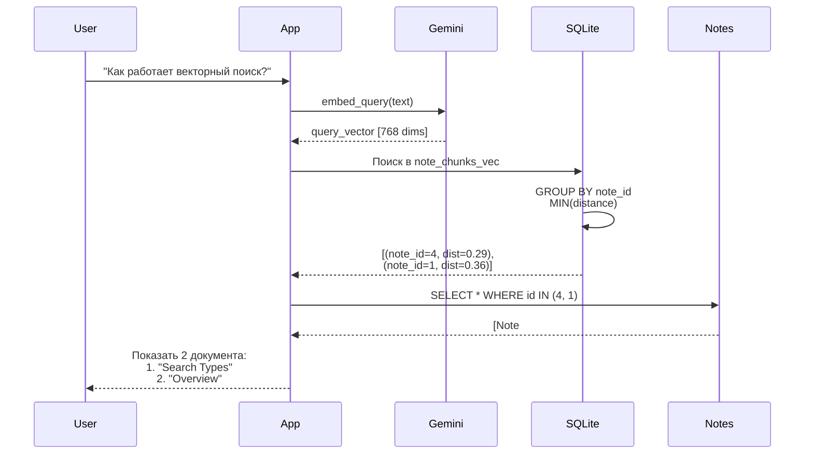
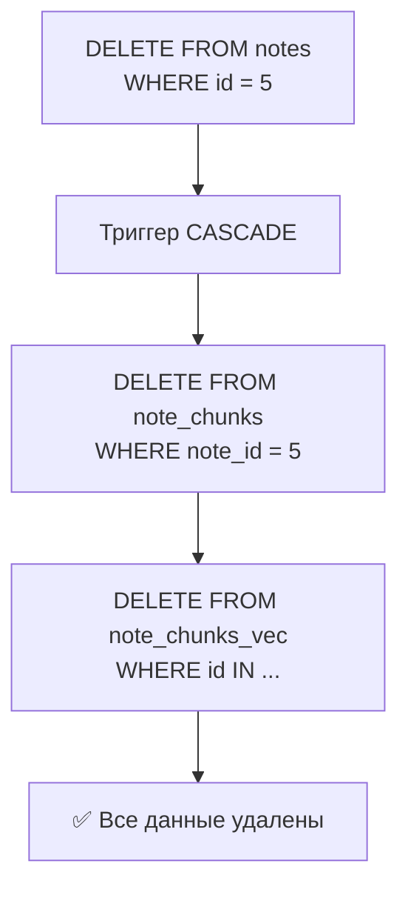

# 👨‍👦 Parent-Child Retrieval

> Как искать по кускам, но возвращать целые документы

---

## 🎯 Проблема: поиск по чанкам

Мы нарезали документы на чанки и проиндексировали их. Но теперь возникает вопрос:

**Как показать пользователю результат?**

```
Пользователь: "Как работает векторный поиск?"

База данных: 
  ✓ Chunk #42 из документа "04_search_types.md" → distance: 0.29
  ✓ Chunk #15 из документа "04_search_types.md" → distance: 0.35
  ✓ Chunk #7 из документа "00_overview.md" → distance: 0.36

Что показать? 🤔
```

**Варианты:**

1. ❌ Показать 3 отдельных чанка → плохо, пользователь не видит контекст
2. ✅ Показать 2 уникальных документа → хорошо, можно прочитать целиком!

---

## 💡 Решение: Parent-Child архитектура

Разделяем данные на **два уровня**:

### Parent (родитель) — для людей

```python
class Note(Model):
    title = CharField()
    content = TextField()  # ПОЛНЫЙ текст БЕЗ лимитов
    category = ForeignKeyField(Category)
    
    # Используется для:
    # - Полнотекстового поиска (FTS5)
    # - Отображения пользователю
```

### Child (ребенок) — для векторов

```python
class NoteChunk(Model):
    note = ForeignKeyField(Note, on_delete='CASCADE')
    chunk_index = IntegerField()
    content = TextField()  # Кусочек текста
    
    # Используется для:
    # - Векторного поиска (vec0)
    # - Индексации эмбеддингов
```

---

## 🏗️ Архитектура базы данных



**Связи:**

- `Note` (1) → (N) `NoteChunk` — один документ, много чанков
- При удалении `Note` → автоматически удаляются все `NoteChunk` (CASCADE)

---

## 🔍 Векторный поиск с агрегацией

### Проблема дубликатов

Без агрегации мы получим дубликаты:

```sql
-- Наивный подход (ПЛОХО)
SELECT chunk.note_id, chunk.content, vec.distance
FROM note_chunks chunk
JOIN note_chunks_vec vec ON chunk.id = vec.id
ORDER BY distance
LIMIT 10

-- Результат:
-- note_id | content      | distance
-- 1       | "chunk 1..." | 0.29  ← документ 1
-- 1       | "chunk 2..." | 0.35  ← документ 1 (дубликат!)
-- 2       | "chunk 1..." | 0.36  ← документ 2
-- 1       | "chunk 5..." | 0.38  ← документ 1 (опять!)
```

**Проблемы:**

- Пользователь видит один документ несколько раз
- Нет разнообразия в результатах
- Непонятно, какой чанк самый релевантный

### Решение: GROUP BY + MIN(distance)

```sql
-- Правильный подход (ХОРОШО)
SELECT 
    chunk.note_id,
    MIN(vec_distance_cosine(vec.embedding, ?)) as best_distance
FROM note_chunks chunk
JOIN note_chunks_vec vec ON chunk.id = vec.id
JOIN notes parent ON chunk.note_id = parent.id
WHERE vec.embedding MATCH ? AND vec.k = 50
GROUP BY chunk.note_id          -- ← Группируем по документу
ORDER BY best_distance ASC
LIMIT 10

-- Результат:
-- note_id | best_distance
-- 1       | 0.29          ← лучший чанк из документа 1
-- 2       | 0.36          ← лучший чанк из документа 2
-- 3       | 0.41          ← лучший чанк из документа 3
```

**Преимущества:**

- ✅ Каждый документ встречается только 1 раз
- ✅ Выбирается самый релевантный чанк (MIN distance)
- ✅ Разнообразие результатов

---

## 📊 Алгоритм поиска

### Шаг 1: Поиск по чанкам

```python
def vector_search_chunks(
    parent_model: Model,
    chunk_model: Model,
    query: str,
    limit: int = 10
):
    # 1. Генерируем эмбеддинг запроса
    query_embedding = generator.embed_query(query)
    query_blob = generator.vector_to_blob(query_embedding)
```

### Шаг 2: Агрегация по родителям

```python
    # 2. SQL с GROUP BY
    sql = """
        SELECT 
            chunk.note_id,
            MIN(vec_distance_cosine(vec.embedding, ?)) as best_distance
        FROM note_chunks chunk
        INNER JOIN note_chunks_vec vec ON chunk.id = vec.id
        INNER JOIN notes parent ON chunk.note_id = parent.id
        WHERE vec.embedding MATCH ?
          AND vec.k = ?
        GROUP BY chunk.note_id
        ORDER BY best_distance ASC
        LIMIT ?
    """
```

### Шаг 3: Загрузка полных документов

```python
    # 3. Получаем ID и загружаем полные Note
    results = cursor.fetchall()  # [(note_id, distance), ...]
    note_ids = [row[0] for row in results]
    
    # 4. Загружаем Note объекты
    notes = Note.select().where(Note.id.in_(note_ids))
    
    # 5. Возвращаем в порядке релевантности
    return [(note, distance) for note_id, distance in results]
```

---

## 🔀 Гибридный поиск с RRF

Parent-Child архитектура позволяет комбинировать:

### Векторный поиск (по чанкам)

```sql
WITH vector_results AS (
    SELECT 
        chunk.note_id,
        MIN(vec_distance_cosine(vec.embedding, ?)) as best_distance,
        ROW_NUMBER() OVER (ORDER BY MIN(distance)) as rank
    FROM note_chunks chunk
    JOIN note_chunks_vec vec ON chunk.id = vec.id
    GROUP BY chunk.note_id
    LIMIT 100
)
```

### Полнотекстовый поиск (по родителям)

```sql
fts_results AS (
    SELECT 
        parent.id as note_id,
        fts.rank as bm25_rank,
        ROW_NUMBER() OVER (ORDER BY fts.rank) as rank
    FROM notes parent
    JOIN notes_fts fts ON parent.id = fts.rowid
    WHERE notes_fts MATCH ?
    LIMIT 100
)
```

### RRF объединение

```sql
rrf_scores AS (
    SELECT 
        COALESCE(v.note_id, f.note_id) as note_id,
        (
            COALESCE(1.0 / (60 + v.rank), 0) +    -- векторный вклад
            COALESCE(1.0 / (60 + f.rank), 0)      -- FTS вклад
        ) as rrf_score
    FROM vector_results v
    FULL OUTER JOIN fts_results f ON v.note_id = f.note_id
)
SELECT note_id, rrf_score
FROM rrf_scores
ORDER BY rrf_score DESC
LIMIT 10
```

**Результат:**

- Лучшее из двух миров: семантика + точные совпадения
- Уникальные документы (без дубликатов)
- Ранжирование по RRF

---

## 🎨 Визуализация потока поиска



---

## 💾 Сохранение с нарезкой

### Атомарная транзакция

```python
def save_note_with_chunks(note_data, splitter, generator):
    with db.atomic():  # Всё или ничего
        # 1. Создаем родителя
        note = Note.create(**note_data)
        
        # 2. Нарезаем контент
        chunks_data = splitter.split_text(note.content)
        
        # 3. Добавляем контекст к каждому чанку
        context = note.get_context_text()  # title + category
        
        for chunk in chunks_data:
            vector_text = f"{context}\n\n{chunk.text}"
            vector = generator.embed_document(vector_text)
            embeddings.append(vector)
        
        # 4. Массовая вставка чанков
        created_chunks = NoteChunk.bulk_create([...])
        
        # 5. Массовая вставка векторов
        for chunk, vector in zip(created_chunks, embeddings):
            db.execute_sql(
                "INSERT INTO note_chunks_vec VALUES (?, ?)",
                (chunk.id, vector_to_blob(vector))
            )
    
    return note
```

**Гарантии:**

- Либо всё сохранилось успешно
- Либо откат (rollback) — база остается чистой

---

## 🔥 Удаление (CASCADE)

```python
class NoteChunk(Model):
    note = ForeignKeyField(
        Note,
        backref='chunks',
        on_delete='CASCADE'  # ← Магия здесь!
    )
```

**Что происходит при `note.delete()`:**



**Автоматически удаляется:**

1. Родительский документ (Note)
2. Все чанки (NoteChunk)
3. Все векторы (note_chunks_vec)
4. Записи в FTS индексе (notes_fts)

---

## 📈 Производительность

### Преимущества Parent-Child

**Экономия памяти:**

```
Без чанкинга:
  10 документов × 8000 символов × 768D = огромный индекс

С чанкингом:
  10 документов × 8 чанков × 1000 символов × 768D = меньше дубликатов
```

**Точность поиска:**

```
Длинный документ → один большой вектор → усредненный смысл
Документ на чанки → 10 векторов → конкретные темы
```

**Пример:**

```
Документ: "Python синтаксис. Machine Learning алгоритмы. DevOps практики."

Один вектор: усредненное облако тем (нечеткий)
3 чанка: 
  - Вектор 1: Python синтаксис (четкий)
  - Вектор 2: ML алгоритмы (четкий)
  - Вектор 3: DevOps (четкий)
```

### Ограничения

**Больше записей в БД:**

```
1000 документов × 7 чанков = 7000 записей в note_chunks
7000 записей × 768 измерений = больше места на диске
```

**Больше запросов API:**

```
1 документ = 7 вызовов Gemini API
1000 документов = 7000 вызовов (дороже)
```

**Решение:** Кэширование эмбеддингов, пакетная обработка

---

## 🎯 Best Practices

### 1. Контекст для чанков

✅ **ПРАВИЛЬНО:**

```python
context = f"Категория: {note.category.name}\nЗаголовок: {note.title}"
vector_text = f"{context}\n\n{chunk.text}"
embedding = generator.embed_document(vector_text)
```

❌ **НЕПРАВИЛЬНО:**

```python
embedding = generator.embed_document(chunk.text)
# Чанк без контекста теряет связь с документом!
```

### 2. Размер чанка

```
Слишком маленький (< 500):
  - Потеря контекста
  - Больше вызовов API
  - Больше записей в БД

Слишком большой (> 1500):
  - Риск превысить лимит 2000 токенов
  - Менее точный поиск

Оптимально: 800-1200 символов
```

### 3. Overlap

```
Без overlap: граничные предложения теряются
С overlap 20%: контекст сохраняется
С overlap 50%: слишком много дубликатов
```

### 4. Выбор агрегации

```sql
-- MIN(distance) - лучший чанк
SELECT note_id, MIN(distance) 

-- AVG(distance) - средняя релевантность
SELECT note_id, AVG(distance)

-- MAX(rank) - худший чанк (редко нужно)
SELECT note_id, MAX(distance)
```

**Рекомендация:** MIN(distance) — наиболее релевантный чанк

---

## 🔮 Альтернативные подходы

### Sentence-Level Chunking

Резать по предложениям:

```python
sentences = text.split('. ')
chunks = group_sentences_by_size(sentences, target_size=1000)
```

### Paragraph-Level Chunking

Резать по параграфам:

```python
paragraphs = text.split('\n\n')
chunks = [p for p in paragraphs if len(p) > 100]
```

### Hierarchical Chunking

Многоуровневая структура:

```
Document
  ├── Section 1
  │   ├── Chunk 1.1
  │   └── Chunk 1.2
  └── Section 2
      └── Chunk 2.1
```

---

## 📊 Статистика из POC

Реальные данные нашего проекта:

| Метрика | Значение |
|---------|----------|
| Документов | 8 |
| Чанков | 54 |
| Avg чанков/документ | 6.8 |
| Размер БД | ~15 MB |
| Время индексации | ~12 сек |

**Запросы:**

| Тип поиска | Документов найдено | Время |
|------------|-------------------|-------|
| Векторный | 3 | 0.05s |
| FTS | 3 | 0.01s |
| Гибридный RRF | 5 | 0.08s |

---

**← [Назад: Chunking Strategy](08_chunking_strategy.md)**

**↑ [К оглавлению](00_overview.md)**

**→ [Дальше: Тестирование](../README.md#тесты)** (если есть)
