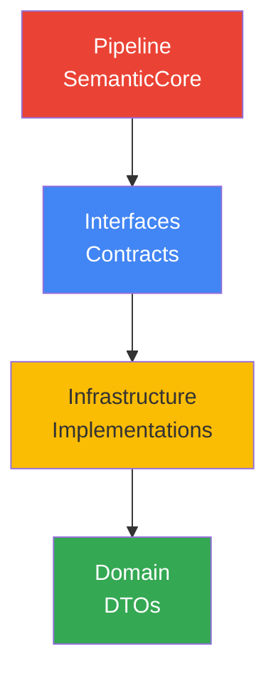
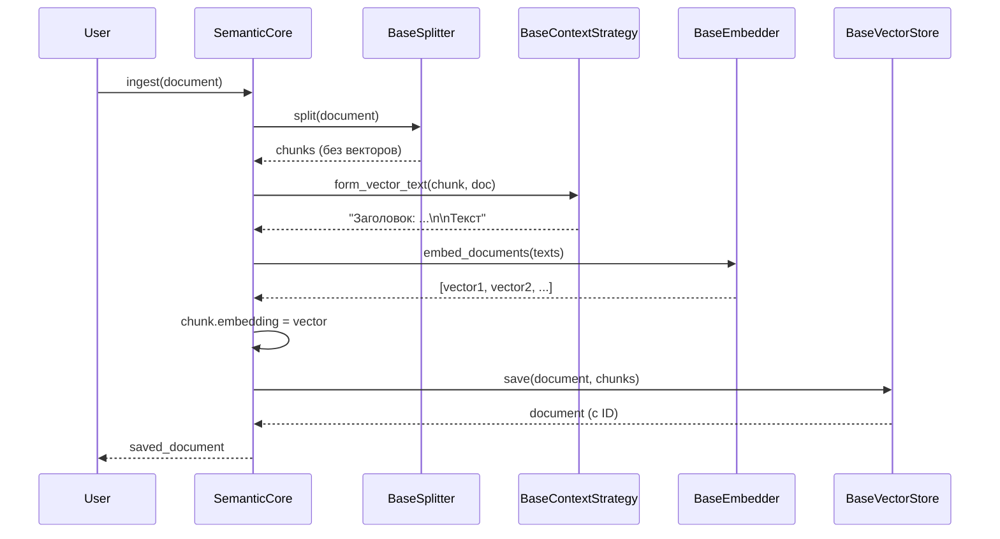
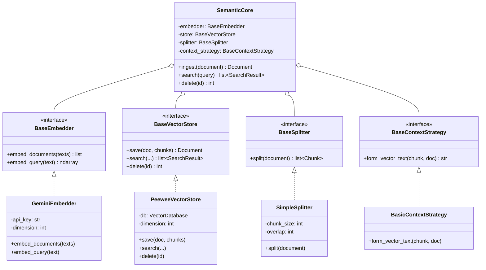

# 🏗️ SOLID Рефакторинг: Фаза 1 завершена

> Как мы превратили прототип в масштабируемую архитектуру

---

## 🎯 Проблема: монолитная архитектура

В старой версии проекта весь код был смешан:

**Проблемы:**

- 🔴 Бизнес-логика (Note) привязана к Peewee ORM
- 🔴 Невозможно поменять Gemini на другой AI-провайдер
- 🔴 Нельзя перейти с SQLite на PostgreSQL без переписывания
- 🔴 Сложно тестировать без реального API и БД

```
domain/models.py  →  HybridSearchMixin  →  EmbeddingGenerator  →  Gemini API
                                        →  database.py  →  SQLite + vec0
```

**Всё связано напрямую!** Изменить одно = переписать всё.

---

## 💡 Решение: SOLID архитектура

Разделяем систему на **4 независимых слоя**:



---

## 📦 Слой 1: Domain (чистые данные)

### Философия

**Никаких зависимостей!** Только данные.

### Структура

```
semantic_core/
└── domain/
    ├── __init__.py
    ├── document.py      # Document, MediaType
    ├── chunk.py         # Chunk
    └── search_result.py # SearchResult, MatchType
```

### Document (родитель)

```python
@dataclass
class Document:
    content: str                          # Полный текст
    metadata: dict[str, Any]             # {title, url, tags, ...}
    media_type: MediaType = TEXT         # TEXT | IMAGE | VIDEO
    id: Optional[int] = None             # После сохранения
```

**Почему dataclass?**

- ✅ Автоматические `__init__`, `__repr__`, `__eq__`
- ✅ Неизменяемость (можно добавить `frozen=True`)
- ✅ Поддержка type hints
- ✅ Работает без ORM

### Chunk (ребёнок)

```python
@dataclass
class Chunk:
    content: str                         # Текст фрагмента
    chunk_index: int                     # Позиция (0, 1, 2...)
    embedding: Optional[np.ndarray]      # Вектор 768D
    parent_doc_id: Optional[int]         # FK на Document
    metadata: dict[str, Any]             # {заголовки, позиции}
```

**Зачем embedding Optional?**

```python
# 1. Создаём чанк (без вектора)
chunk = Chunk(content="текст", chunk_index=0)

# 2. Генерируем вектор
chunk.embedding = embedder.embed_documents([chunk.content])[0]

# 3. Сохраняем
store.save(document, [chunk])
```

### SearchResult (результат)

```python
@dataclass
class SearchResult:
    document: Document       # Найденный документ
    score: float            # Релевантность (0.0 - 1.0)
    match_type: MatchType   # VECTOR | FTS | HYBRID
    chunk_id: Optional[int] # Какой чанк дал совпадение
```

**Почему не ORM модель?**

- ✅ Не зависит от БД (работает с любой)
- ✅ Можно вернуть из API (JSON serializable)
- ✅ Легко тестировать (без подключения к БД)

---

## 📋 Слой 2: Interfaces (контракты)

### Философия

**Программируй на интерфейсах, а не на реализациях!**

### Структура

```
semantic_core/
└── interfaces/
    ├── __init__.py
    ├── embedder.py        # BaseEmbedder
    ├── vector_store.py    # BaseVectorStore
    ├── splitter.py        # BaseSplitter
    └── context.py         # BaseContextStrategy
```

### BaseEmbedder (AI-провайдер)

```python
class BaseEmbedder(ABC):
    @abstractmethod
    def embed_documents(self, texts: list[str]) -> list[np.ndarray]:
        """Генерирует векторы для документов."""
        pass
    
    @abstractmethod
    def embed_query(self, text: str) -> np.ndarray:
        """Генерирует вектор для запроса."""
        pass
```

**Зачем два метода?**

- `embed_documents`: task_type=RETRIEVAL_DOCUMENT (для индексации)
- `embed_query`: task_type=RETRIEVAL_QUERY (для поиска)

Асимметричный поиск работает лучше!

### BaseVectorStore (БД-агностик)

```python
class BaseVectorStore(ABC):
    @abstractmethod
    def save(self, document: Document, chunks: list[Chunk]) -> Document:
        """Атомарное сохранение документа с чанками."""
        pass
    
    @abstractmethod
    def search(
        self,
        query_vector: Optional[np.ndarray],
        query_text: Optional[str],
        mode: str = "hybrid",
        limit: int = 10,
    ) -> list[SearchResult]:
        """Поиск с поддержкой vector/fts/hybrid режимов."""
        pass
    
    @abstractmethod
    def delete(self, document_id: int) -> int:
        """Удаление документа с каскадом."""
        pass
```

**Почему один интерфейс для всех БД?**

```python
# SQLite
store = PeeweeVectorStore(database=sqlite_db)

# В будущем: PostgreSQL
store = AlchemyVectorStore(database=postgres_db)

# Код пайплайна НЕ МЕНЯЕТСЯ!
core = SemanticCore(store=store, ...)
```

### BaseSplitter (стратегия нарезки)

```python
class BaseSplitter(ABC):
    @abstractmethod
    def split(self, document: Document) -> list[Chunk]:
        """Разбивает документ на чанки БЕЗ векторов."""
        pass
```

**Реализации:**

- `SimpleSplitter`: по размеру + переносы
- `MarkdownSplitter` (будущее): по заголовкам
- `CodeSplitter` (будущее): по функциям

### BaseContextStrategy (умный текст)

```python
class BaseContextStrategy(ABC):
    @abstractmethod
    def form_vector_text(self, chunk: Chunk, document: Document) -> str:
        """Формирует текст для векторизации."""
        pass
```

**Пример:**

```python
# BasicContextStrategy
def form_vector_text(self, chunk, doc):
    return f"Заголовок: {doc.metadata['title']}\n\n{chunk.content}"

# NoContextStrategy
def form_vector_text(self, chunk, doc):
    return chunk.content  # Без контекста

# HierarchicalStrategy (будущее)
def form_vector_text(self, chunk, doc):
    breadcrumbs = chunk.metadata.get('breadcrumbs', '')
    return f"{breadcrumbs}\n\n{chunk.content}"
```

---

## ⚙️ Слой 3: Infrastructure (реализации)

### Философия

**Здесь живут адаптеры к реальным технологиям.**

### Структура

```
semantic_core/
└── infrastructure/
    ├── gemini/
    │   └── embedder.py           # GeminiEmbedder
    ├── storage/
    │   └── peewee/
    │       ├── engine.py         # VectorDatabase
    │       ├── models.py         # DocumentModel, ChunkModel
    │       └── adapter.py        # PeeweeVectorStore
    └── text_processing/
        ├── simple_splitter.py    # SimpleSplitter
        └── basic_context.py      # BasicContextStrategy
```

### GeminiEmbedder → BaseEmbedder

```python
class GeminiEmbedder(BaseEmbedder):
    def __init__(self, api_key: str, dimension: int = 768):
        genai.configure(api_key=api_key)
        self.dimension = dimension
    
    def embed_documents(self, texts):
        return [self._generate(t, "RETRIEVAL_DOCUMENT") for t in texts]
    
    def embed_query(self, text):
        return self._generate(text, "RETRIEVAL_QUERY")
```

**Легко заменить:**

```python
# OpenAI
class OpenAIEmbedder(BaseEmbedder):
    def embed_documents(self, texts):
        return openai.Embedding.create(input=texts, model="text-embedding-3-small")
```

### PeeweeVectorStore → BaseVectorStore

```python
class PeeweeVectorStore(BaseVectorStore):
    def __init__(self, database: VectorDatabase, dimension: int = 768):
        self.db = database
        # Создаём внутренние ORM модели
        self._create_tables()
    
    def save(self, document, chunks):
        with self.db.atomic():
            # 1. Сохраняем Document → DocumentModel
            doc_model = DocumentModel.create(...)
            
            # 2. Сохраняем Chunks → ChunkModel + chunks_vec
            for chunk in chunks:
                chunk_model = ChunkModel.create(...)
                self.db.execute_sql(
                    "INSERT INTO chunks_vec VALUES (?, ?)",
                    (chunk_model.id, chunk.embedding.tobytes())
                )
        return document
```

**Внутренние модели скрыты!**

Пользователь работает только с DTO (`Document`, `Chunk`), не с ORM.

---

## 🎼 Слой 4: Pipeline (оркестратор)

### Философия

**Фасад, который собирает всё воедино через Dependency Injection.**

### SemanticCore

```python
class SemanticCore:
    def __init__(
        self,
        embedder: BaseEmbedder,
        store: BaseVectorStore,
        splitter: BaseSplitter,
        context_strategy: BaseContextStrategy,
    ):
        self.embedder = embedder
        self.store = store
        self.splitter = splitter
        self.context_strategy = context_strategy
```

**Зачем передавать всё в конструктор?**

- ✅ **Testability**: Можно подставить моки
- ✅ **Flexibility**: Легко менять компоненты
- ✅ **Explicitness**: Видно все зависимости

### Метод ingest (индексация)

```python
def ingest(self, document: Document) -> Document:
    # 1. Нарезаем
    chunks = self.splitter.split(document)
    
    # 2. Формируем контекст
    vector_texts = [
        self.context_strategy.form_vector_text(chunk, document)
        for chunk in chunks
    ]
    
    # 3. Генерируем векторы
    embeddings = self.embedder.embed_documents(vector_texts)
    
    # 4. Записываем векторы в чанки
    for chunk, embedding in zip(chunks, embeddings):
        chunk.embedding = embedding
    
    # 5. Сохраняем
    return self.store.save(document, chunks)
```

**Поток данных:**



### Метод search (поиск)

```python
def search(self, query: str, mode: str = "hybrid", limit: int = 10):
    # 1. Векторизуем запрос
    query_vector = self.embedder.embed_query(query)
    
    # 2. Ищем
    results = self.store.search(
        query_vector=query_vector,
        query_text=query,
        mode=mode,
        limit=limit,
    )
    
    return results  # List[SearchResult]
```

---

## 🧪 Использование: простой пример

### Настройка компонентов

```python
from semantic_core import (
    SemanticCore,
    Document,
    GeminiEmbedder,
    PeeweeVectorStore,
    SimpleSplitter,
    BasicContextStrategy,
    init_peewee_database,
)

# 1. Инициализация БД
db = init_peewee_database("data.db", dimension=768)

# 2. Создание компонентов
embedder = GeminiEmbedder(api_key="...", dimension=768)
store = PeeweeVectorStore(database=db, dimension=768)
splitter = SimpleSplitter(chunk_size=1000, overlap=200)
context = BasicContextStrategy()

# 3. Сборка ядра
core = SemanticCore(
    embedder=embedder,
    store=store,
    splitter=splitter,
    context_strategy=context,
)
```

### Индексация

```python
doc = Document(
    content="Python — язык программирования...",
    metadata={"title": "Python Tutorial", "category": "Programming"},
)

saved_doc = core.ingest(doc)
print(f"Документ сохранён с ID: {saved_doc.id}")
```

### Поиск

```python
results = core.search("как написать цикл", mode="hybrid", limit=5)

for result in results:
    print(f"{result.document.metadata['title']}: {result.score:.3f}")
```

---

## ✅ Преимущества SOLID архитектуры

### 1. Single Responsibility Principle (SRP)

**Каждый класс делает одно:**

- `SimpleSplitter`: только нарезка
- `GeminiEmbedder`: только векторизация
- `PeeweeVectorStore`: только хранение
- `SemanticCore`: только оркестрация

### 2. Open/Closed Principle (OCP)

**Открыт для расширения, закрыт для модификации:**

```python
# Хочешь добавить Markdown нарезку?
class MarkdownSplitter(BaseSplitter):
    def split(self, document):
        # Парсим AST, режем по заголовкам
        ...

# Ничего не меняем в SemanticCore!
core = SemanticCore(splitter=MarkdownSplitter(), ...)
```

### 3. Liskov Substitution Principle (LSP)

**Любая реализация интерфейса работает одинаково:**

```python
# Gemini
embedder1 = GeminiEmbedder(api_key="...")

# В будущем: OpenAI
embedder2 = OpenAIEmbedder(api_key="...")

# Пайплайн работает с обоими!
core = SemanticCore(embedder=embedder1, ...)  # ✅
core = SemanticCore(embedder=embedder2, ...)  # ✅
```

### 4. Interface Segregation Principle (ISP)

**Интерфейсы минимальны и сфокусированы:**

```python
# BaseEmbedder: только 2 метода
class BaseEmbedder(ABC):
    def embed_documents(...) ...
    def embed_query(...) ...

# Не перегружен лишними методами!
```

### 5. Dependency Inversion Principle (DIP)

**Зависим от абстракций, а не от конкретики:**

```python
# ❌ ПЛОХО (зависит от конкретной реализации)
class SemanticCore:
    def __init__(self):
        self.embedder = GeminiEmbedder()  # Жёсткая зависимость!

# ✅ ХОРОШО (зависит от интерфейса)
class SemanticCore:
    def __init__(self, embedder: BaseEmbedder):
        self.embedder = embedder  # Любая реализация!
```

---

## 🧪 Тестируемость

### Моки вместо реальных API

```python
class FakeEmbedder(BaseEmbedder):
    def embed_documents(self, texts):
        return [np.random.rand(768) for _ in texts]
    
    def embed_query(self, text):
        return np.random.rand(768)

# Тесты без затрат денег!
core = SemanticCore(embedder=FakeEmbedder(), ...)
```

### In-Memory Store для тестов

```python
class MemoryVectorStore(BaseVectorStore):
    def __init__(self):
        self.documents = {}
    
    def save(self, document, chunks):
        document.id = len(self.documents) + 1
        self.documents[document.id] = (document, chunks)
        return document
    
    def search(self, ...):
        # Наивный поиск по массиву
        ...

# Тесты без БД!
core = SemanticCore(store=MemoryVectorStore(), ...)
```

---

## 📊 Диаграмма классов



---

## 🚀 Что дальше?

### Фаза 2: Умный Markdown (Planned)

- `MarkdownSplitter`: нарезка по заголовкам
- `HierarchicalContext`: breadcrumbs (Глава > Раздел)
- Извлечение ссылок на медиа

### Фаза 3: Async Batching (Planned)

- `BatchQueue`: отложенная обработка
- Google Batch API: экономия 50%
- State Machine: PENDING → PROCESSING → DONE

### Фаза 4: Мультимодальность (Planned)

- `VisionStrategy`: описание изображений
- `OCRProvider`: распознавание текста
- Media Router: автоопределение типа файла

---

## 🎓 Ключевые выводы

1. **SOLID — не про сложность, а про гибкость**
2. **Интерфейсы делают код переносимым**
3. **Dependency Injection = легкое тестирование**
4. **DTO (чистые данные) ≠ ORM модели**
5. **Каждый слой не знает о реализации других**

---

**← [Назад: Parent-Child Retrieval](09_parent_child_retrieval.md)**

**↑ [К оглавлению](00_overview.md)**

**→ Дальше: Фаза 2 (когда будет готова)** 🚀
