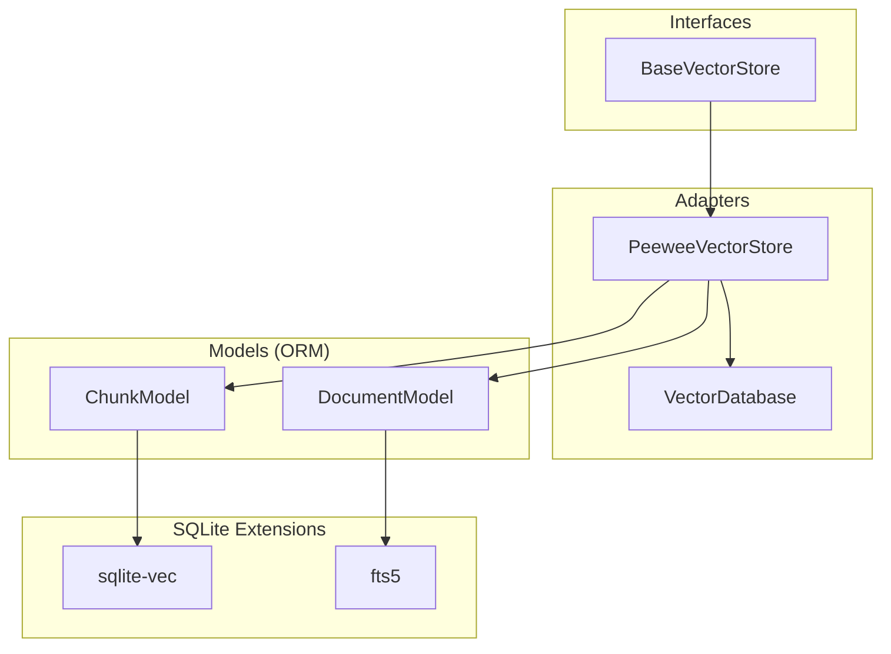
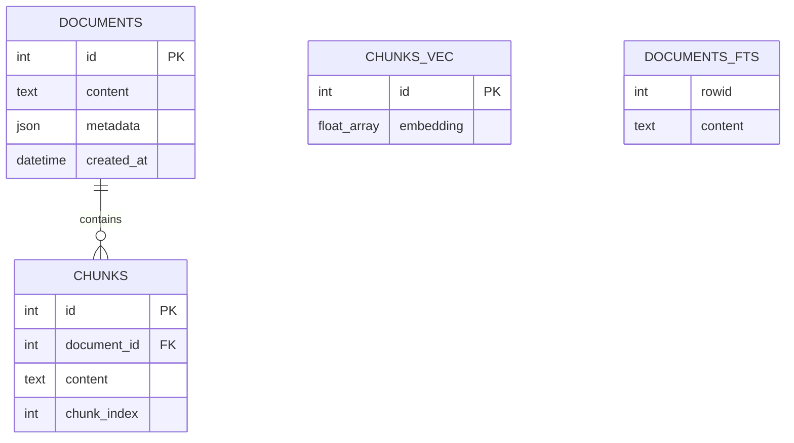
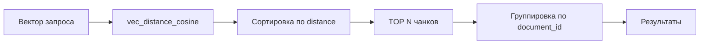
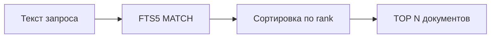

# 🗄️ Storage Layer: Peewee + RRF + Фильтры (Phase 2)

> Как реализовано хранилище векторов с гибридным поиском и фильтрацией по метаданным

---

## 📌 Что это такое?

**Storage Layer** — это адаптер между абстракциями (интерфейс `BaseVectorStore`) и конкретной реализацией (Peewee ORM + SQLite + расширения).

Он инкапсулирует всю работу с базой данных: сохранение документов с чанками, векторный поиск через `sqlite-vec`, полнотекстовый поиск через `fts5` и гибридный поиск с RRF алгоритмом.

---

## 🎯 Зачем это нужно?

**Проблема**: В Phase 1 мы создали интерфейсы и DTO, но реализация хранилища была минимальной:

- ❌ Гибридный поиск делал fallback на векторный
- ❌ Не было фильтрации по метаданным
- ❌ Не было настройки параметров RRF

**Решение**: Phase 2 реализует полноценный Storage Layer с:

- ✅ **Parent-Child архитектурой** (Document → Chunks) с каскадным удалением
- ✅ **Три режима поиска**: `vector`, `fts`, `hybrid` с настоящим RRF
- ✅ **Фильтрация** по произвольным полям метаданных (JSON fields)
- ✅ **Fallback стратегии** для гибридного поиска

---

## 🏗️ Архитектура

### Диаграмма компонентов



**Слои**:

1. **Interface**: `BaseVectorStore` — контракт для любого хранилища
2. **Adapter**: `PeeweeVectorStore` — реализация через Peewee ORM
3. **ORM Models**: `DocumentModel` / `ChunkModel` — таблицы БД
4. **Extensions**: `sqlite-vec` (векторы) + `fts5` (FTS)

---

## 🔍 Как это работает?

### 1️⃣ Parent-Child архитектура



**Связь**: Один документ (`DocumentModel`) → много чанков (`ChunkModel`).

**Каскадное удаление**: При удалении документа автоматически удаляются все его чанки (через `ON DELETE CASCADE`).

---

### 2️⃣ Три режима поиска

#### Vector Search

Семантический поиск по векторам через `sqlite-vec`:



**Ключевое**:

- Поиск идет по **чанкам** (chunks_vec)
- Возвращаются **документы** (уникальные)
- Используется `MIN(distance)` для дедупликации

#### FTS Search

Полнотекстовый поиск по ключевым словам через `fts5`:



**Ключевое**:

- Поиск сразу по **документам** (documents_fts)
- Поддерживает boolean операторы (AND, OR, NOT)
- Автообновление через триггеры

#### Hybrid Search (RRF)

Комбинирует результаты векторного и FTS поиска:

```mermaid
graph TB
    Q[Запрос] --> QV[Вектор запроса]
    Q --> QT[Текст запроса]
    
    QV --> VS[Vector Search: TOP 100]
    QT --> FS[FTS Search: TOP 100]
    
    VS --> R1[Rank 1, 2, 3...]
    FS --> R2[Rank 1, 2, 3...]
    
    R1 --> RRF[RRF Score = 1/(k+rank_vec) + 1/(k+rank_fts)]
    R2 --> RRF
    
    RRF --> SORT[Сортировка по RRF]
    SORT --> TOP[TOP N результатов]
```

**RRF алгоритм** (Reciprocal Rank Fusion):

$$
\text{score}(doc) = \frac{1}{k + \text{rank}_{vector}} + \frac{1}{k + \text{rank}_{FTS}}
$$

где `k` — константа сглаживания (обычно 60).

---

### 3️⃣ Фильтрация по метаданным

Метаданные хранятся как **JSON** в поле `metadata`:

```json
{
  "title": "Python Guide",
  "category": "Programming",
  "author": "Alice",
  "year": 2024
}
```

**Фильтрация через SQL**:

```sql
WHERE json_extract(metadata, '$.category') = 'Programming'
  AND json_extract(metadata, '$.year') = 2024
```

**Работает для всех режимов**: `vector`, `fts`, `hybrid`.

---

## 📊 Сравнение режимов поиска

| Критерий | Vector | FTS | Hybrid (RRF) |
|----------|--------|-----|--------------|
| **Синонимы** | ✅ Понимает | ❌ Нет | ✅ Да |
| **Точное совпадение** | ⚠️ Может пропустить | ✅ Находит | ✅ Находит |
| **Скорость** | 🐢 ~50ms | 🚀 ~5ms | ⏱️ ~60ms |
| **Интернет** | ⚠️ Для векторизации | ✅ Локально | ⚠️ Для векторизации |
| **Качество** | 🎯 Высокое | ⚡ Среднее | 🏆 **Лучшее** |

**Вывод**: Hybrid (RRF) дает лучшие результаты, комбинируя преимущества обоих методов.

---

## ⚙️ Параметры RRF

### Параметр `k`

Константа сглаживания в формуле RRF:

| Значение k | Эффект | Когда использовать |
|-----------|--------|-------------------|
| `k=10` | 🔥 **Сильно** влияет ранг | Доверяем FTS + Vector одинаково |
| `k=60` | ⚖️ **Сбалансировано** | **Стандарт** (рекомендуется) |
| `k=100` | 🌊 **Сглаживает** различия | Много шума в рангах |

**Пример влияния**:

```
Документ A: rank_vec=1, rank_fts=5
Документ B: rank_vec=5, rank_fts=1

При k=10:
  score_A = 1/11 + 1/15 = 0.157
  score_B = 1/15 + 1/11 = 0.157  (равные!)

При k=60:
  score_A = 1/61 + 1/65 = 0.032
  score_B = 1/65 + 1/61 = 0.032  (равные!)

При k=100:
  score_A = 1/101 + 1/105 = 0.019
  score_B = 1/105 + 1/101 = 0.019  (равные!)
```

**Золотое правило**: Используй `k=60` по умолчанию, изменяй только при A/B тестировании.

---

## ⚠️ Важные нюансы

### 1. **Fallback стратегии**

Если в гибридном поиске передан только один параметр:

- `query_vector=None` → используется **только FTS**
- `query_text=None` → используется **только Vector**

Это позволяет использовать `mode="hybrid"` даже когда один из источников недоступен.

### 2. **TOP 100 для RRF**

RRF сначала выбирает **TOP 100** из каждого метода, потом комбинирует.

**Почему не TOP 10?** Чтобы не потерять релевантные документы, которые:

- В векторном поиске на 50-м месте
- В FTS на 3-м месте
- После RRF попадают в TOP 5 ✅

### 3. **JSON индексы**

SQLite **не индексирует** JSON поля автоматически.

Для частых фильтров по `metadata.category` можно создать expression index:

```sql
CREATE INDEX idx_category 
ON documents (json_extract(metadata, '$.category'));
```

Но пока этого нет — фильтрация работает через полное сканирование (приемлемо для <10k документов).

### 4. **Каскадное удаление**

При `store.delete(document_id)` удаляются:

1. Документ из `documents`
2. Все чанки из `chunks` (CASCADE)
3. Векторы из `chunks_vec` (через триггер)
4. FTS записи из `documents_fts` (через триггер)

Это атомарная операция внутри `db.atomic()`.

---

## 🧪 Примеры использования

### Векторный поиск с фильтром

```python
results = store.search(
    query_vector=embedding,
    filters={"category": "Python"},
    limit=10,
    mode="vector"
)
```

### FTS поиск с несколькими фильтрами

```python
results = store.search(
    query_text="циклы AND списки",
    filters={
        "category": "Programming",
        "year": 2024
    },
    limit=5,
    mode="fts"
)
```

### Гибридный поиск с настройкой k

```python
results = store.search(
    query_vector=embedding,
    query_text="Python синтаксис",
    filters={"author": "Alice"},
    k=60,  # стандартная константа RRF
    limit=10,
    mode="hybrid"
)
```

---

## 🔗 Связанные документы

- **← [Предыдущее: SOLID Архитектура (Phase 1)](10_solid_refactoring.md)**
- **→ Следующее: Integration API (Phase 3)** *(в планах)*

---

## 📚 Технические детали

**Реализация**: `semantic_core/infrastructure/storage/peewee/`

- `adapter.py` — PeeweeVectorStore (логика поиска)
- `models.py` — DocumentModel, ChunkModel (ORM)
- `engine.py` — VectorDatabase (подключение + расширения)

**Тесты**: `tests/test_phase_2_storage.py` (26 тестов, все проходят)

---

**Последнее обновление**: 2 декабря 2025
