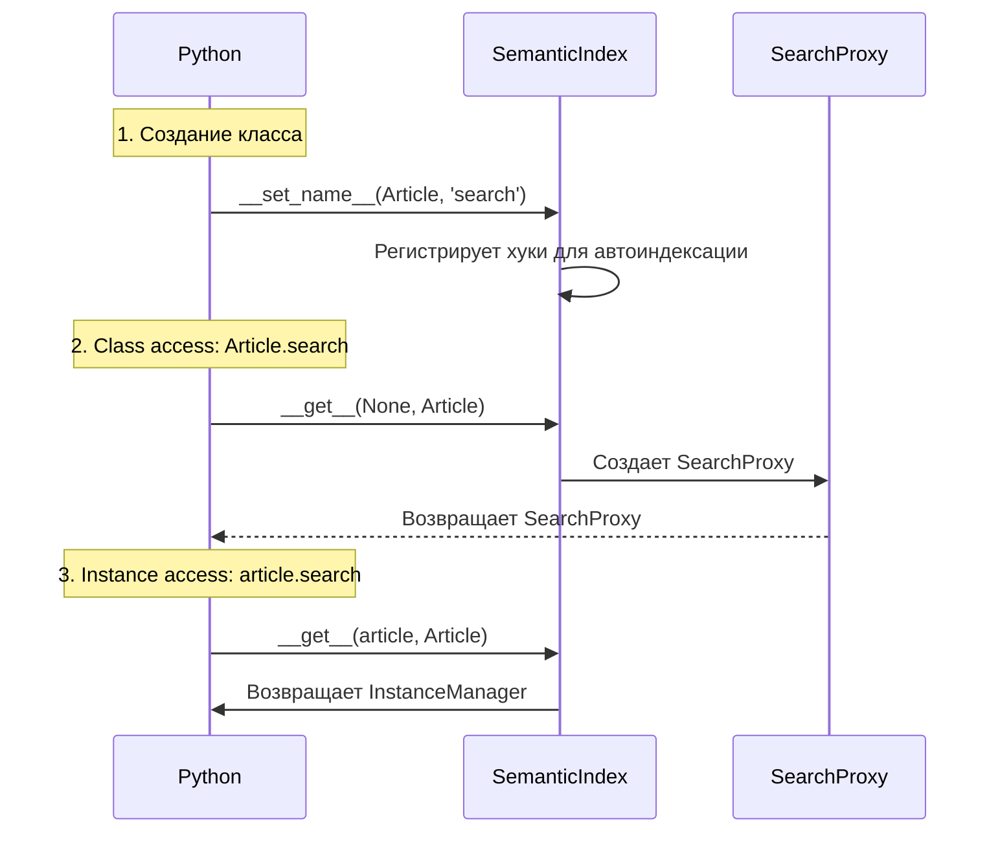

# 🎩 Descriptor Protocol: Магия атрибутов класса

> Как `Article.search` превращается в объект с методами поиска

---

## 📌 Что это такое?

**Дескриптор** — это объект Python, который перехватывает обращения к атрибуту класса.

Когда ты пишешь `Article.search.hybrid("python")`, на самом деле происходит следующее:
1. Python видит обращение к атрибуту `search`
2. Проверяет, является ли `search` дескриптором
3. Вызывает специальный метод `__get__()` дескриптора
4. Возвращает результат (в нашем случае — SearchProxy объект)

**Простая аналогия:** Дескриптор — это "волшебная дверь" в класс. Снаружи это выглядит как обычный атрибут, но при обращении запускается твой кастомный код.

---

## 🎯 Зачем это нужно?

### Проблема: Как добавить поиск к модели?

Представь, у тебя есть модель статьи:

```python
class Article(Model):
    title = CharField()
    content = TextField()
```

Хочется добавить семантический поиск. **Как?**

**Вариант A (плохой):** Добавить методы прямо в класс

```python
class Article(Model):
    title = CharField()
    content = TextField()
    
    @classmethod
    def search_hybrid(cls, query):
        # ... логика поиска
    
    @classmethod
    def search_vector(cls, query):
        # ... логика поиска
```

**Проблема:** Захламляем модель поисковыми методами. Смешиваем ORM и семантику.

---

**Вариант B (хороший):** Использовать дескриптор

```python
class Article(Model):
    title = CharField()
    content = TextField()
    
    search = SemanticIndex(
        core=semantic_core,
        content_field='content',
        context_fields=['title']
    )
```

Теперь:
- `Article.search.hybrid("python")` — поиск по всей таблице
- `article.search.update()` — переиндексация конкретной записи

**Преимущества:**
- ✅ Чистое разделение: модель отдельно, поиск отдельно
- ✅ Удобный API (как у Django)
- ✅ Автоматическая индексация при сохранении

---

## 🔍 Как это работает?

### Жизненный цикл дескриптора



---

### Фаза 1: Регистрация при создании класса

Когда Python создает класс `Article`, он видит атрибут `search = SemanticIndex(...)` и вызывает:

```python
search.__set_name__(Article, 'search')
```

**В этот момент:**
- Дескриптор узнает свое имя (`'search'`)
- Узнает класс-владелец (`Article`)
- Регистрирует хуки для автоматической индексации (об этом в следующем выпуске)

**Важно:** `__set_name__` вызывается **один раз** при создании класса, не при каждом обращении!

---

### Фаза 2: Class access (доступ через класс)

Когда ты пишешь `Article.search`, Python вызывает:

```python
search.__get__(instance=None, owner=Article)
```

**Параметры:**
- `instance=None` — потому что мы обращаемся через класс, не через инстанс
- `owner=Article` — класс-владелец

**Дескриптор возвращает:**
```python
return SearchProxy(core=self.core, model=Article, descriptor=self)
```

`SearchProxy` — это объект с методами `hybrid()`, `vector()`, `fts()` для поиска.

---

### Фаза 3: Instance access (доступ через инстанс)

Когда ты пишешь `article.search` (где `article = Article.get_by_id(1)`), Python вызывает:

```python
search.__get__(instance=article, owner=Article)
```

**Параметры:**
- `instance=article` — конкретный объект
- `owner=Article` — класс

**Дескриптор возвращает:**
```python
return InstanceManager(instance=article, descriptor=self)
```

`InstanceManager` — это объект с методами `update()` и `delete()` для управления индексом конкретной записи.

---

## 📊 Два режима работы

| Обращение | `instance` | Возвращает | Методы |
|-----------|------------|------------|--------|
| `Article.search` | `None` | `SearchProxy` | `hybrid()`, `vector()`, `fts()` |
| `article.search` | `article` | `InstanceManager` | `update()`, `delete()` |

**Ключевая идея:** Один дескриптор ведет себя по-разному в зависимости от контекста!

---

## 💡 Примеры использования

### Пример 1: Поиск по всей таблице

```python
# Article.search возвращает SearchProxy
results = Article.search.hybrid("python tutorial", limit=10)

# results — это list[(Article, score)]
for article, score in results:
    print(f"{article.title} (релевантность: {score:.2f})")
```

**Что происходит под капотом:**
1. `Article.search` вызывает `__get__(None, Article)`
2. Возвращается `SearchProxy`
3. `SearchProxy.hybrid()` вызывает `SemanticCore.search()`
4. Результаты преобразуются обратно в ORM объекты

---

### Пример 2: Управление индексом конкретной записи

```python
# Создаем статью
article = Article.create(
    title="Python Tutorial",
    content="Learn Python programming..."
)
# ↑ Автоматически индексируется при save()

# Позже обновляем контент напрямую в БД (минуя save)
Article.update(content="New content").where(Article.id == article.id).execute()

# Переиндексируем вручную
article = Article.get_by_id(article.id)
article.search.update()  # ← __get__(article, Article) → InstanceManager
```

**Что происходит:**
1. `article.search` вызывает `__get__(article, Article)`
2. Возвращается `InstanceManager(instance=article)`
3. `InstanceManager.update()` удаляет старые чанки и создает новые

---

### Пример 3: Удаление из индекса без удаления из БД

```python
# Удаляем из семантического индекса
article.search.delete()

# Сам объект остается в БД
assert Article.get_by_id(article.id) is not None  # ✅ Существует

# Но в поиске его нет
results = Article.search.hybrid("python")
assert article not in [obj for obj, score in results]  # ✅ Не найден
```

**Use case:** Временное исключение из поиска без физического удаления.

---

## ⚠️ Важные нюансы

### 1. **Дескриптор живет на уровне класса**

```python
class Article(Model):
    search = SemanticIndex(...)  # ← ОДИН объект для всех инстансов
```

**НЕ** создается новый дескриптор для каждого `Article()`. Это один и тот же объект!

**Почему важно:** Состояние дескриптора (builder, core) общее для всех инстансов.

---

### 2. **Нельзя присваивать значение дескриптору**

```python
article.search = "something"  # ❌ AttributeError!
```

**Причина:** Дескриптор реализует `__set__()`, который запрещает присваивание.

**Зачем:** Защита от случайной перезаписи атрибута.

---

### 3. **Множественные дескрипторы на одной модели**

```python
class Article(Model):
    title = CharField()
    content = TextField()
    summary = TextField()
    
    # Два разных индекса!
    search_full = SemanticIndex(content_field='content')
    search_summary = SemanticIndex(content_field='summary')
```

**Работает:** Каждый дескриптор независим, но оба патчят одни и те же методы `save()` и `delete_instance()`.

**Решение:** Class-level registry отслеживает все дескрипторы и вызывает хуки для каждого (подробности в следующем выпуске).

---

### 4. **Дескриптор работает даже с type()**

```python
# Динамическое создание класса
TestModel = type('TestModel', (Model,), {
    'content': TextField(),
    'search': SemanticIndex(...)
})
```

**Важно:** Python автоматически вызовет `__set_name__()` даже при создании класса через `type()`!

**Вывод:** Дескрипторы работают везде, где создаются классы.

---

## 🎭 Альтернативы дескрипторам

### Почему не `@classmethod`?

```python
class Article(Model):
    @classmethod
    def search_hybrid(cls, query):
        ...
```

**Проблемы:**
- ❌ Нет разделения между поиском и управлением индексом
- ❌ Нужно передавать `core`, `builder` в каждый метод
- ❌ Захламляет класс модели

---

### Почему не отдельный класс?

```python
class ArticleSearch:
    def __init__(self, model):
        self.model = model
    
    def hybrid(self, query):
        ...

# Использование
Article.search_helper = ArticleSearch(Article)
results = Article.search_helper.hybrid("python")
```

**Проблемы:**
- ❌ Нет автоматической индексации
- ❌ Некрасивый API (search_helper вместо search)
- ❌ Нужно вручную создавать инстанс

---

### Почему дескриптор — лучше?

✅ **Чистый API:** `Article.search.hybrid()` и `article.search.update()`  
✅ **Автоиндексация:** Регистрируется при создании класса  
✅ **Два режима:** Class access → SearchProxy, Instance access → InstanceManager  
✅ **SOLID:** Разделение ответственности

---

## 🔗 Что дальше?

В следующем выпуске разберем **как работает автоматическая индексация**.

**Спойлер:** Дескриптор патчит методы `save()` и `delete_instance()` модели, внедряя хуки индексации. Это работает **без требования наследоваться от специальных классов** (в отличие от Django signals).

→ [13. Method Patching: Автоматическая индексация](13_method_patching.md)

---

## 📚 Ключевые термины

**Дескриптор** — объект с методами `__get__`, `__set__`, `__delete__`, который перехватывает обращения к атрибуту класса.

**`__set_name__(owner, name)`** — вызывается Python при создании класса, передает класс-владелец и имя атрибута.

**`__get__(instance, owner)`** — вызывается при обращении к атрибуту, возвращает нужный объект в зависимости от контекста.

**SearchProxy** — объект с методами поиска (`hybrid`, `vector`, `fts`).

**InstanceManager** — объект для управления индексом конкретной записи (`update`, `delete`).

---

**Предыдущий выпуск:** [11. Storage Layer (Phase 2)](11_storage_layer_phase2.md)  
**Следующий выпуск:** [13. Method Patching](13_method_patching.md)  
**Вернуться к оглавлению:** [00. Overview](00_overview.md)
