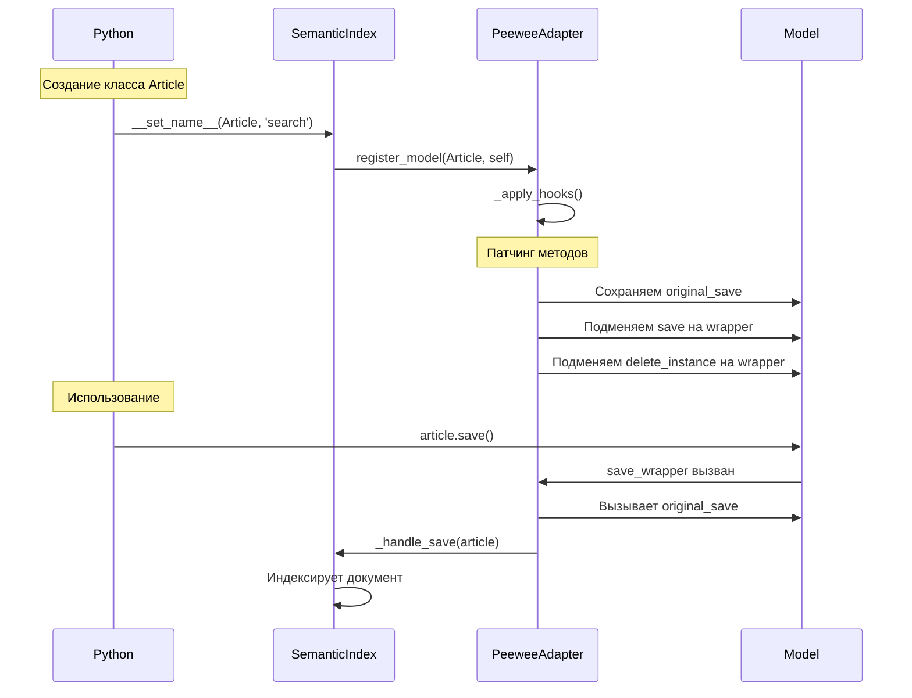

# 🔧 Method Patching: Автоматическая индексация без SignalModel

> Как сделать так, чтобы `Article.create()` автоматически добавлял запись в семантический индекс

---

## 📌 Что это такое?

**Method Patching** — это техника, когда мы подменяем методы класса на свои обертки (wrappers).

В нашем случае мы "перехватываем" методы `save()` и `delete_instance()` у Peewee модели и добавляем в них логику индексации.

**Простая аналогия:** Представь, что у двери стоял обычный охранник. Мы заменили его на охранника, который не только открывает дверь, но и записывает всех входящих в журнал.

---

## 🎯 Зачем это нужно?

### Проблема: Как индексировать автоматически?

Ты создаешь статью:

```python
article = Article.create(
    title="Python Tutorial",
    content="Learn Python programming..."
)
```

**Хочется:** Чтобы статья **автоматически** попала в семантический индекс.

**Но как?** Где вызвать `semantic_core.ingest()`?

---

### Вариант A: Вызывать вручную

```python
article = Article.create(title="...", content="...")

# Вручную индексируем
doc = Document(content=article.content, metadata={"source_id": article.id})
semantic_core.ingest(doc)
```

**Проблемы:**
- ❌ Легко забыть
- ❌ Дублирование кода
- ❌ Не DRY (Don't Repeat Yourself)

---

### Вариант B: Переопределить save()

```python
class Article(Model):
    def save(self, *args, **kwargs):
        result = super().save(*args, **kwargs)
        
        # Индексируем
        doc = Document(content=self.content, ...)
        semantic_core.ingest(doc)
        
        return result
```

**Проблемы:**
- ❌ Захламляем модель логикой индексации
- ❌ Нарушаем Single Responsibility Principle
- ❌ Сложно масштабировать (каждая модель должна переопределять save)

---

### Вариант C: Использовать Peewee signals

Peewee предоставляет систему сигналов (из `playhouse.signals`):

```python
from playhouse.signals import post_save, Model as SignalModel

class Article(SignalModel):  # ← Наследуемся от SignalModel
    ...

@post_save(sender=Article)
def on_article_save(sender, instance, created):
    doc = Document(content=instance.content, ...)
    semantic_core.ingest(doc)
```

**Проблема:** Сигналы работают **только с `SignalModel`**, не с обычной `peewee.Model`!

**Почему плохо:**
- ❌ Требуем наследоваться от специального класса
- ❌ Нарушаем принцип "минимальной инвазивности"
- ❌ Что если у пользователя уже своя базовая модель?

---

### Вариант D (наш выбор): Method Patching

**Идея:** Когда дескриптор `SemanticIndex` регистрируется на модели (в `__set_name__`), мы:

1. Сохраняем оригинальные методы `save()` и `delete_instance()`
2. Создаем wrappers, которые:
   - Вызывают оригинальный метод
   - Если успешно — триггерят индексацию
3. Подменяем методы на классе модели

**Преимущества:**
- ✅ Работает с **любой** `peewee.Model`
- ✅ Не требует наследования
- ✅ Логика индексации в `SemanticIndex`, не в модели
- ✅ Изолированно — патчим только модели с дескриптором

---

## 🔍 Как это работает?

### Архитектура патчинга



---

### Шаг 1: Регистрация при создании класса

Когда Python создает класс `Article`, вызывается:

```python
# В SemanticIndex.__set_name__()
if issubclass(owner, Model):  # Это Peewee модель?
    from semantic_core.integrations.peewee.adapter import register_model
    register_model(owner, self)
```

**Что происходит:**
1. Создается `PeeweeAdapter(model=Article, descriptor=self)`
2. Вызывается `adapter._apply_hooks()`

---

### Шаг 2: Применение хуков (_apply_hooks)

```python
def _apply_hooks(self):
    # Регистрируем дескриптор в глобальном реестре
    if self.model not in _MODEL_HOOKS:
        _MODEL_HOOKS[self.model] = []
    _MODEL_HOOKS[self.model].append(self.descriptor)
    
    # Патчим методы только при первом дескрипторе
    if len(_MODEL_HOOKS[self.model]) == 1:
        self._patch_save()
        self._patch_delete()
```

**Ключевая идея:** Если на модели несколько дескрипторов `SemanticIndex`, патчим методы **только один раз**. Все дескрипторы регистрируются в `_MODEL_HOOKS` и вызываются из одного wrapper.

---

### Шаг 3: Патчинг save()

```python
def _patch_save(self):
    original_save = self.model.save  # Сохраняем оригинал
    model_class = self.model  # Для замыкания
    
    def save_wrapper(instance, *args, **kwargs):
        # 1. Определяем, создается или обновляется
        is_new = not bool(instance.get_id())
        
        # 2. Вызываем оригинальный save
        result = original_save(instance, *args, **kwargs)
        
        # 3. Если успешно — индексируем
        if result:
            for desc in _MODEL_HOOKS.get(model_class, []):
                desc._handle_save(instance, created=is_new)
        
        return result
    
    # Подменяем метод на классе
    self.model.save = save_wrapper
```

**Что происходит:**
1. Сохраняем ссылку на оригинальный `save()`
2. Создаем функцию `save_wrapper`, которая:
   - Проверяет, создается объект или обновляется
   - Вызывает оригинальный `save()`
   - Если успешно (result > 0), вызывает `_handle_save()` для всех дескрипторов
3. Заменяем `Article.save` на `save_wrapper`

---

### Шаг 4: Патчинг delete_instance()

```python
def _patch_delete(self):
    original_delete = self.model.delete_instance
    model_class = self.model
    
    def delete_wrapper(instance, *args, **kwargs):
        # 1. СНАЧАЛА удаляем из индекса (пока id существует)
        for desc in _MODEL_HOOKS.get(model_class, []):
            desc._handle_delete(instance)
        
        # 2. Вызываем оригинальное удаление
        return original_delete(instance, *args, **kwargs)
    
    self.model.delete_instance = delete_wrapper
```

**Критично:** Удаляем из индекса **ДО** удаления из БД, потому что нам нужен `instance.id` для фильтрации чанков.

---

## 📊 Сравнение подходов

| Подход | Инвазивность | Гибкость | Надежность |
|--------|--------------|----------|------------|
| Вручную вызывать | 🟢 Низкая | 🔴 Нулевая | 🔴 Легко забыть |
| Переопределить save | 🔴 Высокая | 🟡 Средняя | 🟡 Работает |
| Peewee signals | 🔴 Требует SignalModel | 🟡 Средняя | 🟢 Надежно |
| **Method Patching** | 🟢 **Минимальная** | 🟢 **Высокая** | 🟢 **Надежно** |

---

## 💡 Class-level Registry

### Проблема множественных дескрипторов

Представь:

```python
class Article(Model):
    search_full = SemanticIndex(content_field='content')
    search_summary = SemanticIndex(content_field='summary')
```

**Проблема:** Если каждый дескриптор патчит `save()`, получится:

```
Article.save = wrapper_from_search_full
Article.save = wrapper_from_search_summary  # ← Перезапись!
```

Первый wrapper потеряется!

---

### Решение: Глобальный реестр

```python
_MODEL_HOOKS: dict[type[Model], list[SemanticIndex]] = {}
```

**Как работает:**

1. Первый дескриптор (`search_full`) регистрируется:
   ```python
   _MODEL_HOOKS[Article] = [search_full]
   ```
   Патчит `save()` и `delete_instance()`

2. Второй дескриптор (`search_summary`) регистрируется:
   ```python
   _MODEL_HOOKS[Article] = [search_full, search_summary]
   ```
   **НЕ** патчит методы (они уже пропатчены)

3. При вызове `article.save()`:
   ```python
   for desc in _MODEL_HOOKS[Article]:  # Оба дескриптора!
       desc._handle_save(article, created=is_new)
   ```

**Результат:** Один wrapper вызывает хуки всех дескрипторов!

---

## ⚠️ Важные нюансы

### 1. **Замыкания (closures) — критичны**

❌ **НЕПРАВИЛЬНО:**

```python
def _patch_save(self):
    original_save = self.model.save
    
    def save_wrapper(instance, *args, **kwargs):
        result = original_save(instance, *args, **kwargs)
        
        # BUG: Используем self.model из внешней области
        for desc in _MODEL_HOOKS.get(self.model, []):
            ...
```

**Проблема:** `self.model` может измениться или стать недоступным.

✅ **ПРАВИЛЬНО:**

```python
def _patch_save(self):
    original_save = self.model.save
    model_class = self.model  # ← Сохраняем в локальную переменную
    
    def save_wrapper(instance, *args, **kwargs):
        result = original_save(instance, *args, **kwargs)
        
        # OK: Используем model_class из замыкания
        for desc in _MODEL_HOOKS.get(model_class, []):
            ...
```

---

### 2. **Массовые операции НЕ триггерят хуки**

```python
# НЕ вызовет автоиндексацию!
Article.insert_many([
    {'title': 'A', 'content': '...'},
    {'title': 'B', 'content': '...'},
]).execute()

# НЕ вызовет автоудаление!
Article.delete().where(Article.created_at < date).execute()
```

**Причина:** Эти методы работают на уровне SQL, минуя `save()` и `delete_instance()`.

**Решение:** Документировать, что после массовых операций нужно вызывать:

```python
# Переиндексация всей таблицы
Article.search.reindex_all()
```

---

### 3. **Порядок важен: delete ДО удаления из БД**

```python
def delete_wrapper(instance, *args, **kwargs):
    # 1. СНАЧАЛА удаляем из индекса
    for desc in _MODEL_HOOKS.get(model_class, []):
        desc._handle_delete(instance)
    
    # 2. ПОТОМ удаляем из БД
    return original_delete(instance, *args, **kwargs)
```

**Почему:** `_handle_delete()` использует `instance.id` для поиска чанков. После удаления из БД id может стать недоступным.

---

### 4. **Транзакции и откат**

**Проблема:** Если `save()` успешен, но `ingest()` падает:

```python
article.save()  # ✅ Успешно, данные в БД
# → Вызывается wrapper
# → Вызывается _handle_save()
# → semantic_core.ingest() ❌ Падает!
```

**Результат:** Данные в ORM БД есть, в векторной — нет. Рассинхронизация!

**Решение (Phase 5):** Оборачивать в транзакцию:

```python
with db.atomic():
    article.save()
    semantic_core.ingest(doc)  # Откатится, если упадет
```

---

## 🎭 Альтернативы Method Patching

### Metaclass-based подход

Можно использовать метаклассы для автоматического патчинга при создании класса:

```python
class SemanticModelMeta(type):
    def __new__(mcs, name, bases, dct):
        cls = super().__new__(mcs, name, bases, dct)
        # Патчим методы
        return cls

class Article(Model, metaclass=SemanticModelMeta):
    ...
```

**Проблема:** Требует явного указания метакласса. Менее гибко.

---

### Decorator-based подход

```python
@enable_semantic_search(content_field='content')
class Article(Model):
    ...
```

**Проблема:** Не позволяет использовать дескрипторы (нет атрибута `search`).

---

### Почему Method Patching — лучше?

✅ **Прозрачность:** Работает с любой `peewee.Model`  
✅ **Гибкость:** Поддерживает множественные дескрипторы  
✅ **Изоляция:** Патчит только модели с `SemanticIndex`  
✅ **Deskriptor Protocol:** Совместимо с красивым API

---

## 🔗 Что дальше?

В следующем выпуске разберем **как результаты поиска преобразуются обратно в ORM объекты**.

**Спойлер:** `SearchProxy` получает `list[SearchResult]` (с векторами и метаданными), извлекает `source_id` из метаданных и загружает соответствующие ORM объекты через `Article.select().where(id.in_([...]))`.

→ [14. SearchProxy и DocumentBuilder](14_orm_to_semantic.md)

---

## 📚 Ключевые термины

**Method Patching** — техника замены методов класса на обертки (wrappers).

**Wrapper** — функция, которая вызывает оригинальный метод и добавляет дополнительную логику.

**Closure (замыкание)** — функция, которая "захватывает" переменные из внешней области видимости.

**Class-level registry** — глобальный словарь для отслеживания дескрипторов на каждой модели.

**`_MODEL_HOOKS`** — реестр вида `{Model: [descriptor1, descriptor2]}`.

---

**Предыдущий выпуск:** [12. Descriptor Protocol](12_descriptor_protocol.md)  
**Следующий выпуск:** [14. SearchProxy и DocumentBuilder](14_orm_to_semantic.md)  
**Вернуться к оглавлению:** [00. Overview](00_overview.md)
