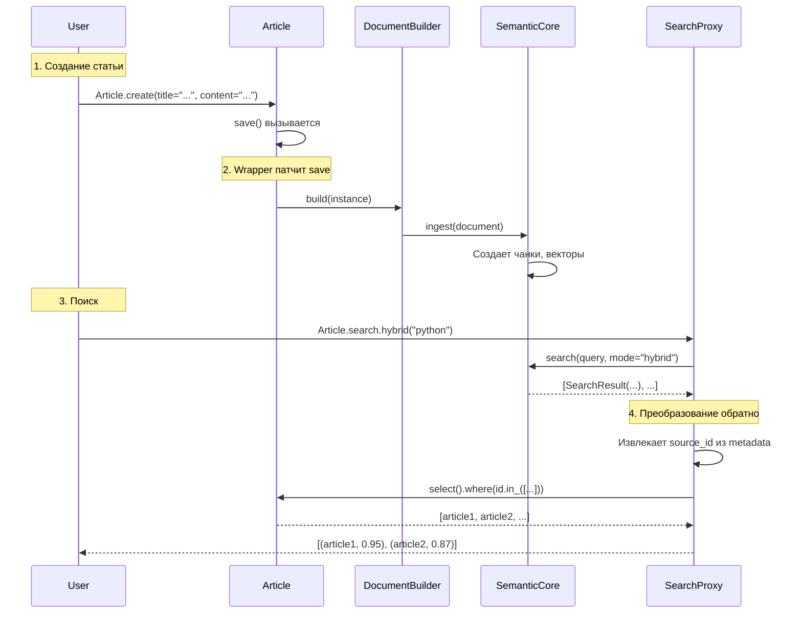
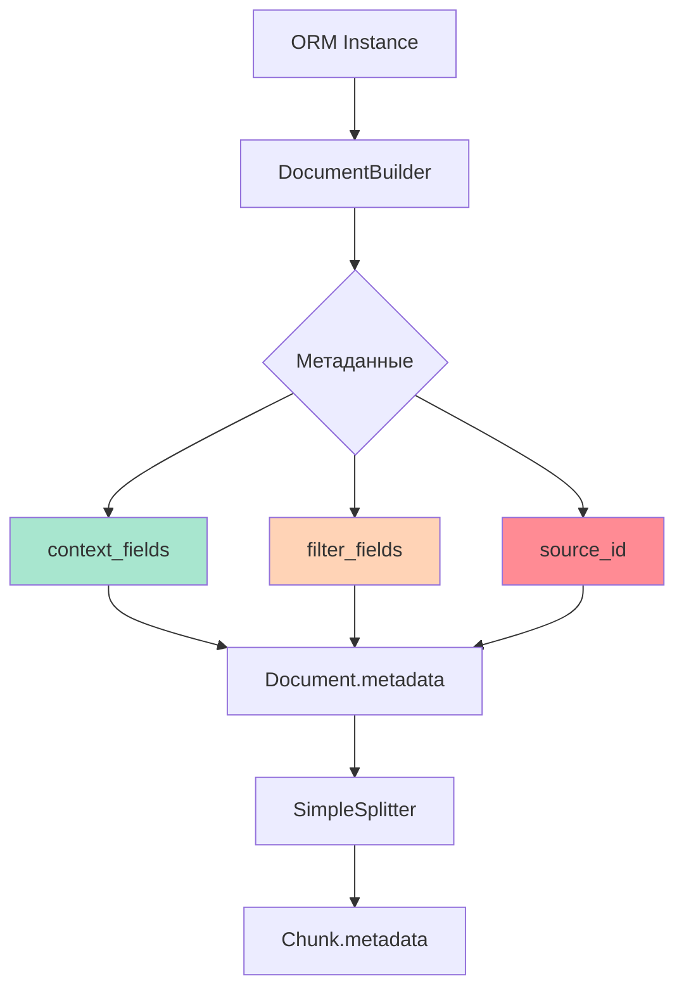

# 🔄 SearchProxy и DocumentBuilder: От ORM к семантике и обратно

> Как превратить `Article` в `Document`, найти похожие, и вернуть обратно `Article`

---

## 📌 Что это такое?

**SearchProxy** и **DocumentBuilder** — это два компонента, которые работают как "переводчики" между двумя мирами:

- **Мир ORM:** `Article`, `Note`, `Post` с полями `title`, `content`
- **Мир семантики:** `Document`, `Chunk`, векторы, метаданные

**Простая аналогия:**

- `DocumentBuilder` — это переводчик с русского на английский (ORM → Semantic)
- `SearchProxy` — это переводчик с английского на русский (Semantic → ORM)

---

## 🎯 Зачем это нужно?

### Проблема: Разные структуры данных

**Peewee модель:**

```python
class Article(Model):
    id = AutoField()
    title = CharField()
    content = TextField()
    author = CharField()
    created_at = DateTimeField()
```

**Semantic Core ожидает:**

```python
class Document:
    content: str
    metadata: dict
    media_type: MediaType
```

**Вопросы:**

1. Как из `Article` сделать `Document`?
2. Что положить в `content`? Только `article.content` или `title + content`?
3. Что положить в `metadata`? Все поля? Только некоторые?
4. После поиска как вернуть `Article` из `SearchResult`?

---

### Без переводчиков (плохо)

```python
# Индексация
article = Article.create(title="Python", content="...")
doc = Document(
    content=article.content,
    metadata={
        "source_id": article.id,
        "title": article.title,
        "author": article.author,
    }
)
semantic_core.ingest(doc)

# Поиск
results = semantic_core.search("python tutorial")
# results = [SearchResult(document=Document(...), score=0.95), ...]

# Как получить Article? Нужно извлекать source_id вручную!
for result in results:
    source_id = result.document.metadata["source_id"]
    article = Article.get_by_id(source_id)
```

**Проблемы:**

- ❌ Дублирование кода (каждый раз собирать Document вручную)
- ❌ Легко забыть добавить `source_id`
- ❌ Сложно масштабировать (разные модели = разная логика)

---

### С переводчиками (хорошо)

```python
# Настройка один раз
class Article(Model):
    title = CharField()
    content = TextField()
    author = CharField()
    
    search = SemanticIndex(
        core=semantic_core,
        content_field='content',        # Основной контент
        context_fields=['title'],       # Для semantic context
        filter_fields=['author']        # Для фильтрации
    )

# Использование
article = Article.create(title="Python", content="...")
# ↑ Автоматически индексируется через DocumentBuilder

# Поиск
results = Article.search.hybrid("python tutorial")
# ↑ Возвращает [(Article, score), ...] через SearchProxy

for article, score in results:
    print(f"{article.title} by {article.author} (score: {score})")
```

**Преимущества:**

- ✅ Декларативная конфигурация
- ✅ Автоматическая индексация
- ✅ Удобный API (сразу ORM объекты)

---

## 🔍 Как это работает?

### Полный цикл: Save → Index → Search → Result



---

## 📦 DocumentBuilder: ORM → Semantic

### Задача

Превратить Peewee инстанс в `Document` DTO для обработки пайплайном.

---

### Конфигурация

```python
builder = DocumentBuilder(
    content_field='content',      # Основной контент
    context_fields=['title'],     # Для semantic context
    filter_fields=['author'],     # Для фильтрации
    media_fields=[]               # Пути к медиа (Phase 6)
)
```

**Что означает каждый параметр:**

| Параметр | Назначение | Куда попадает |
|----------|------------|---------------|
| `content_field` | Основной текст | `Document.content` |
| `context_fields` | Доп. контекст | `Document.metadata` + влияет на векторизацию |
| `filter_fields` | Для фильтрации | `Document.metadata` |
| `media_fields` | Медиа-файлы | `MediaResource` (Phase 6) |

---

### Процесс build()

```python
def build(self, instance) -> Document:
    # 1. Извлекаем основной контент
    content = getattr(instance, self.content_field, "")
    
    # Обрабатываем None
    if content is None:
        content = ""
    
    # 2. Собираем метаданные из context_fields
    metadata = {}
    for field_name in self.context_fields:
        if hasattr(instance, field_name):
            metadata[field_name] = getattr(instance, field_name)
    
    # 3. Добавляем filter_fields
    for field_name in self.filter_fields:
        if hasattr(instance, field_name):
            metadata[field_name] = getattr(instance, field_name)
    
    # 4. Добавляем source_id (КРИТИЧНО!)
    if hasattr(instance, "id") and instance.id is not None:
        metadata["source_id"] = instance.id
    
    # 5. Создаем Document
    return Document(
        content=content,
        metadata=metadata,
        media_type=MediaType.TEXT
    )
```

---

### Пример работы

```python
article = Article(id=42, title="Python Tutorial", content="Learn...", author="Alice")

builder = DocumentBuilder(
    content_field='content',
    context_fields=['title'],
    filter_fields=['author']
)

doc = builder.build(article)

# Результат:
# Document(
#     content="Learn...",
#     metadata={
#         "title": "Python Tutorial",   # ← context_field
#         "author": "Alice",             # ← filter_field
#         "source_id": 42                # ← автоматически
#     },
#     media_type=MediaType.TEXT
# )
```

---

### Зачем context_fields vs filter_fields?

**context_fields** влияют на векторизацию:

```python
# С context_fields=['title']
chunk.content = "Learn Python programming..."
context_text = "Title: Python Tutorial\n\nLearn Python programming..."
# ↑ Векторизуется с учетом заголовка!
```

**filter_fields** используются только для фильтрации:

```python
results = Article.search.hybrid("python", filters={"author": "Alice"})
# ↑ Ищет только статьи Alice
```

---

## 🔎 SearchProxy: Semantic → ORM

### Задача

Выполнить поиск через `SemanticCore` и преобразовать результаты в ORM объекты.

---

### Методы SearchProxy

```python
class SearchProxy:
    def hybrid(self, query: str, filters: dict = None, limit: int = 10, k: int = 60):
        """Гибридный поиск (RRF)."""
    
    def vector(self, query: str, filters: dict = None, limit: int = 10):
        """Только векторный поиск."""
    
    def fts(self, query: str, filters: dict = None, limit: int = 10):
        """Только FTS5 поиск."""
```

**Все методы возвращают:** `list[tuple[ORM_Object, float]]`

---

### Процесс hybrid()

```python
def hybrid(self, query, filters=None, limit=10, k=60):
    # 1. Вызываем SemanticCore
    search_results = self.core.search(
        query=query,
        filters=filters,
        limit=limit,
        mode="hybrid",
        k=k
    )
    # search_results = [SearchResult(document=..., score=0.95), ...]
    
    # 2. Преобразуем в ORM объекты
    return self._results_to_objects(search_results)
```

---

### Магия _results_to_objects()

```python
def _results_to_objects(self, results):
    if not results:
        return []
    
    # 1. Извлекаем source_id из метаданных
    source_ids = []
    score_map = {}
    for result in results:
        source_id = result.document.metadata.get("source_id")
        if source_id:
            source_ids.append(source_id)
            score_map[source_id] = result.score
    
    # 2. Загружаем ORM объекты одним запросом
    objects = list(
        self.model.select().where(self.model.id.in_(source_ids))
    )
    
    # 3. Создаем словарь {id: object}
    obj_map = {obj.id: obj for obj in objects}
    
    # 4. Восстанавливаем порядок по релевантности
    ordered_results = []
    for source_id in source_ids:
        if source_id in obj_map:
            obj = obj_map[source_id]
            score = score_map[source_id]
            ordered_results.append((obj, score))
    
    return ordered_results
```

**Ключевые моменты:**

1. **Batch loading:** Загружаем все объекты одним запросом `WHERE id IN (...)`, а не по одному.
2. **Порядок важен:** Результаты сортируются по релевантности, восстанавливаем этот порядок.
3. **Фильтрация:** Если `source_id` в метаданных есть, но объект удален из БД, пропускаем его.

---

## 📊 Метаданные: Что, куда, зачем?

### Типы метаданных



| Тип | Откуда | Куда | Зачем |
|-----|--------|------|-------|
| **source_id** | `instance.id` | `Document.metadata` → `Chunk.metadata` | Связь между ORM и чанками |
| **context_fields** | Поля модели | `Document.metadata` → влияет на векторизацию | Улучшает поиск |
| **filter_fields** | Поля модели | `Document.metadata` → `Chunk.metadata` | Фильтрация результатов |
| **Технические** | SimpleSplitter | `Chunk.metadata` | `start`, `end`, `cut_type` |

---

### Критическая важность source_id

**Без source_id:**

```python
# Поиск вернул чанки, но как найти Article?
result.document.metadata = {"title": "Python", "author": "Alice"}
# ❌ Нет способа загрузить Article из БД!
```

**С source_id:**

```python
result.document.metadata = {"source_id": 42, "title": "...", ...}
# ✅ Можем загрузить: Article.get_by_id(42)
```

---

### Копирование метаданных в чанки

**Проблема (Bug #1 из Phase 3):**

SimpleSplitter создавал чанки с метаданными:

```python
Chunk(metadata={"start": 0, "end": 100})  # ← Нет source_id!
```

`delete_by_metadata({"source_id": 42})` не находил чанки!

**Решение:**

```python
# SimpleSplitter.split()
chunk_metadata = document.metadata.copy()  # ← Копируем метаданные документа
chunk_metadata.update({
    "start": start,
    "end": end,
    "cut_type": cut_type
})

Chunk(metadata=chunk_metadata)
# ← Теперь есть source_id + технические поля
```

---

## 💡 Примеры использования

### Пример 1: Поиск с фильтрацией

```python
# Ищем только статьи Alice
results = Article.search.hybrid(
    "python tutorial",
    filters={"author": "Alice"},
    limit=5
)

for article, score in results:
    print(f"{article.title} (score: {score:.2f})")
```

**Что происходит:**

1. `SearchProxy.hybrid()` вызывает `SemanticCore.search(filters={"author": "Alice"})`
2. SemanticCore фильтрует чанки по `metadata.author == "Alice"`
3. Возвращает `SearchResult` только для статей Alice
4. `_results_to_objects()` загружает соответствующие `Article` объекты

---

### Пример 2: Разные режимы поиска

```python
# Векторный поиск (синонимы, смысл)
vec_results = Article.search.vector("машинное обучение", limit=3)

# FTS поиск (точные слова)
fts_results = Article.search.fts("machine learning", limit=3)

# Гибридный (RRF объединяет оба)
hybrid_results = Article.search.hybrid("ML tutorial", limit=5, k=60)
```

---

### Пример 3: Множественные индексы

```python
class Article(Model):
    title = CharField()
    content = TextField()
    summary = TextField()
    
    # Два разных индекса
    search_full = SemanticIndex(content_field='content')
    search_summary = SemanticIndex(content_field='summary')

# Поиск по полному контенту
full_results = Article.search_full.hybrid("python")

# Поиск по саммари
summary_results = Article.search_summary.hybrid("python")
```

**Как работает:**

- Каждый дескриптор создает свой `DocumentBuilder`
- При `save()` вызываются оба `_handle_save()` (через `_MODEL_HOOKS`)
- Создаются два набора чанков (с разным content, но одинаковым source_id)

---

## ⚠️ Важные нюансы

### 1. **None в content**

```python
article = Article.create(title="Test", content=None)
```

**Проблема:** `Document.content = None` вызывает `IntegrityError` в БД.

**Решение:**

```python
# В DocumentBuilder.build()
content = getattr(instance, self.content_field, "")
if content is None:
    content = ""
```

---

### 2. **Типы в метаданных**

```python
# В DocumentBuilder
metadata["source_id"] = instance.id  # int, не str!

# В delete_by_metadata
json_extract(metadata, '$.source_id') == value  # Сравнение без str()
```

**Урок:** SQLite `json_extract` возвращает нативные типы. Не приводи числа к строкам!

---

### 3. **Порядок результатов**

`_results_to_objects()` **сохраняет порядок** результатов по релевантности:

```python
# SemanticCore вернул:
# [SearchResult(score=0.95, source_id=10),
#  SearchResult(score=0.87, source_id=5)]

# _results_to_objects вернет:
# [(Article(id=10), 0.95),
#  (Article(id=5), 0.87)]  ← Порядок сохранен!
```

---

### 4. **Удаленные объекты**

Если ORM объект удален, но чанки остались:

```python
results = semantic_core.search("python")
# → [SearchResult(source_id=42), ...]

article = Article.select().where(id == 42).first()
# → None (удалена)
```

`_results_to_objects()` просто пропускает такие записи:

```python
if source_id in obj_map:  # ← Проверка существования
    ordered_results.append((obj, score))
```

---

## 🎭 Альтернативы

### Почему не прямая работа с Document?

```python
# Без SearchProxy
results = semantic_core.search("python")
for result in results:
    doc = result.document
    print(doc.content, doc.metadata)  # ← Работаем с Document, не с Article
```

**Проблемы:**

- ❌ Нужно вручную загружать `Article.get_by_id(doc.metadata["source_id"])`
- ❌ Дублирование кода
- ❌ Нет типизации (IDE не подскажет поля Article)

---

### Почему не встроить в модель?

```python
class Article(Model):
    def to_document(self):
        return Document(content=self.content, ...)
    
    @classmethod
    def from_search_result(cls, result):
        return cls.get_by_id(result.document.metadata["source_id"])
```

**Проблемы:**

- ❌ Нарушаем Single Responsibility Principle
- ❌ Захламляем модель логикой поиска
- ❌ Сложно масштабировать (каждая модель должна реализовывать эти методы)

---

## 🔗 Следующие шаги

Phase 3 завершена! Мы реализовали:

- ✅ Descriptor Protocol для удобного API
- ✅ Method Patching для автоиндексации
- ✅ DocumentBuilder для ORM → Semantic
- ✅ SearchProxy для Semantic → ORM

**Что дальше (Phase 4):**

- Smart Markdown parsing через AST
- Иерархический контекст (parent chunks)
- Умная нарезка по заголовкам

→ [Вернуться к оглавлению](00_overview.md)

---

## 📚 Ключевые термины

**DocumentBuilder** — класс для преобразования ORM инстансов в DTO `Document`.

**SearchProxy** — proxy-объект с методами поиска (`hybrid`, `vector`, `fts`).

**context_fields** — поля, которые влияют на векторизацию (улучшают поиск).

**filter_fields** — поля для фильтрации результатов.

**source_id** — уникальный идентификатор, связывающий ORM объект и чанки.

**_results_to_objects()** — метод преобразования `SearchResult` в ORM объекты с сохранением порядка.

---

**Предыдущий выпуск:** [13. Method Patching](13_method_patching.md)  
**Следующий выпуск:** Phase 4 (Smart Markdown)  
**Вернуться к оглавлению:** [00. Overview](00_overview.md)
