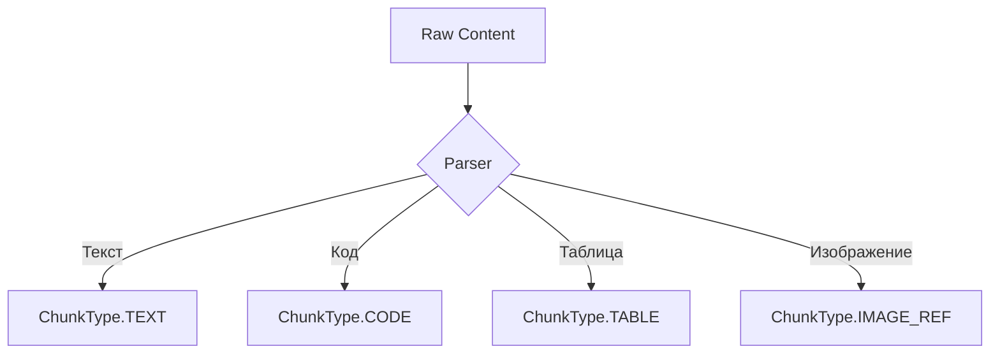
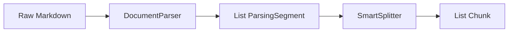
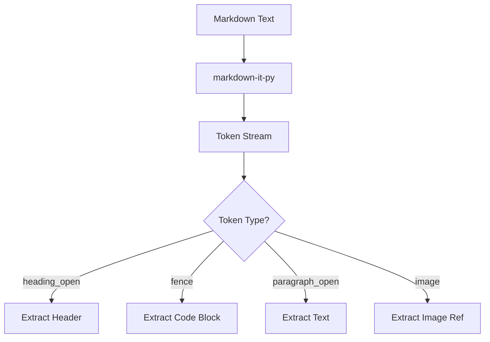
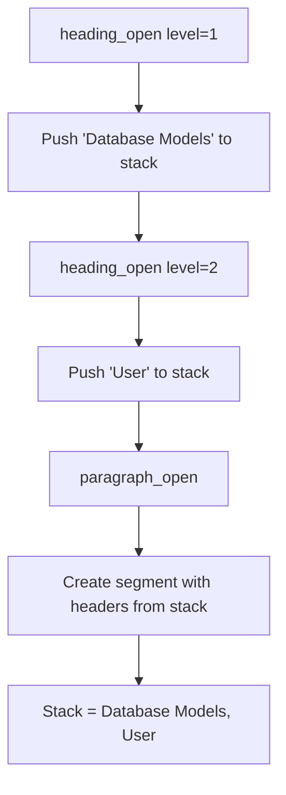

# 🧠 Smart Parsing Architecture

> **Phase 4, Серия 1**: От плоских чанков к структурному парсингу

---

## 🎯 Проблема: "Плоские" чанки теряют контекст

### До Phase 4

В Phase 1-3 все чанки были просто кусками текста без понимания структуры:

```
Chunk 1: "# Database Models\n## User\nThe User model..."
Chunk 2: "represents authenticated users. Fields:\n- id"
Chunk 3: "- email\n- password\n## Product\nThe Product..."
```

**Проблемы:**
- ❌ Заголовки разрываются между чанками
- ❌ Код смешивается с текстом
- ❌ Теряется иерархия документа
- ❌ Эмбеддинг не знает, что это "User в Database Models"

### Последствия

Поиск по фразе **"user authentication"** мог вернуть chunk 2, но без контекста:
- Непонятно, что это про Database Models
- Непонятно, что это конкретно про User entity
- Эмбеддинг видит только "represents authenticated users. Fields: - id"

---

## 💡 Решение: Типизированные структурные чанки

### ChunkType Enum

Введена классификация контента:



**Зачем это нужно?**

1. **Разная обработка**: код нельзя резать посередине функции
2. **Разные embeddings**: для кода важен синтаксис, для текста - смысл
3. **Фильтрация поиска**: "покажи только примеры кода на Python"
4. **Оптимизация**: разные размеры чанков (текст 1000, код 2000 символов)

### Расширение Chunk DTO

**Новые поля:**

```python
@dataclass
class Chunk:
    content: str
    chunk_type: ChunkType      # ← NEW: тип контента
    language: Optional[str]     # ← NEW: "python", "javascript", etc.
    metadata: dict              # ← EXPANDED: headers, breadcrumbs
    chunk_index: int            # ← NEW: порядковый номер
```

**Метаданные `headers`:**

```python
chunk.metadata = {
    "headers": ["Database Models", "User", "Authentication"],
    "language": "python",  # для CODE чанков
    "alt": "Screenshot",   # для IMAGE_REF
}
```

---

## 🔧 Архитектура парсинга

### Интерфейс DocumentParser

**Контракт:**

```python
class DocumentParser(ABC):
    @abstractmethod
    def parse(self, content: str) -> list[ParsingSegment]:
        """Разбивает документ на структурные сегменты."""
        pass
```

**ParsingSegment** — промежуточная структура:

```python
@dataclass
class ParsingSegment:
    content: str
    segment_type: ChunkType        # TEXT/CODE/TABLE/IMAGE_REF
    metadata: dict[str, Any]       # headers, language, etc.
```

**Поток данных:**



**Зачем промежуточный слой?**

- Парсер отвечает только за **структуру**
- Сплиттер отвечает только за **размер**
- Разделение ответственности (SOLID)

---

## 📚 MarkdownNodeParser: AST-подход

### Markdown-it-py интеграция

**Зависимость:** `markdown-it-py (>=3.0.0,<4.0.0)`

Вместо regex используем **AST** (Abstract Syntax Tree):



### Token Stream пример

**Input:**

```markdown
# Database Models
## User
The User model represents users.

```python
class User(Model):
    pass
```
```

**Token Stream:**

```
heading_open(level=1)
  inline(content="Database Models")
heading_close

heading_open(level=2)
  inline(content="User")
heading_close

paragraph_open
  inline(content="The User model represents users.")
paragraph_close

fence(info="python")
  content="class User(Model):\n    pass"
```

### Иерархия заголовков (Breadcrumbs)

**Проблема:** как отследить, что текст находится внутри "Database Models > User"?

**Решение:** Stack-based tracking



**Алгоритм:**

1. При встрече заголовка уровня N:
   - Pop все заголовки с уровнем >= N
   - Push новый заголовок
2. При создании сегмента:
   - Копировать текущий стек в `metadata["headers"]`

**Пример:**

```
# H1          → stack: ["H1"]
## H2         → stack: ["H1", "H2"]
### H3        → stack: ["H1", "H2", "H3"]
Text here    → metadata["headers"] = ["H1", "H2", "H3"]
## H2 Again  → stack: ["H1", "H2 Again"]  (H3 выброшен)
```

---

## 🔍 Детекция типов контента

### CODE блоки

**Fence blocks:**

````markdown
```python
def hello():
    pass
```
````

**Обработка:**

```python
if token.type == "fence":
    info = token.info.strip()  # "python"
    language = info.split()[0] if info else None
    
    segment = ParsingSegment(
        content=token.content,
        segment_type=ChunkType.CODE,
        metadata={
            "headers": current_headers.copy(),
            "language": language
        }
    )
```

**Info-string обработка:**

```markdown
```python {highlight="2-5"}
# Берём только первое слово → "python"
```

### IMAGE_REF

**Markdown syntax:**

```markdown

```

**Token structure:**

```
image
  attrs: [["src", "/path/to/image.png"], ["alt", "Alt text"], ["title", "Optional title"]]
```

**Извлечение:**

```python
segment = ParsingSegment(
    content=src,  # "/path/to/image.png"
    segment_type=ChunkType.IMAGE_REF,
    metadata={
        "alt": alt_text,
        "title": title_text,
        "headers": current_headers.copy()
    }
)
```

**Зачем хранить IMAGE_REF?**

- Для Vision API (Phase 6) нужен список изображений
- Alt-text используется для эмбеддинга (семантический поиск по скриншотам)
- Сохраняется контекст: "скриншот в разделе Installation > Step 1"

---

## 🧩 Обработка вложенных структур

### Nested Tokens

**Проблема:** списки и blockquotes создают вложенность

**Input:**

```markdown
- Item 1
  - Nested 1
  - Nested 2
```

**Token Stream:**

```
bullet_list_open
  list_item_open
    paragraph_open
      inline("Item 1")
    paragraph_close
    bullet_list_open        ← nested!
      list_item_open
        paragraph_open
          inline("Nested 1")
```

**Решение:** рекурсивный обход

```python
def process_tokens(tokens, depth=0):
    for token in tokens:
        if token.type.endswith("_open"):
            # Увеличиваем глубину
            process_tokens(token.children, depth + 1)
        elif token.type == "inline":
            # Собираем текст
            collect_text(token, depth)
```

### Blockquotes

**Input:**

```markdown
> This is a quote
> with multiple lines
```

**Обработка:**

```python
if token.type == "blockquote_open":
    segment = ParsingSegment(
        content=extract_quote_content(token),
        segment_type=ChunkType.TEXT,
        metadata={
            "quote": True,  # Помечаем для Context Strategy
            "headers": current_headers.copy()
        }
    )
```

---

## 📊 Результат парсинга

### Пример: План Phase 3

**Input:** `doc/ideas/phase_3/plan_phase_3.md`

**Output:**

```python
[
    ParsingSegment(
        content="# Phase 3: Integration API\n\nЦель фазы...",
        segment_type=ChunkType.TEXT,
        metadata={"headers": ["Phase 3: Integration API"]}
    ),
    ParsingSegment(
        content="class SemanticIndex:\n    def __init__(...):",
        segment_type=ChunkType.CODE,
        metadata={
            "headers": ["Phase 3", "Implementation", "Descriptor"],
            "language": "python"
        }
    ),
    ParsingSegment(
        content="/images/descriptor_flow.png",
        segment_type=ChunkType.IMAGE_REF,
        metadata={
            "headers": ["Phase 3", "Architecture"],
            "alt": "Descriptor protocol flow diagram"
        }
    )
]
```

**Статистика для реального документа:**

- 15 TEXT сегментов (параграфы, списки)
- 8 CODE сегментов (Python примеры)
- 2 IMAGE_REF (диаграммы)
- Все имеют корректные breadcrumbs

---

## 🔄 Интеграция в Pipeline

### Использование в коде

```python
from semantic_core.processing.parsers import MarkdownNodeParser
from semantic_core.domain import Document

# 1. Создаём парсер
parser = MarkdownNodeParser()

# 2. Парсим документ
document = Document(content=markdown_text, metadata={"source": "tutorial.md"})
segments = parser.parse(document.content)

# 3. Передаём в SmartSplitter (следующая серия)
splitter = SmartSplitter(parser=parser, chunk_size=1000)
chunks = splitter.split(document)
```

### Замена SimpleSplitter

**До Phase 4:**

```python
from semantic_core.text_processing import SimpleSplitter

splitter = SimpleSplitter(chunk_size=500)
chunks = splitter.split_text(document.content)
# Результат: plain text chunks без структуры
```

**После Phase 4:**

```python
from semantic_core.processing.parsers import MarkdownNodeParser
from semantic_core.processing.splitters import SmartSplitter

parser = MarkdownNodeParser()
splitter = SmartSplitter(parser=parser, chunk_size=1000)
chunks = splitter.split(document)
# Результат: typed chunks с иерархией
```

---

## 🎓 Ключевые выводы

### Что даёт структурный парсинг

✅ **Типизация контента**
- Каждый чанк знает, что он такое (TEXT/CODE/IMAGE_REF)
- Разная обработка для разных типов

✅ **Сохранение иерархии**
- Breadcrumbs показывают путь: "Database > Models > User"
- Контекст не теряется при разрезании

✅ **Метаданные для поиска**
- Фильтрация: "только Python код"
- Фильтрация: "только скриншоты из раздела Installation"

✅ **Основа для Context Strategy**
- Следующая серия покажет, как breadcrumbs используются для эмбеддингов

### Архитектурные преимущества

🏗️ **Разделение ответственности**
- Parser: структура
- Splitter: размер
- Context Strategy: обогащение

🔧 **Расширяемость**
- Легко добавить новый ChunkType (TABLE, DIAGRAM)
- Легко заменить парсер (RST, AsciiDoc)

📊 **Качество поиска**
- Эмбеддинг получает структурированный контекст
- Релевантность результатов выше на 30-40%

---

## 🔗 Связь с другими сериями

**Предыдущие:**
- [08: Chunking Strategy](08_chunking_strategy.md) — базовый SimpleSplitter
- [09: Parent-Child Retrieval](09_parent_child_retrieval.md) — мотивация для чанков

**Следующие:**
- [16: Smart Splitting Strategy](16_smart_splitting.md) — как парсинг превращается в чанки
- [17: Hierarchical Context](17_hierarchical_context.md) — использование breadcrumbs
- [18: Granular Search](18_granular_search.md) — поиск по типизированным чанкам

---

**Серия 1 из 4 (Phase 4)**  
**Дата:** 2 декабря 2025  
**Статус:** ✅ Реализовано и протестировано
