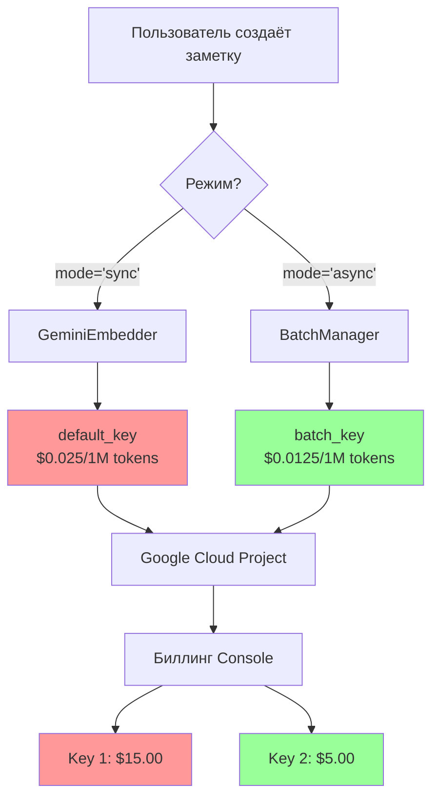

# 🔐 API Key Management: Разделение биллинга

> Как изолировать затраты между синхронной и асинхронной векторизацией

---

## 📌 Что это такое?

**GoogleKeyring** — это domain объект, который хранит два независимых API ключа Google Gemini: один для обычных операций, второй для batch processing.

Простая идея: **разные ключи = раздельный биллинг в Google Cloud Console**.

---

## 🎯 Зачем это нужно?

**Проблема:**

Представь, что ты внедрил Batch API для экономии 50% на векторизации. Прошёл месяц, ты заходишь в биллинг... и видишь общую сумму. **Но как понять, сколько именно сэкономил батчинг?**

Если используешь один API ключ для всего, Google объединяет запросы в одну строку счёта:

```
Gemini API (text-embedding-004): $25.00
```

Непонятно, сколько из этого обычный `embed_content()`, а сколько — Batch API.

**Решение:**

Два независимых API ключа → две строки в биллинге:

```
Gemini API (Key 1 - default):     $15.00  ← Синхронная векторизация
Gemini API (Key 2 - batch):       $5.00   ← Batch processing (50% дешевле!)
```

Теперь ты **видишь экономию напрямую** в счёте.

---

## 🔍 Как это работает?

### Концептуальная схема



### Жизненный цикл ключей

1. **Создание:** Генерируешь два API ключа в Google AI Studio
2. **Конфигурация:** Сохраняешь в `.env` или secrets manager
3. **Использование:** Pipeline выбирает ключ в зависимости от режима
4. **Мониторинг:** Проверяешь раздельный биллинг в Google Cloud Console

---

## 📊 Сравнение подходов

| Критерий | Один ключ | GoogleKeyring (два ключа) |
|----------|-----------|---------------------------|
| **Видимость экономии** | ❌ Непонятно | ✅ Раздельный биллинг |
| **Безопасность** | ⚠️ Если скомпрометирован — потеря всего | ✅ Изоляция blast radius |
| **Квоты** | ⚠️ Общая квота на всё | ✅ Независимые лимиты |
| **Анализ затрат** | ❌ Ручной подсчёт | ✅ Автоматический в Console |
| **Сложность setup** | ✅ Один ключ в .env | ⚠️ Два ключа в .env |

---

## ⚠️ Важные нюансы

### 1. Валидация при старте

GoogleKeyring **проверяет наличие batch_key** при инициализации BatchManager:

- Если `batch_key = None` → **ValueError**
- Почему строго? Потому что без ключа BatchManager не сможет отправить задания в Google

**Аналогия:** Как проверка наличия денег на счёте перед покупкой билета.

---

### 2. Безопасность и ротация

**Хранение:**

- ❌ **НЕ коммить** ключи в Git
- ✅ Использовать `.env` (локально) или AWS Secrets Manager (production)
- ✅ Ограничить IP в Google Cloud Console (whitelist)

**Ротация:**

Если ключ скомпрометирован:

1. Создай новый ключ в Google AI Studio
2. Обнови `.env` или secrets manager
3. Удали старый ключ из Google Console
4. **Важно:** batch_key можно менять независимо от default_key

**Преимущество:** Если утёк batch_key, злоумышленник может только **отправлять batch jobs**, но не делать синхронные запросы.

---

### 3. Квоты и лимиты

Google Gemini API имеет **rate limits** (запросов в минуту):

| Лимит | Значение |
|-------|----------|
| Requests per minute (RPM) | 1500 |
| Tokens per minute (TPM) | 1M |

**Проблема:** Если используешь один ключ, синхронные и batch запросы **делят общую квоту**.

**Решение:** Два ключа → **удвоение квоты**:

- default_key: 1500 RPM для синхронных запросов
- batch_key: 1500 RPM для batch processing

**Аналогия:** Как два канала в Wi-Fi роутере — не мешают друг другу.

---

### 4. Биллинг проекты

**Опциональная оптимизация:** Можно создать **два отдельных Google Cloud проекта**:

- Проект A (default_key) — для production трафика
- Проект B (batch_key) — для фоновой обработки

**Преимущества:**

- ✅ Полная изоляция budgets (alerts при превышении)
- ✅ Разные команды могут управлять проектами
- ✅ Легче анализировать затраты по сервисам

**Недостатки:**

- ⚠️ Больше административной работы
- ⚠️ Нужно настраивать два проекта

---

## 🎓 Аналогия из жизни

Представь кафе с двумя кассами:

- **Касса 1 (default_key):** Для клиентов, которые заказывают "на вынос" (быстро, дороже)
- **Касса 2 (batch_key):** Для предзаказов оптом со скидкой 50% (медленнее, дешевле)

Владелец кафе хочет знать: **сколько зарабатывает каждая касса**?

Если использовать одну кассу — непонятно. Две кассы → **раздельный учёт выручки** в конце дня.

---

## 🔗 Следующий шаг

Теперь, когда ты понимаешь **зачем** нужно разделение ключей, перейдём к тому, **как работает асинхронная обработка**:

→ [**20. Async Processing: From Sync to Queue**](20_async_processing.md)

---

**← [Назад к оглавлению](00_overview.md)**
