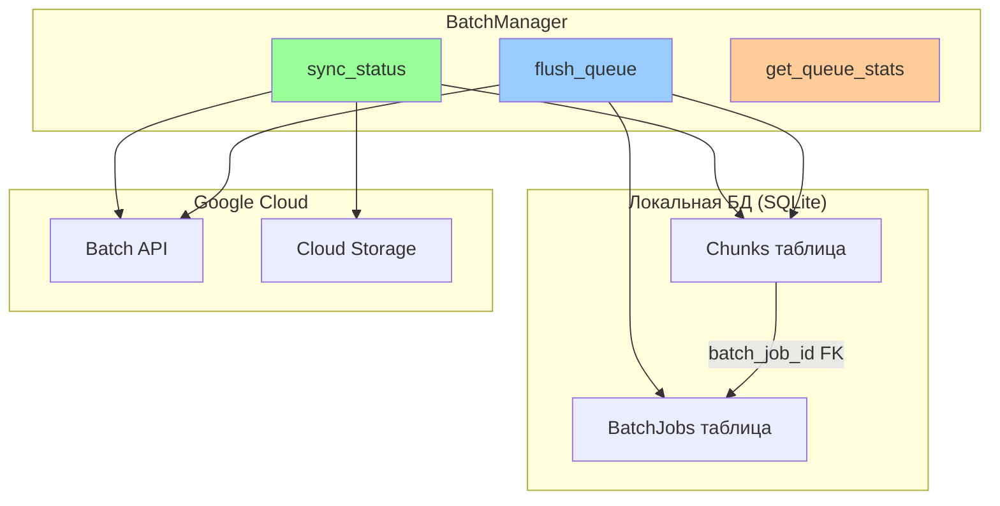
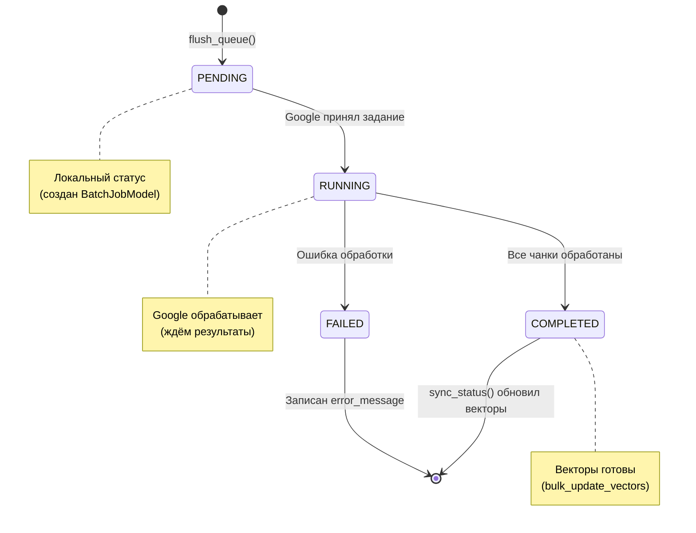

# 🎛️ BatchManager: Локальная оркестрация очереди

> Как SQLite управляет жизненным циклом батч-заданий

---

## 📌 Что это такое?

**BatchManager** — это оркестратор, который координирует очередь чанков в локальной БД и отправляет их пачками в Google Batch API. Он следит за статусами заданий, синхронизирует результаты и обновляет векторы.

Простая идея: **SQLite как очередь задач** вместо Redis/RabbitMQ.

---

## 🎯 Зачем это нужно?

**Проблема: Как координировать тысячи чанков?**

Представь: у тебя 1000 документов в async режиме, каждый разбит на 5 чанков = **5000 чанков** ждут векторизации.

Вопросы:

1. Когда отправлять в Google? (Ждать накопления или сразу?)
2. Как группировать? (По 10? По 100? По 1000?)
3. Что делать с результатами? (Как обновить векторы в БД?)
4. Как обработать ошибки? (Retry? Логирование?)

**Решение: BatchManager как диспетчер**

BatchManager отвечает на все эти вопросы через **два ключевых метода**:

- `flush_queue()` — "Собрать PENDING чанки и отправить в Google"
- `sync_status()` — "Проверить завершённые задания и обновить векторы"

---

## 🔍 Как это работает?

### Архитектурная схема



### Жизненный цикл батч-задания



---

## 🎛️ Ключевые методы

### 1. flush_queue() — Отправка батча

**Что делает:**

1. Выбирает все чанки со статусом `PENDING` без `batch_job_id`
2. Если количество < `min_size` и `force=False` → пропускает
3. Создаёт `BatchJobModel` с `status=PENDING`
4. Связывает чанки с батчем (обновляет `batch_job_id`)
5. Вызывает `batch_client.create_embedding_job()`
6. Обновляет `google_job_id` и `status=RUNNING`

**Параметры:**

- `min_size` (default: 100) — минимальный размер батча
- `force` (bool) — отправить независимо от размера

**Пример:**

```
Очередь: 50 PENDING чанков

flush_queue(min_size=100) → None (недостаточно)
flush_queue(min_size=100, force=True) → "batch_abc123" (отправлен!)
```

**Зачем min_size?**

Batch API эффективен только при больших объёмах. Если отправлять по 5 чанков, overhead (создание job, загрузка JSONL) съедает экономию.

**Аналогия:** Как доставка — выгоднее везти полный грузовик, чем 10 раз по 1 коробке.

---

### 2. sync_status() — Синхронизация результатов

**Что делает:**

1. Выбирает все `BatchJobModel` с `status IN (PENDING, RUNNING)`
2. Для каждого вызывает `batch_client.get_job_status(google_job_id)`
3. **Если COMPLETED:**
   - Вызывает `retrieve_results()` → получает `dict[chunk_id → vector_blob]`
   - Вызывает `bulk_update_vectors()` → сохраняет векторы в `chunks_vec`
   - Обновляет чанки: `embedding_status=READY`, `batch_job_id=NULL`
   - Обновляет батч: `status=COMPLETED`, `completed_chunks=total_chunks`
4. **Если FAILED:**
   - Записывает `error_message` в BatchJobModel
   - Обновляет чанки: `error_message` из Google response
   - Обновляет батч: `status=FAILED`

**Когда вызывать:**

- ✅ **Worker скрипт:** Запускается каждые 5 минут (cron)
- ✅ **Manually:** Для дебага (`python worker.py --sync`)
- ❌ **Не надо:** Вызывать после каждого `ingest()` (слишком часто)

---

### 3. get_queue_stats() — Мониторинг

**Что возвращает:**

```python
{
    "pending": 150,    # Чанки ждут отправки
    "running": 500,    # Чанки в обработке
    "failed": 5        # Чанки с ошибками
}
```

**Use case:**

Показывать прогресс в UI:

```
⏳ В очереди: 150 документов
🔄 Обрабатывается: 500 документов
❌ Ошибки: 5 документов
```

---

## 📊 Таблицы БД

### BatchJobModel

| Поле | Тип | Назначение |
|------|-----|------------|
| `id` | INT | Локальный ID |
| `google_job_id` | VARCHAR | ID задания в Google Cloud |
| `status` | ENUM | PENDING/RUNNING/COMPLETED/FAILED |
| `total_chunks` | INT | Сколько чанков в батче |
| `completed_chunks` | INT | Сколько обработано |
| `created_at` | DATETIME | Когда создан |
| `updated_at` | DATETIME | Последнее обновление |

**Индексы:**

- PRIMARY KEY на `id`
- INDEX на `google_job_id` (для быстрого поиска при sync)
- INDEX на `status` (для выборки активных заданий)

---

### ChunkModel (новые поля)

| Поле | Тип | Назначение |
|------|-----|------------|
| `embedding_status` | ENUM | PENDING/READY/FAILED |
| `batch_job_id` | FK | Связь с BatchJobModel |
| `error_message` | TEXT | Описание ошибки (nullable) |

---

## ⚠️ Важные нюансы

### 1. Идемпотентность sync_status()

**Проблема:** Что если `sync_status()` вызван дважды для одного задания?

**Решение:** Метод **идемпотентен**:

1. При первом вызове: статус `RUNNING` → `COMPLETED`, векторы обновлены
2. При втором вызове: статус уже `COMPLETED` → пропускается

**SQL:**

```sql
SELECT * FROM batch_jobs
WHERE status IN ('PENDING', 'RUNNING')  -- Только активные
```

Завершённые задания не попадают в выборку → **безопасно вызывать многократно**.

---

### 2. Транзакции для атомарности

**Критично:** Все операции в `flush_queue()` и `sync_status()` обёрнуты в транзакции.

**Почему важно:**

Если после `create_embedding_job()` приложение упало, а `google_job_id` не сохранён:

- ❌ Задание отправлено в Google, но БД не знает об этом
- ❌ Чанки навсегда останутся `PENDING`
- ❌ Деньги потрачены, векторов нет

**Решение:**

```python
with db.atomic():
    # 1. Создать BatchJobModel
    # 2. Связать чанки
    # 3. Вызвать batch_client
    # 4. Сохранить google_job_id
    # Если что-то упало → rollback всего
```

---

### 3. Обработка partial failures

**Сценарий:** 100 чанков отправлено, 95 успешны, 5 провалены.

**Текущая реализация (Phase 5.0):**

- Весь батч помечается как `FAILED`
- `error_message` сохраняется во все чанки

**Улучшение (Phase 6):**

- Обрабатывать успешные чанки → `embedding_status=READY`
- Проваленные чанки → `embedding_status=FAILED` с индивидуальными ошибками
- Retry логика для проваленных

---

### 4. Worker deployment patterns

**Как запускать sync_status()?**

**Вариант A: Cron job**

```bash
# crontab
*/5 * * * * cd /app && python worker.py
```

✅ Просто  
⚠️ Нет monitoring

---

**Вариант B: Systemd service**

```ini
# /etc/systemd/system/batch-worker.service
[Service]
ExecStart=/app/worker.py
Restart=always
```

✅ Автоперезапуск при сбое  
✅ Логи через journalctl

---

**Вариант C: Kubernetes CronJob**

```yaml
apiVersion: batch/v1
kind: CronJob
metadata:
  name: batch-worker
spec:
  schedule: "*/5 * * * *"
```

✅ Cloud-native  
✅ Масштабируемость

---

## 🎓 Аналогия из жизни

Представь склад с конвейером:

**flush_queue()** — это **погрузчик**:

- Собирает коробки (чанки) с полки (БД)
- Ждёт, пока накопится полный поддон (min_size=100)
- Отправляет грузовик в доставку (Google)
- Прикрепляет трек-номер (google_job_id)

**sync_status()** — это **диспетчер доставки**:

- Проверяет статус грузовиков по трек-номерам
- Если доставлено → обновляет инвентарь (векторы в БД)
- Если потеряно → записывает в журнал ошибок

**get_queue_stats()** — это **дашборд склада**:

- Показывает: сколько коробок на полке, в пути, потеряно

---

## 🔗 Следующий шаг

Теперь ты понимаешь **оркестрацию** очереди. Но **как именно** БД эволюционирует без breaking changes?

→ [**23. Schema Evolution: Обратная совместимость**](23_schema_evolution.md)

---

**← [Назад к оглавлению](00_overview.md)**
