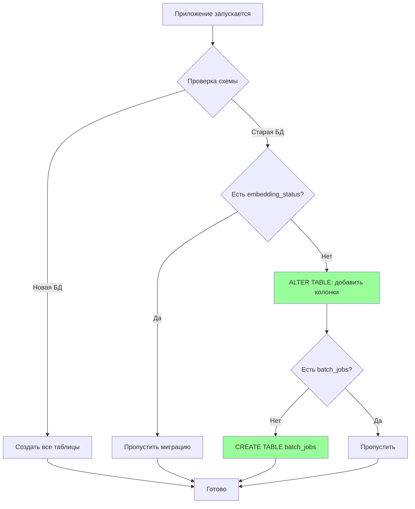

# 🔄 Schema Evolution: Миграция без downtime

> Как добавлять новые поля в БД без breaking changes

---

## 📌 Что это такое?

**Schema Evolution** — это процесс изменения структуры базы данных (добавление таблиц, колонок, индексов) таким образом, чтобы **старая версия приложения продолжала работать**.

Простая идея: **новые поля опциональны, старые неизменны**.

---

## 🎯 Зачем это нужно?

**Проблема: Breaking changes при обновлении**

Представь пользователя библиотеки, который обновился с Phase 4 на Phase 5:

**Phase 4 схема:**

```sql
CREATE TABLE chunks (
    id INTEGER PRIMARY KEY,
    content TEXT NOT NULL,
    chunk_type TEXT,
    language TEXT
);
```

**Phase 5 схема (naive подход):**

```sql
-- ❌ ПЛОХО: Дроп старой таблицы
DROP TABLE chunks;

CREATE TABLE chunks (
    id INTEGER PRIMARY KEY,
    content TEXT NOT NULL,
    chunk_type TEXT,
    language TEXT,
    embedding_status TEXT NOT NULL,  -- Новое поле!
    batch_job_id INTEGER
);
```

**Проблема:**

- ❌ Все данные **потеряны** (DROP TABLE)
- ❌ Старая версия приложения **сломается** (embedding_status отсутствует)
- ❌ Пользователь должен **вручную** пересоздать БД

**Это недопустимо для production библиотеки!**

---

**Решение: Автоматическая миграция с ALTER TABLE**

```sql
-- ✅ ХОРОШО: Добавить колонки к существующей таблице
ALTER TABLE chunks ADD COLUMN embedding_status TEXT DEFAULT 'READY';
ALTER TABLE chunks ADD COLUMN batch_job_id INTEGER;
ALTER TABLE chunks ADD COLUMN error_message TEXT;

-- Создать новую таблицу для батч-заданий
CREATE TABLE IF NOT EXISTS batch_jobs (...);
```

**Преимущества:**

- ✅ Данные **сохранены**
- ✅ Старые чанки получают `embedding_status='READY'` (уже векторизованы)
- ✅ Новые чанки могут иметь `PENDING` или `FAILED`
- ✅ **Нулевая ручная работа** для пользователя

---

## 🔍 Как это работает?

### Механизм ensure_schema_compatibility()



### Алгоритм миграции

**Шаг 1: Проверка наличия колонки**

```sql
PRAGMA table_info(chunks);
```

Возвращает список всех колонок. Ищем `embedding_status` в результатах.

**Шаг 2: Добавление колонки (если отсутствует)**

```sql
ALTER TABLE chunks ADD COLUMN embedding_status TEXT DEFAULT 'READY';
```

**Критично:** `DEFAULT 'READY'` — **все старые чанки** автоматически получают статус `READY` (они уже векторизованы в Phase 4).

**Шаг 3: Создание таблицы batch_jobs**

```sql
CREATE TABLE IF NOT EXISTS batch_jobs (
    id INTEGER PRIMARY KEY AUTOINCREMENT,
    google_job_id TEXT UNIQUE,
    status TEXT NOT NULL,
    total_chunks INTEGER,
    completed_chunks INTEGER DEFAULT 0,
    created_at DATETIME DEFAULT CURRENT_TIMESTAMP,
    updated_at DATETIME DEFAULT CURRENT_TIMESTAMP
);
```

`IF NOT EXISTS` — безопасная операция, не упадёт если таблица уже создана.

---

## 📊 Версионирование схемы

### Phase 4 → Phase 5 миграция

| Изменение | Тип | Backward compatible? |
|-----------|-----|----------------------|
| `chunks.embedding_status` | Добавление колонки | ✅ Да (с DEFAULT) |
| `chunks.batch_job_id` | Добавление FK | ✅ Да (nullable) |
| `chunks.error_message` | Добавление колонки | ✅ Да (nullable) |
| `batch_jobs` таблица | Новая таблица | ✅ Да (независимая) |

**Критерий backward compatibility:**

- ✅ **Добавление** nullable колонок — ОК
- ✅ **Добавление** колонок с DEFAULT — ОК
- ✅ **Создание** новых таблиц — ОК
- ❌ **Удаление** колонок — BREAKING CHANGE
- ❌ **Изменение** типа колонки — BREAKING CHANGE

---

## ⚠️ Важные нюансы

### 1. SQLite ограничения на ALTER TABLE

**SQLite не умеет:**

- ❌ Добавить NOT NULL колонку к заполненной таблице
- ❌ Добавить FOREIGN KEY к существующей таблице
- ❌ Изменить тип колонки (ALTER COLUMN)
- ❌ Удалить колонку (до SQLite 3.35.0)

**Workaround для NOT NULL:**

Используй DEFAULT:

```sql
-- ❌ НЕ РАБОТАЕТ
ALTER TABLE chunks ADD COLUMN embedding_status TEXT NOT NULL;

-- ✅ РАБОТАЕТ
ALTER TABLE chunks ADD COLUMN embedding_status TEXT DEFAULT 'READY';
-- Потом добавь CHECK constraint для новых строк
```

---

### 2. Идемпотентность миграций

**Проблема:** Что если `ensure_schema_compatibility()` вызван дважды?

**Решение:** Все операции **идемпотентны**:

```sql
-- Вызов 1: добавляет колонку
ALTER TABLE chunks ADD COLUMN embedding_status TEXT DEFAULT 'READY';

-- Вызов 2: НЕ УПАДЁТ (но и не добавит дубликат)
-- SQLite вернёт ошибку "duplicate column name", которую мы обрабатываем
```

**Реализация:**

```python
try:
    db.execute_sql("ALTER TABLE chunks ADD COLUMN embedding_status TEXT DEFAULT 'READY'")
except OperationalError as e:
    if "duplicate column" in str(e):
        pass  # Колонка уже существует, всё ОК
    else:
        raise  # Другая ошибка, пробрасываем
```

---

### 3. Rollback стратегия

**Вопрос:** Что делать, если Phase 5 сломалась и нужно откатиться на Phase 4?

**Хорошая новость:** Phase 4 код **продолжает работать** с Phase 5 схемой!

```python
# Phase 4 код
chunk = ChunkModel.create(
    content="text",
    chunk_type="text",
    language=None
)
# embedding_status автоматически получит DEFAULT 'READY'
# batch_job_id останется NULL
```

**Почему работает:**

- Phase 4 не знает о новых колонках → игнорирует их
- SQLite заполняет DEFAULT значения автоматически

**Аналогия:** Как старый телефон с новой SIM-картой — просто не использует новые функции (5G), но звонки работают.

---

### 4. Миграция vs Alembic/Django ORM

**Вопрос:** Почему не использовать Alembic для миграций?

**Ответ:**

**Преимущества Alembic:**

- ✅ Версионирование миграций (001_initial, 002_add_batching)
- ✅ Rollback через `alembic downgrade`
- ✅ Поддержка сложных трансформаций

**Недостатки для библиотеки:**

- ❌ Требует установки `alembic` (лишняя зависимость)
- ❌ Пользователь должен **вручную** вызывать `alembic upgrade head`
- ❌ Усложняет onboarding

**Наш подход:**

- ✅ **Zero-config:** Просто обновил библиотеку → всё работает
- ✅ **Автоматическая миграция** при первом запуске
- ⚠️ Ограничен простыми ALTER TABLE (но этого достаточно для Phase 1-5)

**Рекомендация:** Для корпоративных deployment используй Alembic. Для rapid prototyping — `ensure_schema_compatibility()`.

---

## 🎓 Аналогия из жизни

Представь многоквартирный дом:

**Phase 4** — дом с 5 этажами, в каждой квартире:

- Спальня (content)
- Кухня (chunk_type)
- Ванная (language)

**Phase 5** — владелец решил **добавить балконы** (embedding_status):

**❌ ПЛОХОЙ подход:**

- Снести дом, построить новый с балконами
- Жильцы (данные) остаются на улице

**✅ ХОРОШИЙ подход:**

- Пристроить балконы к **существующим квартирам**
- Старые жильцы (Phase 4 чанки) получают балкон с DEFAULT мебелью
- Новые жильцы (Phase 5 чанки) могут обустроить балкон по-своему

**Никто не переезжает, downtime = 0!**

---

## 🔗 Завершение серии

Поздравляю! Ты прошёл всю серию **Async Batching & Cost Optimization**:

1. ✅ [19. API Key Management](19_api_key_management.md) — Разделение биллинга
2. ✅ [20. Async Processing](20_async_processing.md) — От блокировки к очереди
3. ✅ [21. Batch API Economics](21_batch_api_economics.md) — 50% экономия
4. ✅ [22. BatchManager](22_batch_manager.md) — Локальная оркестрация
5. ✅ [23. Schema Evolution](23_schema_evolution.md) — Миграция без downtime

**Следующие шаги:**

- 📚 Изучи [технические отчёты Phase 5](../../ideas/phase_5/) для деталей реализации
- 🔬 Запусти [example_phase5.py](../../../example_phase5.py) для практики
- 🧪 Изучи [тесты Phase 5](../../../tests/) для примеров использования

---

**← [Назад к оглавлению](00_overview.md)**
