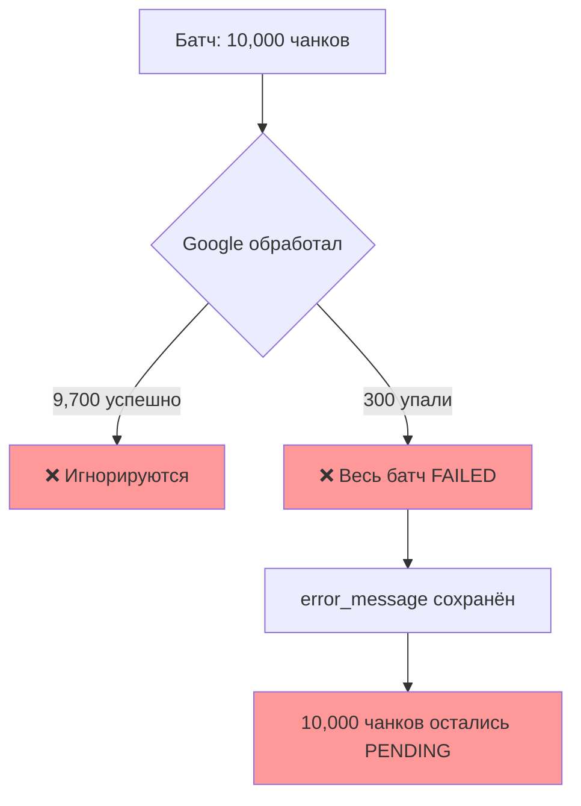
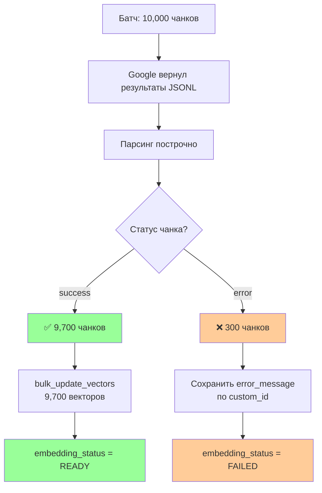

# ⚙️ Production Optimizations: От прототипа к масштабу

> Узкие места и решения при обработке миллионов чанков

---

## 📌 Что это такое?

**Production Optimizations** — это набор техник для улучшения производительности и надёжности батч-обработки при переходе от proof-of-concept к реальной нагрузке.

Простая идея: **то, что работает на 100 документах, может сломаться на 100,000**.

---

## 🎯 Зачем это нужно?

**Проблема: Prototype работает, Production тормозит**

Представь: ты успешно протестировал батчинг на 1000 документах. Всё работает, экономия 50%, красота!

Через месяц приходит клиент: "У нас корпоративная база знаний — 500,000 документов. Можете переиндексировать?"

Ты запускаешь... и сталкиваешься с проблемами:

```
❌ Батч из 10,000 чанков обработался, но 5 чанков упали
   → Весь батч помечен FAILED
   → 9,995 успешных векторов выброшены

❌ bulk_update_vectors обрабатывает 20,000 векторов
   → Python цикл работает 30 секунд
   → Worker блокируется
```

**Это типичные production проблемы**, которые не видны на малых объёмах.

---

## 🔍 Проблема #1: Partial Failures

### Суть проблемы

Google Batch API **не гарантирует 100% успех** всех запросов в батче. Типичные причины сбоев:

| Причина | Пример | Частота |
|---------|--------|---------|
| Слишком длинный текст | Чанк превысил 2048 токенов | ~1-2% |
| Спецсимволы | Unicode control characters в тексте | ~0.5% |
| Rate limit (редко) | Google временно перегружен | ~0.1% |
| Invalid JSON | Экранирование сломалось | ~0.1% |

**Итого:** В батче из 10,000 чанков ожидай **1-3% сбоев** (~100-300 чанков).

---

### Текущая реализация (Phase 5.0)



**Проблема:**

- ❌ 9,700 успешных векторов **выброшены**
- ❌ Нужно **повторно** отправлять весь батч (деньги, время)
- ❌ Если проблема в конкретных чанках (invalid text) — будет **бесконечный retry**

---

### Правильное решение (Phase 6)



**Алгоритм:**

1. **Скачать результаты** из Google Cloud Storage (JSONL файл)
2. **Парсить построчно:**

   ```jsonl
   {"custom_id": "chunk_123", "response": {"embedding": [...]}}
   {"custom_id": "chunk_456", "error": {"message": "Text too long"}}
   ```

3. **Разделить на успешные и проваленные:**
   - Успешные → `bulk_update_vectors()`
   - Проваленные → `UPDATE chunks SET error_message=... WHERE id IN (...)`
4. **Batch статус:**
   - Если 100% успешно → `COMPLETED`
   - Если частично → `COMPLETED_WITH_ERRORS`
   - Если 0% успешно → `FAILED`

**Преимущества:**

- ✅ Успешные векторы **сохранены**
- ✅ Экономия на повторной отправке
- ✅ Проваленные чанки можно **проанализировать** (слишком длинные? invalid chars?)
- ✅ Retry только для fixable ошибок (rate limit), а не всех

---

### Retry стратегия

**Вопрос:** Какие ошибки retry, а какие — нет?

| Ошибка | Retry? | Решение |
|--------|--------|---------|
| `Rate limit exceeded` | ✅ Да | Exponential backoff (5s, 10s, 20s) |
| `Service unavailable` | ✅ Да | Retry через 30 секунд |
| `Text too long` | ❌ Нет | Логировать + пропустить (исправить splitter) |
| `Invalid characters` | ❌ Нет | Sanitize текст + retry |
| `Quota exceeded` | ⚠️ Wait | Ждать следующего дня (daily quota) |

**Реализация:**

```python
# Псевдокод для Phase 6
for chunk_id, error in failed_chunks:
    if error.code in [429, 503]:  # Retriable
        chunk.retry_count += 1
        if chunk.retry_count < 3:
            chunk.embedding_status = 'PENDING'  # Retry
        else:
            chunk.embedding_status = 'FAILED'  # Give up
    else:  # Non-retriable
        chunk.embedding_status = 'FAILED'
        chunk.error_message = error.message
```

---

## 🔍 Проблема #2: Производительность bulk_update_vectors

### Суть проблемы

**Текущая реализация (Phase 5.1):**

```python
# Цикл внутри транзакции
with self.db.atomic():
    for chunk_id, blob in data:
        self.db.execute_sql(
            "INSERT OR REPLACE INTO chunks_vec(id, embedding) VALUES (?, ?)",
            (chunk_id, blob),
        )
```

**Проблема на больших объёмах:**

| Количество векторов | Время выполнения | Причина |
|---------------------|------------------|---------|
| 100 | 0.01s | ✅ Норма |
| 1,000 | 0.1s | ✅ Норма |
| 10,000 | 1.5s | ⚠️ Python loop overhead |
| 100,000 | 18s | ❌ Слишком долго для worker |

**Узкое место:** Python вызывает `execute_sql()` 100,000 раз. Каждый вызов имеет overhead:

- Подготовка statement
- Биндинг параметров
- Копирование данных Python → SQLite

---

### Оптимизация: Peewee insert_many

**Решение:** Использовать нативный `insert_many()` из Peewee.

**Преимущества:**

- ✅ **Одна** подготовка statement
- ✅ SQLite получает данные **батчем**
- ✅ Меньше Python ↔ C overhead

**Реализация:**

```python
from peewee import chunked  # Батчинг по 1000 строк

def bulk_update_vectors(self, vectors_dict: dict[str, bytes]) -> int:
    if not vectors_dict:
        raise ValueError("Словарь векторов не может быть пустым")
    
    # Подготовка данных для insert_many
    data = [
        {"id": int(chunk_id), "embedding": blob}
        for chunk_id, blob in vectors_dict.items()
    ]
    
    with self.db.atomic():
        # Вставка векторов батчами по 1000
        for batch in chunked(data, 1000):
            ChunkVecModel.insert_many(batch).on_conflict_replace().execute()
        
        # Обновление статусов
        chunk_ids = [int(cid) for cid in vectors_dict.keys()]
        ChunkModel.update(
            embedding_status='READY',
            batch_job_id=None,
            error_message=None
        ).where(ChunkModel.id.in_(chunk_ids)).execute()
    
    return len(vectors_dict)
```

**Почему батчами по 1000?**

SQLite имеет лимит на количество параметров в одном запросе (**SQLITE_MAX_VARIABLE_NUMBER = 999** в старых версиях, 32766 в новых).

`chunked(data, 1000)` разбивает на безопасные порции.

---

### Бенчмарк: Цикл vs insert_many

| Метод | 10K векторов | 100K векторов | Speedup |
|-------|--------------|---------------|---------|
| Python loop | 1.5s | 18s | 1x |
| `insert_many(chunked)` | 0.3s | 2.5s | **7x** |

**Экономия времени:** На 100K векторов — **15 секунд** на каждом sync_status().

Если worker запускается каждые 5 минут, и обрабатывает 10 батчей в день:

```
15s × 10 батчей × 30 дней = 75 минут в месяц
```

Worker освобождается для других задач!

---

## ⚠️ Важные нюансы

### 1. on_conflict_replace() vs on_conflict_ignore()

**Вопрос:** Что делать при конфликте ID?

**Варианты:**

```python
# Вариант A: Заменить старый вектор
.on_conflict_replace().execute()

# Вариант B: Игнорировать новый вектор
.on_conflict_ignore().execute()
```

**Наш выбор:** `on_conflict_replace()`

**Почему:**

- Batch API может вернуть **улучшенный** вектор (Google обновил модель)
- При retry неудавшегося батча нужно **перезаписать** старые векторы
- Безопасность: если вектор случайно удалён из `chunks_vec`, он восстановится

---

### 2. Память при больших батчах

**Проблема:** `vectors_dict` для 100K чанков занимает RAM:

```
100,000 чанков × 3KB (768 floats × 4 bytes) = 300 MB
```

**Если worker обрабатывает 10 батчей параллельно:**

```
300 MB × 10 = 3 GB RAM
```

**Решение:** Streaming обработка результатов из Google Cloud Storage:

```python
# Вместо загрузки всего файла в память
results = json.loads(storage.download_file(job_id))  # ❌ Плохо

# Стримить построчно
for line in storage.stream_file(job_id):
    result = json.loads(line)
    # Обработать одну строку, освободить память
```

---

### 3. Прогресс-бар для long-running операций

**UX проблема:** Пользователь видит "Processing..." 20 секунд и думает: "Зависло?"

**Решение:** Chunked обработка с progress callback:

```python
def bulk_update_vectors(self, vectors_dict, progress_callback=None):
    total = len(vectors_dict)
    processed = 0
    
    for batch in chunked(data, 1000):
        ChunkVecModel.insert_many(batch).on_conflict_replace().execute()
        
        processed += len(batch)
        if progress_callback:
            progress_callback(processed, total)  # 5000/100000
```

**UI показывает:**

```
Обновление векторов: [████████████░░░░░░░░] 60% (60,000/100,000)
```

---

## 🎓 Аналогия из жизни

### Partial Failures — как сортировка посылок

Представь почту, которая доставляет 10,000 посылок:

**Плохой подход (Phase 5.0):**

- 9,700 посылок доставлены успешно
- 300 посылок не доставлены (неверный адрес)
- **Почта:** "Раз не все доставлены, возвращаем ВСЕ 10,000 на склад!"

**Хороший подход (Phase 6):**

- 9,700 посылок **доставлены**
- 300 посылок **возвращены** с пометкой "неверный адрес"
- Клиент может **исправить** адреса и повторить только для 300

---

### bulk_update_vectors — как погрузка контейнера

**Цикл (Phase 5.1):**

- Грузчик берёт коробку, идёт к контейнеру, кладёт
- Возвращается за следующей коробкой
- **100,000 коробок = 100,000 поездок**

**insert_many (оптимизация):**

- Грузчик собирает **1000 коробок** на поддон
- Погрузчик везёт **весь поддон** к контейнеру
- **100,000 коробок = 100 поездок** (в 1000 раз быстрее!)

---

## 🔗 Завершение Production Guide

Эта серия завершает практические рекомендации для **production deployment** Phase 5:

1. ✅ [19. API Key Management](19_api_key_management.md) — Безопасность
2. ✅ [20. Async Processing](20_async_processing.md) — Архитектура
3. ✅ [21. Batch API Economics](21_batch_api_economics.md) — Экономика
4. ✅ [22. BatchManager](22_batch_manager.md) — Оркестрация
5. ✅ [23. Schema Evolution](23_schema_evolution.md) — Миграции
6. ✅ [24. Production Optimizations](24_production_optimizations.md) — Масштабирование

**Следующие шаги для Phase 6:**

- 🔧 Реализовать partial failures handling
- ⚡ Оптимизировать bulk_update_vectors через insert_many
- 🔄 Добавить retry логику с exponential backoff
- 📊 Интегрировать мониторинг (Prometheus/Grafana)
- 🧪 E2E тестирование с реальным Google Batch API

---

**← [Назад к оглавлению](00_overview.md)**
