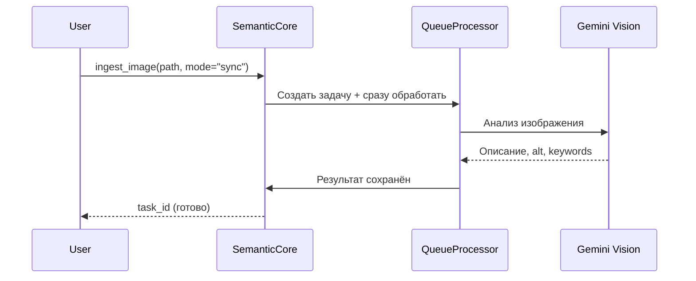
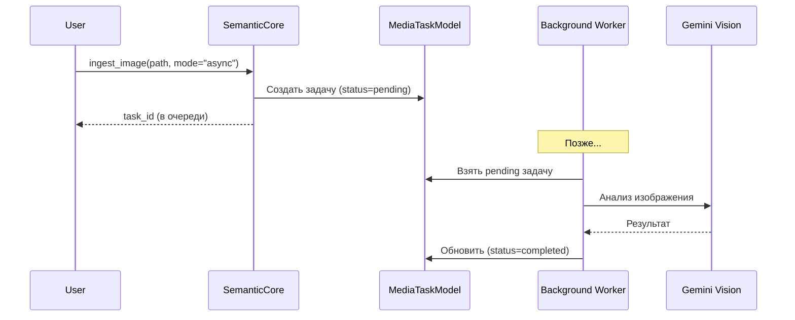

# 🖼️ Media Processing Architecture

> Как библиотека работает с изображениями: от файла до семантического чанка

---

## 📌 Что это такое?

**Media Processing** — подсистема для анализа изображений (и в будущем аудио/видео) с помощью Gemini Vision API и сохранения результатов как семантических чанков.

Ключевая идея: **изображение → текстовое описание → вектор → поиск**.

---

## 🎯 Зачем это нужно?

**Проблема**: У пользователя есть Markdown-документы с изображениями. При семантическом поиске картинки игнорируются — ищется только текст.

**Решение**: Gemini Vision анализирует изображение и создаёт:
- **Описание** (что изображено)
- **Alt-text** (краткая подпись)
- **Ключевые слова** (теги)
- **OCR-текст** (если есть надписи)

Этот текст векторизуется и участвует в поиске наравне с обычным контентом.

---

## 🏗️ Архитектура слоёв

```
┌─────────────────────────────────────────────────────────────┐
│                     SemanticCore                            │
│                   ingest_image()                            │
│              process_media_queue()                          │
└─────────────────────────────────────────────────────────────┘
                           │
                           ▼
┌─────────────────────────────────────────────────────────────┐
│                  Core Layer                                 │
│              MediaQueueProcessor                            │
│         (оркестрирует очередь задач)                        │
└─────────────────────────────────────────────────────────────┘
                           │
          ┌────────────────┼────────────────┐
          ▼                ▼                ▼
┌──────────────┐  ┌──────────────┐  ┌──────────────┐
│ RateLimiter  │  │ ImageAnalyzer│  │ MediaTask    │
│ (throttling) │  │ (Gemini API) │  │   Model      │
└──────────────┘  └──────────────┘  └──────────────┘
     Infrastructure Layer              Storage Layer
```

**Принцип разделения**:
- **SemanticCore** — публичный API (фасад)
- **MediaQueueProcessor** — бизнес-логика обработки
- **Infrastructure** — внешние сервисы (Gemini, Rate Limiting)
- **Storage** — персистентность (SQLite)

---

## 🔄 Два режима работы

### Sync Mode (по умолчанию)



**Когда использовать**: Интерактивная работа, нужен результат сразу.

---

### Async Mode



**Когда использовать**: Пакетная загрузка множества изображений, фоновая обработка.

---

## 📦 Domain Layer: DTO

### MediaConfig

Центральная точка конфигурации медиа-обработки:

| Параметр | Значение | Назначение |
|----------|----------|------------|
| `image_model` | gemini-2.5-flash | Экономичная модель Vision |
| `rpm_limit` | 15 | Лимит запросов/минуту (Free Tier) |
| `max_image_dimension` | 1920 | Максимальный размер стороны |
| `image_quality` | 80 | Качество сжатия при оптимизации |

**Почему Flash?** Для анализа изображений достаточно Flash-модели — она в 10× дешевле Pro и справляется с описаниями/OCR.

---

### MediaAnalysisResult

Структура результата анализа:

| Поле | Тип | Пример |
|------|-----|--------|
| `description` | str | "Красный автомобиль на парковке" |
| `alt_text` | str | "Фото красной машины" |
| `keywords` | list[str] | ["автомобиль", "красный", "парковка"] |
| `ocr_text` | str? | "STOP" (если есть текст) |

**Зачем всё это?**
- `description` → основа для эмбеддинга
- `alt_text` → для accessibility
- `keywords` → для FTS5 поиска
- `ocr_text` → текст с вывесок, скриншотов

---

### TaskStatus (Enum)

```
PENDING → PROCESSING → COMPLETED
                   ↘
                    FAILED
```

| Статус | Значение |
|--------|----------|
| `pending` | В очереди, ждёт обработки |
| `processing` | Сейчас обрабатывается |
| `completed` | Успешно обработано |
| `failed` | Ошибка (сохранена в error_message) |

---

## 🔗 Интеграция в SemanticCore

### Публичный API

```python
# Sync — результат сразу
task_id = core.ingest_image(
    path="docs/images/diagram.png",
    user_prompt="Это UML диаграмма классов",
    context_text="Раздел: Архитектура > Модели",
    mode="sync"
)

# Async — в очередь
task_id = core.ingest_image(path="photo.jpg", mode="async")

# Обработка очереди
processed = core.process_media_queue(max_tasks=10)

# Проверка размера очереди
pending = core.get_media_queue_size()
```

### Параметры контекста

| Параметр | Назначение |
|----------|------------|
| `user_prompt` | Подсказка для анализа ("Это скриншот кода") |
| `context_text` | Контекст из документа (заголовки секции) |

**Зачем контекст?** Gemini лучше понимает изображение, если знает контекст. Скриншот в разделе "Django ORM" будет описан точнее, чем без контекста.

---

## 📊 Сравнение режимов

| Критерий | Sync | Async |
|----------|------|-------|
| Скорость ответа | ⏱️ 2-5 сек | ⚡ мгновенно |
| Результат сразу | ✅ Да | ❌ Нет |
| Пакетная загрузка | 🐢 Медленно | 🚀 Быстро |
| Rate Limiting | ⚠️ Блокирует | ✅ Контролируемо |
| Отказоустойчивость | ⚠️ Теряется | ✅ Персистентно |

**Рекомендация**: 
- Единичные изображения → `sync`
- Импорт 100+ изображений → `async`

---

## ⚠️ Важные нюансы

### 1. Зависимость от Pillow

Библиотека Pillow — **optional dependency**:

```bash
poetry install --extras media
```

Без Pillow: расчёт токенов и оптимизация изображений недоступны.

---

### 2. Персистентность очереди

Задачи хранятся в SQLite (`MediaTaskModel`), а не в памяти. Это значит:
- Перезапуск приложения **не теряет** очередь
- Можно обрабатывать задачи **другим процессом**
- Failed задачи **сохраняются** для анализа

---

### 3. Контекст из Phase 4

Если изображение встретилось в Markdown-документе, контекст берётся из **иерархии заголовков** (Phase 4):

```markdown
# Архитектура
## Модели данных
### User Model


```

`context_text` = "Архитектура > Модели данных > User Model"

---

## 🔗 Связанные документы

- **Следующий**: [Gemini Vision Integration](26_gemini_vision_integration.md) — как работает анализ
- **Rate Limiting**: [Rate Limiting](28_rate_limiting.md) — защита от 429
- **Очередь**: [Media Queue Processor](29_media_queue_processor.md) — детали очереди

---

**← [Production Optimizations](24_production_optimizations.md)** | **[Gemini Vision Integration](26_gemini_vision_integration.md) →**
