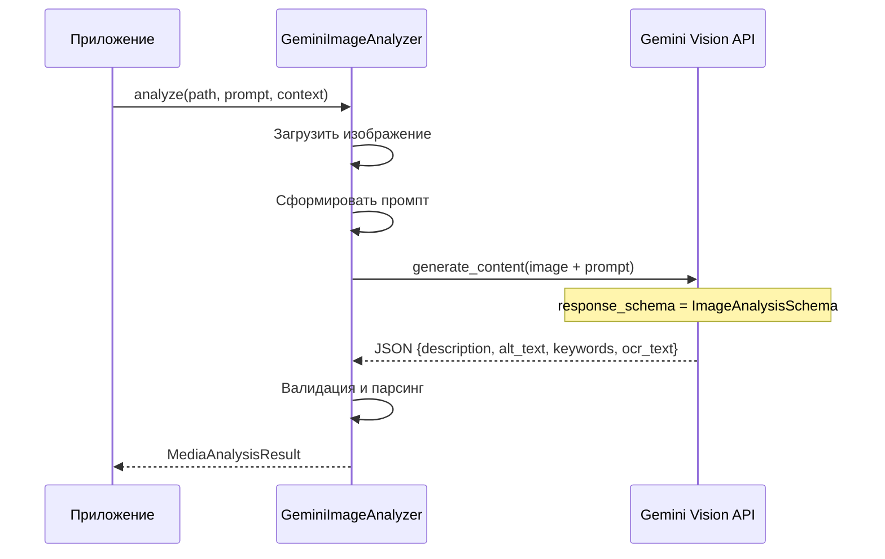
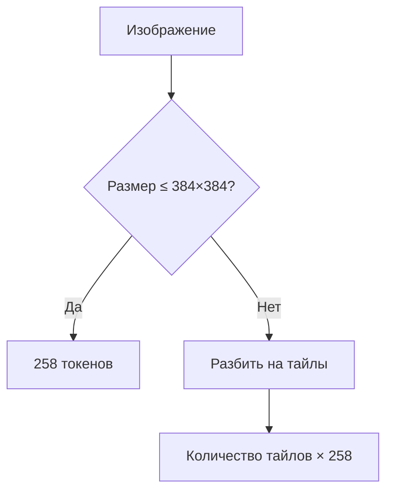

# 👁️ Gemini Vision Integration

> Как Gemini Vision API анализирует изображения и возвращает структурированные данные

---

## 📌 Что это такое?

**GeminiImageAnalyzer** — адаптер для Gemini Vision API, который:

1. Принимает путь к изображению
2. Отправляет в Gemini с промптом
3. Получает **структурированный JSON** с описанием

Результат: текстовое представление изображения для последующей векторизации.

---

## 🎯 Зачем это нужно?

**Проблема**: Gemini Vision возвращает свободный текст. Нам нужны отдельные поля: описание, alt-text, ключевые слова, OCR.

**Решение**: Используем `response_schema` для принудительного JSON-формата. Gemini **гарантированно** вернёт данные в нужной структуре.

---

## 🔍 Как это работает?



---

## 📦 Structured JSON Output

### Проблема свободного текста

❌ **Без schema** — Gemini возвращает что хочет:

```
"На изображении красная машина. Это автомобиль марки Toyota. 
Виден номерной знак ABC-123. Фон — городская улица."
```

Как из этого извлечь alt-text? Ключевые слова? OCR?

---

### Решение: response_schema

✅ **С schema** — Gemini возвращает JSON:

```json
{
  "description": "Красный автомобиль Toyota на городской улице",
  "alt_text": "Фото красной машины",
  "keywords": ["автомобиль", "Toyota", "красный", "улица"],
  "ocr_text": "ABC-123"
}
```

**Как это работает**: Gemini API принимает параметр `response_schema`, который описывает ожидаемую структуру. Модель **обязана** вернуть валидный JSON этой структуры.

---

### Схема анализа

| Поле | Тип | Обязательное | Описание |
|------|-----|--------------|----------|
| `description` | string | ✅ | Подробное описание изображения |
| `alt_text` | string | ✅ | Краткий alt-text (1-2 предложения) |
| `keywords` | array[string] | ✅ | 3-7 ключевых слов |
| `ocr_text` | string | ❌ | Распознанный текст (если есть) |

---

## 🎨 Промпт-инжиниринг

### Базовый промпт

Промпт состоит из трёх частей:

1. **Инструкция** — что делать
2. **Контекст** — откуда изображение (если есть)
3. **User Prompt** — уточнение от пользователя (если есть)

```
Проанализируй изображение и верни:
1. Подробное описание (2-3 предложения)
2. Краткий alt-text для accessibility
3. 3-7 ключевых слов/тегов
4. Любой текст на изображении (OCR)

Контекст: {context_text}
Дополнительно: {user_prompt}
```

---

### Влияние контекста

| Контекст | Результат |
|----------|-----------|
| Без контекста | "Диаграмма с прямоугольниками и стрелками" |
| "Django ORM" | "UML диаграмма классов Django моделей User и Profile" |
| "Раздел: API Reference" | "Sequence диаграмма REST API эндпоинта /users" |

**Вывод**: Контекст из иерархии заголовков (Phase 4) значительно улучшает качество описаний.

---

## 🧮 Расчёт токенов изображений

### Алгоритм Gemini

Gemini использует **тайлинг** для подсчёта токенов:



---

### Формула тайлинга

1. **Маленькие изображения** (≤ 384×384): фиксированно **258 токенов**

2. **Большие изображения**:
   - `crop_unit = min(width, height) / 1.5`
   - `tiles_x = ceil(width / crop_unit)`
   - `tiles_y = ceil(height / crop_unit)`
   - **Токены = tiles_x × tiles_y × 258**

---

### Примеры расчёта

| Размер | Тайлов | Токенов |
|--------|--------|---------|
| 200×200 | 1 | 258 |
| 384×384 | 1 | 258 |
| 800×600 | 2×2 = 4 | 1032 |
| 1920×1080 | 3×2 = 6 | 1548 |
| 3840×2160 (4K) | 4×3 = 12 | 3096 |

---

### Стоимость

| Модель | Цена за 1M токенов |
|--------|-------------------|
| gemini-2.5-flash | $0.10 |
| gemini-2.5-pro | $1.25 |

**Пример**: 1000 изображений 1080p × 1548 токенов = 1.5M токенов

- Flash: **$0.15**
- Pro: **$1.88**

**Вывод**: Для массовой обработки Flash экономит **12×**.

---

## ⚙️ Выбор модели

| Критерий | Flash | Pro |
|----------|-------|-----|
| Скорость | 🚀 Быстрее | 🐢 Медленнее |
| Стоимость | 💰 $0.10/1M | 💸 $1.25/1M |
| Качество OCR | ✅ Хорошо | ✅✅ Отлично |
| Сложные диаграммы | ⚠️ Достаточно | ✅ Лучше |
| Мелкий текст | ⚠️ Может пропустить | ✅ Точнее |

**Рекомендация по умолчанию**: `gemini-2.5-flash`

**Когда Pro**: Критичный OCR (документы, скриншоты с кодом), сложные технические диаграммы.

---

## ⚠️ Важные нюансы

### 1. Поддерживаемые форматы

| Формат | Поддержка |
|--------|-----------|
| JPEG | ✅ |
| PNG | ✅ |
| WebP | ✅ |
| GIF | ✅ (первый кадр) |
| HEIC | ✅ |
| BMP | ❌ |
| TIFF | ❌ |

---

### 2. Лимиты размера

- **Максимум**: 20MB на изображение
- **Рекомендация**: оптимизировать до 1920px по большей стороне

Большие изображения = больше токенов = дороже. Качество описания не улучшается после 1920px.

---

### 3. Retry при ошибках

`GeminiImageAnalyzer` использует декоратор `@retry_with_backoff`:

- 429 (rate limit) → retry с задержкой
- 503 (service unavailable) → retry
- ValueError → **не retry** (ошибка в данных)

Подробнее: [Resilience Patterns](27_resilience_patterns.md)

---

## 🔗 Связанные документы

- **Предыдущий**: [Media Processing Architecture](25_media_processing_architecture.md)
- **Следующий**: [Resilience Patterns](27_resilience_patterns.md)
- **Rate Limiting**: [Rate Limiting](28_rate_limiting.md)

---

**← [Media Processing Architecture](25_media_processing_architecture.md)** | **[Resilience Patterns](27_resilience_patterns.md) →**
