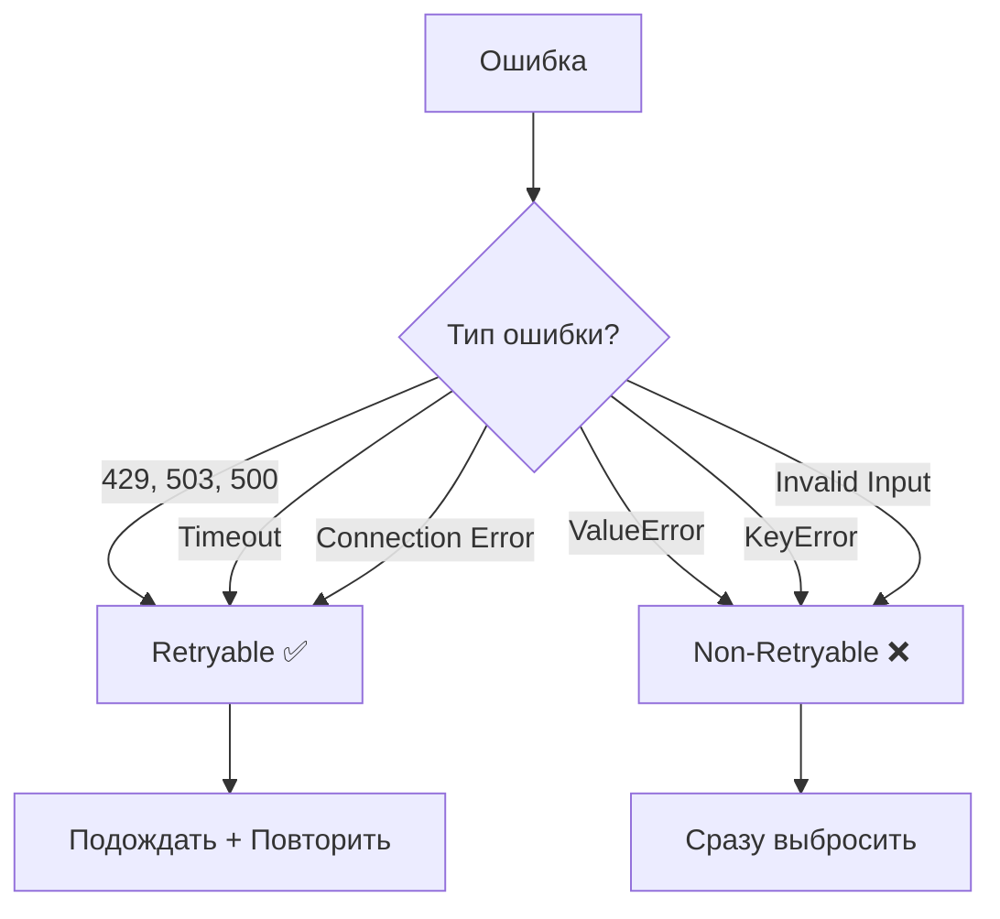
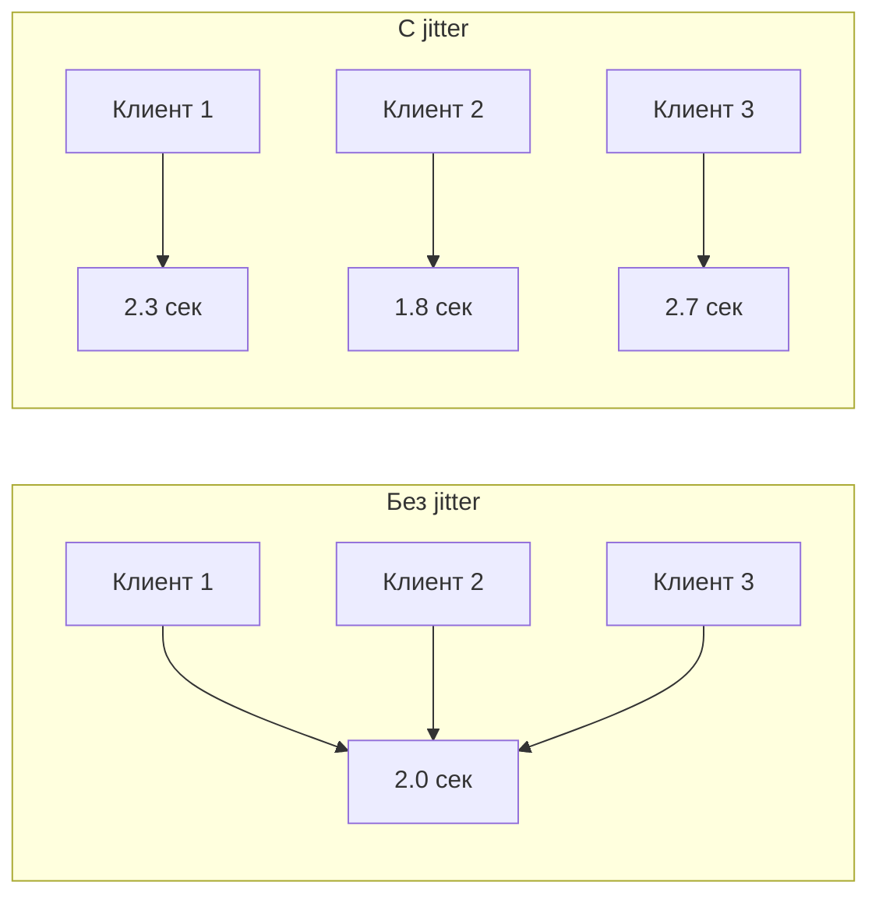

# 🛡️ Resilience Patterns

> Как библиотека переживает временные сбои API без потери данных

---

## 📌 Что это такое?

**Resilience Patterns** — набор паттернов для устойчивой работы с внешними API:
- **Retry with Backoff** — повторные попытки с увеличивающейся задержкой
- **Error Classification** — разделение ошибок на "можно повторить" и "нельзя"
- **Graceful Degradation** — сохранение состояния при неудаче

---

## 🎯 Зачем это нужно?

**Проблема**: Gemini API может временно отказать:
- 429 — превышен лимит запросов
- 503 — сервис недоступен
- Timeout — сеть медленная

Без обработки: потеря данных, сбой приложения.

**Решение**: Классифицируем ошибки и retry только те, которые могут пройти при повторе.

---

## 🔍 Классификация ошибок

### Retryable vs Non-Retryable



---

### Таблица классификации

| Ошибка | Код | Retryable? | Причина |
|--------|-----|------------|---------|
| Rate Limit | 429 | ✅ | Через время лимит сбросится |
| Service Unavailable | 503 | ✅ | Сервис скоро восстановится |
| Internal Error | 500 | ✅ | Временный сбой на сервере |
| Timeout | — | ✅ | Сеть может восстановиться |
| Connection Reset | — | ✅ | Временная проблема сети |
| Invalid API Key | 401 | ❌ | Не исправится повтором |
| Bad Request | 400 | ❌ | Ошибка в данных |
| ValueError | — | ❌ | Баг в коде |

---

### Как определяется retryable

Проверяется **текст ошибки** на ключевые паттерны:

| Паттерн | Что ищем |
|---------|----------|
| HTTP коды | "429", "503", "500" |
| Таймауты | "timeout", "timed out" |
| Сеть | "connection", "reset", "refused" |

**Важно**: Если ошибка не содержит этих паттернов — она **non-retryable**.

---

## 🔄 Exponential Backoff

### Идея

Каждая следующая попытка ждёт **дольше** предыдущей:

```
Попытка 1: сразу
Попытка 2: подождать 1 сек
Попытка 3: подождать 2 сек
Попытка 4: подождать 4 сек
...
```

**Зачем**: Даёт серверу время восстановиться, не "долбим" его запросами.

---

### Формула задержки

```
delay = min(base_delay × 2^attempt + jitter, max_delay)
```

| Компонент | Значение | Назначение |
|-----------|----------|------------|
| `base_delay` | 1.0 сек | Начальная задержка |
| `2^attempt` | 1, 2, 4, 8... | Экспоненциальный рост |
| `jitter` | 0-1 сек | Случайный разброс |
| `max_delay` | 30 сек | Потолок задержки |

---

### Пример последовательности

| Попытка | Расчёт | Задержка |
|---------|--------|----------|
| 1 | — | 0 (сразу) |
| 2 | 1×2¹ + 0.3 | ~2.3 сек |
| 3 | 1×2² + 0.7 | ~4.7 сек |
| 4 | 1×2³ + 0.5 | ~8.5 сек |
| 5 | 1×2⁴ + 0.2 | ~16.2 сек |

---

### Зачем jitter?

**Проблема**: Если 100 клиентов получили 429 и все ждут ровно 2 секунды — через 2 секунды все 100 снова ударят по API одновременно.

**Решение**: Случайный jitter (0-1 сек) разносит запросы во времени.



---

## 📦 Декоратор @retry_with_backoff

### Использование

```python
@retry_with_backoff(max_retries=5, base_delay=1.0, max_delay=30.0)
def call_gemini_api(image_path: str) -> dict:
    # Может выбросить 429, 503, timeout...
    return gemini.generate_content(...)
```

**Что происходит**:
1. Функция вызывается
2. Если retryable ошибка → ждём → повторяем
3. Если non-retryable → сразу выбрасываем
4. После N попыток → `MediaProcessingError`

---

### Параметры декоратора

| Параметр | По умолчанию | Описание |
|----------|--------------|----------|
| `max_retries` | 5 | Максимум попыток |
| `base_delay` | 1.0 | Базовая задержка (сек) |
| `max_delay` | 30.0 | Максимальная задержка (сек) |

---

### Сохранение метаданных функции

Декоратор использует `@functools.wraps`, чтобы сохранить:
- `__name__` — имя функции
- `__doc__` — docstring

Это важно для отладки и документации.

---

## ⚠️ MediaProcessingError

### Когда выбрасывается

После исчерпания всех попыток создаётся специальное исключение:

```
MediaProcessingError: Failed after 5 retries: 429 Resource Exhausted
```

**Содержит**:
- Количество попыток
- Текст последней ошибки
- Chain к оригинальному исключению (`__cause__`)

---

### Обработка в приложении

```python
try:
    result = analyzer.analyze(image_path)
except MediaProcessingError as e:
    # Все retry исчерпаны
    logger.error(f"Image analysis failed: {e}")
    task.status = "failed"
    task.error_message = str(e)
    task.save()
```

**Важно**: Задача не теряется — она сохраняется со статусом `failed` для последующего анализа или ручного retry.

---

## 📊 Сравнение стратегий

| Стратегия | Плюсы | Минусы |
|-----------|-------|--------|
| Без retry | Простота | Потеря данных при сбоях |
| Фиксированный delay | Предсказуемость | Перегрузка при массовых сбоях |
| Exponential backoff | Адаптивность | Долгое восстановление |
| Backoff + jitter | ✅ Оптимально | Чуть сложнее |

---

## ⚠️ Важные нюансы

### 1. Не retry бизнес-ошибки

❌ **Плохо**: retry на `ValueError("Invalid image format")`

Ошибка в данных не исправится повтором. Только тратим время.

✅ **Хорошо**: сразу выбросить, пусть пользователь исправит.

---

### 2. Логирование попыток

Каждая попытка должна логироваться:

```
[WARNING] Retry 1/5 after 429: waiting 2.3s
[WARNING] Retry 2/5 after 429: waiting 4.7s
[INFO] Success on attempt 3
```

Это помогает диагностировать проблемы с API.

---

### 3. Timeout на весь retry-цикл

Текущая реализация не ограничивает **общее** время retry. При 5 попытках с max_delay=30 можно ждать до 2+ минут.

Для критичных сценариев рассмотреть circuit breaker (Phase 7?).

---

## 🔗 Связанные документы

- **Предыдущий**: [Gemini Vision Integration](26_gemini_vision_integration.md)
- **Следующий**: [Rate Limiting](28_rate_limiting.md) — превентивная защита от 429
- **Очередь**: [Media Queue Processor](29_media_queue_processor.md) — graceful degradation

---

**← [Gemini Vision Integration](26_gemini_vision_integration.md)** | **[Rate Limiting](28_rate_limiting.md) →**
