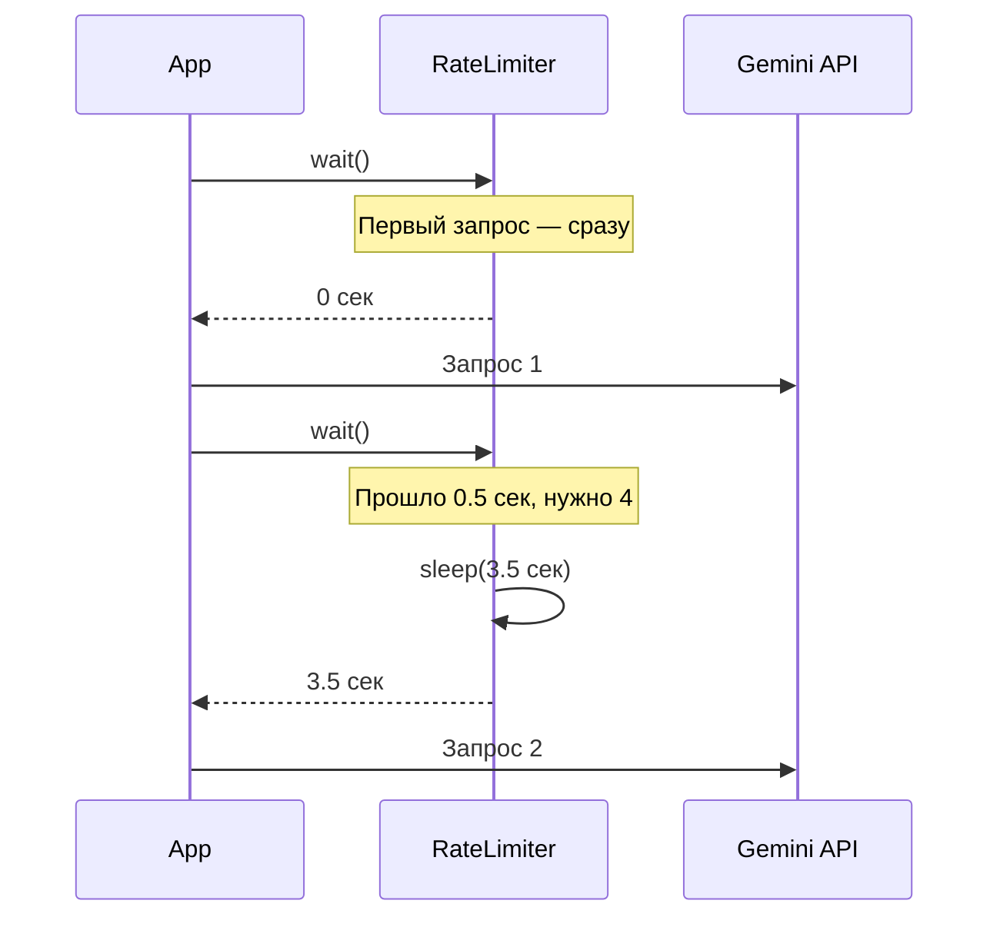
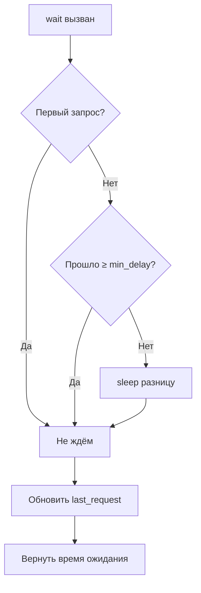
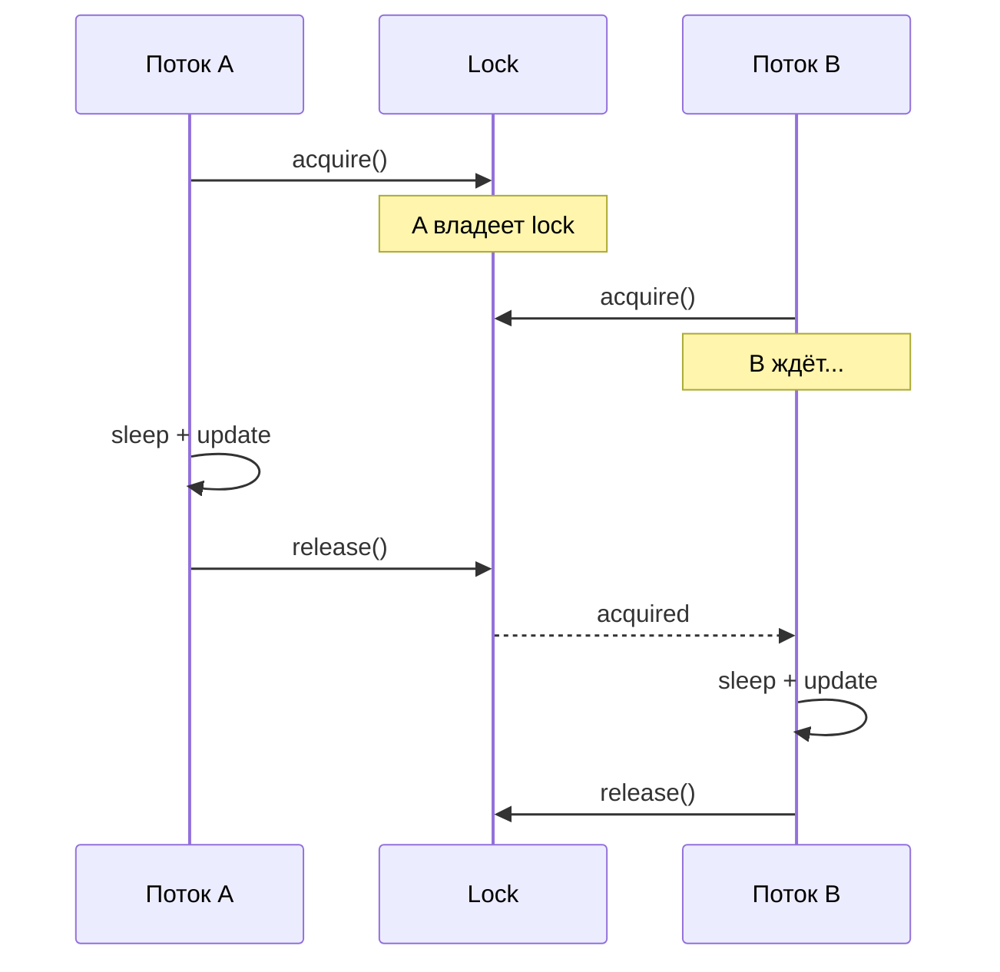
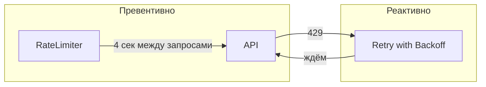

# ⏱️ Rate Limiting

> Как не получить 429 от Gemini API при массовой обработке изображений

---

## 📌 Что это такое?

**Rate Limiter** — механизм контроля частоты запросов к API. Гарантирует, что между запросами проходит минимальный интервал.

**Token Bucket** — алгоритм, который "выдаёт токены" с фиксированной скоростью. Нет токена — жди.

---

## 🎯 Зачем это нужно?

**Проблема**: Gemini API имеет лимиты:

| Tier | RPM (запросов/мин) |
|------|-------------------|
| Free | 15 |
| Pay-as-you-go | 1000+ |

При обработке 100 изображений без контроля — гарантированный 429.

**Решение**: Принудительная задержка между запросами.

---

## 🔍 Как это работает?

### Простая математика

```
RPM = 15 запросов в минуту
min_delay = 60 сек / 15 = 4 секунды между запросами
```



---

### Логика wait()



---

## 📊 Расчёт задержки

| RPM | min_delay |
|-----|-----------|
| 15 | 4.0 сек |
| 30 | 2.0 сек |
| 60 | 1.0 сек |
| 120 | 0.5 сек |

**Формула**: `min_delay = 60.0 / rpm_limit`

---

## 🔒 Потокобезопасность

### Проблема

Если два потока одновременно вызовут `wait()`:

```
Поток A: elapsed = 0.5 сек
Поток B: elapsed = 0.5 сек  ← тот же момент!
Поток A: Не нужно ждать? Нет, нужно 3.5 сек
Поток B: Не нужно ждать? Нет, нужно 3.5 сек
→ Оба ждут, потом оба делают запрос ОДНОВРЕМЕННО
```

---

### Решение: Lock



Используется `threading.Lock()` — только один поток внутри критической секции.

---

## ⚙️ Конфигурация

### Параметры RateLimiter

| Параметр | По умолчанию | Описание |
|----------|--------------|----------|
| `rpm_limit` | 15 | Запросов в минуту |

**Рекомендация по умолчанию**: 15 RPM — консервативно для Free Tier.

---

### Выбор RPM

| Сценарий | RPM | min_delay |
|----------|-----|-----------|
| Free Tier, безопасно | 15 | 4 сек |
| Free Tier, агрессивно | 12 | 5 сек |
| Pay-as-you-go | 60+ | ≤1 сек |

**Почему 15, а не больше?** Free Tier лимит — 15 RPM. Но лучше оставить запас на случай параллельных запросов из других частей приложения.

---

## 📈 Rate Limiting vs Retry

### Два уровня защиты



| Механизм | Когда работает | Цель |
|----------|---------------|------|
| Rate Limiter | **До** запроса | Предотвратить 429 |
| Retry | **После** 429 | Восстановиться |

**Идеал**: Rate Limiter настроен так, что Retry никогда не нужен.

---

## 📊 Сравнение подходов

| Подход | Плюсы | Минусы |
|--------|-------|--------|
| Без контроля | Максимальная скорость | 429, блокировка |
| Фиксированный sleep | Простота | Неэффективно при паузах |
| Token Bucket | ✅ Адаптивность | Чуть сложнее |
| Sliding Window | Точнее | Сложнее реализация |

**Выбор**: Token Bucket — оптимальный баланс простоты и эффективности.

---

## ⚠️ Важные нюансы

### 1. Reset для тестов

Метод `reset()` сбрасывает таймер:

```python
limiter = RateLimiter(rpm_limit=15)
limiter.wait()  # 0 сек (первый)
limiter.reset()
limiter.wait()  # 0 сек (снова первый!)
```

**Когда использовать**: В тестах, чтобы не ждать между test cases.

---

### 2. Burst-запросы

Token Bucket **не накапливает** токены. Если приложение простаивало 10 минут — нельзя сделать 150 запросов подряд.

**Почему**: Gemini API считает RPM в скользящем окне. Burst всё равно вызовет 429.

---

### 3. Несколько Rate Limiter'ов

Если приложение делает запросы к разным эндпоинтам Gemini:
- Embeddings
- Vision
- Generation

Каждый может иметь **свой лимит**. Используйте отдельные RateLimiter'ы или общий с суммарным RPM.

---

### 4. Distributed Rate Limiting

Текущая реализация — **in-process**. Если несколько процессов/серверов используют один API ключ — нужен Redis или подобное.

Для single-process приложений (наш случай) — достаточно.

---

## 🔗 Связанные документы

- **Предыдущий**: [Resilience Patterns](27_resilience_patterns.md) — что делать если 429 всё-таки случился
- **Следующий**: [Media Queue Processor](29_media_queue_processor.md) — где используется Rate Limiter
- **Архитектура**: [Media Processing Architecture](25_media_processing_architecture.md)

---

**← [Resilience Patterns](27_resilience_patterns.md)** | **[Media Queue Processor](29_media_queue_processor.md) →**
