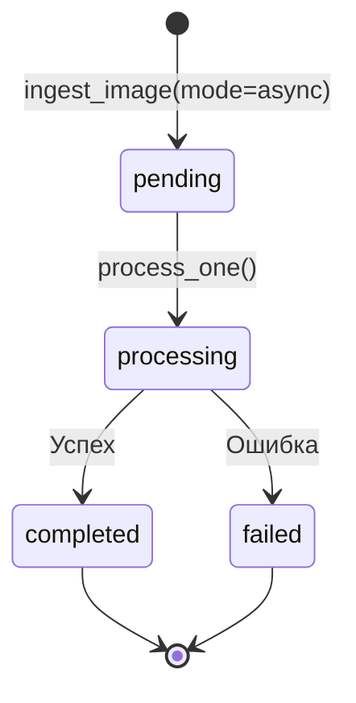
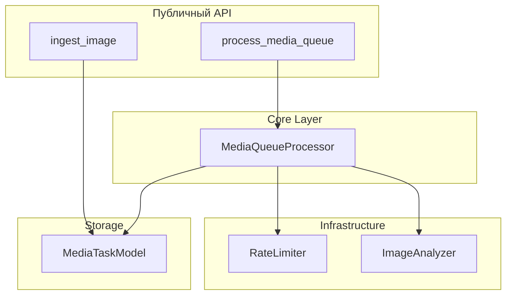
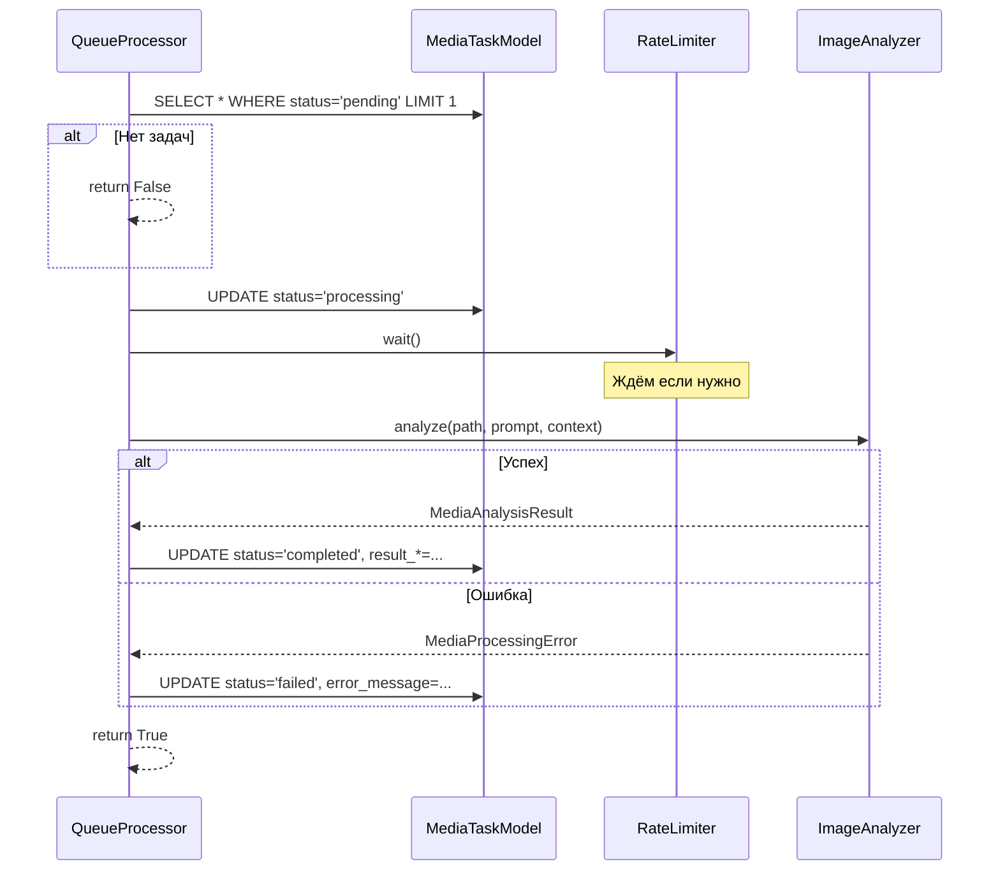
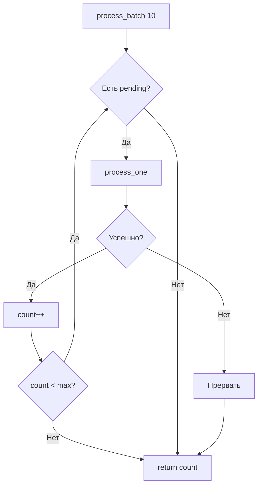
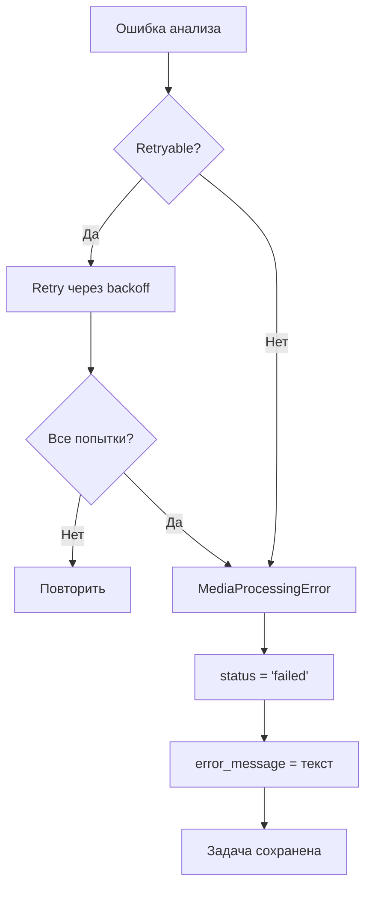

# 📬 Media Queue Processor

> Персистентная очередь для надёжной обработки изображений

---

## 📌 Что это такое?

**MediaQueueProcessor** — оркестратор, который:

1. Берёт задачи из очереди (SQLite)
2. Обрабатывает их через Gemini Vision
3. Сохраняет результаты обратно
4. Соблюдает Rate Limiting

**MediaTaskModel** — ORM модель для хранения задач в SQLite.

---

## 🎯 Зачем это нужно?

**Проблема**: При массовой загрузке изображений:

- Приложение блокируется на время обработки
- Сбой → потеря прогресса
- Нет контроля над скоростью

**Решение**: Персистентная очередь + фоновая обработка.

---

## 🔍 Жизненный цикл задачи



| Статус | Описание |
|--------|----------|
| `pending` | В очереди, ждёт обработки |
| `processing` | Сейчас анализируется |
| `completed` | Успешно обработано |
| `failed` | Ошибка (сохранена для анализа) |

---

## 🏗️ Архитектура



---

## 📦 MediaTaskModel

### Структура таблицы

| Поле | Тип | Описание |
|------|-----|----------|
| `id` | UUID | Первичный ключ |
| `media_path` | VARCHAR | Путь к файлу |
| `media_type` | VARCHAR | image/audio/video |
| `mime_type` | VARCHAR | image/jpeg, image/png... |
| `user_prompt` | TEXT | Подсказка пользователя |
| `context_text` | TEXT | Контекст из документа |
| `status` | VARCHAR | pending/processing/completed/failed |
| `error_message` | TEXT | Текст ошибки (если failed) |
| `result_description` | TEXT | Описание из Gemini |
| `result_alt_text` | TEXT | Alt-текст |
| `result_keywords` | TEXT | JSON массив ключевых слов |
| `result_ocr_text` | TEXT | Распознанный текст |
| `created_at` | DATETIME | Время создания |
| `processed_at` | DATETIME | Время обработки |

---

### Почему SQLite, а не Redis?

| Критерий | SQLite | Redis |
|----------|--------|-------|
| Установка | ✅ Встроен | ❌ Отдельный сервис |
| Персистентность | ✅ Автоматическая | ⚠️ Настраивать |
| Запросы | ✅ SQL, фильтры | ⚠️ Ограниченно |
| Для нас | ✅ Идеально | Overkill |

**Вывод**: Для single-process приложения SQLite — оптимальный выбор.

---

## 🔄 MediaQueueProcessor

### API методов

| Метод | Описание |
|-------|----------|
| `process_one()` | Обработать одну pending задачу |
| `process_batch(max_tasks)` | Обработать до N задач |
| `process_task(task_id)` | Обработать конкретную задачу |
| `get_pending_count()` | Количество pending задач |

---

### Алгоритм process_one()



---

### FIFO порядок

Задачи обрабатываются в порядке создания:

```sql
SELECT * FROM media_tasks 
WHERE status = 'pending' 
ORDER BY created_at ASC 
LIMIT 1
```

**Важно**: Это гарантирует, что ранее добавленные изображения обработаются первыми.

---

## 📊 Пакетная обработка

### process_batch(max_tasks)



**Поведение**:

- Обрабатывает до N задач
- Останавливается при первой ошибке
- Возвращает количество успешно обработанных

---

### Пример использования

```python
# В фоновом воркере
while True:
    processed = core.process_media_queue(max_tasks=10)
    if processed == 0:
        time.sleep(60)  # Очередь пуста, ждём
    else:
        logger.info(f"Processed {processed} images")
```

---

## ⚠️ Обработка ошибок

### Graceful Degradation



**Ключевое**: Задача **никогда не теряется**. При ошибке:

1. Статус → `failed`
2. Ошибка сохранена в `error_message`
3. Можно retry позже или проанализировать

---

### Ручной retry

```python
# Найти failed задачи
failed = MediaTaskModel.select().where(
    MediaTaskModel.status == 'failed'
)

# Сбросить статус для retry
for task in failed:
    task.status = 'pending'
    task.error_message = None
    task.save()

# Обработать снова
core.process_media_queue()
```

---

## 📈 Мониторинг очереди

### get_media_queue_size()

```python
pending = core.get_media_queue_size()
print(f"В очереди: {pending} изображений")
```

**Полезно для**:

- UI индикатор прогресса
- Алерты при переполнении
- Балансировка нагрузки

---

### Статистика по статусам

```sql
SELECT status, COUNT(*) 
FROM media_tasks 
GROUP BY status
```

| status | count |
|--------|-------|
| pending | 45 |
| completed | 1203 |
| failed | 7 |

---

## ⚠️ Важные нюансы

### 1. Один воркер

Текущая реализация рассчитана на **один процесс-обработчик**. При нескольких воркерах возможны:

- Race conditions на UPDATE status
- Дублирование обработки

**Решение для scale**: SELECT FOR UPDATE или отдельная таблица locks.

---

### 2. Не удаляем completed

Задачи со статусом `completed` **сохраняются** в БД. Это позволяет:

- Аудит: кто/когда/что обработано
- Дедупликация: не обрабатывать повторно
- Отладка: посмотреть результаты

**Периодическая очистка**: По крону удалять задачи старше N дней.

---

### 3. Транзакционность

Изменение статуса и сохранение результата — **атомарная операция**:

```python
with db.atomic():
    task.status = 'completed'
    task.result_description = result.description
    task.result_alt_text = result.alt_text
    task.processed_at = datetime.now()
    task.save()
```

Если приложение упадёт между update'ами — не будет частичного состояния.

---

### 4. Интеграция с SemanticCore

`SemanticCore` делегирует в `MediaQueueProcessor`:

| SemanticCore | MediaQueueProcessor |
|--------------|---------------------|
| `ingest_image()` | Создаёт задачу + опционально `process_task()` |
| `process_media_queue()` | `process_batch()` |
| `get_media_queue_size()` | `get_pending_count()` |

---

## 🔗 Связанные документы

- **Предыдущий**: [Rate Limiting](28_rate_limiting.md)
- **Архитектура**: [Media Processing Architecture](25_media_processing_architecture.md)
- **Vision API**: [Gemini Vision Integration](26_gemini_vision_integration.md)
- **Ошибки**: [Resilience Patterns](27_resilience_patterns.md)

---

**← [Rate Limiting](28_rate_limiting.md)** | **[Вернуться к оглавлению](00_overview.md) →**
