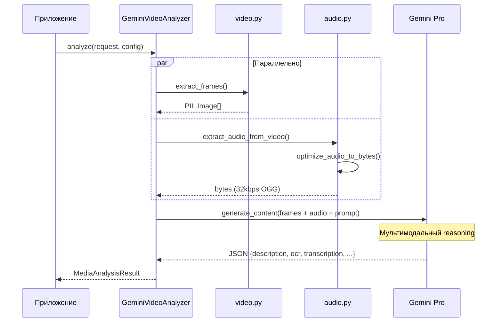
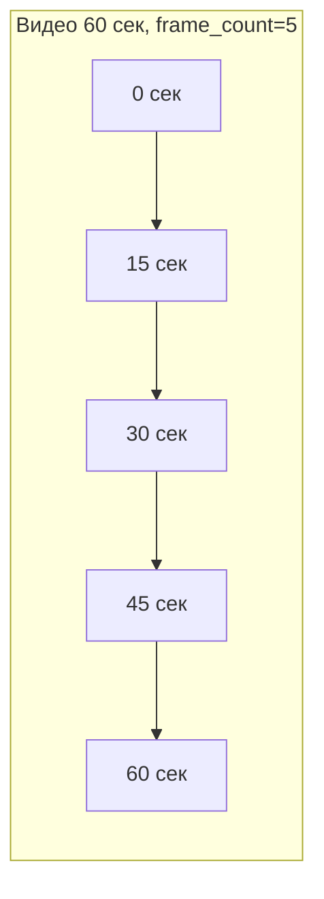
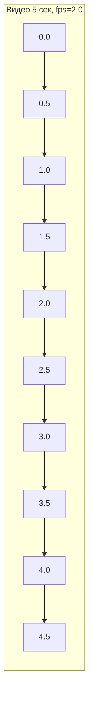
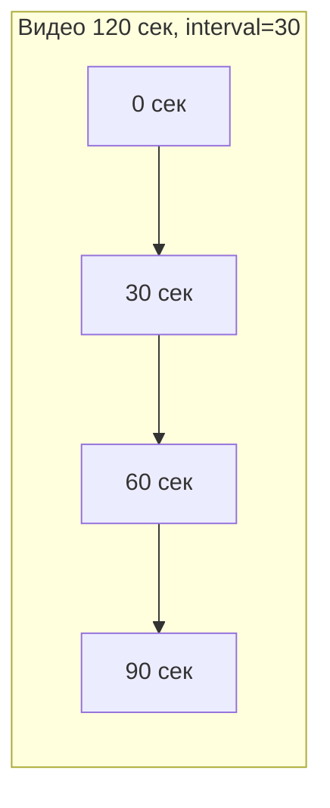

# 🎬 Video Multimodal Analysis

> Как Gemini анализирует видео: кадры + аудио в одном запросе

---

## 📌 Что это такое?

**GeminiVideoAnalyzer** — мультимодальный анализатор, который:

1. Извлекает **кадры** из видео
2. Извлекает **аудио-дорожку**
3. Отправляет **всё вместе** в Gemini Pro
4. Получает комплексный анализ

Ключевая идея: **одновременный** анализ визуального и аудио контента.

---

## 🎯 Зачем мультимодальность?

**Проблема**: Раздельный анализ кадров и аудио теряет контекст.

| Сценарий | Только кадры | Только аудио | Мультимодально |
|----------|--------------|--------------|----------------|
| Презентация | "Слайды с текстом" | "Спикер объясняет..." | "Слайд OAuth показывает flow, спикер объясняет редирект" |
| Туториал | "Код в редакторе" | "Голос за кадром..." | "Демонстрация pytest, автор объясняет fixtures" |
| Интервью | "Два человека" | "Обсуждают AI..." | "Иван спрашивает про модели, Мария отвечает про fine-tuning" |

**Вывод**: Мультимодальный анализ понимает **связь** между видео и звуком.

---

## 🔍 Как это работает?



---

## 🎞️ Режимы извлечения кадров

### Три режима

| Режим | Параметр | Когда использовать |
|-------|----------|-------------------|
| `total` | `frame_count=N` | Видео любой длины (равномерно N кадров) |
| `fps` | `fps=1.0` | Анимации, быстрое действие |
| `interval` | `interval_seconds=5.0` | Длинные видео, лекции |

---

### Mode: Total (по умолчанию)



**Логика**: Видео разбивается на N равных частей, берётся первый кадр каждой части.

**Плюсы**: 
- Покрывает всё видео независимо от длины
- Предсказуемое количество кадров = предсказуемые токены

---

### Mode: FPS



**Логика**: Берём N кадров каждую секунду.

**Плюсы**: Детальный анализ анимации и быстрых действий.
**Минусы**: Много кадров = много токенов = дорого.

---

### Mode: Interval



**Логика**: Кадр каждые N секунд.

**Плюсы**: Хорошо для длинных лекций.
**Минусы**: Может пропустить важные моменты между интервалами.

---

## 📐 Quality Presets

### Зачем уменьшать кадры?

Gemini тарифицирует изображения по **тайлам** (см. [Gemini Vision](26_gemini_vision_integration.md)).

| Размер кадра | Тайлов | Токенов |
|--------------|--------|---------|
| 1920×1080 | 6 | 1548 |
| 1024×576 | 3 | 774 |
| 768×432 | 2 | 516 |
| 512×288 | 1 | 258 |

**10 кадров 1080p** = 15480 токенов
**10 кадров 768p** = 5160 токенов → **экономия 67%**

---

### Пресеты

| Preset | Макс. сторона | Рекомендация |
|--------|---------------|--------------|
| `fhd` | 1024 px | UI с текстом, скриншоты кода |
| `hd` | 768 px | **По умолчанию** — баланс |
| `balanced` | 512 px | Длинные видео, экономия |

**Примечание**: "FHD" намеренно занижен. 1920px → 1024px экономит токены без потери качества анализа.

---

## 📦 Structured Output

### Схема ответа

| Поле | Тип | Описание |
|------|-----|----------|
| `description` | string | Что происходит в видео (3-5 предложений) |
| `keywords` | array[string] | 5-10 ключевых слов |
| `ocr_text` | string? | Текст с экрана (если есть) |
| `transcription` | string? | Транскрипция речи (если include_audio=true) |
| `participants` | array[string] | Спикеры/участники |
| `action_items` | array[string] | Задачи из обсуждения |

### Пример результата

```json
{
  "description": "Видео демонстрирует диаграмму последовательности OAuth авторизации в Django. Показаны три участника: Client, Auth Server, Resource Server. Стрелки показывают flow токенов.",
  "keywords": ["OAuth", "Django", "sequence diagram", "авторизация", "токены"],
  "ocr_text": "OAuth 2.0 Flow\nClient → Auth Server\nAuthorization Code → Access Token",
  "transcription": null,
  "participants": [],
  "action_items": []
}
```

---

## ⚙️ Выбор модели

| Модель | Мультимодальность | Рекомендация |
|--------|-------------------|--------------|
| `gemini-2.5-pro` | ✅ Отлично | **По умолчанию для видео** |
| `gemini-2.5-flash` | ⚠️ Базово | Простые видео |
| `gemini-2.5-flash-lite` | ❌ Слабо | Не рекомендуется |

**Почему Pro?**

Мультимодальный анализ (кадры + аудио + их связь) требует сложного reasoning. Flash справляется хуже.

---

## 🧮 Расчёт токенов

### Формула

```
Токены = (кадры × токенов_на_кадр) + токенов_аудио + токенов_промпта
```

### Примеры

| Конфигурация | Кадров | Аудио | Примерно токенов |
|--------------|--------|-------|------------------|
| 5 кадров HD, без аудио | 5 × 516 | 0 | ~2600 |
| 10 кадров HD + 1 мин аудио | 10 × 516 | ~1000 | ~6200 |
| 10 кадров FHD + 5 мин аудио | 10 × 774 | ~5000 | ~12800 |

### Стоимость (Gemini Pro)

| Сценарий | Токенов | Стоимость |
|----------|---------|-----------|
| Короткое видео (30 сек) | ~3000 | $0.004 |
| Среднее видео (5 мин) | ~10000 | $0.0125 |
| Длинное видео (30 мин) | ~40000 | $0.05 |

---

## ⚠️ Важные нюансы

### 1. Видео без аудио

Если `include_audio=True`, но видео без звуковой дорожки:

```python
try:
    audio_bytes = optimize_audio_to_bytes(extract_audio_from_video(path))
except Exception:
    # Продолжаем без аудио
    audio_bytes = None
```

Анализатор **не падает**, просто анализирует только кадры.

---

### 2. Лимит кадров

`max_frames=50` защищает от случайной отправки сотен кадров:

| fps | 1 минута | 10 минут |
|-----|----------|----------|
| 1.0 | 60 кадров → **50** | 600 кадров → **50** |
| 0.5 | 30 кадров | 300 кадров → **50** |

---

### 3. Формат кадров

Кадры конвертируются в JPEG (quality=85) перед отправкой:

- PNG → JPEG (экономия размера)
- WebP → JPEG (совместимость)
- Raw → JPEG (стандартизация)

---

### 4. Поддерживаемые форматы видео

| Формат | MIME-тип | Поддержка |
|--------|----------|-----------|
| MP4 | video/mp4 | ✅ |
| WebM | video/webm | ✅ |
| MOV | video/quicktime | ✅ |
| AVI | video/x-msvideo | ✅ |
| MKV | video/x-matroska | ✅ |

Требуется **imageio[pyav]** и **ffmpeg**.

---

## 📊 Сравнение с раздельным анализом

| Подход | Плюсы | Минусы |
|--------|-------|--------|
| **Раздельно** (кадры + Whisper) | Whisper точнее для длинного аудио | Теряется контекст связи |
| **Мультимодально** (Gemini Pro) | Понимает связь видео+аудио | Дороже, лимит аудио 83 мин |

**Рекомендация**:

- Короткие видео (< 15 мин) → мультимодально
- Длинные лекции → раздельный анализ

---

## 🔗 Связанные документы

- **Предыдущий**: [Audio Analysis Architecture](30_audio_analysis_architecture.md)
- **Следующий**: [Media Optimization Strategies](32_media_optimization_strategies.md)
- **Кадры**: [Gemini Vision Integration](26_gemini_vision_integration.md)

---

**← [Audio Analysis Architecture](30_audio_analysis_architecture.md)** | **[Media Optimization Strategies](32_media_optimization_strategies.md) →**
