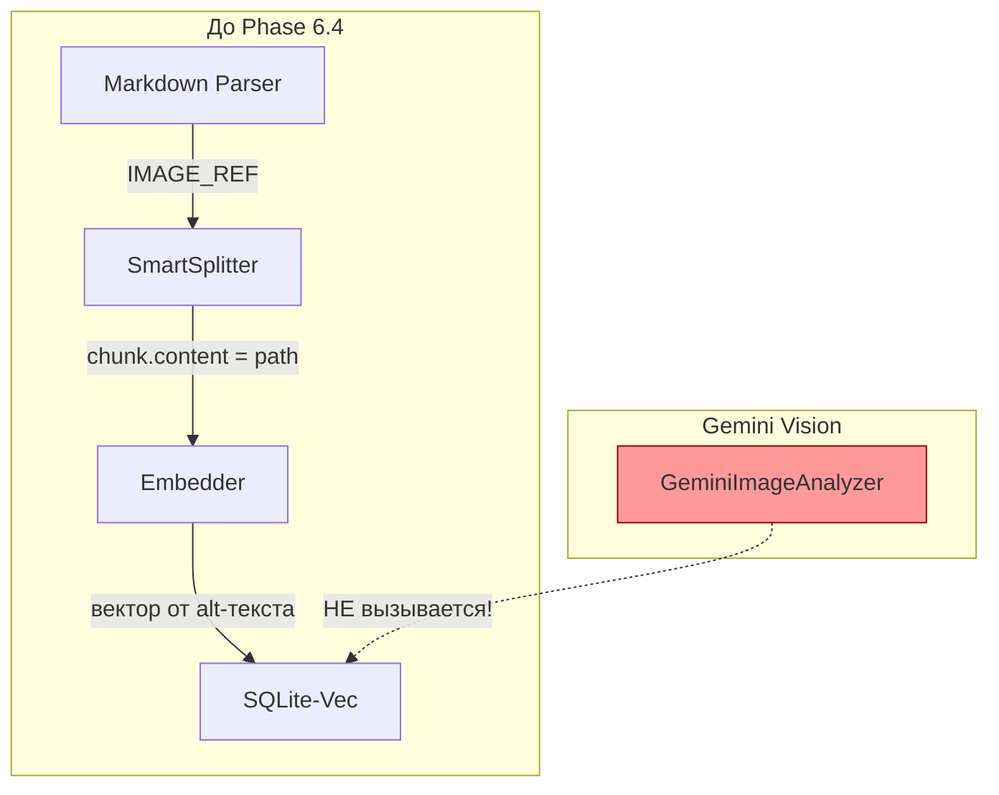
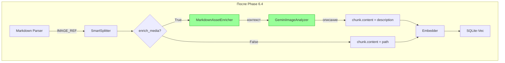
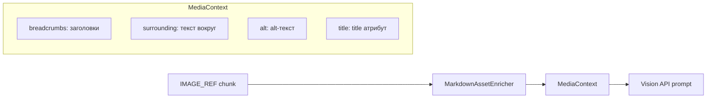
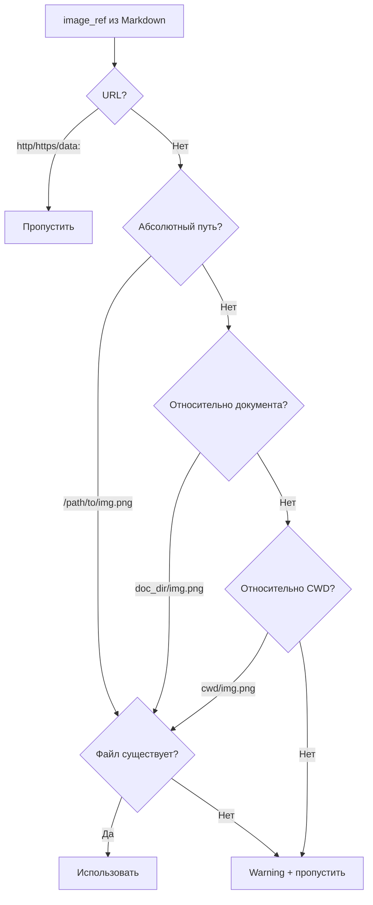
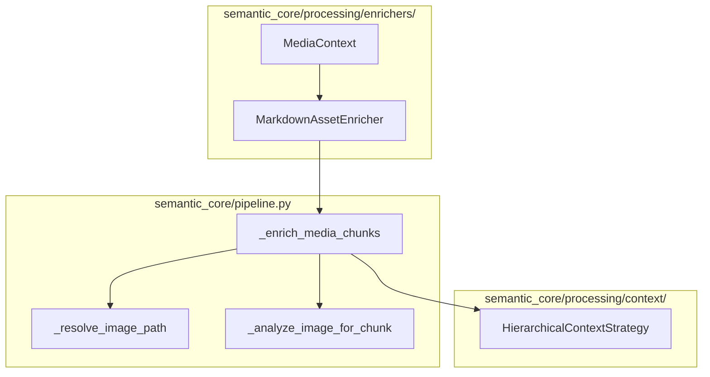

# 🔗 Markdown-Media Integration

> Как связать изображения в Markdown с Vision API для семантического поиска

---

## 📌 Что это такое?

**Markdown-Media Integration** — механизм обогащения IMAGE_REF чанков реальными описаниями от Vision API вместо использования только alt-текста.

Это "недостающее звено" между парсингом Markdown и мультимодальным анализом.

---

## 🎯 Зачем это нужно?

### Проблема: разрыв между парсером и Vision



**Результат**: поиск "ER-диаграмма базы данных" не находит картинку с ``, потому что вектор построен только на слове "схема".

---

### Решение: обогащение через Vision



---

## 🔍 Как это работает?

### Флаг `enrich_media`

| Значение | Поведение | Стоимость |
|----------|-----------|-----------|
| `False` (default) | Alt-текст → вектор | Бесплатно |
| `True` | Vision API → описание → вектор | ~100 токенов/картинка |

**Почему по умолчанию False?**

1. Экономия токенов (явное включение)
2. Быстрый `ingest()` без API вызовов
3. "Явное лучше неявного"

---

### Передача контекста в Vision

Vision API получает не просто картинку, а **контекст из документа**:



---

### Пример контекста

**Исходный Markdown:**
```markdown
# Nginx Setup

## Configuration

Here's the architecture:


This shows request flow.
```

**Контекст для Vision:**
```
Document section: Nginx Setup > Configuration
Image caption: Nginx diagram
Title: Figure 1
Surrounding text:
[Before]: ...Here's the architecture:
[After]: This shows request flow...
Role: Illustration embedded in document
```

**Результат**: Vision "понимает" что картинка показывает архитектуру Nginx, а не абстрактную диаграмму.

---

## 📊 Сравнение качества поиска

| Запрос | Без обогащения | С обогащением |
|--------|----------------|---------------|
| "nginx architecture" | ❌ Не найдёт (alt="Nginx diagram") | ✅ Найдёт (description содержит "architecture") |
| "request flow diagram" | ❌ Не найдёт | ✅ Найдёт (Vision увидел стрелки) |
| "server configuration" | ❌ Не найдёт | ✅ Найдёт (контекст из surrounding text) |

---

## 🛤️ Резолв путей к изображениям

### Порядок проверок



---

### Примеры

| image_ref | doc_dir | Результат |
|-----------|---------|-----------|
| `https://example.com/img.png` | любой | ⏭️ Пропущен (URL) |
| `/home/user/doc/img.png` | любой | ✅ Использован (абсолютный) |
| `images/diagram.png` | `/docs/setup/` | ✅ `/docs/setup/images/diagram.png` |
| `../shared/icon.png` | `/docs/setup/` | ✅ `/docs/shared/icon.png` |

---

## 🛡️ Обработка ошибок

**Философия**: Никогда не ронять весь `ingest()` из-за одной картинки.

```mermaid
graph TD
    A[Попытка обогащения] --> B{Успех?}
    B -->|Да| C[chunk.content = description<br/>_enriched = True]
    B -->|Нет| D{Тип ошибки}
    D -->|Файл не найден| E[log.warning<br/>_media_error = "not found"]
    D -->|Vision API ошибка| F[log.error<br/>_media_error = str]
    D -->|image_analyzer = None| G[log.warning<br/>Пропуск обогащения]
    E --> H[Продолжаем с alt-текстом]
    F --> H
    G --> H
```

---

## 📦 Метаданные после обогащения

| Ключ | Когда появляется | Значение |
|------|------------------|----------|
| `_enriched` | Vision успешен | `True` |
| `_original_path` | Всегда | Путь до замены content |
| `_vision_alt` | Vision успешен | alt_text от Vision |
| `_vision_keywords` | Vision успешен | `["nginx", "server", ...]` |
| `_vision_ocr` | Есть текст на картинке | OCR результат |
| `_media_error` | Ошибка | Сообщение об ошибке |

---

## ⚙️ Архитектура компонентов



---

### HierarchicalContextStrategy: две ветки

| Условие | Формат vector_text |
|---------|-------------------|
| `_enriched=True` | "Type: Image\nDescription: {vision}\nKeywords: {...}" |
| `_enriched=False` | "Type: Image Reference\nDescription: {alt}\nSource: {path}" |

---

## ⚠️ Важные нюансы

### 1. Нет кеширования Vision

Одна картинка в разных документах → разный контекст → разное описание.

```
docs/problems/error.png  → "Скриншот ошибки 404"
docs/solutions/error.png → "Исправленная страница без ошибки"
```

### 2. Только IMAGE_REF

Аудио и видео в Markdown отложены — нет стандартного синтаксиса.

### 3. Sync vs Async

| Режим | Поведение | Когда использовать |
|-------|-----------|-------------------|
| `sync` | Сразу вызов Vision API | Мало картинок, нужен результат сейчас |
| `async` | Задача в очередь | Много картинок, batch обработка |

---

## 🔗 Связанные документы

- **Предыдущий**: [Media Optimization Strategies](32_media_optimization_strategies.md)
- **Vision API**: [Gemini Vision Integration](26_gemini_vision_integration.md)
- **Smart Parsing**: [Smart Parsing Architecture](15_smart_parsing.md)
- **Rate Limiting**: [Rate Limiting](28_rate_limiting.md)

---

**← [Media Optimization Strategies](32_media_optimization_strategies.md)** | **[00_overview.md](00_overview.md) →**
