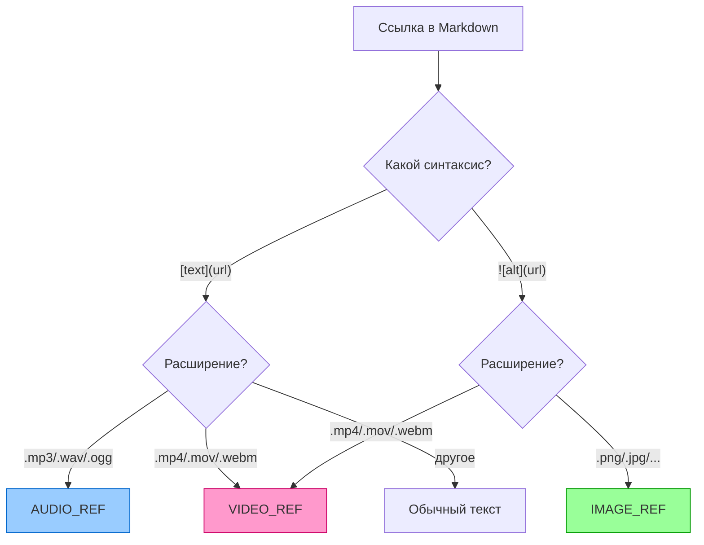
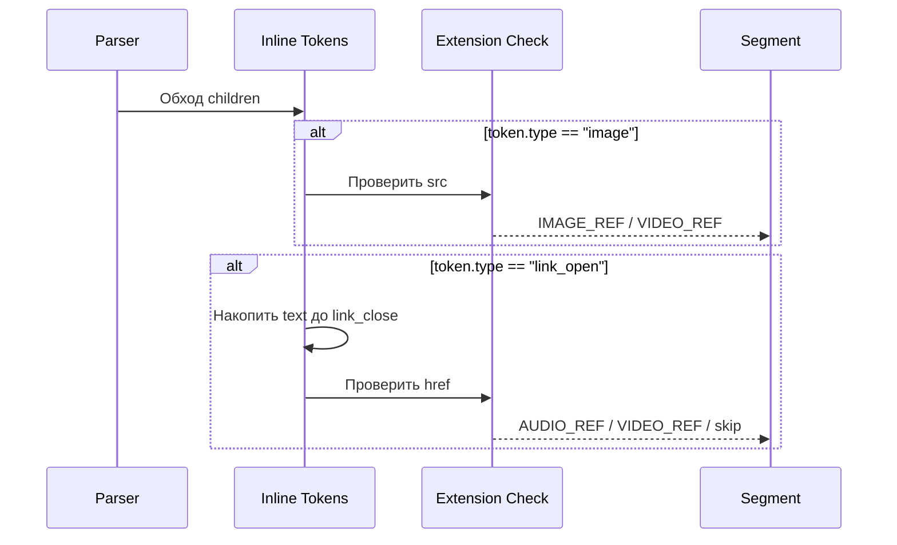
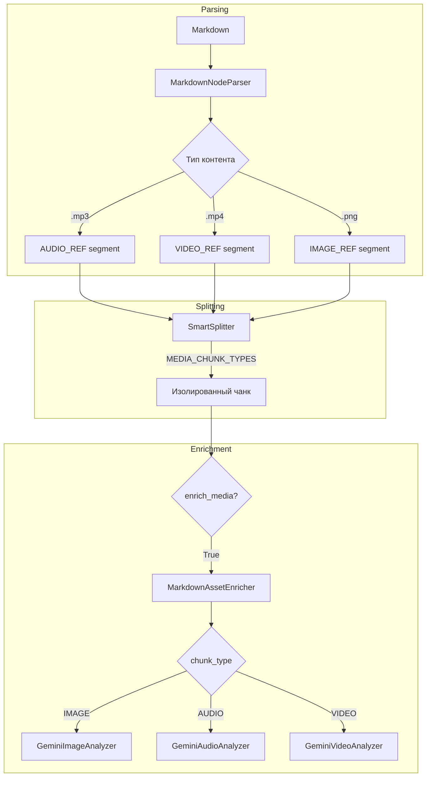

# 🎵 Audio & Video in Markdown

> Расширение парсера для детекции медиа-ссылок по расширению файла

---

## 📌 Что это такое?

**Audio/Video in Markdown** — механизм обнаружения ссылок на аудио и видео файлы в Markdown-документах и их обработка как полноценных медиа-чанков.

Это расширение Phase 6.4 (IMAGE_REF) для двух других типов медиа.

---

## 🎯 Зачем это нужно?

### Проблема: ссылки на медиа — это просто текст

```markdown
# Лекция по архитектуре

Запись первой части:
[Аудио лекции](recordings/part1.mp3)

Демонстрация работы:

```

**Без Phase 6.5**: парсер видит:

- `[Аудио лекции](...)` → обычный текст с URL
- `` → `IMAGE_REF` (но это видео!)

**Результат**: поиск "что говорили про микросервисы" не найдёт лекцию.

---

### Решение: детекция по расширению



---

## 🔍 Как это работает?

### Расширения медиа-файлов

| Тип | Расширения | MIME-типы |
|-----|------------|-----------|
| **Audio** | `.mp3`, `.wav`, `.ogg`, `.flac`, `.aac`, `.aiff` | audio/* |
| **Video** | `.mp4`, `.mov`, `.avi`, `.mkv`, `.webm` | video/* |
| **Image** | `.png`, `.jpg`, `.jpeg`, `.gif`, `.webp`, `.svg` | image/* |

> ⚠️ `.m4a` намеренно исключён — Gemini API не поддерживает напрямую

---

### Разница в AST-токенах

**Изображение** `` — один токен:

```
Token(type="image", attrs=[("src", "url")], content="alt")
```

**Ссылка** `[text](url)` — три токена:

```
Token(type="link_open", attrs=[("href", "url")])
Token(type="text", content="text")
Token(type="link_close")
```

---

### Алгоритм детекции



---

## 📊 Новые типы чанков

### ChunkType enum

```python
class ChunkType(str, Enum):
    TEXT = "text"
    CODE = "code"
    TABLE = "table"
    IMAGE_REF = "image_ref"
    AUDIO_REF = "audio_ref"   # NEW
    VIDEO_REF = "video_ref"   # NEW
```

### MEDIA_CHUNK_TYPES

Унифицированное множество для проверки:

```python
MEDIA_CHUNK_TYPES = frozenset({
    ChunkType.IMAGE_REF,
    ChunkType.AUDIO_REF,
    ChunkType.VIDEO_REF,
})
```

**Где используется:**

- `SmartSplitter`: изоляция медиа-чанков
- `MarkdownAssetEnricher`: фильтрация чанков
- `SemanticCore._enrich_media_chunks()`: роутинг

---

## 🔄 Поток обработки



---

## 📝 Формат vector_text

### HierarchicalContextStrategy

**AUDIO_REF (обогащённый):**

```
Section: Лекции > Архитектура
Type: Audio
Transcription: Сегодня мы поговорим о микросервисах...
Speakers: Владимир, Анна
Keywords: микросервисы, архитектура, API
Duration: 1847.5s
Source: recordings/part1.mp3
```

**VIDEO_REF (обогащённый):**

```
Section: Демонстрации > VS Code
Type: Video
Description: Скринкаст настройки отладчика Python
Audio transcription: Открываем launch.json и добавляем...
Visible text: Debug Configuration, Python, pytest
Duration: 180.0s
Source: demo/screencast.mp4
```

---

## 🎛️ Интеграция анализаторов

### SemanticCore конструктор

```python
SemanticCore(
    embedder=embedder,
    store=store,
    splitter=splitter,
    context_strategy=strategy,
    image_analyzer=GeminiImageAnalyzer(...),  # Phase 6.0
    audio_analyzer=GeminiAudioAnalyzer(...),  # Phase 6.5
    video_analyzer=GeminiVideoAnalyzer(...),  # Phase 6.5
)
```

### Graceful degradation

| Конфигурация | Поведение |
|--------------|-----------|
| Все анализаторы | Полное обогащение |
| Только image | Audio/Video пропускаются с логом |
| Без анализаторов | `enrich_media=True` → warning, пропуск |

---

## 📦 Метаданные по типам

| Тип | Ключи метаданных |
|-----|------------------|
| **IMAGE_REF** | `_vision_alt`, `_vision_keywords`, `_vision_ocr` |
| **AUDIO_REF** | `_audio_description`, `_audio_keywords`, `_audio_participants`, `_audio_action_items`, `_audio_duration` |
| **VIDEO_REF** | `_video_transcription`, `_video_keywords`, `_video_ocr`, `_video_duration` |

**Общие**: `_enriched`, `_original_path`, `_media_error`

---

## ⚠️ Важные нюансы

### 1. Видео в синтаксисе изображений

```markdown

```

Раньше: `IMAGE_REF` ❌  
Теперь: `VIDEO_REF` ✅ (по расширению)

### 2. Только локальные файлы

URL (`http://`, `https://`, `data:`) пропускаются — нет скачивания.

### 3. Контент чанка после обогащения

| Тип | chunk.content |
|-----|---------------|
| IMAGE_REF | Описание от Vision |
| AUDIO_REF | Транскрипция (или описание) |
| VIDEO_REF | Описание (транскрипция в metadata) |

---

## 🔗 Связанные документы

- **Предыдущий**: [Markdown-Media Integration](33_markdown_media_integration.md)
- **Audio Analyzer**: [Audio Analysis](30_audio_analysis.md)
- **Video Analyzer**: [Video Analysis](31_video_analysis.md)
- **Smart Parsing**: [Smart Parsing Architecture](15_smart_parsing.md)

---

**← [Markdown-Media Integration](33_markdown_media_integration.md)** | **[00_overview.md](00_overview.md) →**
