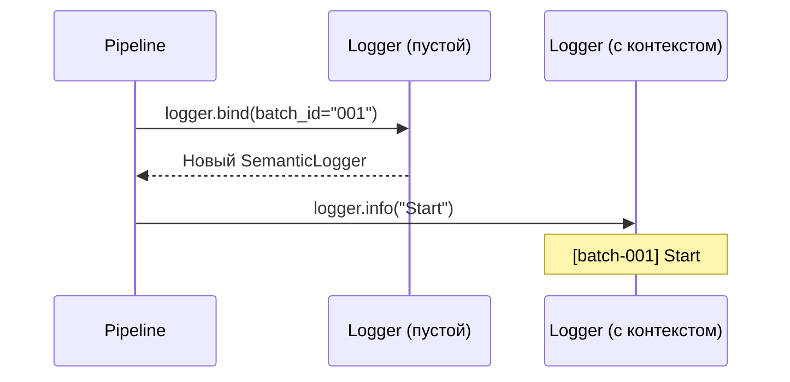
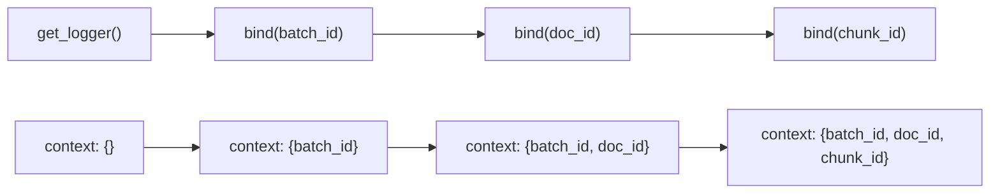
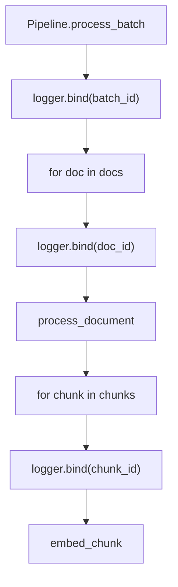
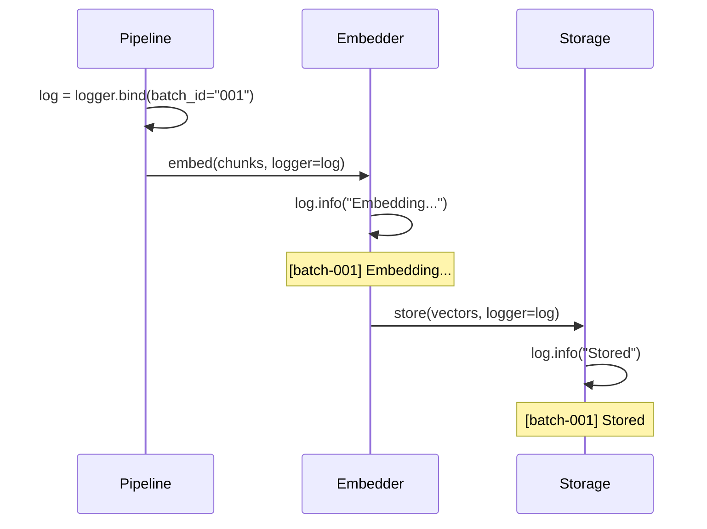
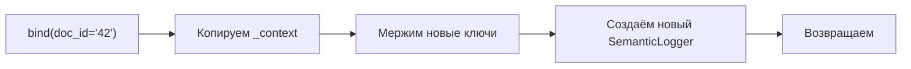
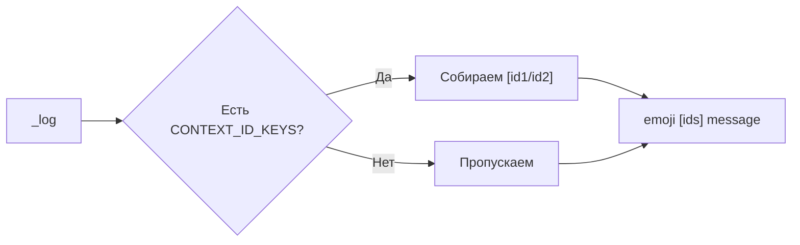
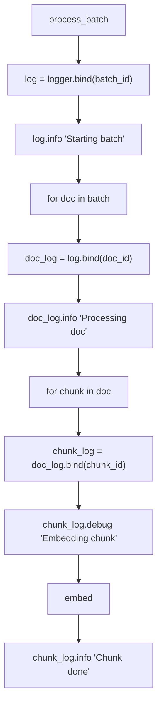

# 🔗 Context Propagation with bind()

> Проброс batch_id, doc_id через весь pipeline без thread-local storage

---

## 📌 Что это такое?

**Context Propagation** — механизм автоматического добавления идентификаторов (batch_id, doc_id, chunk_id) ко всем логам в цепочке вызовов.

Один `bind()` в начале — контекст везде до конца.

---

## 🎯 Зачем это нужно?

**Проблема**: При обработке батча из 100 документов логи перемешиваются:

```
INFO: Processing document
INFO: Chunk created
ERROR: Embedding failed
INFO: Processing document
INFO: Chunk created
```

Какой документ упал? Непонятно.

**Решение**: Привязываем контекст:

```
📥 [batch-001/doc-42] Processing document
✂️ [batch-001/doc-42/chunk-5] Chunk created
❌ [batch-001/doc-42/chunk-5] Embedding failed
📥 [batch-001/doc-43] Processing document
✂️ [batch-001/doc-43/chunk-1] Chunk created
```

Сразу видно: проблема в doc-42, chunk-5.

---

## 🔍 Механизм bind()

### Как работает



---

### Цепочка bind()



**Важно**: Каждый `bind()` создаёт **новый** логгер, не мутирует старый.

---

## 📐 CONTEXT_ID_KEYS

### Какие ключи форматируются

| Ключ | Пример значения | В логе |
|------|-----------------|--------|
| `batch_id` | "batch-001" | `[batch-001]` |
| `doc_id` | "doc-42" | `[doc-42]` |
| `chunk_id` | "chunk-5" | `[chunk-5]` |
| `task_id` | "task-99" | `[task-99]` |
| `request_id` | "req-abc" | `[req-abc]` |

---

### Формат вывода

```
[{id1}/{id2}/{id3}]
```

**Примеры**:

| Контекст | Вывод |
|----------|-------|
| `{batch_id: "001"}` | `[batch-001]` |
| `{batch_id: "001", doc_id: "42"}` | `[batch-001/doc-42]` |
| `{doc_id: "42", chunk_id: "5"}` | `[doc-42/chunk-5]` |

---

## 🎭 Паттерн использования

### В pipeline



---

### Передача логгера



---

## 📊 Сравнение с альтернативами

### Thread-Local (contextvars)

| Аспект | bind() | contextvars |
|--------|--------|-------------|
| Явность | ✅ Видно в коде | ❌ Магия |
| Async-safe | ✅ | ✅ |
| Передача | Явно через параметр | Автоматически |
| Отладка | ✅ Легко | ⚠️ Сложнее |

**Выбор bind()**: Явность важнее магии. Видно, откуда контекст.

---

### structlog.bind()

| Аспект | SemanticLogger | structlog |
|--------|----------------|-----------|
| Зависимости | 0 (stdlib) | +1 пакет |
| Процессоры | Простые | Мощные |
| Интеграция | logging stdlib | Своя система |

**Выбор**: Минимализм. structlog избыточен для наших задач.

---

## 🔧 Реализация

### SemanticLogger.bind()



**Ключевые моменты**:

1. **Shallow copy** контекста — не мутируем родителя
2. **Новый экземпляр** — изоляция веток
3. **Тот же _logger** — делегация остаётся

---

### Форматирование в _log()



---

## ⚠️ Важные нюансы

### 1. Передавайте логгер явно

❌ **Плохо**: Глобальный логгер в функции

```python
def embed_chunk(chunk):
    logger.info("Embedding...")  # Нет контекста!
```

✅ **Хорошо**: Передача логгера

```python
def embed_chunk(chunk, logger):
    logger.info("Embedding...")  # [batch-001/doc-42] Embedding...
```

---

### 2. bind() не мутирует

❌ **Ошибка ожиданий**:

```python
logger.bind(doc_id="42")
logger.info("Test")  # Контекста НЕТ!
```

✅ **Правильно**:

```python
log = logger.bind(doc_id="42")
log.info("Test")  # [doc-42] Test
```

---

### 3. Цепочка bind() композиционна

```python
log1 = logger.bind(batch_id="001")
log2 = log1.bind(doc_id="42")
log3 = log2.bind(chunk_id="5")

log3.info("Final")  # [batch-001/doc-42/chunk-5] Final
log1.info("Still original")  # [batch-001] Still original
```

---

## 📈 Диаграмма потока в Pipeline



---

## 🔗 Связанные документы

- **Предыдущий**: [Visual Semantics in Logs](36_visual_semantics_logs.md)
- **Следующий**: [Secret Redaction](38_secret_redaction.md)
- **Архитектура**: [Semantic Logging Architecture](35_semantic_logging.md)

---

**← [Visual Semantics in Logs](36_visual_semantics_logs.md)** | **[Secret Redaction](38_secret_redaction.md) →**
