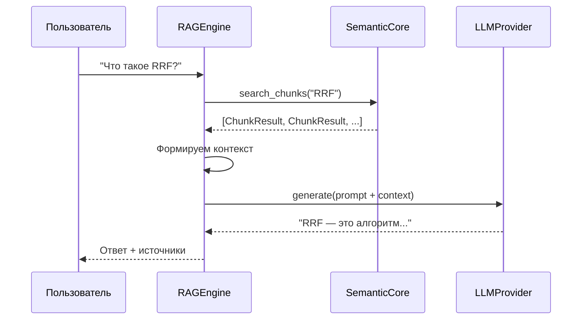

# 🔗 Episode 44: RAG Engine Architecture

> Как связать семантический поиск с генерацией ответов

---

## 🎯 Зачем RAG?

Представь ситуацию: у тебя есть база документов (заметки, статьи, код). Ты хочешь **задать вопрос** и получить ответ, основанный на твоих данных.

**Обычный LLM** (ChatGPT, Gemini):
- Отвечает на основе своих знаний (training data)
- Не знает твоих документов
- Может "галлюцинировать"

**RAG (Retrieval-Augmented Generation)**:
- Сначала **ищет** релевантные документы
- Потом **генерирует** ответ на их основе
- Ответы подкреплены реальными данными

---

## 🧠 Как работает RAG



**Три шага:**

1. **Retrieval** — находим релевантные чанки
2. **Augmentation** — формируем контекст из найденного
3. **Generation** — LLM отвечает на основе контекста

---

## 📦 Компоненты системы

### Интерфейс LLM провайдера

RAG не привязан к конкретной модели. Любой провайдер реализует общий интерфейс:

| Метод | Назначение |
|-------|------------|
| `generate()` | Генерация текста |
| `model_name` | Название модели |

**Результат генерации** содержит:

- Текст ответа
- Количество токенов (input/output)
- Причина остановки (STOP, MAX_TOKENS)

### RAGEngine

Оркестратор, связывающий поиск и генерацию:

| Параметр | Default | Описание |
|----------|---------|----------|
| `core` | — | SemanticCore для поиска |
| `llm` | — | Провайдер LLM |
| `context_chunks` | 5 | Количество чанков контекста |
| `system_prompt` | Built-in | Кастомный промпт |

### RAGResult

Результат RAG-запроса:

| Поле | Тип | Описание |
|------|-----|----------|
| `answer` | str | Сгенерированный ответ |
| `sources` | list | Найденные источники |
| `generation` | GenerationResult | Метаданные LLM |
| `query` | str | Исходный вопрос |
| `full_docs` | bool | Режим полных документов |

---

## 🎛 Два режима контекста

### Режим chunks (по умолчанию)

```
┌─────────────────────────────────────────────────────────────────┐
│  Вопрос: "Как работает RRF?"                                    │
│                                                                 │
│  Поиск → 5 чанков по ~500 символов каждый                       │
│  Контекст ≈ 2.5k токенов                                        │
│                                                                 │
│  ✅ Экономия токенов                                            │
│  ✅ Высокая точность                                            │
│  ❌ Ограниченный контекст                                       │
└─────────────────────────────────────────────────────────────────┘
```

### Режим full_docs

```
┌─────────────────────────────────────────────────────────────────┐
│  Вопрос: "Суммаризируй этот документ"                           │
│                                                                 │
│  Поиск → находим чанк → загружаем весь документ                 │
│  Контекст ≈ 10-50k токенов                                      │
│                                                                 │
│  ✅ Полный контекст                                             │
│  ✅ Для суммаризации                                            │
│  ❌ Дороже по токенам                                           │
└─────────────────────────────────────────────────────────────────┘
```

### Когда какой использовать?

| Задача | Режим | Причина |
|--------|-------|---------|
| FAQ, точечные вопросы | chunks | Нужны конкретные факты |
| Суммаризация | full_docs | Нужен весь документ |
| Анализ структуры | full_docs | Важны связи между частями |
| Поиск кода | chunks | Нужен конкретный фрагмент |

---

## 🎨 Формирование контекста

### Формат для chunks

```
[1] architecture.md [text] (score: 0.95)
RRF (Reciprocal Rank Fusion) — алгоритм объединения результатов...

---

[2] search.md [code] (python) (score: 0.82)
def hybrid_search(query, k=60):
    return 1 / (k + rank)

---

[3] examples.md [text] (score: 0.71)
Пример использования гибридного поиска...
```

**Структура блока:**
- Номер источника
- Заголовок документа
- Тип чанка и язык
- Score релевантности
- Содержимое

### Формат для full_docs

```
[1] architecture.md (score: 0.95)
# Архитектура поиска

Документ полностью...
Весь контент...

---

[2] search.md (score: 0.82)
# Поиск

Весь документ целиком...
```

---

## 📝 Системный промпт

RAGEngine использует продуманный системный промпт:

**Ключевые правила:**

1. Отвечай **ТОЛЬКО** на основе контекста
2. Если информации нет — скажи об этом
3. Будь кратким и точным
4. Форматируй в Markdown
5. Цитируй источники

**Почему это важно?**

- Предотвращает "галлюцинации"
- Фокусирует ответ на реальных данных
- Обеспечивает проверяемость

### Кастомные промпты

Можно заменить промпт полностью:

```
# С placeholder {context}
"Ты эксперт Python. Используй контекст:\n{context}"

# Без placeholder — контекст добавится в конец
"Будь краток и полезен."
```

---

## ⚠️ Важные нюансы

### Ограничение контекста

Контент чанков обрезается до 2000 символов на источник:
- Защита от переполнения контекста LLM
- Примерно 500 токенов на источник
- 5 источников ≈ 2500 токенов контекста

### Обрезка заголовков

Длинные пути к файлам обрезаются:
```
/very/long/path/to/document.md
→ .../path/to/document.md
```

Сохраняем последние 47 символов + "..."

### Обработка пустых результатов

Если поиск ничего не нашёл:
- Контекст = "No relevant context found."
- LLM честно скажет, что нет информации

---

## 📊 Сравнение с альтернативами

| Аспект | Простой LLM | RAG |
|--------|-------------|-----|
| Источник знаний | Training data | Твои документы |
| Актуальность | Дата обучения | Всегда свежие |
| Галлюцинации | Частые | Редкие |
| Проверяемость | ❌ | ✅ Источники |
| Стоимость | Только генерация | Поиск + генерация |

---

## 🔗 Следующие шаги

**Episode 45** расскажет про CLI интерфейс для RAG — как задавать вопросы из терминала.

---

**← Предыдущий**: [Episode 43: Queue & Worker Commands](43_queue_worker_commands.md)  
**→ Следующий**: [Episode 45: RAG Chat Interface](45_rag_chat_interface.md)
