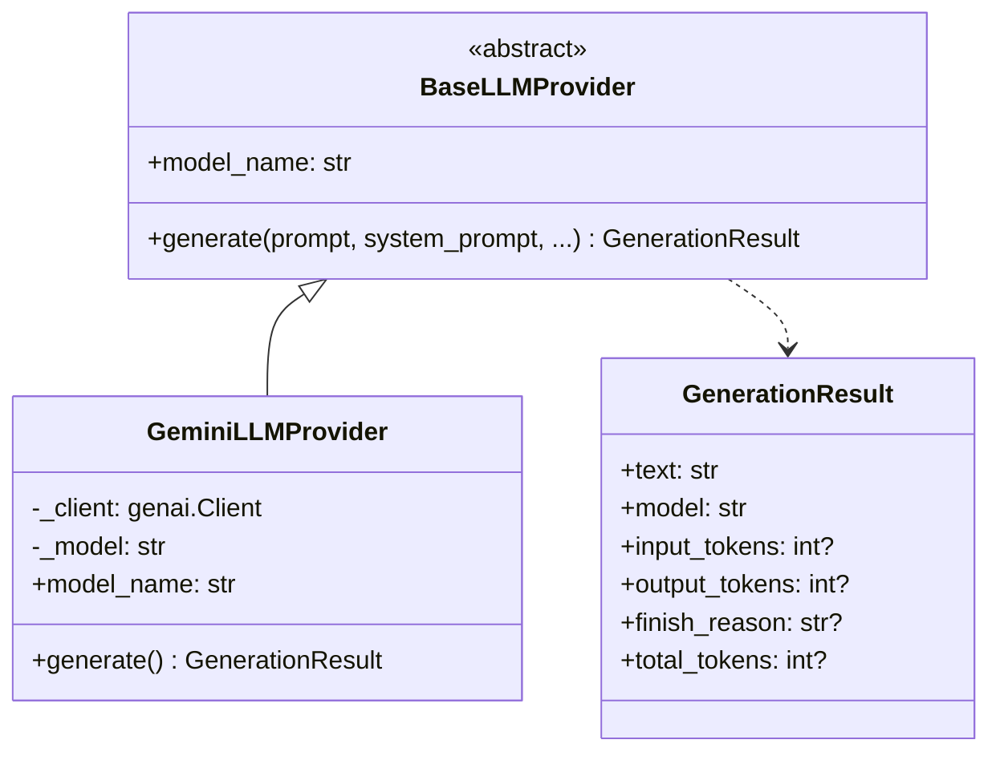

# 🧠 Episode 45: LLM Provider Abstraction

> Как абстрагировать генерацию текста от конкретной модели

---

## 🎯 Зачем абстракция?

Сегодня используем Gemini, завтра — OpenAI, послезавтра — локальную Llama. Код RAG не должен меняться при смене провайдера.

**Без абстракции:**
```
RAGEngine → напрямую вызывает Gemini API
            ↓
            Переключение на OpenAI = переписать весь RAG
```

**С абстракцией:**
```
RAGEngine → BaseLLMProvider (интерфейс)
                 ↓
            GeminiLLMProvider | OpenAIProvider | LocalLlamaProvider
```

---

## 🏗 Архитектура



---

## 📦 Контракт провайдера

### Метод generate()

| Параметр | Тип | Default | Описание |
|----------|-----|---------|----------|
| `prompt` | str | Required | Текст запроса |
| `system_prompt` | str? | None | Инструкции для модели |
| `temperature` | float | 0.7 | Креативность (0.0-2.0) |
| `max_tokens` | int? | None | Лимит ответа |

**Возвращает:** `GenerationResult`

### Property model_name

Возвращает название модели для логирования:
- `gemini-2.0-flash`
- `gpt-4-turbo`
- `llama-3-70b`

---

## 📊 GenerationResult

Унифицированный результат генерации:

| Поле | Тип | Описание |
|------|-----|----------|
| `text` | str | Сгенерированный текст |
| `model` | str | Использованная модель |
| `input_tokens` | int? | Токены промпта |
| `output_tokens` | int? | Токены ответа |
| `finish_reason` | str? | Почему остановился |

**Причины остановки (finish_reason):**

| Значение | Описание |
|----------|----------|
| `STOP` | Модель закончила естественно |
| `MAX_TOKENS` | Достигнут лимит токенов |
| `SAFETY` | Заблокировано safety фильтром |
| `RECITATION` | Слишком похоже на training data |

### Вычисляемое свойство

**total_tokens** возвращает сумму input + output:
- Если оба значения есть → сумма
- Если любого нет → None

---

## 🔌 Реализация для Gemini

### Инициализация

Провайдер создаётся с API ключом и названием модели:

| Параметр | Default | Описание |
|----------|---------|----------|
| `api_key` | Required | Ключ Gemini |
| `model` | gemini-2.0-flash | Модель |

### Генерация

```
┌─────────────────────────────────────────────────────────────────┐
│  1. Формируем GenerateContentConfig                             │
│     - temperature                                               │
│     - max_output_tokens                                         │
│     - system_instruction                                        │
│                                                                 │
│  2. Вызываем models.generate_content()                          │
│                                                                 │
│  3. Извлекаем метаданные                                        │
│     - usage_metadata.prompt_token_count                         │
│     - usage_metadata.candidates_token_count                     │
│     - candidates[0].finish_reason                               │
│                                                                 │
│  4. Возвращаем GenerationResult                                 │
└─────────────────────────────────────────────────────────────────┘
```

### Обработка ошибок

Все ошибки API оборачиваются в `RuntimeError`:
- Логируется тип ошибки
- Сохраняется оригинальная причина

---

## 📈 Логирование AI-вызовов

Каждый вызов генерации логируется через `trace_ai()`:

| Поле | Описание |
|------|----------|
| `prompt` | Превью промпта (100 символов) |
| `response` | Превью ответа (100 символов) |
| `model` | Название модели |
| `tokens_in` | Входные токены |
| `tokens_out` | Выходные токены |
| `duration_ms` | Время выполнения |

**Зачем trace_ai()?**
- Анализ затрат на API
- Отладка промптов
- Мониторинг производительности

---

## 🔄 Добавление нового провайдера

### Шаги

1. Создать класс, наследующий `BaseLLMProvider`
2. Реализовать `generate()` и `model_name`
3. Добавить в `infrastructure/llm/`
4. Экспортировать в `__init__.py`

### Пример: OpenAI Provider

```
┌─────────────────────────────────────────────────────────────────┐
│  class OpenAIProvider(BaseLLMProvider):                         │
│                                                                 │
│      def __init__(self, api_key, model="gpt-4"):               │
│          self._client = OpenAI(api_key=api_key)                │
│          self._model = model                                    │
│                                                                 │
│      def generate(self, prompt, system_prompt=None, ...):       │
│          messages = []                                          │
│          if system_prompt:                                      │
│              messages.append({"role": "system", ...})           │
│          messages.append({"role": "user", ...})                 │
│          response = self._client.chat.completions.create(...)   │
│          return GenerationResult(...)                           │
│                                                                 │
│      @property                                                  │
│      def model_name(self) -> str:                               │
│          return self._model                                     │
└─────────────────────────────────────────────────────────────────┘
```

---

## 📊 Сравнение провайдеров

| Аспект | Gemini | OpenAI | Local LLM |
|--------|--------|--------|-----------|
| Стоимость | Средняя | Высокая | Бесплатно |
| Скорость | Быстро | Быстро | Зависит от GPU |
| Качество | Хорошее | Отличное | Зависит от модели |
| Privacy | Облако | Облако | Локально |
| Лимиты | 15 RPM (free) | Rate limits | Нет |

---

## ⚠️ Важные нюансы

### Совместимость system_prompt

Не все модели поддерживают system_prompt одинаково:
- Gemini: `system_instruction` в конфиге
- OpenAI: отдельное сообщение с ролью "system"
- Некоторые модели: игнорируют

### Пустой ответ

Некоторые модели возвращают None вместо текста:
- Gemini: `response.text` может быть None
- Обрабатываем как пустую строку

### Отсутствие метаданных

Не все провайдеры возвращают токены:
- Gemini: обычно есть `usage_metadata`
- Некоторые API: нет информации о токенах
- GenerationResult корректно обрабатывает None

---

## 🔗 Следующий шаг

**Episode 46** расскажет про интерактивный CLI чат — как использовать RAG из терминала.

---

**← Предыдущий**: [Episode 44: RAG Engine Architecture](44_rag_engine_architecture.md)  
**→ Следующий**: [Episode 46: RAG Chat CLI](46_rag_chat_cli.md)
