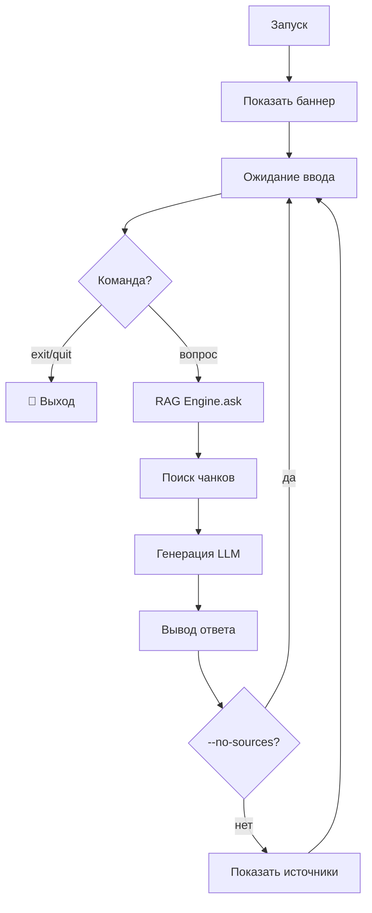

# 💬 Episode 46: RAG Chat CLI

> Интерактивный чат с базой знаний из терминала

---

## 🎯 Зачем CLI чат?

У нас есть:

- ✅ Индексированные документы
- ✅ Семантический поиск
- ✅ RAG Engine

Не хватает **удобного способа задавать вопросы**. CLI чат — это REPL (Read-Eval-Print Loop) для RAG.

---

## 🖥 Интерфейс

### Запуск

```bash
semantic chat
semantic chat --model gemini-1.5-pro --context 10
semantic chat --search vector --no-sources
semantic chat --full-docs  # Полные документы
```

### Сессия

```
┌──────────────────────────────────────────────────┐
│  💬 RAG Chat                                      │
│                                                  │
│  Модель: gemini-2.0-flash                        │
│  Поиск: 🔀 Гибридный                             │
│  Контекст: 5 чанков                              │
│                                                  │
│  Введите вопрос или 'exit' для выхода.           │
└──────────────────────────────────────────────────┘

You: Как работает RRF?

🔍 Поиск релевантных документов...

📚 Найдено 3 источника:

╭─ Ответ ──────────────────────────────────────────╮
│  RRF (Reciprocal Rank Fusion) объединяет        │
│  результаты векторного и текстового поиска...    │
╰──────────────────────────────────────────────────╯

Источники:
  [1] 05_hybrid_search_rrf.md
  [2] 04_search_types.md

You: exit
👋 До свидания!
```

---

## ⌨️ Технологический стек

### Три кита CLI

```
┌─────────────────────────────────────────────────┐
│                    CLI REPL                      │
├─────────────────┬───────────────┬───────────────┤
│     Typer       │     Rich      │ prompt_toolkit│
│   (Команды)     │  (Вывод)      │   (Ввод)      │
└─────────────────┴───────────────┴───────────────┘
```

| Компонент | Роль |
|-----------|------|
| **Typer** | Парсинг аргументов и флагов |
| **Rich** | Форматирование, панели, стили |
| **prompt_toolkit** | Интерактивный ввод, история |

---

## 🎛 Флаги

| Флаг | По умолчанию | Описание |
|------|--------------|----------|
| `--model` | gemini-2.0-flash | Модель для генерации |
| `--context` | 5 | Число источников |
| `--search` | hybrid | vector / fts / hybrid |
| `--temperature` | 0.3 | Креативность (0-1) |
| `--full-docs` | False | Полные документы вместо чанков |
| `--no-sources` | False | Скрыть источники |

### Режим `--full-docs`

```
По умолчанию:            С --full-docs:
┌──────────────┐         ┌──────────────┐
│   Chunk 1    │         │  Document 1  │
│   Chunk 2    │    →    │  (полный)    │
│   Chunk 3    │         │  Document 2  │
└──────────────┘         └──────────────┘
```

---

## 🔄 REPL Loop



---

## 🎨 Форматирование вывода

### Rich Console

```python
# Панели для ответов
Panel(
    answer,
    title="🤖 Ответ",
    border_style="green"
)

# Таблицы для источников
Table(
    Column("№", style="cyan"),
    Column("Документ", style="green"),
    Column("Чанк", style="yellow")
)
```

### Иерархия вывода

```
┌─ Баннер ─────────────────────────────────────────┐
│  💬 RAG Chat                                      │
│  Модель: gemini-2.0-flash                        │
└──────────────────────────────────────────────────┘

You: <вопрос>

🔍 Поиск...

╭─ 🤖 Ответ ───────────────────────────────────────╮
│  <ответ от LLM>                                  │
╰──────────────────────────────────────────────────╯

📚 Источники:
┌────┬─────────────────────┬───────────┐
│ № │ Документ             │ Чанк      │
├────┼─────────────────────┼───────────┤
│ 1  │ 05_hybrid_search... │ heading_3 │
│ 2  │ 04_search_types...  │ paragraph │
└────┴─────────────────────┴───────────┘
```

---

## 🔗 Интеграция компонентов

```
┌────────────────────────────────────────────────────┐
│                     CLI Chat                        │
│  ┌──────────────────────────────────────────────┐  │
│  │                 prompt_toolkit                │  │
│  │            (история, автодополнение)          │  │
│  └──────────────────────────────────────────────┘  │
│                        ↓                            │
│  ┌──────────────────────────────────────────────┐  │
│  │                  RAG Engine                   │  │
│  │  (Episode 44 — оркестрация RAG)               │  │
│  └──────────────────────────────────────────────┘  │
│                        ↓                            │
│  ┌──────────────┐  ┌─────────────────────────────┐ │
│  │ SemanticCore │  │ GeminiLLMProvider            │ │
│  │ (поиск)      │  │ (Episode 45 — генерация)     │ │
│  └──────────────┘  └─────────────────────────────┘ │
│                        ↓                            │
│  ┌──────────────────────────────────────────────┐  │
│  │                    Rich                       │  │
│  │            (форматирование вывода)            │  │
│  └──────────────────────────────────────────────┘  │
└────────────────────────────────────────────────────┘
```

---

## ⚠️ Обработка ошибок

### Graceful degradation

| Ситуация | Поведение |
|----------|-----------|
| Нет документов | "База знаний пуста. Индексируйте документы." |
| Ошибка API | Показать ошибку, продолжить REPL |
| Ctrl+C | Мягкий выход без stack trace |
| Пустой ввод | Игнорировать, ждать следующий |

---

## 🎯 UX принципы

1. **Мгновенный feedback** — спиннер при поиске
2. **Информативный баннер** — модель, режим, настройки
3. **Минимум шума** — только важное
4. **Красивый вывод** — Rich панели и таблицы
5. **История команд** — prompt_toolkit сохраняет

---

## 📊 Сравнение режимов

| Аспект | Chunks (default) | Full Docs |
|--------|------------------|-----------|
| Контекст | Точечный | Полный |
| Токены | Меньше | Больше |
| Скорость | Быстрее | Медленнее |
| Точность | Фокусированная | Широкая |
| Когда | Конкретные вопросы | "Расскажи всё о..." |

---

## 📍 Что дальше?

В следующих эпизодах:

- 📜 История сессий
- 🔄 Streaming ответов
- 📎 Контекст из предыдущих вопросов

---

**Продолжение следует...**

*Episode 46 | RAG Integration | Phase 9.0*
