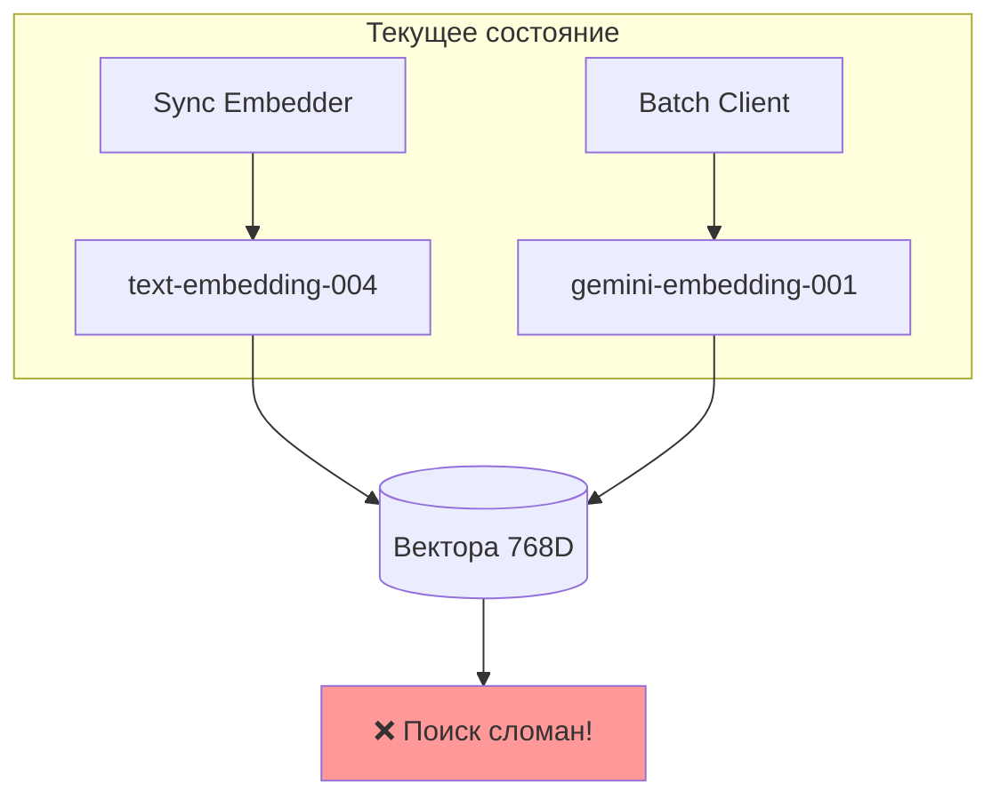
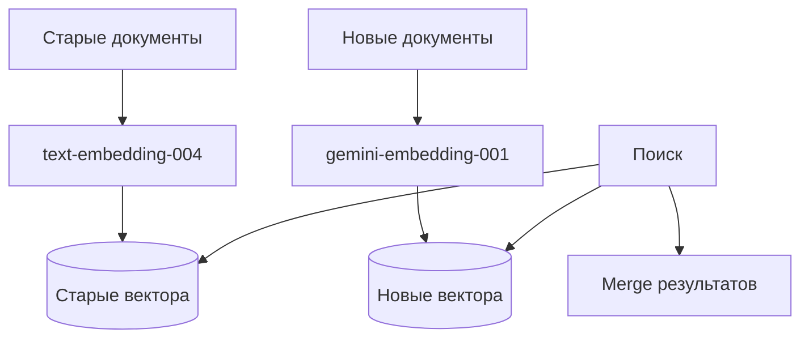

# 🔀 Миграция на gemini-embedding-001

> Почему нельзя смешивать модели и как безболезненно перейти

---

## 📌 Что это такое?

**Миграция модели эмбеддингов** — это переход с `text-embedding-004` на `gemini-embedding-001` для всех операций (sync и batch).

Это **breaking change**, требующий полной переиндексации данных.

---

## 🎯 Зачем это нужно?

**Проблема: Две несовместимые модели**

После Phase 10 в проекте образовалась ситуация:



**Почему сломан?** Вектора от разных моделей **несовместимы**.

---

## 🔍 Почему модели несовместимы?

### Эксперимент

```python
text = "Python — язык программирования"

vec_004 = text_embedding_004.embed(text)   # 768 чисел
vec_001 = gemini_embedding_001.embed(text)  # 768 чисел

similarity = cosine_similarity(vec_004, vec_001)
# Результат: -0.05
```

### Интерпретация

| Значение similarity | Что означает |
|--------------------|--------------|
| 1.0 | Идентичные |
| 0.7-0.9 | Похожие |
| 0.3-0.5 | Слабо связаны |
| ~0.0 | Случайные |
| **-0.05** | **Хуже случайных!** |

**Вывод:** Модели используют разные "системы координат" для смысла.

---

## 📊 Варианты миграции

### Вариант A: Breaking Change

**Полная замена на `gemini-embedding-001`**


| Плюсы | Минусы |
|-------|--------|
| Единая модель | Переиндексация |
| +10% качество | Breaking change |
| Простой код | Downtime |

---

### Вариант B: Dual-Model

**Параллельная поддержка обеих моделей**



| Плюсы | Минусы |
|-------|--------|
| Обратная совместимость | Сложность x2 |
| Постепенная миграция | Путаница |
| Нет downtime | Два пути кода |

---

## 🎯 Рекомендация

**Выбрать Вариант A (Breaking Change)**

Причины:

1. **Проект в разработке** — пользователей мало
2. **Качество важнее** — +10% лучше поиск
3. **Простота** — один путь кода
4. **Batch API** — экономия 50% только с gemini-embedding-001

---

## ⚠️ Что нужно изменить

### В коде

| Файл | Изменение |
|------|-----------|
| `embeddings.py` | DEFAULT_MODEL → gemini-embedding-001 |
| `config.py` | SemanticConfig defaults |
| `embedder.py` | Добавить output_dimensionality |
| `pipeline.py` | Обновить default |

### В тестах

| Тест | Изменение |
|------|-----------|
| Integration tests | Новая модель |
| E2E tests | Проверить совместимость |

### В данных

| Действие | Описание |
|----------|----------|
| Очистить chunks_vec | DELETE all vectors |
| Переиндексировать | Re-embed все документы |

---

## 📋 Checklist миграции

**Подготовка:**

- [ ] Backup базы данных
- [ ] Оценить время переиндексации
- [ ] Подготовить changelog

**Код:**

- [ ] Изменить DEFAULT_MODEL
- [ ] Добавить output_dimensionality=768
- [ ] Обновить тесты
- [ ] Прогнать CI

**Данные:**

- [ ] Очистить старые вектора
- [ ] Запустить переиндексацию
- [ ] Проверить качество поиска

**Документация:**

- [ ] Migration Guide
- [ ] README update
- [ ] Changelog entry

---

## 🎓 Аналогия

Представь две карты мира:

- **Меркатор** (text-embedding-004)
- **Глобус** (gemini-embedding-001)

Обе показывают Землю, но:

- Расстояния измеряются по-разному
- Координаты не совпадают
- Нельзя наложить одну на другую

**Миграция** — это перерисовка всех точек на новую карту.

---

## 🔗 Связанные документы

| Документ | Тема |
|----------|------|
| [21_batch_api_economics.md](21_batch_api_economics.md) | Экономика Batch API |
| [50_batch_api_implementation.md](50_batch_api_implementation.md) | Реализация Batch API |
| [02_gemini_api.md](02_gemini_api.md) | Gemini API основы |

---

**← [Назад к оглавлению](00_overview.md)**
