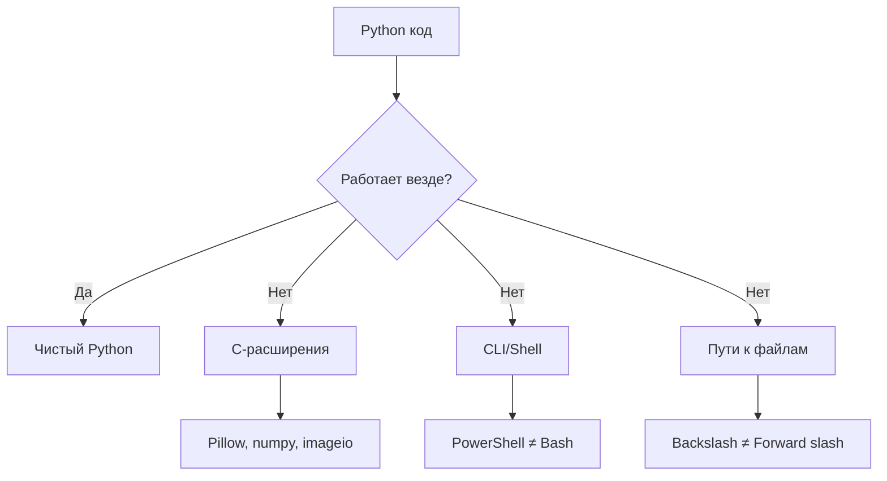
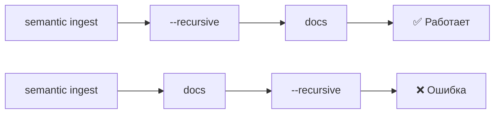
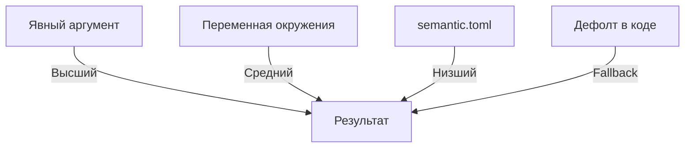
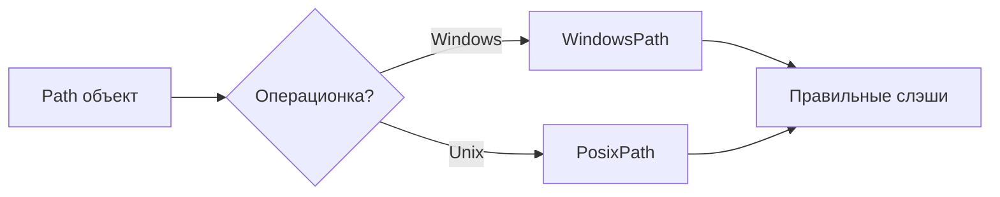
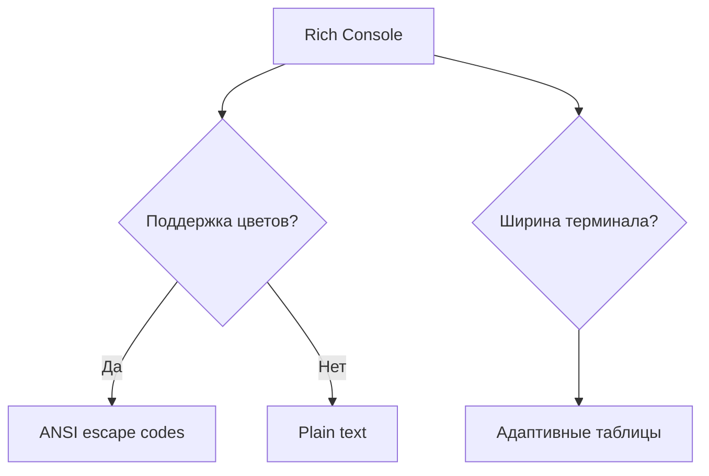

# 🪟 Cross-Platform Compatibility: Windows Support

> Semantic Core работает на Windows, macOS и Linux — но с нюансами

---

## 📌 Зачем это нужно?

Разработка велась на macOS, а большинство пользователей — на Windows.

**Проблема:** Казалось бы, Python кроссплатформенный. Но есть три слоя сложности:



---

## 🔍 Три типа проблем

### 1. C-расширения и версии Python

**Суть:** Пакеты с C-кодом (Pillow, imageio) требуют компиляции или pre-built wheels.

| Python | macOS | Linux | Windows |
|--------|-------|-------|---------|
| 3.13 | ✅ | ✅ | ✅ |
| 3.14 | ✅ | ✅ | ❌ |

Windows-пользователи обычно не имеют Visual Studio Build Tools. Без них — нет компиляции. Без компиляции — нужен wheel. Wheel для 3.14 ещё не собран.

**Решение:** Ограничить версию Python: `>=3.13,<3.15`

---

### 2. CLI-парсинг: Typer/Click

**Суть:** Порядок аргументов имеет значение!



**Почему?** Click интерпретирует `--recursive` после `docs` как подкоманду, а не опцию.

**Когда это происходит?** При использовании `invoke_without_command=True` в sub-Typer.

**Решение:** Документировать правило: **опции ПЕРЕД путём**.

---

### 3. Shell-различия

**Суть:** PowerShell — не Bash.

| Операция | Bash | PowerShell |
|----------|------|------------|
| Переменная окружения | `export VAR="val"` | `$env:VAR = "val"` |
| Подстановка команды | `$(cmd)` | `$(cmd)` ✅ |
| Путь к файлу | `/path/to/file` | `C:\path\to\file` |
| Разделитель | `:` (PATH) | `;` (PATH) |

**Решение:** В документации давать оба варианта.

---

## 🎯 Конфигурация: Pydantic Settings

### Префикс SEMANTIC_

Все переменные окружения требуют префикс:

```
GEMINI_API_KEY → ❌ Игнорируется
SEMANTIC_GEMINI_API_KEY → ✅ Читается
```

**Почему так?** Изоляция от других приложений. Если десять проектов используют `GEMINI_API_KEY`, будет хаос.

### Приоритет источников



Это позволяет:
1. Хранить дефолты в TOML
2. Переопределять в CI через env
3. Переопределять в коде для тестов

---

## 📊 Путь файла: Path vs строка

### Проблема

```python
# macOS/Linux
path = Path("/home/user/docs/file.md")

# Windows  
path = Path("C:\\Users\\user\\docs\\file.md")
```

### Решение в Semantic Core

`pathlib.Path` автоматически адаптируется:



Мы **никогда** не конкатенируем строки вручную. Всегда используем `Path / "subdir" / "file.txt"`.

---

## 🎨 Rich и цвета в терминале

### Проблема

Старый PowerShell (5.1) плохо поддерживает ANSI-цвета.

| Терминал | Цвета | Эмодзи |
|----------|-------|--------|
| PowerShell 5.1 | ⚠️ Частично | ⚠️ Частично |
| PowerShell 7 | ✅ | ✅ |
| Windows Terminal | ✅ | ✅ |
| cmd.exe | ❌ | ❌ |

### Решение

Rich автоматически определяет capabilities терминала:



Мы не делаем ничего специального — Rich справляется сам.

---

## ⚠️ Важные нюансы

### 1. Кодировка UTF-8

Windows по умолчанию использует локальную кодировку (Windows-1251 для русского). 

**Симптом:** Кракозябры вместо кириллицы в выводе.

**Решение:** 
- Использовать Windows Terminal
- Или: `[Console]::OutputEncoding = [System.Text.Encoding]::UTF8`

### 2. Антивирус и производительность

Windows Defender сканирует каждый файл при чтении/записи.

**Симптом:** Ingest медленнее на 15-25%.

**Решение:** Добавить папку проекта в исключения Defender.

### 3. Long paths

Windows имеет лимит 260 символов на путь.

**Симптом:** Ошибка при глубокой вложенности папок.

**Решение:** Включить Long Paths в реестре или использовать короткие пути.

---

## 🔗 Что почитать дальше

- **[CLI Architecture](41_cli_architecture.md)** — как устроен CLI
- **[Unified Configuration](40_unified_configuration.md)** — как работает SemanticConfig
- **[Phase 11 Report](../ideas/phase_11/report_phase_11_windows.md)** — детальный технический отчёт

---

**← [Вернуться к оглавлению](00_overview.md)**
