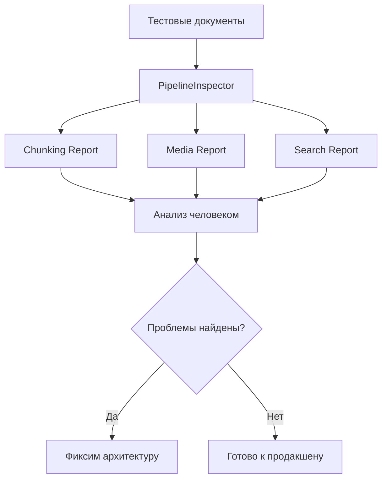

# 🔬 Phase 13: Total Visual Check — Концептуальный обзор

> Как мы проверяли систему на реальных данных

---

## 📌 Зачем нужен визуальный аудит?

**Проблема**: Unit-тесты проверяют, что код не падает, но не показывают **качество** работы.

Система может:
- ✅ Успешно разбить документ на чанки
- ✅ Отправить запрос в Gemini
- ✅ Вернуть результаты поиска

Но при этом:
- ❌ Чанки порезаны некорректно (обрывают предложения)
- ❌ Vision API не получает достаточно контекста
- ❌ Поиск возвращает нерелевантные результаты

**Решение**: Прогнать реальные данные через систему и сгенерировать **детальные отчёты** для ручного анализа.

---

## 🎯 Цели аудита

Проверить **3 критических сценария**:

| Сценарий | Что проверяем | Ожидаемый результат |
|----------|---------------|---------------------|
| **Chunking Inspection** | Как разбиваются документы | Чанки сохраняют смысл, контекст передаётся |
| **Media Processing** | Обработка изображений/аудио/видео | Vision/Audio API получают нужный контекст |
| **Search Quality** | Релевантность поиска | Гибридный поиск находит нужные документы |

---

## 🏗️ Архитектура аудита



**Ключевая идея**: Не изменяем код системы, а **перехватываем** промежуточные данные через `Inspector`.

---

## 🔧 Инструментарий

### Session-Scoped AuditCollector

**Проблема старого подхода**: Каждый тест создавал свой `PipelineInspector`, отчёты терялись.

**Решение**: Session-scoped fixture для агрегации данных:

```python
class AuditCollector:
    """Глобальный коллектор данных для всей сессии pytest."""
    
    def __init__(self):
        self.reports = {
            "chunks": [],    # Все чанки
            "media": [],     # Все медиа-анализы
            "searches": []   # Все поисковые запросы
        }
    
    def add_report(self, chunk_data):
        """Сохраняет данные о чанке."""
        self.reports["chunks"].append(chunk_data)
```

**Результат**: Один отчёт для всех 16 тестов, 308 KB данных.

---

## 📊 Структура тестовых данных

### Входные данные

```
tests/asests/
├── sample_article.txt           # Простой текст (эмбеддинги, векторный поиск)
├── nested_headers_example.md    # MD с вложенными заголовками
├── mixed_content_example.md     # MD с кодом, формулами, цитатами
├── cat_photo.png                # Фото животного (Vision API)
├── eiffel_tower.jpg             # Достопримечательность
├── code_screen.png              # Скриншот кода (OCR)
├── slides_ideas_audio.ogg       # Русская речь (транскрипция)
├── module_init_demo.mp4         # Видео с кодом (OCR + Audio)
└── new_year_greeting.mp4        # Русское видео (транскрипция)
```

### Выходные отчёты

```
tests/audit_reports/2025-12-05_13-47-30/
├── 01_chunking_audit.md         # 173 KB — все чанки с векторами
├── 02_media_audit.md            # 37 KB — 6 медиа с промптами
└── 03_search_audit.md           # 98 KB — 14 запросов с результатами
```

---

## 🧪 Сценарий 1: Chunking Inspection

**Задача**: Визуализировать, как `SmartSplitter` и `MarkdownNodeParser` нарезают документы.

### Что проверяем

1. **Размер чанков** — не слишком ли маленькие/большие?
2. **Сохранение контекста** — передаются ли заголовки?
3. **Правильность парсинга** — определён ли язык кода?
4. **Векторы** — генерируются ли эмбеддинги для всех чанков?

### Формат отчёта

Для каждого файла:

```markdown
# File: `sample_article.txt`
Total Chunks: 7

---
### Chunk #1 [text] 📝
**Size:** 355 chars
**Content:** Семантический поиск и векторные базы данных...

**Vector Context (sent to embedder):**
Content:
Семантический поиск и векторные базы данных...

**Embedding:** [-0.053591, -0.004871, ...]
**Dimension:** 768
```

### Что видим в отчёте

| Метрика | Значение | Оценка |
|---------|----------|--------|
| Всего файлов | 13 | ✅ Все обработаны |
| Всего чанков | 127 | ✅ Приемлемо |
| Размер чанков | 45-800 символов | ⚠️ Разброс большой |
| Векторы | 768D для каждого | ✅ Все сгенерированы |

**Проблема #1**: Маленькие чанки (45 символов) — слишком мало контекста.

---

## 🎬 Сценарий 2: Media Processing Debug

**Задача**: Проверить, что Vision/Audio API получают достаточно контекста.

### Что проверяем

1. **Окружающий текст** — попадает ли он в промпт?
2. **System Prompt** — правильный ли инструктаж для модели?
3. **User Prompt** — кастомизирован ли он под тип медиа?
4. **Raw Response** — что модель вернула (без парсинга)?
5. **Final Chunk** — как это сохранено в базу?

### Формат отчёта

Для каждого медиа-файла:

```markdown
# Media #1: `cat_photo.png`
**Type:** IMAGE
**Processing Time:** 3446.46 ms
**Model:** gemini-2.5-flash-lite

## 1. Surrounding Context
**Text Before:**
> A personal photo from a pet blog

## 2. LLM Request
**System Prompt:** "You are an image analyst..."
**User Prompt:** "Describe this pet photo for a family album."

## 3. Raw API Response
{
  "description": "This close-up portrait captures a tabby cat...",
  "keywords": ["cat", "tabby cat", "pet", "golden hour", ...]
}

## 5. Final Chunk Content
[IMAGE: cat_photo.png]

This close-up portrait captures a tabby cat in profile...

Keywords: cat, tabby cat, pet, golden hour, sunset, green eyes
```

### Что видим в отчёте

| Тип медиа | Файлов | Время обработки | API вызовов |
|-----------|--------|-----------------|-------------|
| IMAGE | 3 | 2.2-3.4 сек | 3 Vision |
| AUDIO | 1 | 8.2 сек | 1 Audio |
| VIDEO | 2 | 10-13 сек | 2 Multimodal |

**Проблема #2**: Видео 30 секунд обрабатывается 13 секунд. Час видео = ?

---

## 🔍 Сценарий 3: Search Quality Check

**Задача**: Проверить релевантность выдачи после индексации.

### Что проверяем

1. **Vector Search** — находит ли похожие по смыслу тексты?
2. **Hybrid Search (RRF)** — улучшает ли результаты?
3. **Поиск по коду** — работает ли семантика для кода?
4. **Поиск по медиа** — находятся ли описания картинок?

### Формат отчёта

Для каждого запроса:

```markdown
# Search #1
**Query:** `семантический поиск эмбеддинги`
**Mode:** hybrid
**Time:** 596.18 ms
**Results Found:** 5

**Query Vector:** [-0.061142, 0.010694, ...]

## Results
### #1
- **Score:** 0.032787
- **Match Type:** hybrid
- **Document ID:** 1
- **Content:** Семантический поиск и векторные базы данных...
```

### Что видим в отчёте

| Режим поиска | Кол-во запросов | Средний Score | Время |
|--------------|-----------------|---------------|-------|
| `hybrid` | 10 | 0.032 | ~600 ms |
| `vector` | 4 | 0.70 | ~610 ms |

**Проблема #3**: Гибридный поиск даёт **в 20 раз ниже** score, чем векторный!

---

## 📝 Критерии проверки (для человека)

После генерации отчётов анализируем вручную:

### Chunking Report

- [ ] Не обрываются ли предложения посередине?
- [ ] Правильно ли определён язык кода?
- [ ] Передаются ли заголовки в векторный контекст?
- [ ] Нет ли дубликатов чанков?

### Media Report

- [ ] Попадает ли соседний текст в промпт?
- [ ] Адекватно ли описание от Vision API?
- [ ] Нет ли галлюцинаций в OCR?
- [ ] Качество транскрипции аудио?

### Search Report

- [ ] Находится ли нужный документ первым?
- [ ] Работает ли поиск по коду?
- [ ] Находит ли описания картинок?
- [ ] Релевантны ли все 5 результатов?

---

## ⚙️ Технические детали

### Перехват промежуточных данных

**Паттерн**: `PipelineInspector` обёртка без изменения `SemanticCore`.

```python
class PipelineInspector:
    """Прозрачный инспектор пайплайна."""
    
    def __init__(self, semantic_core, collector):
        self.core = semantic_core
        self.collector = collector
    
    def ingest_with_inspection(self, doc, mode="sync"):
        # Вызываем оригинальный метод
        result = self.core.ingest(doc, mode=mode)
        
        # Перехватываем данные
        for chunk in result.chunks:
            self.collector.add_report({
                "content": chunk.content,
                "embedding": chunk.embedding,
                "metadata": chunk.metadata,
            })
        
        return result
```

### Session-Scoped Fixtures

```python
@pytest.fixture(scope="session")
def audit_collector(tmp_path_factory):
    """Глобальный коллектор на всю сессию pytest."""
    collector = AuditCollector()
    
    # Сохранение отчётов после всех тестов
    yield collector
    
    # Teardown: генерируем markdown-файлы
    generate_reports(collector.reports)
```

---

## 🔗 Следующий шаг

В [следующей части](56_phase_13_audit_part2.md) разберём **результаты аудита** детально →

**Темы**:
- Что работает хорошо? ✅
- Какие проблемы нашли? ❌
- Метрики и статистика 📊
