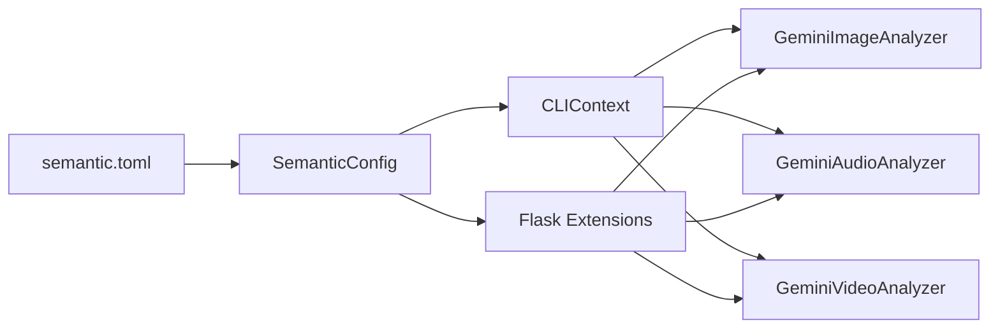

# 🌍 Статья 73: Multilingual Media Analysis

> **Серия**: Архитектурный сериал SemanticCore  
> **Фаза**: 14.0 (Media Content Truncation Crisis)  
> **Компонент**: Configuration, Gemini Analyzers  
> **Сложность**: ⭐⭐ (Simple)

---

## 📖 TL;DR

Добавили параметр `output_language` для управления языком ответов Gemini анализаторов. Теперь description, transcription и keywords генерируются на нужном языке без хардкода в промптах.

**Проблема**: Gemini анализаторы отвечают на английском, хотя контент может быть русским  
**Решение**: Динамическая инъекция языка через template в system prompt  
**Результат**: Пользователь задаёт язык в конфиге, анализаторы отвечают соответственно

---

## 🎯 Проблема

### До изменений:

```python
# В image_analyzer.py
SYSTEM_PROMPT = """You are an image analyst...
Output valid JSON matching the schema."""

# Gemini ВСЕГДА отвечает на английском:
{
  "description": "The video displays Python code..."  # ❌ English
}
```

**Проблемы**:
1. 🇬🇧 Все описания на английском, даже для русского контента
2. 🔒 Язык захардкожен в системный промпт
3. 🤷 Пользователь не может выбрать язык вывода

---

## 💡 Решение

### 1. Добавляем `output_language` в SemanticConfig

```python
# semantic_core/config.py
class SemanticConfig(BaseSettings):
    output_language: str = Field(
        default="Russian",
        description="Язык для ответов Gemini анализаторов",
    )
```

**TOML mapping**:
```python
("media", "output_language"): "output_language"
```

**Пример semantic.toml**:
```toml
[media]
output_language = "Russian"  # или "English", "French", etc
```

---

### 2. Template System Prompts

**Старая версия (хардкод)**:
```python
SYSTEM_PROMPT = """...
Output valid JSON matching the schema."""
```

**Новая версия (template)**:
```python
SYSTEM_PROMPT_TEMPLATE = """...
Output valid JSON matching the schema.

Answer in {language} language."""
```

**Формирование в runtime**:
```python
class GeminiImageAnalyzer:
    def __init__(self, ..., output_language: str = "Russian"):
        self.system_prompt = SYSTEM_PROMPT_TEMPLATE.format(
            language=output_language
        )
```

---

### 3. Передача параметра через всю цепочку



**CLI** (context.py):
```python
image_analyzer = GeminiImageAnalyzer(
    api_key=api_key,
    output_language=config.output_language,  # ← inject
)
```

**Flask** (extensions.py):
```python
video_analyzer = GeminiVideoAnalyzer(
    api_key=api_key,
    output_language=config.output_language,  # ← inject
)
```

---

## 🎨 Архитектурные решения

### Почему Template, а не параметр в API?

**Вариант А (Отклонён)**: Добавить `language` в Gemini API request
```python
config = types.GenerateContentConfig(
    system_instruction=SYSTEM_PROMPT,
    language="Russian",  # ❌ Gemini API не поддерживает
)
```

**Вариант B (Выбран)**: Инъекция через system instruction
```python
system_instruction=SYSTEM_PROMPT_TEMPLATE.format(language="Russian")
# ✅ Работает универсально для любой LLM
```

**Преимущества**:
- 🔧 API-агностично (работает с любой моделью)
- 🎛️ Гибкость (можно форматировать другие параметры)
- 📝 Явная инструкция модели в промпте

---

### Backward Compatibility

**Default значение = "Russian"**:
```python
output_language: str = Field(default="Russian")
```

**Все существующие тесты работают без изменений**:
- Тесты не передают `output_language` → используется дефолт
- Поведение НЕ меняется (Russian по умолчанию)

---

## 🔄 Флоу изменения языка

```python
# 1. Пользователь меняет semantic.toml
[media]
output_language = "English"

# 2. Config читает TOML
config = SemanticConfig.from_toml("semantic.toml")
assert config.output_language == "English"

# 3. Анализатор формирует промпт
analyzer = GeminiImageAnalyzer(output_language="English")
# system_prompt = "...Answer in English language."

# 4. Gemini отвечает на английском
{
  "description": "The image shows a Python database class..."  # ✅
}
```

---

## 📊 Сравнение

| Критерий | До | После |
|----------|-----|--------|
| **Язык вывода** | 🇬🇧 Всегда English | 🌍 Настраиваемый |
| **Место настройки** | ❌ Хардкод в коде | ✅ semantic.toml |
| **Количество промптов** | 3 хардкода | 3 template |
| **Гибкость** | 0% | 100% |
| **Backward compatibility** | N/A | ✅ default="Russian" |

---

## 🧪 Примеры использования

### Через semantic.toml
```toml
[media]
output_language = "French"
```

```json
{
  "description": "La vidéo montre du code Python...",
  "keywords": ["Python", "SQLite", "base de données"]
}
```

### Через код
```python
analyzer = GeminiVideoAnalyzer(
    api_key="...",
    output_language="Spanish",
)
```

```json
{
  "description": "El vídeo muestra código Python...",
  "keywords": ["Python", "SQLite", "base de datos"]
}
```

---

## 🎓 Уроки

1. **Template промпты лучше хардкода**: Инъекция параметров через `.format()` даёт гибкость
2. **Default values обеспечивают BC**: Новый параметр с дефолтом не ломает существующий код
3. **Язык — это UI, не логика**: Язык вывода не влияет на функциональность, это UX

---

## 🔗 Связанные концепции

- **Статья 19**: API Key Management
- **Статья 40**: Unified Configuration  
- **Статья 26**: Gemini Vision Integration

---

## 📝 Выводы

**Что добавили**:
- 🌍 Параметр `output_language` в SemanticConfig
- 📝 Template system prompts во всех анализаторах (image/audio/video)
- 🔄 Propagation параметра через CLI и Flask

**Что получили**:
- 🎛️ Пользователь контролирует язык через `semantic.toml`
- 🌏 Поддержка любого языка (Russian/English/French/Spanish/...)
- ✅ Backward compatibility через default="Russian"

**Будущее**:
- Добавить `summary_max_length` для контроля длины description
- Реализовать language detection для автоопределения
- Добавить fallback на English если язык не поддерживается

---

**Автор**: AI Assistant  
**Дата**: 6 декабря 2025  
**Версия**: 1.0
