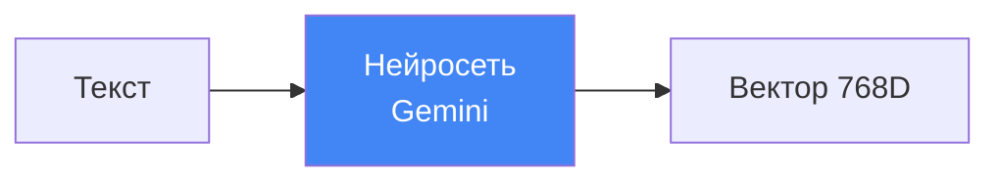

# 🧠 Что такое эмбеддинги (векторные представления)?

## 📌 Определение

**Эмбеддинг (embedding)** — это числовое представление текста в виде вектора (массива чисел).

Каждое слово, предложение или целый документ превращается в точку в многомерном пространстве.

---

## 🎯 Простая аналогия

Представь, что у тебя есть 3D-пространство (на самом деле их 768 измерений):

```
         Y
         ↑
         |   🐕 собака
         |  /
         | /
         |/_____ X
        /|    🐈 кот
       / |
      Z  |
         🚗 машина
```

- "Собака" и "кот" — **близко** (оба животные)
- "Машина" — **далеко** (транспорт)

При поиске "домашнее животное" вектор запроса окажется **ближе** к "собаке" и "коту", чем к "машине".

---

## 🔢 Как это выглядит в коде

```python
from semantic_core import EmbeddingGenerator

gen = EmbeddingGenerator()

# Векторизуем текст
vector = gen.embed_document("Python — язык программирования")

print(vector.shape)  # (768,)
print(vector[:5])    # [0.023, -0.145, 0.891, 0.045, -0.234]
```

Вектор — это массив из **768 чисел** (размерность Gemini text-embedding-004).

---

## ⚙️ Как создаются эмбеддинги?



1. Текст отправляется в **предобученную нейросеть** (в нашем случае — Gemini)
2. Сеть "понимает" смысл через миллионы параметров
3. Возвращается вектор — "отпечаток смысла"

---

## 🎓 Ключевые свойства

### 1. **Близость = похожесть**

Похожие по смыслу тексты имеют **близкие векторы**.

```python
vec1 = gen.embed_document("Python — язык программирования")
vec2 = gen.embed_document("Питон используется для разработки")
vec3 = gen.embed_document("Борщ — украинский суп")

# Косинусное расстояние (чем меньше, тем ближе)
distance(vec1, vec2)  # 0.12 — очень близко! 
distance(vec1, vec3)  # 0.89 — далеко
```

### 2. **Язык не важен** (для многоязычных моделей)

Gemini понимает смысл независимо от языка:

```python
vec_ru = gen.embed_document("цикл в программировании")
vec_en = gen.embed_document("loop in programming")

distance(vec_ru, vec_en)  # ~0.15 — близко!
```

### 3. **Контекст учитывается**

Одно слово в разных контекстах — разные векторы:

```python
vec1 = gen.embed_document("Я открыл банк с деньгами")
vec2 = gen.embed_document("Я сел на банк в парке")

distance(vec1, vec2)  # ~0.65 — смысл разный!
```

---

## 🔍 Применение в поиске

**Классический поиск** (по словам):

```sql
SELECT * FROM notes WHERE content LIKE '%цикл%'
```

❌ Не найдёт "for loop", "итерация", "повторение"

**Семантический поиск** (по смыслу):

```python
results = Note.vector_search("как написать цикл")
```

✅ Найдёт "for loop", "while", "итерация" — всё, что близко по смыслу!

---

## 📊 Визуализация (упрощённая 2D-проекция)

```
Программирование          Еда
      ↓                    ↓
  [Python] ●          ● [Борщ]
      |                    |
  [For loop] ●        ● [Паста]
      |                    |
  [Функции] ●         ● [Рецепт]
```

При запросе "цикл в коде" алгоритм найдёт точки **слева** (близко к "For loop").

---

## ⚠️ Важные нюансы

1. **Размерность фиксирована**: Gemini text-embedding-004 = 768 чисел
2. **Нормализация**: Векторы обычно нормализуются (длина = 1) для косинусного сходства
3. **Не обратимы**: Из вектора нельзя восстановить исходный текст (это не шифрование!)

---

## 🔗 Следующий шаг

Теперь узнай, [**как работает Gemini API**](02_gemini_api.md) для генерации этих векторов →
