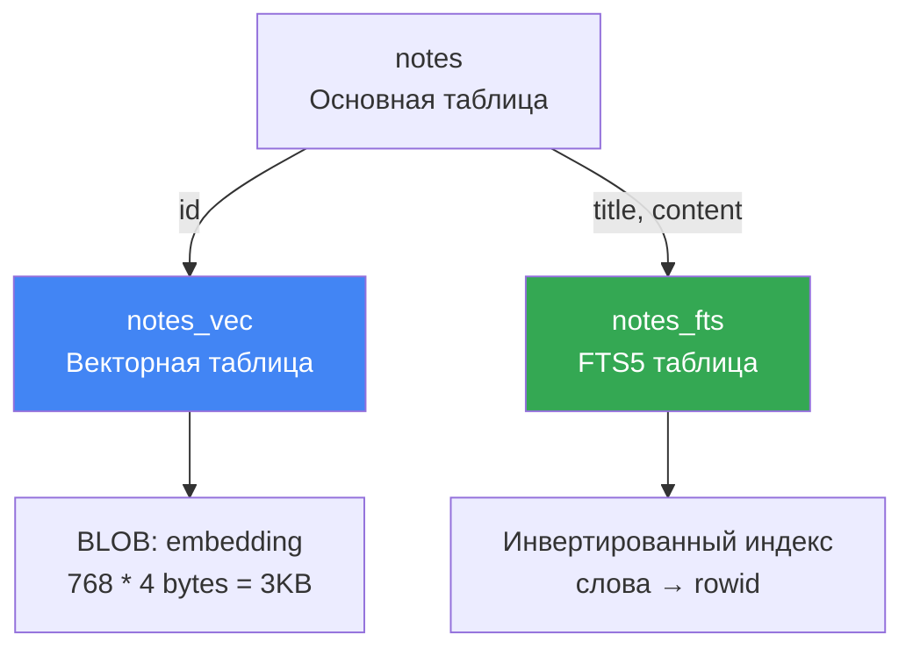

# 💾 SQLite-Vec: хранение векторов в базе данных

## 📌 Что такое sqlite-vec?

**sqlite-vec** — это расширение для SQLite, написанное на чистом C, которое добавляет поддержку векторного поиска.

🔗 **GitHub**: [asg017/sqlite-vec](https://github.com/asg017/sqlite-vec)

---

## 🎯 Зачем нужно расширение?

SQLite **не умеет** работать с векторами из коробки:

- ❌ Нет типа данных "вектор"
- ❌ Нет функций косинусного расстояния
- ❌ Нет индексов для быстрого поиска

**sqlite-vec** добавляет всё это!

---

## 📦 Установка и загрузка

### 1. Установка через pip

```bash
poetry add sqlite-vec
```

### 2. Загрузка в SQLite

```python
# semantic_core/database.py
import sqlite3
import sqlite_vec

conn = sqlite3.connect("database.db")
conn.enable_load_extension(True)
sqlite_vec.load(conn)  # ← Загружаем расширение
conn.enable_load_extension(False)
```

**Автоматически** при каждом подключении (реализовано в `VectorDatabase`):

```python
class VectorDatabase(SqliteExtDatabase):
    def _add_conn_hooks(self, conn: sqlite3.Connection):
        super()._add_conn_hooks(conn)
        conn.enable_load_extension(True)
        sqlite_vec.load(conn)
        conn.enable_load_extension(False)
```

---

## 🗂️ Виртуальная таблица vec0

### Создание таблицы для векторов

```sql
CREATE VIRTUAL TABLE notes_vec USING vec0(
    id INTEGER PRIMARY KEY,
    embedding FLOAT[768]  -- 768-мерный вектор
);
```

**В коде**:

```python
# semantic_core/database.py
def create_vector_table(model_class, vector_column="embedding"):
    table_name = model_class._meta.table_name
    vector_table_name = f"{table_name}_vec"
    
    db.obj.execute_sql(f"""
        CREATE VIRTUAL TABLE IF NOT EXISTS {vector_table_name} 
        USING vec0(
            id INTEGER PRIMARY KEY,
            {vector_column} FLOAT[{settings.embedding_dimension}]
        )
    """)
```

---

## 💾 Хранение векторов: BLOB-формат

### Сериализация numpy → BLOB

```python
# semantic_core/embeddings.py
import numpy as np

vector = np.array([0.1, 0.2, 0.3], dtype=np.float32)

# Конвертация в бинарный формат
blob = vector.tobytes()
# b'\xcd\xcc\xcc=\xcd\xcc\xcc=\x9a\x99\x99>'

# Сохранение в БД
db.execute_sql(
    "INSERT INTO notes_vec (id, embedding) VALUES (?, ?)",
    (note_id, blob)
)
```

### Десериализация BLOB → numpy

```python
# Чтение из БД
cursor = db.execute_sql("SELECT embedding FROM notes_vec WHERE id = ?", (note_id,))
blob = cursor.fetchone()[0]

# Восстановление вектора
vector = np.frombuffer(blob, dtype=np.float32)
# array([0.1, 0.2, 0.3], dtype=float32)
```

---

## 🔍 Поиск по векторам

### Косинусное расстояние

```sql
SELECT 
    main.id,
    vec_distance_cosine(vec.embedding, ?) as distance
FROM notes main
INNER JOIN notes_vec vec ON main.id = vec.id
ORDER BY distance ASC
LIMIT 10;
```

**Параметры**:

- `?` — BLOB запроса (векторизованный текст поиска)
- `distance` — чем **меньше**, тем **ближе** (0 = идентично, 1 = противоположно)

---

## 📊 Структура хранения



**Три таблицы для одной модели**:

1. `notes` — основные данные (title, content, category_id)
2. `notes_vec` — векторы для семантического поиска
3. `notes_fts` — полнотекстовый индекс для keyword-поиска

---

## ⚙️ Функции sqlite-vec

### Доступные метрики расстояния

```sql
-- Косинусное расстояние (используем)
vec_distance_cosine(vec1, vec2)

-- Евклидово расстояние
vec_distance_l2(vec1, vec2)

-- Расстояние Манхэттена
vec_distance_l1(vec1, vec2)
```

**Наш выбор**: `cosine` — стандарт для текстовых эмбеддингов.

### Вспомогательные функции

```sql
-- Длина вектора
vec_length(embedding)  -- 768

-- Нормализация (встроенная)
vec_normalize(embedding)
```

---

## 🎓 Пример полного цикла

### 1. Добавление заметки

```python
# domain/models.py
note = Note.create(
    title="Циклы в Python",
    content="for и while — основные циклы"
)

# Генерация эмбеддинга
gen = EmbeddingGenerator()
vector = gen.embed_document(note.get_search_text())
blob = gen.vector_to_blob(vector)

# Сохранение в векторную таблицу
db.obj.execute_sql(
    "INSERT INTO notes_vec (id, embedding) VALUES (?, ?)",
    (note.id, blob)
)
```

### 2. Поиск

```python
# Векторизация запроса
query_vector = gen.embed_query("как написать цикл?")
query_blob = gen.vector_to_blob(query_vector)

# SQL-запрос
sql = """
    SELECT main.id, vec_distance_cosine(vec.embedding, ?) as distance
    FROM notes main
    INNER JOIN notes_vec vec ON main.id = vec.id
    ORDER BY distance ASC
    LIMIT 5
"""

cursor = db.obj.execute_sql(sql, (query_blob,))
results = cursor.fetchall()
# [(1, 0.12), (2, 0.34), (3, 0.56), ...]
```

---

## 📏 Размер данных

Для **768-мерного вектора** (float32):

```
768 чисел × 4 байта = 3072 байта = ~3 КБ на вектор
```

**Пример для 10,000 заметок**:

```
10,000 векторов × 3 КБ = 30 МБ
```

Очень компактно для локальной базы!

---

## ⚠️ Ограничения

1. **Нет индексов** (в текущей версии)
   - Поиск — **линейный** (O(n))
   - Для >100К записей может быть медленно
   - Для POC и средних проектов — отлично!

2. **Только float32**
   - Векторы должны быть `np.float32` (не float64)

3. **Фиксированная размерность**
   - Все векторы должны быть одной длины (768 в нашем случае)

---

## 🚀 Производительность

### Тесты на MacBook M1

| Количество векторов | Время поиска |
|---------------------|--------------|
| 1,000               | ~10 ms       |
| 10,000              | ~50 ms       |
| 100,000             | ~300 ms      |

**Для сравнения**: PostgreSQL + pgvector с HNSW-индексом — ~2-5 ms на 100K.

**Вывод**: Для малых/средних проектов sqlite-vec **достаточно быстр**!

---

## 🔗 Следующий шаг

Теперь узнай, [**какие типы поиска существуют**](04_search_types.md) →
