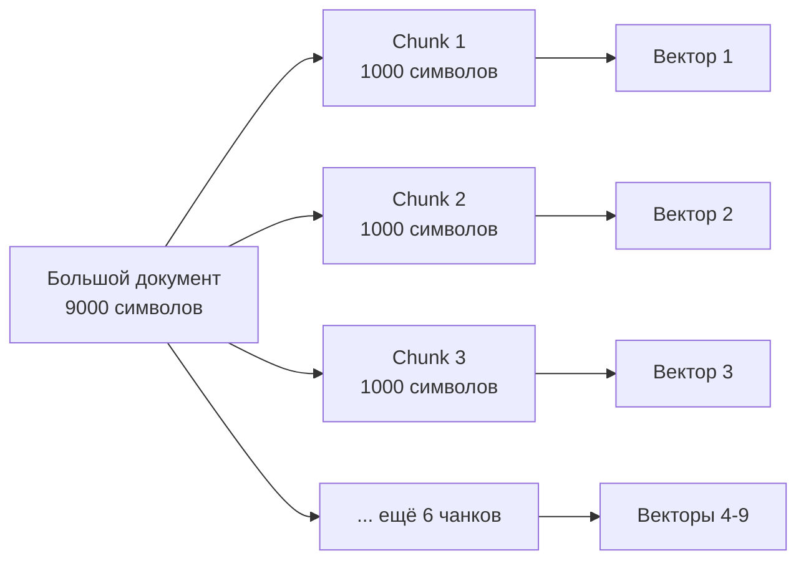
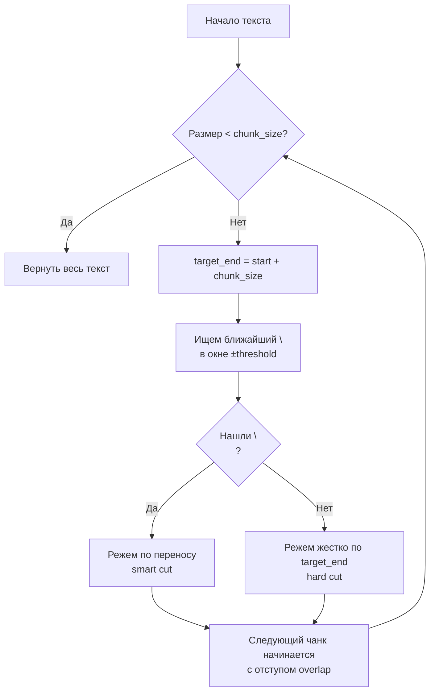

# ✂️ Стратегия нарезки текста (Chunking)

> Почему нужно резать документы на куски и как это делать правильно

---

## 🎯 Проблема: лимит 2000 токенов

**Gemini embedding model** (models/text-embedding-004) имеет жесткое ограничение:

```
Максимум: 2000 токенов на один запрос
```

**Что такое токен?**

- Примерно 1 токен ≈ 0.75 слова (для английского)
- Примерно 1 токен ≈ 0.5 слова (для русского, из-за кириллицы)

**Сколько это символов?**

| Язык | Токенов | Символов (примерно) |
|------|---------|---------------------|
| Английский | 2000 | ~6000-8000 |
| Русский | 2000 | ~4000-5000 |
| Код Python | 2000 | ~5000-7000 |

**Реальные примеры:**

- Эта страница документации: ~1500 символов → **вмещается**
- Документ `07_data_flow.md`: ~9000 символов → **НЕ вмещается!**

---

## 💡 Решение: chunking (нарезка)

Разбиваем большой документ на маленькие кусочки (chunks), каждый из которых векторизуем отдельно.



---

## 🔧 SimpleTextSplitter: "тупой как пробка"

Наша реализация следует принципу **KISS** (Keep It Simple, Stupid):

### Параметры

```python
SimpleTextSplitter(
    chunk_size=1000,    # Целевой размер куска (символы)
    overlap=200,        # Перекрытие между кусками
    threshold=100       # Окно поиска переноса строки
)
```

### Алгоритм



### Умная нарезка (smart cut)

```python
text = """
Первый параграф.

Второй параграф с важной информацией.

Третий параграф.
"""

# Цель: разрез на позиции 50
# Окно поиска: [40, 60] (±10 от цели)
# Найден перенос на позиции 54 → режем там!
```

**Результат:**

```
Chunk 1: "Первый параграф.\n\nВторой параграф с важной..."
                                                        ↑
                                             smart cut здесь
```

### Перекрытие (overlap)

Зачем нужно перекрытие? Чтобы **не потерять контекст** на границах!

```
Текст: "Python — это язык программирования. Он используется для..."
                                          ↑
                           граница чанка без overlap

Chunk 1: "Python — это язык программир"
Chunk 2: "ания. Он используется для..."
         ❌ Потеряли связь между предложениями!
```

**С overlap=20:**

```
Chunk 1: "Python — это язык программирования. Он"
Chunk 2:                  "ирования. Он используется для..."
                          ↑
                   перекрытие 20 символов
         ✅ Контекст сохранен!
```

---

## 📊 Метаданные чанков

Каждый чанк содержит метаданные для отладки:

```python
@dataclass
class Chunk:
    text: str                    # Текст чанка
    index: int                   # Порядковый номер (0, 1, 2...)
    metadata: Dict[str, Any]     # Метаданные
```

**Пример metadata:**

```json
{
  "start": 0,
  "end": 1024,
  "cut_type": "newline",  // или "hard"
  "is_last": false
}
```

---

## 🎨 Примеры нарезки

### Пример 1: Короткий текст

```python
splitter = SimpleTextSplitter(chunk_size=1000)
text = "Короткая заметка"

chunks = splitter.split_text(text)
# Результат: 1 чанк (весь текст)
```

### Пример 2: Длинный документ

```python
text = """
# Документ на 5000 символов
... много текста ...
"""

chunks = splitter.split_text(text)
# Результат: 5-6 чанков по ~1000 символов
```

### Пример 3: Код Python

```python
text = open("main.py").read()  # 3500 символов

chunks = splitter.split_text(text)
# Результат: 
# Chunk 0: imports + первая функция
# Chunk 1: вторая функция (перекрытие с первой)
# Chunk 2: третья функция
# Chunk 3: остаток кода
```

---

## ⚠️ Ограничения

### Что НЕ умеет SimpleTextSplitter

1. **Не понимает структуру Markdown**

   ```markdown
   # Заголовок
   Текст параграфа
   ```

   Может разрезать прямо посреди заголовка!

2. **Не понимает код**

   ```python
   def function():
       # Может разрезать здесь →
       return value
   ```

3. **Не учитывает семантику**
   - Не знает, что это предложение связано с предыдущим
   - Режет только по переносам строк

### Когда этого достаточно?

✅ **Годится для:**

- Обычного текста (статьи, заметки)
- Документации
- README файлов
- Логов

❌ **Плохо работает с:**

- Кодом (лучше использовать AST-парсер)
- Markdown (лучше резать по заголовкам)
- JSON/XML (лучше по элементам структуры)

---

## 🔮 Альтернативы (для будущего)

Благодаря абстракции `TextSplitter`, можно легко заменить реализацию:

### MarkdownSplitter (гипотетический)

```python
class MarkdownSplitter(TextSplitter):
    """Режет по заголовкам Markdown."""
    
    def split_text(self, text: str) -> List[Chunk]:
        # Парсим Markdown
        # Режем по # заголовкам
        # Сохраняем иерархию
        pass
```

### CodeAwareSplitter (гипотетический)

```python
class CodeAwareSplitter(TextSplitter):
    """Режет Python код по функциям/классам."""
    
    def split_text(self, text: str) -> List[Chunk]:
        # Парсим с помощью ast.parse()
        # Режем по функциям и классам
        # Сохраняем импорты в каждом чанке
        pass
```

---

## 📈 Статистика из нашего POC

Реальные данные из `doc/architecture/`:

| Документ | Символы | Чанков | Avg размер чанка |
|----------|---------|--------|------------------|
| 00_overview.md | 2009 | 3 | 670 |
| 01_embeddings_basics.md | 3477 | 4 | 869 |
| 02_gemini_api.md | 5397 | 6 | 899 |
| 07_data_flow.md | 9022 | 11 | 820 |

**Выводы:**

- Среднее: 6.8 чанков на документ
- Средний размер чанка: ~820 символов (< 1000 ✅)
- Самый большой документ: 9022 символа → 11 чанков

---

## 🎯 Рекомендации

### Настройка chunk_size

```python
# Для коротких заметок
SimpleTextSplitter(chunk_size=500, overlap=100)

# Для статей (по умолчанию)
SimpleTextSplitter(chunk_size=1000, overlap=200)

# Для больших документов
SimpleTextSplitter(chunk_size=1500, overlap=300)
```

### Настройка overlap

```
Правило большого пальца: overlap = 20% от chunk_size
```

- Слишком маленький → теряем контекст
- Слишком большой → дублируем данные

### Настройка threshold

```
Обычно: threshold = 10% от chunk_size
```

- Больше → больше шансов найти перенос (меньше hard cuts)
- Меньше → более предсказуемый размер чанков

---

**← [Назад к оглавлению](00_overview.md)**

**→ [Дальше: Parent-Child Retrieval](09_parent_child_retrieval.md)**
