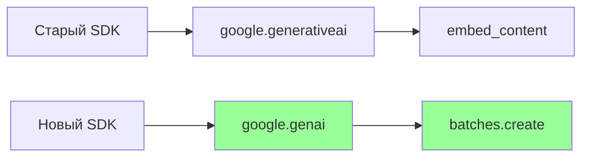

# 🔄 Batch API: От заглушки к реальности

> Как GeminiBatchClient превратился из NotImplementedError в работающую интеграцию

---

## 📌 Что это такое?

**Phase 10** — это реализация реального Google Batch API вместо заглушки из Phase 5. 

Phase 5 создала архитектуру (BatchManager, BatchJobModel, статусы чанков), но сам клиент возвращал `NotImplementedError`.

Phase 10 заменила заглушку работающим кодом и обнаружила неожиданные препятствия.

---

## 🎯 Зачем это нужно?

**Проблема:** Batch API обещает 50% экономию, но не работает.

| Компонент | Phase 5 | Phase 10 |
|-----------|---------|----------|
| `BatchJobModel` | ✅ Готов | ✅ Без изменений |
| `BatchManager` | ✅ Готов | ✅ Без изменений |
| `GeminiBatchClient` | ❌ Заглушка | ✅ Работает |

**Решение:** Реализовать три метода клиента с реальным Google API.

---

## 🔍 Что пошло не так?

### Проблема 1: Другой SDK



Batch API доступен **только** в новом SDK `google-genai`. 
Старый `google-generativeai` его не поддерживает.

---

### Проблема 2: Другой формат JSONL

| Аспект | Ожидание (Phase 5) | Реальность |
|--------|-------------------|------------|
| ID чанка | `custom_id` | `key` |
| Контент | `content` (объект) | `contents` (массив!) |
| Конфигурация | Вне запроса | Внутри `request.config` |

**Критично:** `content` vs `contents` — одна буква, но API молча отклоняет неправильный формат.

---

### Проблема 3: Модель не поддерживает Batch API

```
400 INVALID_ARGUMENT: Model does not support asyncBatchEmbedContent
```

**Открытие:** `text-embedding-004` не работает с Batch API!

| Модель | Sync | Batch |
|--------|------|-------|
| `text-embedding-004` | ✅ | ❌ |
| `gemini-embedding-001` | ✅ | ✅ |

**Решение:** Перейти на `gemini-embedding-001`.

---

## 📊 Сравнение моделей

### Качество поиска

| Запрос | text-embedding-004 | gemini-embedding-001 | Разница |
|--------|-------------------|---------------------|---------|
| SQL оптимизация | 0.59 | 0.67 | **+14%** |
| Кэширование | 0.48 | 0.51 | **+6%** |
| Безопасность | 0.56 | 0.62 | **+10%** |

**Неожиданно:** `gemini-embedding-001` оказалась **качественнее**!

---

### Размерность и MRL

`gemini-embedding-001` по умолчанию даёт 3072-мерные вектора.

Но поддерживает **Matryoshka Representation Learning**:

| Размерность | Качество | Память |
|-------------|----------|--------|
| 3072 | 100% | 100% |
| 768 | ~98% | 25% |
| 256 | ~94% | 8% |

**Решение:** Использовать `output_dimensionality=768` — совместимо с существующей схемой.

---

### Совместимость моделей

**Критический тест:** Можно ли смешивать эмбеддинги?

```
Cross-model similarity: -0.05
```

**Ответ: НЕТ.** Это хуже случайного шума!

**Вывод:** При смене модели нужна полная переиндексация.

---

## ⚠️ Важные нюансы

### 1. Два SDK сосуществуют

```python
# embedder.py (sync)
import google.generativeai as genai

# batching.py (batch)
from google import genai
```

Это разные пакеты, но могут работать вместе в одном проекте.

---

### 2. Специализированный метод для embeddings

Вместо универсального `batches.create()` есть `batches.create_embeddings()`:

- Поддерживает `inlined_requests` — без загрузки файлов
- Упрощённая структура ответа
- Меньше шагов интеграции

---

### 3. Результаты в другом месте

Для embeddings batch результаты находятся в:

```
batch_job.dest.inlined_embed_content_responses
```

А не в `batch_job.responses`.

---

## 🔗 Следующий шаг

Batch API работает с `gemini-embedding-001`, но sync embeddings всё ещё используют `text-embedding-004`.

Это создаёт несовместимость. Нужна миграция sync embeddings.

→ [**51. Миграция на gemini-embedding-001**](51_model_migration.md)

---

**← [Назад к оглавлению](00_overview.md)**
