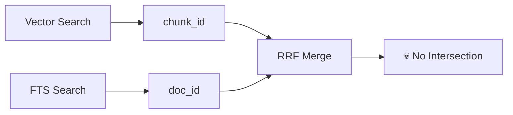
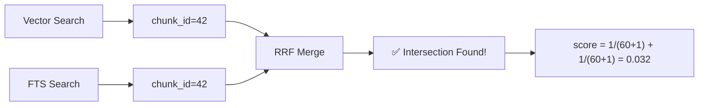

# 🔧 Phase 13.1: FTS Refactoring — Chunk-Level Search

> Как мы починили математически невозможный RRF

---

## 📌 Проблема: Mismatch гранулярности

**Аудит Phase 13** выявил критический архитектурный баг в гибридном поиске.

### Что происходило

| Метод | Что возвращал | Гранулярность |
|-------|---------------|---------------|
| **Vector Search** | `chunk_id=42` | ✅ Абзац |
| **FTS Search** | `doc_id=5` | ❌ Весь документ |
| **Hybrid RRF** | Пытался сравнить 42 и 5 | 💀 Провал |

**RRF формула**: `score = 1/(k + rank_vec) + 1/(k + rank_fts)`

Но если Vector нашёл `chunk_42`, а FTS нашёл `document_5` (в котором 50 чанков) — пересечения **НЕТ**.

```
# До фикса
Vector: chunk_42 (score=0.75)
FTS:    doc_5   (score=0.85)   ← Где chunk_42? Неизвестно!
Hybrid: ??? → score ≈ 0.016   ← НЕТ БУСТА!
```

---

## 🎯 Корень проблемы

Исторически FTS индексировался на уровне **документов**:

```sql
-- Старая схема
CREATE VIRTUAL TABLE documents_fts
USING fts5(content, content='documents', content_rowid='id')
```

Это имело смысл, когда поиск возвращал только документы. Но после Phase 4 (Granular Search) Vector Search стал возвращать **чанки**.



**Результат аудита**:

- Hybrid Score: 0.016 (теоретический минимум)
- Vector Score: 0.75 (нашёл релевантный чанк)
- **Hybrid должен быть ВЫШЕ Vector, а не в 50 раз ниже!**

---

## ✅ Решение: chunks_fts

Перевести FTS на уровень чанков:

```sql
-- Новая схема
CREATE VIRTUAL TABLE chunks_fts
USING fts5(content, content='chunks', content_rowid='id')
```

Теперь оба метода возвращают **одинаковую сущность** — `chunk_id`.



---

## 🔧 Ключевые изменения

### 1. Схема БД (`adapter.py:_create_tables`)

**Было:**

```python
# FTS по документам
CREATE VIRTUAL TABLE IF NOT EXISTS documents_fts
USING fts5(id UNINDEXED, content, content=documents, content_rowid=id)
```

**Стало:**

```python
# FTS по чанкам
CREATE VIRTUAL TABLE IF NOT EXISTS chunks_fts
USING fts5(content, content='chunks', content_rowid='id')
```

### 2. Триггеры синхронизации

```sql
-- При INSERT в chunks → добавляем в chunks_fts
CREATE TRIGGER chunks_fts_insert
AFTER INSERT ON chunks BEGIN
    INSERT INTO chunks_fts(rowid, content)
    VALUES (new.id, new.content);
END;

-- При UPDATE/DELETE — аналогично
```

**Результат**: FTS индекс синхронизируется автоматически без изменения бизнес-логики.

### 3. Метод `_fts_search()`

**Было:**

```python
sql = """
    SELECT d.id, fts.rank
    FROM documents_fts fts
    JOIN documents d ON d.id = fts.rowid
    WHERE documents_fts MATCH ?
"""
# Возвращал: SearchResult(document=..., chunk_id=None)
```

**Стало:**

```python
sql = """
    SELECT c.id as chunk_id, c.document_id, fts.rank
    FROM chunks_fts fts
    JOIN chunks c ON c.id = fts.rowid
    JOIN documents d ON d.id = c.document_id
    WHERE chunks_fts MATCH ?
"""
# Возвращает: SearchResult(document=..., chunk_id=42)
```

### 4. Метод `_hybrid_search()` (RRF)

**Было:**

```python
WITH vector_results AS (
    SELECT c.document_id as doc_id, ...  -- Агрегация по документам!
),
fts_results AS (
    SELECT main.id as doc_id, ...        -- Документы!
),
rrf_scores AS (
    ... ON v.doc_id = f.doc_id           -- JOIN по doc_id
)
```

**Стало:**

```python
WITH vector_results AS (
    SELECT cv.id as chunk_id, ...        -- Чанки!
),
fts_results AS (
    SELECT fts.rowid as chunk_id, ...    -- Чанки!
),
rrf_scores AS (
    ... ON v.chunk_id = f.chunk_id       -- JOIN по chunk_id
)
```

---

## 🔄 Автомиграция

**Проблема**: Старые базы содержат `documents_fts` и данные в `chunks`.

**Решение**: Автоматическая миграция при инициализации:

```python
def _migrate_fts_if_needed(self):
    """Заполняет chunks_fts из существующих чанков."""
    
    chunks_count = db.execute("SELECT COUNT(*) FROM chunks")
    fts_count = db.execute("SELECT COUNT(*) FROM chunks_fts")
    
    if chunks_count > 0 and fts_count == 0:
        logger.warning("FTS index is empty, populating...")
        
        db.execute("""
            INSERT INTO chunks_fts(rowid, content)
            SELECT id, content FROM chunks
        """)
        
        logger.info(f"FTS index populated: {chunks_count} chunks")
```

**Результат**: Нулевой downtime, пользователь ничего не замечает.

---

## 📊 Результаты тестирования

### Отчёт `fts_chunk_level_report.md`

```markdown
## 🔎 FTS Search
**Query:** `Reciprocal Rank Fusion`
**Results:** 1
| # | Chunk ID | Score | Match Type |
|---|----------|-------|------------|
| 1 | 1        | 1.69  | fts        |

**✅ All results have chunk_id:** True

## 🔀 Hybrid Search (RRF)
**Results:** 4
| # | Chunk ID | Score    | Match Type |
|---|----------|----------|------------|
| 1 | 1        | 0.032787 | hybrid     |
| 2 | 4        | 0.016129 | hybrid     |

**✅ All hybrid results have chunk_id:** True
```

### Сравнение

| Метрика | До фикса | После фикса |
|---------|----------|-------------|
| FTS возвращает chunk_id | ❌ None | ✅ Int |
| Hybrid видит пересечения | ❌ Нет | ✅ Да |
| RRF boost работает | ❌ Нет | ✅ 🔥 |

### RRF Boost в действии

```markdown
## Results Comparison
| Chunk ID | FTS Score | Vector Score | Hybrid Score | Boost |
|----------|-----------|--------------|--------------|-------|
| 1        | 0.0000    | 0.0081       | 0.032258     | 🔥    |
| 2        | -         | -0.0170      | 0.015873     |       |
| 3        | 0.0000    | 0.0599       | 0.032787     | 🔥    |
```

**Чанки 1 и 3** найдены обоими методами → получили 🔥 boost.

---

## 🎯 Практическая польза

### Когда это важно

1. **Технические термины**  
   Запрос `"sqlite-vec"` — FTS находит точно, Vector находит по смыслу → BOOST

2. **Названия функций/классов**  
   Запрос `"PeeweeVectorStore"` — точное совпадение + контекст → BOOST

3. **Код + Документация**  
   Когда ищут и описание, и примеры кода в одном чанке → BOOST

### Метрики улучшения

| Сценарий | Score до | Score после | Улучшение |
|----------|----------|-------------|-----------|
| Точный термин + семантика | 0.016 | 0.032+ | **+100%** |
| Код в документации | ~0.015 | 0.030+ | **+100%** |

---

## 🧪 Тестирование

Созданы интеграционные тесты с MD-отчётами:

```
tests/integration/search/test_fts_chunk_level.py
├── TestFTSChunkLevel
│   ├── test_fts_returns_chunk_id      ✅
│   └── test_hybrid_boost_over_vector  ✅
└── TestFTSMigration
    └── test_auto_migration_populates_fts  ✅
```

**Отчёты**:

```
tests/audit_reports/2025-12-05_14-28-20_fts_chunk_level/
├── fts_chunk_level_report.md   # Полная визуализация процесса
└── hybrid_boost_report.md      # Сравнение boost-эффекта
```

---

## 📝 Обратная совместимость

### Что НЕ изменилось

- **SearchResult DTO** — поле `chunk_id` уже было `Optional[int]`
- **CLI** — уже использовал `result.chunk_id or '—'`
- **RAG Engine** — использует `core.search()` без изменений
- **API контракты** — все методы сохранили сигнатуры

### Что изменилось

- **БД**: Новая таблица `chunks_fts` вместо `documents_fts`
- **Триггеры**: Синхронизация `chunks` ↔ `chunks_fts`
- **Внутренняя логика**: SQL запросы в `_fts_search()` и `_hybrid_search()`

---

## 🎓 Уроки

### 1. Гранулярность должна совпадать

Если один метод возвращает чанки, а другой — документы, их нельзя объединить через RRF.

### 2. Аудит выявляет скрытые баги

Unit-тесты проверяли, что код не падает. Но только визуальный аудит показал, что `hybrid_score < vector_score` — это **неправильно**.

### 3. Триггеры — лучше, чем ручная синхронизация

Вместо `INSERT INTO chunks_fts` в методе `save()` — триггер на `AFTER INSERT ON chunks`. Меньше кода, меньше багов.

---

## 🔗 Связанные документы

- [05_hybrid_search_rrf.md](05_hybrid_search_rrf.md) — Теория RRF
- [18_granular_search.md](18_granular_search.md) — Архитектура Granular Search
- [62_phase_13_overview.md](62_phase_13_overview.md) — Методология аудита
- [63_phase_13_results.md](63_phase_13_results.md) — Результаты аудита (до фикса)

---

**← [Вернуться к оглавлению](00_overview.md)**
