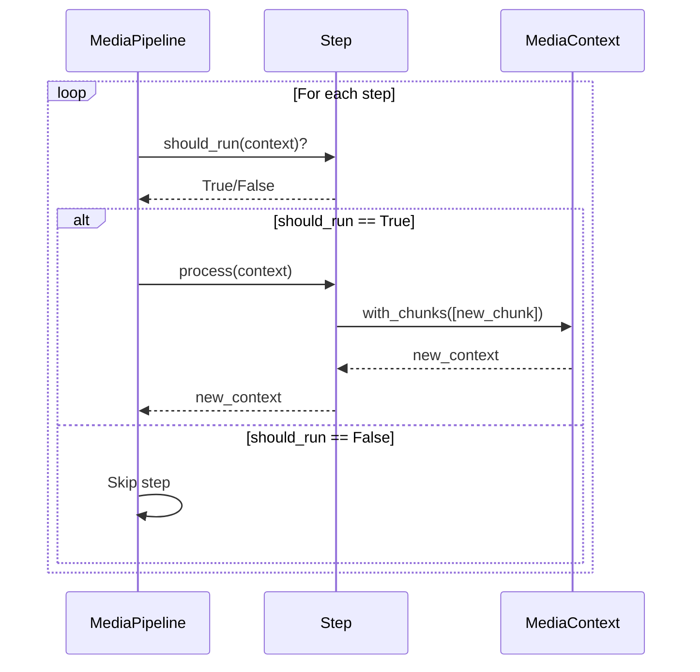

# 75. Processing Steps Architecture

> **Commits:** `6ee1e8e`, `de88fcb`, `261efb1`, `daec167`  
> **Статус:** ✅ Завершено (Phase 14.1.0)  
> **Дата:** 06.12.2025

Модульная step-based архитектура для обработки медиа-контента. Замена монолитного `_build_media_chunks()` на композицию независимых шагов через `MediaContext` + `MediaPipeline`.

---

## 📌 Что это такое?

**Processing Steps Architecture** — система из трёх компонентов:

1. **MediaContext** — immutable контейнер данных (путь, analysis, чанки)
2. **BaseProcessingStep** — абстракция для шагов обработки
3. **MediaPipeline** — executor, координирующий выполнение шагов

Эта архитектура позволяет добавлять новые шаги обработки (sentiment analysis, ad detection, timecode extraction) **без изменения** существующего кода.

---

## 🎯 Зачем это нужно?

### Проблема: Монолитный `_build_media_chunks()`

**Legacy код** (до Phase 14.1.0):

```python
def _build_media_chunks(...) -> list[Chunk]:
    """60 строк в одном методе:
    
    1. Summary chunk из description
    2. Transcript chunks (если есть)
    3. OCR chunks (если есть)
    """
    # Логика summary
    summary_chunk = Chunk(...)
    chunks.append(summary_chunk)
    
    # Логика transcript (дублирует OCR)
    if transcription:
        transcript_chunks = self._split_transcription_into_chunks(...)
        chunks.extend(transcript_chunks)
    
    # Логика OCR (дублирует transcript)
    if ocr_text:
        ocr_chunks = self._split_ocr_into_chunks(...)
        chunks.extend(ocr_chunks)
    
    return chunks
```

**Что невозможно сделать:**

❌ Добавить sentiment analysis без изменения `_build_media_chunks()`  
❌ Переопределить логику summary для конкретного видео  
❌ Перезапустить только транскрипцию (приходится re-analyze весь файл)  
❌ A/B тестировать разные стратегии чанкинга  
❌ Использовать разные splitters для transcript vs OCR

---

### Решение: Модульные шаги


**Каждый шаг:**

- ✅ **Изолирован** — не зависит от других
- ✅ **Заменяем** — можно переопределить логику
- ✅ **Тестируем** — unit-тесты без зависимостей
- ✅ **Переиспользуем** — шаг можно использовать в разных pipeline

**Новые возможности:**

```python
# Базовая обработка
pipeline = MediaPipeline([
    SummaryStep(),
    TranscriptionStep(splitter),
    OCRStep(splitter),
])

# Кастомная обработка для маркетинга
marketing_pipeline = MediaPipeline([
    SummaryStep(style="pirate speak"),  # Переопределили
    AdSpotDetectionStep(),              # Добавили новый
    TranscriptionStep(splitter),
])

# Перезапуск одного шага
pipeline.rerun_step("summary", doc_id="123")
```

---

## 🔍 Как это работает?

### 1. MediaContext — Immutable контейнер

**Зачем нужен?**

Передаёт данные между шагами **без мутаций**. Каждый шаг получает context, обрабатывает и возвращает **новый** context.

**Ключевые поля:**

| Поле | Тип | Назначение |
|------|-----|------------|
| `media_path` | `Path` | Путь к файлу |
| `analysis` | `dict` | Результат от Gemini API |
| `chunks` | `list[Chunk]` | Накопленные чанки |
| `base_index` | `int` | Текущий индекс для нумерации |
| `services` | `dict` | Service Locator (splitter, embedder) |

**Пример использования:**

```python
# Начальный контекст
context = MediaContext(
    media_path=Path("podcast.mp3"),
    document=doc,
    analysis={"type": "audio", "description": "..."},
    chunks=[],
    base_index=0,
)

# SummaryStep добавляет 1 chunk
new_context = context.with_chunks([summary_chunk])
# new_context.chunks == [summary_chunk]
# new_context.base_index == 1

# TranscriptionStep добавляет 3 chunks
final_context = new_context.with_chunks([t1, t2, t3])
# final_context.chunks == [summary, t1, t2, t3]
# final_context.base_index == 4
```

**Почему frozen dataclass?**

> **Immutability** предотвращает случайные изменения. `context.base_index = 10` → FrozenInstanceError.

---

### 2. BaseProcessingStep — Абстракция шага

**Контракт:**

Каждый шаг должен реализовать 2 метода:

1. `step_name` — уникальный идентификатор (для логирования)
2. `process(context)` — основная логика, возвращает новый context

**Опциональные методы:**

- `should_run(context)` — условие запуска (например, "только если есть transcription")
- `is_optional` — флаг: пропускать ли pipeline при ошибке

**Таблица методов:**

| Метод | Обязательный? | Пример |
|-------|---------------|--------|
| `step_name` | ✅ Да | `"summary"` |
| `process()` | ✅ Да | Создаёт chunk, возвращает `context.with_chunks([chunk])` |
| `should_run()` | ❌ Нет | `return bool(context.analysis.get("transcription"))` |
| `is_optional` | ❌ Нет | `return True` (ошибка не прерывает pipeline) |

**Пример шага:**

```python
class SummaryStep(BaseProcessingStep):
    @property
    def step_name(self) -> str:
        return "summary"
    
    def process(self, context: MediaContext) -> MediaContext:
        # Извлекаем description
        description = context.analysis.get("description", "")
        
        # Создаём chunk
        chunk = Chunk(
            content=description,
            chunk_index=context.base_index,
            metadata={"role": "summary"},
        )
        
        # Возвращаем новый контекст
        return context.with_chunks([chunk])
```

---

### 3. MediaPipeline — Executor

**Алгоритм:**



**Error Handling:**

| Тип ошибки | `is_optional=True` | `is_optional=False` |
|------------|-------------------|---------------------|
| ProcessingStepError | ⚠️ Логируем, продолжаем | 🔥 Логируем, прерываем |
| Другие Exception | ⚠️ Wrapping, продолжаем | 🔥 Wrapping, прерываем |

**Логи при ошибках:**

```
# Optional step failed
⚠️  [ocr] Optional step failed (continuing)
    error: Gemini API rate limit exceeded

# Critical step failed
🔥 [summary] Critical step failed (stopping)
    error: Missing 'description' in analysis
    executed_steps: []
```

---

## 📊 Тестирование

### Стратегия

**2 набора тестов:**

1. **MediaContext** (13 тестов) — immutability, with_chunks(), Service Locator
2. **MediaPipeline** (12 тестов) — execution order, error handling, logging

**MockStep для тестов:**

```python
class MockStep(BaseProcessingStep):
    """Фейковый шаг для изоляции pipeline логики."""
    
    def __init__(self, name, add_chunks=1, raise_error=False):
        self._name = name
        self.add_chunks = add_chunks
        self.raise_error = raise_error
        self.process_called = False  # Для проверки вызова
```

### Результаты

**MediaContext:**

```
13 passed in 0.05s

✅ Immutability (3 теста)
✅ with_chunks() (4 теста)
✅ Service Locator (3 теста)
✅ user_instructions (2 теста)
✅ Integration (1 тест)
```

**MediaPipeline:**

```
12 passed in 0.08s

✅ Execution order (3 теста)
✅ Error handling (3 теста)
✅ register_step() (2 теста)
✅ Logging (3 теста)
✅ Integration (1 тест)
```

---

## ⚠️ Важные нюансы

### 1. Immutability через frozen dataclass

**Почему не обычный dataclass?**

```python
# ❌ Mutable — опасно
@dataclass
class MediaContext:
    chunks: list[Chunk]

context.chunks.append(chunk)  # Побочный эффект!

# ✅ Immutable — безопасно
@dataclass(frozen=True)
class MediaContext:
    chunks: list[Chunk]

context.chunks.append(chunk)  # FrozenInstanceError
```

**Плюсы frozen:**

- ✅ Thread-safe (можно читать из разных потоков)
- ✅ Явные изменения (только через `with_chunks()`)
- ✅ Легко дебажить (context не меняется неожиданно)

---

### 2. Service Locator vs Constructor Injection

**Когда использовать Service Locator:**

✅ Для **опциональных** зависимостей (user_instructions processor)  
✅ Когда зависимости **разные для разных шагов**  
✅ Для **runtime** сервисов (rate limiter, cache)

**Когда использовать Constructor Injection:**

✅ Для **обязательных** зависимостей (TranscriptionStep нужен splitter)  
✅ Когда зависимость **неизменна** в runtime  
✅ Для **явности** (видно в сигнатуре конструктора)

**Пример:**

```python
# Constructor Injection (явные зависимости)
class TranscriptionStep(BaseProcessingStep):
    def __init__(self, splitter: BaseSplitter):
        self.splitter = splitter  # Обязательный

# Service Locator (опциональные зависимости)
def process(self, context: MediaContext):
    processor = context.get_service("user_instructions_processor")
    if processor:  # Может не быть
        ...
```

---

### 3. Dynamic Step Registration

**Зачем нужен `register_step()`?**

Для **runtime кастомизации** pipeline без создания нового экземпляра.

**Пример:**

```python
pipeline = MediaPipeline([SummaryStep()])

# Добавить sentiment только для audio
if media_type == "audio":
    pipeline.register_step(SentimentStep(), position=1)

# Финальный pipeline:
# - image: [SummaryStep]
# - audio: [SummaryStep, SentimentStep]
```

---

## 🔗 Следующий шаг

**Phase 14.1.1:** Реализация конкретных шагов  
→ [Статья 76: Smart Steps (Summary & Transcription)](76_smart_steps_summary_transcription.md)

**Что дальше:**

- SummaryStep — извлечение description
- TranscriptionStep — разбивка через splitter
- OCRStep — Markdown parsing, code detection
