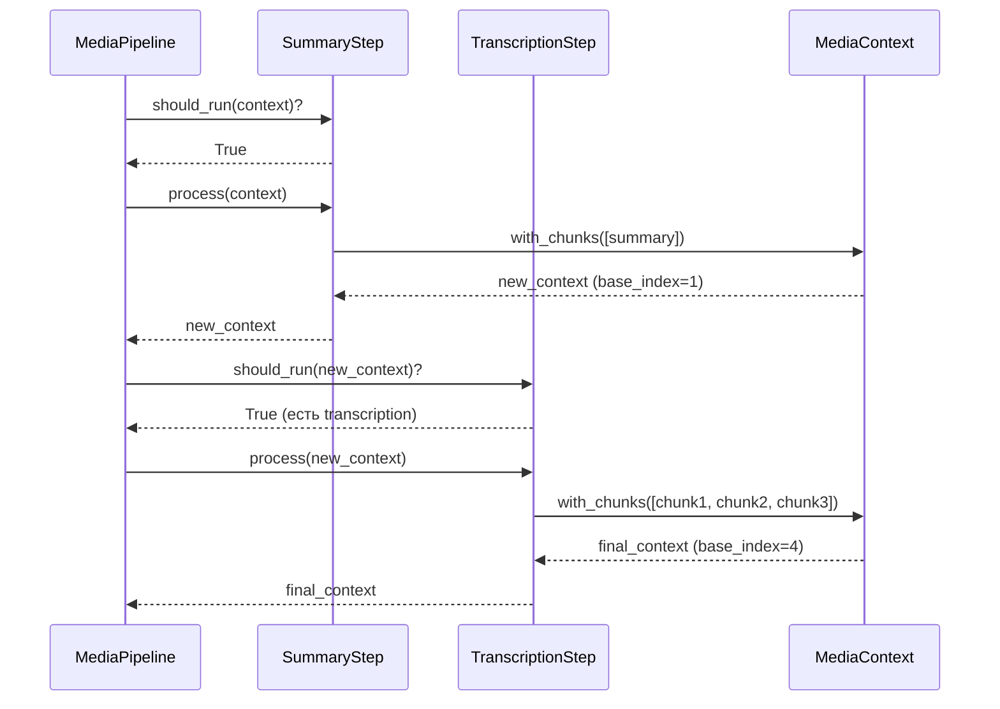

# 76. Smart Steps Implementation: Summary & Transcription

> **Commits:** `f38bbdd`, `1441594`  
> **Статус:** ✅ Завершено (Phase 14.1.1 — частично)  
> **Дата:** 06.12.2025

Реализация интеллектуальных шагов обработки медиа-контента: `SummaryStep` и `TranscriptionStep`. Эти шаги заменяют монолитную логику `_build_content_from_analysis()` и `_split_transcription_into_chunks()` из legacy `pipeline.py`.

---

## 📌 Что это такое?

**SummaryStep** и **TranscriptionStep** — конкретные реализации `BaseProcessingStep`, которые извлекают и обрабатывают данные из результата анализа медиа (analysis dict от Gemini API).

**Ключевые особенности:**

- 🎯 **Focused Responsibility**: каждый шаг отвечает за одну операцию
- 🔧 **Constructor Injection**: зависимости (splitter) передаются через конструктор
- 📊 **Conditional Execution**: `should_run()` проверяет необходимость выполнения
- 🔒 **Immutability**: работа через `MediaContext.with_chunks()`

---

## 🎯 Зачем это нужно?

### Проблема: Монолитные методы в `pipeline.py`

**Legacy код** (Phase 14.0):

```python
def _build_content_from_analysis(self, result: dict) -> str:
    """60 строк смешанной логики для summary, transcript, OCR."""
    media_type = result.get("type", "unknown")
    
    if media_type == "image":
        return result.get("description", "")
    elif media_type == "audio":
        # Только description, transcription будет в отдельных чанках
        return result.get("description", "")
    # ... еще 40 строк
```

**Проблемы:**

1. ❌ **Смешанная ответственность**: summary + transcript + OCR в одном месте
2. ❌ **Невозможно переопределить**: хардкод логики
3. ❌ **Нет тестируемости**: монолитный метод сложно мокать
4. ❌ **Дублирование**: `_split_transcription_into_chunks()` и `_split_ocr_into_chunks()` почти идентичны

### Решение: Модульные шаги


**Преимущества:**

✅ **Изоляция логики**: каждый шаг — отдельный класс  
✅ **Гибкость**: можно переопределить или заменить  
✅ **Тестируемость**: unit-тесты для каждого шага  
✅ **Переиспользование**: splitter инжектится через конструктор

---

## 🔍 Как это работает?

### 1. SummaryStep — Создание summary chunk

**Ответственность:**

- Извлечение `description` из analysis
- Формирование metadata (keywords, alt_text, participants)
- Создание single chunk с `role='summary'`

**Конфигурация:**

```python
step = SummaryStep(include_keywords=True)
```

**Типы медиа и ChunkType:**

| Media Type | ChunkType     | Metadata Keys                          |
|------------|---------------|----------------------------------------|
| `image`    | `IMAGE_REF`   | `_vision_alt`, `_vision_keywords`, `_vision_ocr` |
| `audio`    | `AUDIO_REF`   | `_audio_description`, `_audio_keywords`, `_audio_participants`, `_audio_action_items` |
| `video`    | `VIDEO_REF`   | `_video_keywords`, `_video_duration`   |

**Почему НЕ включаем transcription в summary?**

> Summary chunk должен быть компактным (< 2k tokens). Полная транскрипция идёт в отдельные чанки через `TranscriptionStep`.

---

### 2. TranscriptionStep — Разбивка транскрипции

**Ответственность:**

- Проверка наличия `transcription` в analysis
- Разбивка через `BaseSplitter` (обычно SmartSplitter)
- Обогащение metadata: `role='transcript'`, `parent_media_path`

**Constructor Injection:**

```python
from semantic_core.processing.splitters.smart import SmartSplitter

splitter = SmartSplitter(...)
step = TranscriptionStep(splitter=splitter)
```

**Логика should_run():**

```python
def should_run(self, context: MediaContext) -> bool:
    """Запускаем только если есть transcription в analysis."""
    return bool(context.analysis.get("transcription"))
```

**Зачем проверка?**

> Изображения не имеют транскрипции — шаг пропускается автоматически. Это экономит вычисления и избегает ошибок.

---

## 📊 Тестирование

### SummaryStep — 14 unit-тестов

**Test classes:**

1. **TestSummaryStepBasic** (3 теста)
   - `test_step_name`: проверка имени шага
   - `test_is_optional_false`: SummaryStep критичен
   - `test_should_run_always_true`: всегда выполняется

2. **TestSummaryStepImage** (3 теста)
   - `test_image_summary_with_keywords`: полные metadata
   - `test_image_summary_without_keywords`: отключение keywords
   - `test_image_summary_missing_fields`: обработка пустых полей

3. **TestSummaryStepAudio** (2 теста)
   - `test_audio_summary_with_keywords`: participants, action_items, duration
   - `test_audio_summary_without_keywords`: только description

4. **TestSummaryStepVideo** (2 теста)
   - `test_video_summary_with_keywords`: keywords, duration
   - `test_video_summary_without_keywords`: минимальные metadata

5. **TestSummaryStepEdgeCases** (4 теста)
   - `test_empty_description`: пустой description
   - `test_unknown_media_type`: неизвестный тип → ChunkType.TEXT
   - `test_base_index_increments_correctly`: правильная индексация
   - `test_context_immutability`: исходный контекст не изменяется

**Результаты:**

```
14 passed in 0.08s
```

---

### TranscriptionStep — 11 unit-тестов

**Test classes:**

1. **TestTranscriptionStepShouldRun** (3 теста)
   - `test_should_run_with_transcription`: есть transcription → True
   - `test_should_run_without_transcription`: нет transcription → False
   - `test_should_run_with_empty_transcription`: пустая строка → False

2. **TestTranscriptionStepBasic** (2 теста)
   - `test_step_name`: проверка имени
   - `test_is_optional_false`: критичный шаг

3. **TestTranscriptionStepProcessing** (4 теста)
   - `test_single_chunk_transcription`: короткая транскрипция → 1 chunk
   - `test_multi_chunk_transcription`: длинная транскрипция → 3 chunks, правильная индексация
   - `test_metadata_enrichment`: проверка `role='transcript'`, `parent_media_path`
   - `test_metadata_no_overwrite_original_path`: сохранение существующих metadata

4. **TestTranscriptionStepEdgeCases** (2 теста)
   - `test_context_immutability`: immutability через frozen dataclass
   - `test_video_transcription`: обработка видео-транскрипций

**Результаты:**

```
11 passed in 0.09s
```

---

## ⚙️ Детали реализации

### SummaryStep: include_keywords флаг

**Зачем нужен?**

Для **экономии места в БД** в production. Keywords полезны для search, но занимают много места в metadata.

**Когда отключать:**

```python
# Development: включаем всё
step = SummaryStep(include_keywords=True)

# Production: экономим место
step = SummaryStep(include_keywords=False)
```

**Что теряем при `include_keywords=False`:**

- `_vision_keywords` (image)
- `_audio_keywords` (audio)
- `_video_keywords` (video)

> **Альтернатива**: хранить keywords в отдельной таблице с foreign key.

---

### TranscriptionStep: Constructor Injection

**Почему не Service Locator?**

```python
# ❌ Service Locator (используется в MediaContext)
context.get_service("splitter")

# ✅ Constructor Injection (используется в TranscriptionStep)
step = TranscriptionStep(splitter=my_splitter)
```

**Обоснование:**

1. **Splitter обязателен**: TranscriptionStep не может работать без него
2. **Явные зависимости**: видны в конструкторе
3. **Тестируемость**: легко мокать через `MagicMock()`

**Service Locator оставлен для опциональных сервисов:**

- User instructions processor
- Retry parsers
- Timecode extractors

---

## 🔗 Связь с MediaPipeline

**Как шаги выполняются:**

```python
# MediaPipeline (из статьи 75)
pipeline = MediaPipeline(steps=[
    SummaryStep(include_keywords=True),
    TranscriptionStep(splitter=smart_splitter),
    OCRStep(splitter=smart_splitter),  # TODO: Phase 14.1.1
])

context = MediaContext(
    media_path=Path("podcast.mp3"),
    document=doc,
    analysis=analysis,
    chunks=[],
    base_index=0,
)

# Выполнение
chunks = pipeline.build_chunks(context)
```

**Последовательность вызовов:**



---

## ⚠️ Важные нюансы

### 1. Windows Path Compatibility

**Проблема:**

```python
# Тест на Linux/Mac
assert chunk.metadata["_original_path"] == "/data/audio.mp3"

# Реальность на Windows
# AssertionError: assert '\\data\\audio.mp3' == '/data/audio.mp3'
```

**Решение:**

```python
# ✅ Используем Path для нормализации
assert chunk.metadata["_original_path"] == str(Path("/data/audio.mp3"))
```

---

### 2. Metadata не перезаписывается

**Логика `_build_summary_metadata()` и `process()`:**

```python
meta.setdefault("_original_path", str(context.media_path))
```

**Зачем `setdefault`?**

Если splitter уже установил `_original_path` (например, через кастомную логику), мы не перезаписываем. Это даёт гибкость для advanced use cases.

---

### 3. base_index автоматически увеличивается

**Как работает `with_chunks()`:**

```python
def with_chunks(self, new_chunks: list[Chunk]) -> "MediaContext":
    """Возвращает новый контекст с добавленными чанками."""
    return replace(
        self,
        chunks=self.chunks + new_chunks,
        base_index=self.base_index + len(new_chunks),
    )
```

**Пример:**

```python
context = MediaContext(..., base_index=0, chunks=[])

# SummaryStep добавляет 1 chunk
new_context = context.with_chunks([summary_chunk])
# new_context.base_index == 1

# TranscriptionStep добавляет 3 chunks
final_context = new_context.with_chunks([t1, t2, t3])
# final_context.base_index == 4
```

**Индексы чанков:** 0, 1, 2, 3 (непрерывная последовательность).

---

## 🚀 Следующий шаг

**Phase 14.1.1 продолжается:** OCRStep  
→ [Планы Phase 14.1](../../ideas/phase_14/phase_14.1.md)

**Статья 77 (планируется):** OCR Step — Markdown parsing, code detection, false positives monitoring
