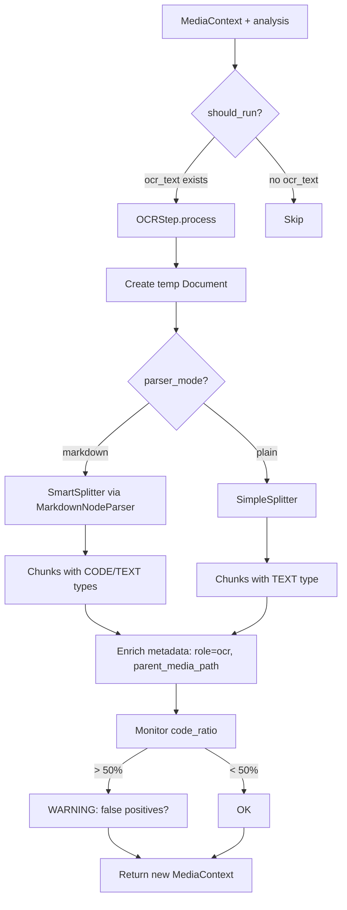
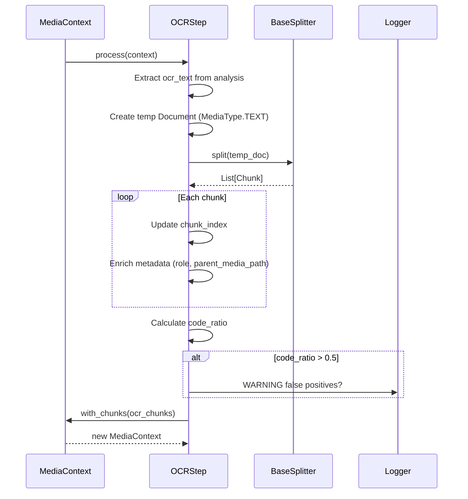

# 77. OCR Step — Smart Parsing для распознанного текста

> **Commit:** `95f2861`  
> **Статус:** ✅ Завершено (Phase 14.1.1)  
> **Дата:** 06.12.2025

Реализация `OCRStep` — интеллектуального шага обработки OCR-текста из видео и изображений с поддержкой Markdown-парсинга для изоляции code blocks.

---

## 📌 Проблема

**Видео-скринкасты** содержат код в frames → OCR извлекает смешанный текст (UI + code) → нужно изолировать code blocks для правильного ChunkType.

**Пример OCR из видео по Python:**

```
# UI текст
Welcome to Python Tutorial

# Код в редакторе
def fibonacci(n):
    if n <= 1:
        return n
    return fibonacci(n-1) + fibonacci(n-2)

# UI текст
Press Run to execute
```

**Требование:**

- Code blocks → `ChunkType.CODE`
- UI текст → `ChunkType.TEXT`
- Мониторинг false positives (UI текст спутан с кодом)

---

## 🏗 Архитектура OCRStep



**Ключевые решения:**

1. **Constructor Injection:** `splitter: BaseSplitter` передаётся снаружи
2. **Configurable Parsing:** `parser_mode: Literal["markdown", "plain"]`
   - `"markdown"` → использует `SmartSplitter` с `MarkdownNodeParser` (code detection)
   - `"plain"` → простой текстовый парсинг через `SimpleSplitter`
3. **Code Ratio Monitoring:** подсчёт `ChunkType.CODE` чанков → WARNING если > 50%
4. **MediaType.TEXT Bug Fix:** изначально использовалось несуществующее `MediaType.MARKDOWN`

---

## 💻 Реализация

**Файл:** `semantic_core/processing/steps/ocr.py` (179 строк)

### Сигнатура

```python
class OCRStep(BaseProcessingStep):
    def __init__(
        self,
        splitter: BaseSplitter,
        parser_mode: Literal["markdown", "plain"] = "markdown",
    ):
        self.splitter = splitter
        self.parser_mode = parser_mode
```

**Параметры:**

| Параметр | Тип | Default | Назначение |
|----------|-----|---------|------------|
| `splitter` | `BaseSplitter` | — | Обязательная зависимость для разбивки |
| `parser_mode` | `"markdown"` \| `"plain"` | `"markdown"` | Режим парсинга OCR текста |

---

### Логика process()



---

### Обогащение метаданных

```python
for idx, chunk in enumerate(split_chunks):
    meta = dict(chunk.metadata or {})
    meta.setdefault("_original_path", str(context.media_path))
    meta["role"] = "ocr"
    meta["parent_media_path"] = str(context.media_path)
    
    chunk.chunk_index = context.base_index + idx
    chunk.metadata = meta
```

**Важно:** `setdefault` не перезаписывает существующий `_original_path`, если splitter уже установил его.

---

### Code Ratio Monitoring

**Зачем?** UI текст из скринкастов может содержать строки вида `File > Open`, которые `MarkdownNodeParser` спутает с кодом.

**Логика:**

```python
code_chunks = sum(1 for c in ocr_chunks if c.chunk_type == ChunkType.CODE)
code_ratio = code_chunks / len(ocr_chunks) if ocr_chunks else 0

if code_ratio > 0.5:
    logger.warning(
        f"[{self.step_name}] High code ratio detected (might be false positives)",
        code_ratio=f"{code_ratio:.1%}",
        code_chunks=code_chunks,
        total_chunks=len(ocr_chunks),
        suggestion="Consider using parser_mode='plain' if OCR text is mostly UI",
    )
```

**Пример warning:**

```
⚠️  [ocr] High code ratio detected (might be false positives)
    code_ratio=60.0%
    code_chunks=3
    total_chunks=5
    suggestion=Consider using parser_mode='plain' if OCR text is mostly UI
```

---

## 🧪 Тестирование

**15 unit-тестов** (5 классов):

| Класс | Кол-во | Что проверяется |
|-------|--------|-----------------|
| `TestOCRStepShouldRun` | 3 | Условие запуска (with/without/empty ocr_text) |
| `TestOCRStepBasic` | 4 | Имя шага, is_optional=False, parser_mode getters |
| `TestOCRStepProcessing` | 4 | Single/multi chunk, parser_mode влияет на парсинг, metadata enrichment |
| `TestOCRStepCodeRatioMonitoring` | 2 | Low code_ratio (no warning), high code_ratio (WARNING logged) |
| `TestOCRStepEdgeCases` | 2 | Context immutability, metadata не перезаписывает _original_path |

---

### Пример теста: Code Ratio Monitoring

```python
def test_high_code_ratio_triggers_warning(self):
    """High code_ratio (> 50%) → WARNING в логах."""
    # 3 CODE chunks из 5 → 60% code_ratio
    mock_chunks = [
        Chunk(content="code1", chunk_type=ChunkType.CODE, ...),
        Chunk(content="code2", chunk_type=ChunkType.CODE, ...),
        Chunk(content="code3", chunk_type=ChunkType.CODE, ...),
        Chunk(content="text1", chunk_type=ChunkType.TEXT, ...),
        Chunk(content="text2", chunk_type=ChunkType.TEXT, ...),
    ]
    
    with patch("semantic_core.utils.logger.logger") as mock_logger:
        step.process(context)
        
        # Проверяем вызов warning
        mock_logger.warning.assert_called_once()
        args = mock_logger.warning.call_args
        assert "High code ratio detected" in args[0][0]
        assert args[1]["code_ratio"] == "60.0%"
```

**Результаты:**

```bash
$ pytest tests/unit/processing/steps/test_ocr_step.py -v
========== 15 passed in 0.09s ==========
```

---

## 🐛 MediaType.MARKDOWN Bug Fix

### Проблема

Изначальная версия использовала:

```python
# ❌ BROKEN
media_type = MediaType.MARKDOWN if self.parser_mode == "markdown" else MediaType.TEXT
```

**MediaType enum** (из `domain/document.py`):

```python
class MediaType(str, Enum):
    TEXT = "text"
    IMAGE = "image"
    VIDEO = "video"
    AUDIO = "audio"
    # ❌ MARKDOWN отсутствует!
```

**Ошибка:**

```
AttributeError: type object 'MediaType' has no attribute 'MARKDOWN'
7/15 тестов падали
```

---

### Решение

```python
# ✅ CORRECT
media_type = MediaType.TEXT  # Всегда TEXT для OCR
# parser_mode влияет на SmartSplitter, а не на Document.media_type
```

**Почему TEXT правильно?**

OCR извлекает **текст** из изображений/видео. Markdown — это формат разметки текста, но не тип медиа. 

- `parser_mode="markdown"` → влияет на `SmartSplitter` (использует `MarkdownNodeParser`)
- `parser_mode="plain"` → влияет на `SmartSplitter` (использует `SimpleSplitter`)
- `Document.media_type` → всегда `TEXT` (это текстовый контент)

---

## 🔍 Nüances

### 1. parser_mode ≠ media_type

**Распространённая ошибка:**

```python
# ❌ Неправильное понимание
if parser_mode == "markdown":
    media_type = MediaType.MARKDOWN  # Не существует!
```

**Правильная модель:**

```python
# ✅ Правильно
media_type = MediaType.TEXT  # OCR текст ВСЕГДА TEXT

# parser_mode влияет на SPLITTER, а не на Document
if parser_mode == "markdown":
    # SmartSplitter использует MarkdownNodeParser
    # → code blocks → ChunkType.CODE
else:
    # SmartSplitter использует SimpleSplitter
    # → всё → ChunkType.TEXT
```

---

### 2. Когда использовать parser_mode="plain"?

**Рекомендации:**

| Сценарий | parser_mode | Обоснование |
|----------|-------------|-------------|
| Скринкаст с кодом | `"markdown"` | Изолирует code blocks |
| UI/UX дизайн видео | `"plain"` | Избегает false positives (стрелки `->` → код) |
| Презентации | `"plain"` | UI текст без кода |
| Coding tutorial | `"markdown"` | Детектит примеры кода |

**Индикатор проблемы:** `code_ratio > 0.5` + отсутствие кода в видео → переключить на `"plain"`.

---

### 3. Мониторинг vs автофикс

**Текущая реализация:** только WARNING в логах.

**Почему не автофикс?**

```python
# ❌ Потенциальная идея (не реализована)
if code_ratio > 0.5 and self.parser_mode == "markdown":
    logger.warning("Автопереключение на parser_mode='plain'")
    self.parser_mode = "plain"
    # Перезапуск process()
```

**Проблемы:**

1. **Mutability:** шаг меняет свою конфигурацию
2. **Неопределённость:** когда именно переключаться?
3. **User intent:** может быть, это действительно код

**Решение:** оставить choice пользователю через CLI/config.

---

## 📊 Итоги тестирования

**Все шаги Phase 14.1.1:**

```bash
$ pytest tests/unit/processing/steps/ -v --tb=short
========== 40 passed in 0.15s ==========

Breakdown:
- SummaryStep: 14 passed in 0.08s
- TranscriptionStep: 11 passed in 0.09s
- OCRStep: 15 passed in 0.09s
```

**Integration с core:**

```bash
$ pytest tests/unit/core/ -v
========== 25 passed in 0.11s ==========

Breakdown:
- MediaContext: 13 tests
- MediaPipeline: 12 tests
```

**Общий итог Phase 14.1.1:**

```
65 unit-тестов
0.26s execution
100% passing
```

---

## 🚀 Следующий шаг

**Phase 14.1.2:** Advanced Features  
→ FrameDescriptionStep, TimecodeParser, user_instructions

[Планы Phase 14.1](../../ideas/phase_14/phase_14.1.md)

