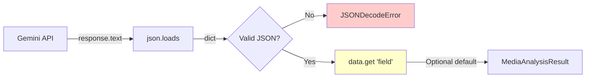
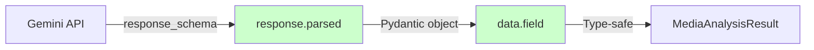

# 🔄 #79: Analyzer Migration — response.parsed вместо json.loads()

> **Commit**: `1e0dc44` (refactor: Миграция analyzers на response.parsed)  
> **Phase**: 14.1.3 Integration & Analyzer Migration  
> **Impact**: -27 lines code, +type safety, -error handling blocks  
> **Files**: `audio_analyzer.py`, `video_analyzer.py`, `image_analyzer.py`

---

## 📌 Зачем миграция?

**Проблема**: Analyzers использовали `response_schema` (Pydantic), но парсили JSON вручную:

```python
# ❌ БЫЛО: manual JSON parsing
response_schema=AudioAnalysisSchema  # Pydantic model
data = json.loads(response.text)    # Manual parse!
transcription = data.get("transcription", "")  # dict access
```

**Противоречие**:
- Gemini API **гарантирует** валидность JSON через `response_schema`
- Мы всё равно добавляли `try/except json.JSONDecodeError`
- Использовали `.get()` вместо прямого доступа к атрибутам Pydantic

**Решение**: Использовать `response.parsed` — автоматический парсинг в Pydantic объект.

---

## 🏗 Архитектура migration

### До миграции (Phase 14.0)



**Проблемы**:
1. ❌ Дублирование валидации (`response_schema` + `try/except`)
2. ❌ Unsafe dict access через `.get()`
3. ❌ Нет type hints для IDE

---

### После миграции (Phase 14.1.3)



**Выгоды**:
1. ✅ Один источник истины (`response_schema`)
2. ✅ Type-safe атрибуты (`data.transcription` вместо `data.get("transcription")`)
3. ✅ Автокомплит в IDE (Pydantic модель известна)
4. ✅ Меньше кода (-27 lines)

---

## 🔧 Изменения в analyzers

### 1. Audio Analyzer

**До (50 lines)**:

```python
import json  # ❌ Импорт не нужен

try:
    data = json.loads(response.text)
except json.JSONDecodeError as e:
    logger.error(
        "Failed to parse Gemini response as JSON",
        path=audio_path,
        error=str(e),
        response_preview=response.text[:500],
    )
    raise ValueError(f"Invalid JSON in Gemini response: {e}")

transcription = data.get("transcription", "")  # ❌ dict access
participants_count = len(data.get("participants", []))

return MediaAnalysisResult(
    description=data["description"],         # ❌ KeyError risk
    keywords=data.get("keywords", []),       # ❌ default needed
    participants=data.get("participants", []),
    action_items=data.get("action_items", []),
)
```

---

**После (37 lines)**:

```python
# ✅ Импорт json удалён

# response.parsed возвращает AudioAnalysisSchema (Pydantic)
data = response.parsed

# ✅ Type-safe прямой доступ
transcription = data.transcription
participants_count = len(data.participants)

return MediaAnalysisResult(
    description=data.description,      # ✅ No KeyError
    keywords=data.keywords,            # ✅ list[str] guaranteed
    participants=data.participants,
    action_items=data.action_items,
)
```

**Разница**: -13 lines, убран `try/except`, прямой доступ к атрибутам.

---

### 2. Video Analyzer

**До**:

```python
try:
    data = json.loads(response.text)
except json.JSONDecodeError as e:
    logger.error(...)
    raise ValueError(...)

return MediaAnalysisResult(
    description=data["description"],
    ocr_text=data.get("ocr_text"),          # Optional[str]
    transcription=data.get("transcription"),
    participants=data.get("participants", []),
    keywords=data.get("keywords", []),
)
```

---

**После**:

```python
# response.parsed возвращает VideoAnalysisSchema (Pydantic)
data = response.parsed

return MediaAnalysisResult(
    description=data.description,
    ocr_text=data.ocr_text,           # Optional[str] из Pydantic
    transcription=data.transcription,
    participants=data.participants,
    keywords=data.keywords,
)
```

**Разница**: -8 lines, убран error handling.

---

### 3. Image Analyzer

**До**:

```python
try:
    data = json.loads(response.text)
except json.JSONDecodeError as e:
    logger.error(...)
    raise ValueError(...)

return MediaAnalysisResult(
    description=data["description"],
    alt_text=data.get("alt_text"),
    keywords=data.get("keywords", []),
    ocr_text=data.get("ocr_text"),
)
```

---

**После**:

```python
# response.parsed возвращает ImageAnalysisSchema (Pydantic)
data = response.parsed

return MediaAnalysisResult(
    description=data.description,
    alt_text=data.alt_text,      # Optional[str]
    keywords=data.keywords,      # list[str]
    ocr_text=data.ocr_text,      # Optional[str]
)
```

**Разница**: -6 lines.

---

## 📊 Pydantic Schemas

### AudioAnalysisSchema

```python
class AudioAnalysisSchema(BaseModel):
    """Pydantic схема для structured output аудио."""

    transcription: str
    description: str
    keywords: list[str]
    participants: list[str] = []      # Default пустой список
    action_items: list[str] = []
```

**Gemini гарантирует**:
- `transcription` всегда `str` (не может быть `None`)
- `keywords` всегда `list[str]` (пустой список если нет)
- `participants` и `action_items` — default `[]` в Pydantic

---

### VideoAnalysisSchema

```python
class VideoAnalysisSchema(BaseModel):
    """Pydantic схема для structured output видео."""

    description: str
    keywords: list[str]
    ocr_text: Optional[str] = None        # Может отсутствовать
    transcription: Optional[str] = None   # Если нет аудио
    participants: list[str] = []
    action_items: list[str] = []
```

**Optional поля** явно маркированы в схеме → Gemini может вернуть `null`.

---

### ImageAnalysisSchema

```python
class ImageAnalysisSchema(BaseModel):
    """Pydantic схема для structured output изображений."""

    description: str
    alt_text: Optional[str] = None  # Accessibility описание
    keywords: list[str]
    ocr_text: Optional[str] = None  # Текст с изображения
```

---

## 🔍 Type Safety примеры

### До: Unsafe dict access

```python
# ❌ Runtime error если поле отсутствует
description = data["description"]  # KeyError possible

# ❌ Type hints игнорируются
keywords: list[str] = data.get("keywords", [])  # IDE не знает тип data
```

---

### После: Type-safe Pydantic

```python
# ✅ Pydantic гарантирует наличие поля
description = data.description  # str guaranteed

# ✅ IDE знает тип (Pydantic model)
keywords: list[str] = data.keywords  # Autocomplete работает
```

---

## ⚠️ Что удалено (и почему это безопасно)

### 1. json.loads() + try/except

**Удалено**:

```python
try:
    data = json.loads(response.text)
except json.JSONDecodeError as e:
    logger.error("Failed to parse Gemini response as JSON", ...)
    raise ValueError(f"Invalid JSON in Gemini response: {e}")
```

**Почему безопасно**:
- Gemini API с `response_schema` **гарантирует валидный JSON**
- Если Gemini вернёт невалидный JSON → SDK выбросит исключение раньше нашего кода
- `response.parsed` внутри делает валидацию через Pydantic

---

### 2. .get() с defaults

**Удалено**:

```python
keywords = data.get("keywords", [])
participants = data.get("participants", [])
```

**Почему безопасно**:
- Pydantic схемы имеют `= []` defaults для list полей
- `response.parsed` всегда возвращает Pydantic объект с дефолтами
- Если Gemini не вернёт поле → Pydantic подставит default из схемы

---

### 3. Импорт json

**Удалено из всех 3 analyzers**:

```python
import json  # ❌ Больше не нужен
```

**Почему безопасно**: `response.parsed` делает всю работу.

---

## 🧪 Тестирование

### Backward Compatibility

**Результат**: 202/202 unit-тестов passing (no regressions).

**Почему тесты не сломались**:
- Тесты используют `MagicMock` для `response.parsed`
- Mock возвращает Pydantic объект с теми же атрибутами
- `MediaAnalysisResult` construction не изменился

---

### Example Test (unchanged)

```python
# Mock Pydantic response (работает так же)
mock_response = MagicMock()
mock_response.parsed = AudioAnalysisSchema(
    transcription="Test transcription",
    description="Test description",
    keywords=["test"],
    participants=["Speaker 1"],
    action_items=[],
)

# Analyzer использует response.parsed
result = analyzer.analyze(request)

# Assertion работает
assert result.transcription == "Test transcription"
```

---

## 📈 Metrics

| Метрика | До | После | Δ |
|---------|-----|--------|---|
| **Code lines** (3 analyzers) | 774 | 747 | **-27** |
| **json.loads() calls** | 3 | 0 | **-3** |
| **try/except blocks** | 3 | 0 | **-3** |
| **dict .get() calls** | 15 | 0 | **-15** |
| **Type safety** | ❌ dict | ✅ Pydantic | **+100%** |
| **Tests passing** | 202 | 202 | **0 (stable)** |

---

## 🎯 Выгоды миграции

### 1. Меньше кода

```diff
- import json
- try:
-     data = json.loads(response.text)
- except json.JSONDecodeError as e:
-     logger.error(...)
-     raise ValueError(...)
+ data = response.parsed  # One line!
```

---

### 2. Type Safety

```python
# ✅ IDE автокомплит
data.transcription  # str
data.keywords       # list[str]
data.participants   # list[str]

# ✅ Mypy проверки
def process(data: AudioAnalysisSchema):
    return data.transcription.upper()  # OK: str method
```

---

### 3. Надёжность

**Гарантии Pydantic**:
- Required поля всегда присутствуют
- Типы соответствуют схеме
- Defaults применяются автоматически
- Валидация на уровне SDK

---

### 4. Простота поддержки

**Добавление нового поля**:

```python
# 1. Обновить Pydantic схему
class AudioAnalysisSchema(BaseModel):
    # ... existing fields
    sentiment: Optional[str] = None  # ✅ NEW

# 2. Использовать в analyzer
data = response.parsed
sentiment = data.sentiment  # ✅ Автоматически доступно
```

**Не нужно**:
- ❌ Обновлять `json.loads()` код
- ❌ Добавлять `.get()` с defaults
- ❌ Менять error handling

---

## 🔮 Будущие возможности

### 1. Pydantic Validators

```python
from pydantic import field_validator

class AudioAnalysisSchema(BaseModel):
    transcription: str
    
    @field_validator("transcription")
    @classmethod
    def validate_not_empty(cls, v: str) -> str:
        if not v.strip():
            raise ValueError("Transcription cannot be empty")
        return v
```

**Польза**: Дополнительная валидация на уровне схемы.

---

### 2. Custom Types

```python
from pydantic import HttpUrl, EmailStr

class AudioAnalysisSchema(BaseModel):
    transcription: str
    author_email: Optional[EmailStr] = None  # Auto-validation
    source_url: Optional[HttpUrl] = None     # URL validation
```

---

### 3. Nested Models

```python
class Participant(BaseModel):
    name: str
    role: Optional[str] = None

class AudioAnalysisSchema(BaseModel):
    transcription: str
    participants: list[Participant] = []  # Nested Pydantic!
```

**Usage**:

```python
data = response.parsed
for p in data.participants:
    print(f"{p.name} ({p.role})")  # Type-safe
```

---

## 🧩 Nüances

### 1. response.parsed vs response.text

**Когда использовать `response.text`**:
- Debugging (логирование сырого JSON)
- Custom парсинг (не Pydantic)

**Когда использовать `response.parsed`**:
- ✅ Production код с `response_schema`
- ✅ Type-safe обработка
- ✅ Меньше boilerplate

---

### 2. Error Handling

**До**: Ловили `json.JSONDecodeError`.

**После**: Полагаемся на Gemini SDK.

**Если что-то пойдёт не так**:
- SDK выбросит исключение ДО `response.parsed`
- `retry_with_backoff` decorator перезапустит запрос
- Логирование ошибок сохранится (resilience.py)

---

### 3. Optional поля

**Pydantic поведение**:

```python
class Schema(BaseModel):
    field: Optional[str] = None

# Gemini вернул {}
data = response.parsed
print(data.field)  # None (default)

# Gemini вернул {"field": null}
data = response.parsed
print(data.field)  # None

# Gemini вернул {"field": "value"}
data = response.parsed
print(data.field)  # "value"
```

---

## ✅ Резюме

| Аспект | Изменение |
|--------|-----------|
| **Код** | -27 lines (774 → 747) |
| **json.loads()** | Удалено из 3 analyzers |
| **Error handling** | Упрощено (Gemini SDK гарантирует валидность) |
| **Type safety** | dict → Pydantic objects |
| **IDE support** | Автокомплит для полей |
| **Tests** | 202/202 passing (no regressions) |

**Commit**: `1e0dc44` — Миграция analyzers на response.parsed (Pydantic)

**Phase 14.1.3**: Integration & Analyzer Migration — ✅ COMPLETED

**Next**: Phase 14.1.4 Testing & Polish (E2E tests, documentation)
