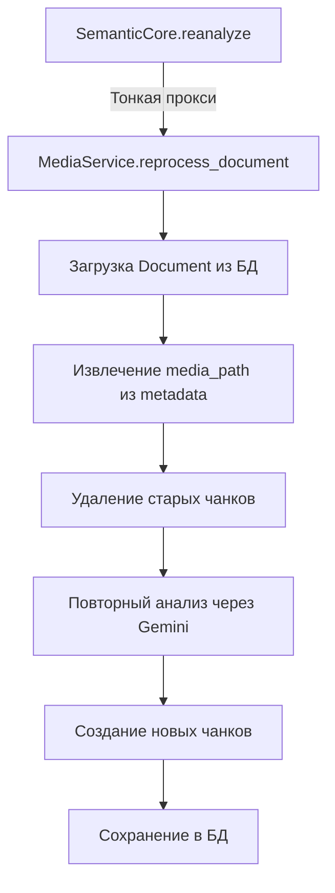
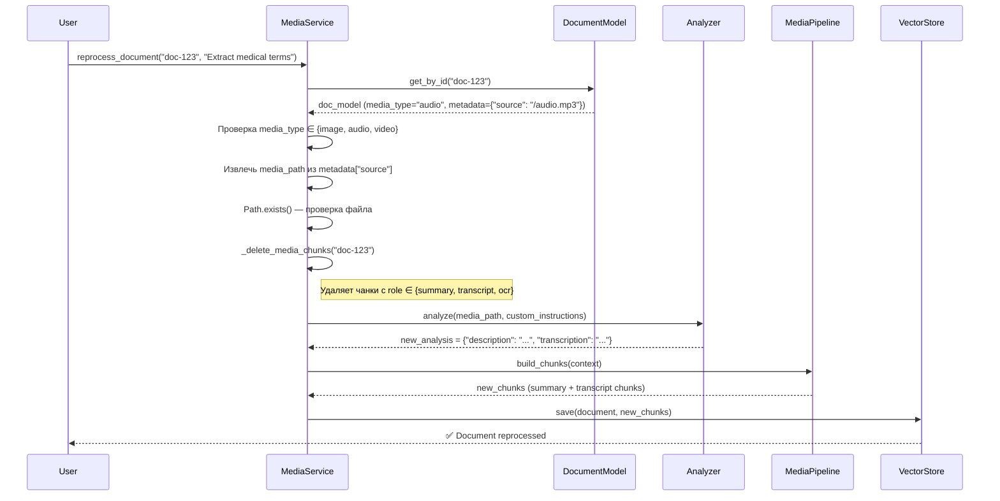
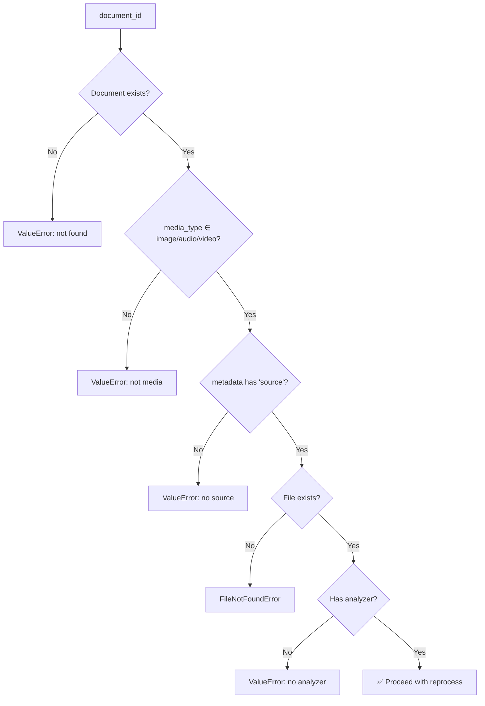

# 83. MediaService.reprocess_document() — Повторный анализ медиа

**Фаза:** Phase 14.3.3 (Configuration & Flexibility)  
**Дата:** 2025-12-06  
**Коммит:** `65f060b`  
**Предыдущая статья:** [82. Configuration & Template Injection](82_configuration_template_injection.md)

---

## 🎯 Проблема

После Phase 14.3.1-14.3.2 пользователь может изменить промпты и chunk sizes в `semantic.toml`, но **как применить их к существующим документам?**

### Архитектурная ошибка

**Первая попытка (неправильно):**

```python
# ❌ ПЛОХО: Логика reprocess в SemanticCore
class SemanticCore:
    def reanalyze(self, document_id: str):
        # 1. Достать media_path из MediaTaskModel.file_path
        task = MediaTaskModel.get(result_document_id=document_id)
        media_path = Path(task.file_path)  # ← ПРОБЛЕМА!
        
        # 2. Удалить старые чанки
        ChunkModel.delete().where(ChunkModel.document == document_id).execute()
        
        # 3. Повторный анализ...
```

**Две критические ошибки:**

| Проблема | Последствия |
|----------|-------------|
| **MediaTaskModel как источник правды** | Если чистить старые tasks → потеря пути к файлу |
| **Логика в SemanticCore** | Нарушение SRP (Single Responsibility Principle) |

**Сценарий провала:**

```sql
-- Администратор чистит старые задачи
DELETE FROM media_tasks WHERE processed_at < NOW() - INTERVAL '30 days';

-- Пользователь пытается reanalyze
>>> core.reanalyze("doc-123")
DoesNotExist: MediaTask matching query does not exist.
```

---

## ✅ Решение

### 1. Single Source of Truth

**Используем `Document.metadata["source"]`** — путь к медиа уже сохранён при первом инжесте:

```python
# semantic_core/pipeline.py (строки 680, 709, 838)
metadata = {"source": str(path)}  # ← Путь к файлу в metadata!
```

**Почему это правильно:**

- ✅ Document живёт вечно (пока не удалён пользователем)
- ✅ MediaTask — временная сущность (очередь обработки)
- ✅ Можно чистить tasks без последствий

### 2. SRP Compliance

**Логика переобработки → `MediaService`** (НЕ SemanticCore):



**Разделение ответственности:**

| Класс | Роль |
|-------|------|
| **SemanticCore** | Фасад (делегирует MediaService) |
| **MediaService** | Агрегация + Переобработка медиа |
| **MediaPipeline** | Создание чанков |

---

## 🏗 Архитектура

### MediaService: До и После

**До Phase 14.3.3:**

```python
class MediaService:
    """Только агрегация данных."""
    
    def get_media_details(self, document_id: str) -> MediaDetails:
        # Собирает summary + transcript + OCR в DTO
        pass
```

**После Phase 14.3.3:**

```python
class MediaService:
    """Агрегация + Переобработка."""
    
    def __init__(
        self,
        image_analyzer: Optional[GeminiImageAnalyzer] = None,
        audio_analyzer: Optional[GeminiAudioAnalyzer] = None,
        video_analyzer: Optional[GeminiVideoAnalyzer] = None,
        splitter: Optional[BaseSplitter] = None,
        store: Optional[BaseVectorStore] = None,
        config: Optional[SemanticConfig] = None,
    ):
        # Зависимости для reprocess_document()
        pass
    
    def reprocess_document(
        self,
        document_id: str,
        custom_instructions: Optional[str] = None,
    ) -> Document:
        # Логика переобработки
        pass
```

**Зачем нужны зависимости?**

| Зависимость | Для чего |
|-------------|----------|
| `image_analyzer` / `audio_analyzer` / `video_analyzer` | Повторный анализ через Gemini |
| `splitter` | Нарезка transcript/OCR на чанки |
| `store` | Сохранение новых чанков в БД |
| `config` | chunk_sizes, enable_timecodes, ocr_parser_mode |

---

## 🔄 Алгоритм reprocess_document()

**8 шагов безопасной переобработки:**



**Детали шагов:**

| Шаг | Действие | Валидация |
|-----|----------|-----------|
| 1️⃣ | Загрузка `DocumentModel.get_by_id()` | `DoesNotExist` → ValueError |
| 2️⃣ | Проверка `media_type` | Если TEXT → ValueError |
| 3️⃣ | Извлечь `metadata["source"]` | Если нет — ValueError |
| 4️⃣ | Проверка `Path.exists()` | Файл удалён → FileNotFoundError |
| 5️⃣ | Удаление старых чанков | WHERE role IN ('summary', 'transcript', 'ocr') |
| 6️⃣ | Повторный анализ | analyzer.analyze(media_path, custom_instructions) |
| 7️⃣ | Создание новых чанков | MediaPipeline с config.media.chunk_sizes |
| 8️⃣ | Сохранение в БД | store.save(document) |

---

## 📋 Примеры использования

### Пример 1: Улучшение промпта

**Сценарий:** Пользователь обновил промпт для медицинских лекций.

```toml
# semantic.toml
[media.prompts]
audio_summary = """
Extract: diagnoses, medications, dosages, contraindications.
Focus on medical terminology.
"""
```

**Переобработка:**

```python
from semantic_core import SemanticCore

core = SemanticCore()

# Повторный анализ с новым промптом
core.reanalyze(
    document_id="doc-123",
    custom_instructions="Extract medical terminology",
)

# Результат:
# - Старые чанки удалены
# - Новый analysis с медицинскими терминами
# - Новые чанки созданы и сохранены
```

### Пример 2: Эксперимент с chunk sizes

**Сценарий:** Видео-туториал с кодом — хотим большие чанки для OCR.

```toml
[media.chunk_sizes]
ocr_text_chunk_size = 3000  # Было 1800
```

**Переобработка:**

```python
# Переобработать ВСЕ видео с новым chunk_size
video_docs = Document.select().where(Document.media_type == "video")

for doc in video_docs:
    core.reanalyze(document_id=doc.id)
    print(f"✅ {doc.id} reprocessed with new chunk sizes")
```

### Пример 3: Миграция на новую модель Gemini

**Сценарий:** Вышел `gemini-3.0-pro` с лучшей транскрипцией.

```python
# Обновляем model в конфиге
config.gemini.model_name = "gemini-3.0-pro"

# Переобработка критичных документов
important_docs = ["lecture-01", "interview-02", "podcast-03"]

for doc_id in important_docs:
    core.reanalyze(document_id=doc_id)
```

---

## 🧪 Тестирование

**9 unit-тестов с моками (100% coverage):**

| Тест | Проверяет |
|------|-----------|
| `test_reprocess_document_requires_dependencies` | ValueError если нет splitter/store/config |
| `test_reprocess_document_not_found` | ValueError если document_id не существует |
| `test_reprocess_document_not_media_file` | ValueError если media_type = "text" |
| `test_reprocess_document_missing_source_metadata` | ValueError если нет metadata["source"] |
| `test_reprocess_document_file_not_found` | FileNotFoundError если файл удалён |
| `test_reprocess_document_audio_success` | Успешная переобработка аудио |
| `test_reprocess_document_deletes_old_chunks` | Удаление старых медиа-чанков |
| `test_reprocess_document_calls_correct_analyzer` | Выбор правильного analyzer (IMAGE/AUDIO/VIDEO) |
| `test_reprocess_document_no_analyzer_raises_error` | ValueError если нет нужного analyzer |

**Результат тестов:**

```bash
tests/unit/services/test_media_service_reprocess.py::test_* PASSED [100%]
========================================== 9 passed in 0.07s ===========================================
```

---

## 🎯 Архитектурные гарантии

### 1. Single Responsibility Principle (SRP)


**SemanticCore.reanalyze() — всего 4 строки:**

```python
def reanalyze(self, document_id: str, custom_instructions: Optional[str] = None):
    """Тонкая прокси для MediaService.reprocess_document()."""
    media_service = MediaService(
        image_analyzer=self.image_analyzer,
        audio_analyzer=self.audio_analyzer,
        video_analyzer=self.video_analyzer,
        splitter=self.splitter,
        store=self.store,
        config=self.config,
    )
    return media_service.reprocess_document(document_id, custom_instructions)
```

### 2. Single Source of Truth

| Источник правды | Для чего | Время жизни |
|-----------------|----------|-------------|
| `Document.metadata["source"]` | Путь к медиа-файлу | Пока Document не удалён |
| ~~`MediaTaskModel.file_path`~~ | ❌ НЕ ИСПОЛЬЗОВАТЬ | Временная сущность (очередь) |

### 3. Атомарность удаления

**Чанки удаляются ПЕРЕД созданием новых:**

```python
# 1. Удалить старые
deleted_count = self._delete_media_chunks(document_id)

# 2. Создать новые
new_chunks = self._build_chunks_via_pipeline(...)

# 3. Сохранить
self.store.save(document)
```

**Почему важно:**

- ✅ Нет дубликатов чанков (старые + новые одновременно)
- ✅ Если новый анализ упадёт → старые чанки уже удалены (чистое состояние для retry)
- ⚠️ Временно нет чанков (между удалением и созданием) — но это лучше дубликатов

### 4. Валидация на каждом шаге



---

## 🔗 Следующий шаг

**Phase 14.3.4: CLI Integration** — команда `semantic reanalyze <document_id>`

**Phase 14.3.5: Documentation** — примеры конфигов в docs/

---

## 📌 Ключевые выводы

1. **Document.metadata["source"]** — единственный источник правды для media_path
2. **MediaService** владеет логикой переобработки (SRP)
3. **SemanticCore** остаётся тонким фасадом (4 строки)
4. **Атомарность**: удаление старых чанков ПЕРЕД созданием новых
5. **9 unit-тестов** покрывают все edge cases

**Результат:** Пользователь может безопасно переобработать любой медиа-файл с новыми промптами/chunk sizes без риска потери данных.
