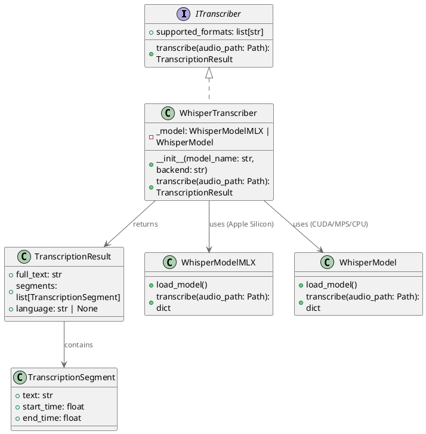
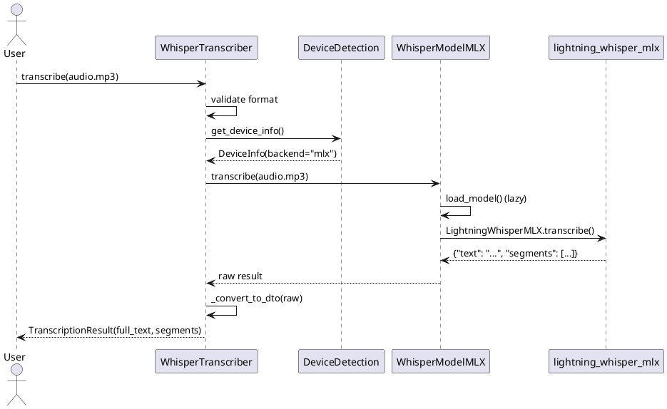

# 82. Локальная транскрипция через Whisper — Освобождение от Gemini Audio

> **Phase:** 15.1  
> **Дата:** 10.12.2025  
> **Статус:** ✅ ЗАВЕРШЕНО  
> **Коммит:** `bf517af`

---

## 🎯 Проблема

До Phase 15.1 транскрипция аудио была **возможна только через Gemini Audio API**:

**Ограничения:**

- 💰 **Стоимость**: $0.000125/сек ($7.50/час) — дороже OpenAI Whisper API
- 🌐 **Требуется интернет**: нет офлайн-режима
- 🔒 **Вендор-лок**: зависимость от Google инфраструктуры
- ⏱️ **Лимиты**: 1000 RPM на проект
- 🔇 **Нет таймкодов**: только полный текст без сегментации

**Реальный пример из проекта:**

Пользователь загружает подкаст 1 час → $7.50 за транскрипцию → слишком дорого для личного проекта.

---

## 💡 Решение

**Интеграция OpenAI Whisper для локальной транскрипции:**

- ✅ **Бесплатно**: запуск на своём железе (CPU/GPU/Apple Silicon)
- ✅ **Офлайн**: работает без интернета
- ✅ **Таймкоды**: сегменты с `start_time` / `end_time`
- ✅ **Гибкость**: выбор модели (tiny → large)
- ✅ **Скорость**: на Apple M3 Max — realtime × 5

---

## 🏗 Архитектура

### 1. Device Auto-Detection (Apple Silicon vs CUDA vs CPU)

**Проблема донора**: Whisper может работать через:

1. **MLX** (Apple Silicon) — lightning-whisper-mlx, mlx-whisper
2. **PyTorch** (CUDA/MPS/CPU) — transformers + torch

Нужен умный выбор backend.

**Решение:**

```python
# semantic_core/infrastructure/local/whisper/device.py

def is_apple_silicon() -> bool:
    """Проверяет, запущены ли мы на Apple Silicon (M1/M2/M3/M4)."""
    return (
        platform.system() == "Darwin" and  # macOS
        platform.machine() == "arm64"      # ARM architecture
    )

@dataclass
class DeviceInfo:
    backend: Literal["mlx", "pytorch"]  # Какой движок использовать
    device: str  # "mlx", "cuda", "mps", "cpu"
    
def get_device_info(force_backend: str | None = None) -> DeviceInfo:
    """Auto-detection платформы."""
    
    # Пользователь может принудительно выбрать backend
    if force_backend == "mlx":
        if not is_apple_silicon():
            raise RuntimeError("MLX требует Apple Silicon (M1/M2/M3/M4)")
        return DeviceInfo(backend="mlx", device="mlx")
    
    # Auto-detection
    if is_apple_silicon():
        # Apple Silicon → MLX (в 2-3 раза быстрее PyTorch MPS)
        return DeviceInfo(backend="mlx", device="mlx")
    
    # Fallback на PyTorch
    import torch
    if torch.cuda.is_available():
        return DeviceInfo(backend="pytorch", device="cuda")
    elif torch.backends.mps.is_available():
        return DeviceInfo(backend="pytorch", device="mps")
    else:
        return DeviceInfo(backend="pytorch", device="cpu")
```

**Логика:**

1. **Apple Silicon (M1/M2/M3/M4)** → MLX (оптимизировано для ARM)
2. **NVIDIA GPU** → PyTorch CUDA
3. **Intel Mac** → PyTorch MPS (GPU acceleration)
4. **Остальные** → PyTorch CPU

---

### 2. WhisperModelMLX — MLX Backend для Apple Silicon

**Почему два пакета?**

- `lightning-whisper-mlx` — быстрее, но нет `word_timestamps`
- `mlx-whisper` — медленнее, но есть детальные таймкоды

**Реализация:**

```python
# semantic_core/infrastructure/local/whisper/models.py

class WhisperModelMLX:
    """Whisper через MLX (Apple Silicon)."""
    
    SUPPORTED_MODELS = {
        "tiny": "mlx-community/whisper-tiny",
        "base": "mlx-community/whisper-base",
        "small": "mlx-community/whisper-small",
        "medium": "mlx-community/whisper-medium",
        "large": "mlx-community/whisper-large-v3",
    }
    
    def __init__(self, model_name: str = "base"):
        if model_name not in self.SUPPORTED_MODELS:
            raise ValueError(f"Модель '{model_name}' не поддерживается")
        
        self.model_name = model_name
        self._model = None  # Lazy loading
    
    def load_model(self):
        """Ленивая загрузка модели."""
        if self._model is not None:
            return
        
        try:
            # Пробуем lightning-whisper-mlx (приоритет)
            from lightning_whisper_mlx import LightningWhisperMLX
            self._model = LightningWhisperMLX(
                model=self.SUPPORTED_MODELS[self.model_name],
                batch_size=12,
                quant=None  # int8 квантизация опциональна
            )
            logger.info("✅ Загружен lightning-whisper-mlx", emoji="🎤")
        except ImportError:
            # Fallback на mlx-whisper
            import mlx_whisper
            self._model = mlx_whisper.load_model(
                self.SUPPORTED_MODELS[self.model_name]
            )
            logger.info("✅ Загружен mlx-whisper", emoji="🎤")
    
    def transcribe(self, audio_path: Path) -> dict[str, Any]:
        """Транскрибация аудио."""
        self.load_model()
        
        # MLX Whisper возвращает: {"text": str, "segments": [...]}
        result = self._model.transcribe(str(audio_path))
        
        return result
```

**Оптимизации MLX:**

- **Квантизация**: `int8` квантизация для tiny/base/small (экономия RAM)
- **Batch size**: 12 параллельных chunk
- **Unified memory**: MLX использует общую память CPU/GPU на Apple Silicon

---

### 3. WhisperModel — PyTorch Backend (Universal)

**Для CUDA/MPS/CPU:**

```python
class WhisperModel:
    """Whisper через transformers + PyTorch."""
    
    def __init__(
        self,
        model_name: str = "openai/whisper-base",
        device: str = "cpu"
    ):
        self.model_name = model_name
        self.device = device
        self._model = None
        self._processor = None
    
    def load_model(self):
        """Ленивая загрузка."""
        if self._model is not None:
            return
        
        from transformers import (
            WhisperProcessor,
            WhisperForConditionalGeneration
        )
        
        # Загрузка модели + процессора
        self._processor = WhisperProcessor.from_pretrained(self.model_name)
        self._model = WhisperForConditionalGeneration.from_pretrained(
            self.model_name
        ).to(self.device)
        
        # ВАЖНО: включаем timestamp generation
        self._model.generation_config.return_timestamps = True
    
    def transcribe(self, audio_path: Path) -> dict[str, Any]:
        """Транскрибация через PyTorch."""
        self.load_model()
        
        import librosa
        
        # Загрузка аудио (resample to 16kHz)
        audio, sr = librosa.load(audio_path, sr=16000)
        
        # Токенизация
        input_features = self._processor(
            audio,
            sampling_rate=16000,
            return_tensors="pt"
        ).input_features.to(self.device)
        
        # Генерация с timestamp
        predicted_ids = self._model.generate(
            input_features,
            return_timestamps=True
        )
        
        # Декодирование
        transcription = self._processor.batch_decode(
            predicted_ids,
            skip_special_tokens=False,  # Сохраняем <|0.00|>
            output_offsets=True
        )
        
        return self._parse_transcription(transcription)
```

**Особенности PyTorch:**

- **librosa** для загрузки/resample аудио
- **return_timestamps=True** для сегментов
- **skip_special_tokens=False** для парсинга `<|0.00|>`, `<|2.50|>`

---

### 4. WhisperTranscriber — Главный фасад

**Реализация ITranscriber:**

```python
# semantic_core/infrastructure/local/whisper/transcriber.py

class WhisperTranscriber(ITranscriber):
    """Провайдер локальной транскрипции через Whisper."""
    
    def __init__(
        self,
        model_name: str = "base",
        backend: str | None = None  # "mlx" или "pytorch" или auto
    ):
        self.model_name = model_name
        
        # Auto-detection платформы
        device_info = get_device_info(force_backend=backend)
        
        # Выбор реализации
        if device_info.backend == "mlx":
            self._model = WhisperModelMLX(model_name)
        else:
            self._model = WhisperModel(
                model_name=f"openai/whisper-{model_name}",
                device=device_info.device
            )
    
    def transcribe(
        self,
        audio_path: Path,
        language: str | None = None
    ) -> TranscriptionResult:
        """Транскрибация аудио → DTO."""
        
        # Валидация формата
        if audio_path.suffix.lower() not in self.supported_formats:
            raise ValueError(f"Формат {audio_path.suffix} не поддерживается")
        
        # Транскрипция
        raw_result = self._model.transcribe(audio_path)
        
        # Преобразование в DTO
        return self._convert_to_dto(raw_result)
    
    def _convert_to_dto(self, raw: dict) -> TranscriptionResult:
        """Парсинг результата Whisper → TranscriptionResult."""
        
        full_text = raw["text"]
        
        # Парсинг сегментов
        segments = []
        for seg in raw.get("segments", []):
            segments.append(TranscriptionSegment(
                text=seg["text"],
                start_time=seg["start"],
                end_time=seg["end"]
            ))
        
        return TranscriptionResult(
            full_text=full_text,
            segments=segments,
            language=raw.get("language")
        )
    
    @property
    def supported_formats(self) -> list[str]:
        return [".mp3", ".wav", ".flac", ".m4a", ".ogg", ".webm"]
```

**Ключевые фичи:**

- ✅ **ITranscriber контракт** — совместим с SemanticCore
- ✅ **Auto-detection** backend (MLX/PyTorch)
- ✅ **Lazy loading** модели (экономия памяти)
- ✅ **Segments с таймкодами** — фикс проблемы донора
- ✅ **6 форматов** аудио

---

## 🧪 Тесты (26 unit + 1 E2E)

### Unit-тесты (test_whisper.py)

**1. Device Detection (9 тестов):**

```python
class TestDeviceDetection:
    def test_is_apple_silicon_m_series(self):
        """M1/M2/M3 → True"""
        with patch("platform.system", return_value="Darwin"):
            with patch("platform.machine", return_value="arm64"):
                assert is_apple_silicon() is True
    
    def test_get_device_info_auto_mlx(self):
        """Auto → MLX на Apple Silicon"""
        with patch("...is_apple_silicon", return_value=True):
            info = get_device_info()
            assert info.backend == "mlx"
            assert info.device == "mlx"
```

**2. WhisperModelMLX (5 тестов):**

```python
class TestWhisperModelMLX:
    def test_init_raises_on_non_apple_silicon(self):
        """MLX требует Apple Silicon"""
        with patch("...is_apple_silicon", return_value=False):
            with pytest.raises(RuntimeError, match="Apple Silicon"):
                WhisperModelMLX("base")
    
    def test_transcribe_returns_segments(self):
        """Проверка структуры результата"""
        model = WhisperModelMLX("tiny")
        result = model.transcribe(audio_path)
        
        assert "text" in result
        assert "segments" in result
        assert len(result["segments"]) > 0
```

**3. WhisperTranscriber (6 тестов):**

```python
class TestWhisperTranscriber:
    def test_convert_to_dto_mlx_format(self):
        """MLX формат → TranscriptionResult"""
        raw = {
            "text": "Hello world",
            "segments": [
                {"text": "Hello", "start": 0.0, "end": 1.5},
                {"text": "world", "start": 1.5, "end": 2.8}
            ],
            "language": "en"
        }
        
        result = transcriber._convert_to_dto(raw)
        
        assert result.full_text == "Hello world"
        assert len(result.segments) == 2
        assert result.segments[0].start_time == 0.0
```

**4. Graceful Degradation (2 теста):**

```python
def test_get_whisper_transcriber_raises_without_deps():
    """Без зависимостей → ImportError"""
    with patch.dict("sys.modules", {"mlx_whisper": None}):
        with pytest.raises(ImportError, match="MLX dependencies"):
            get_whisper_transcriber("mlx")
```

### E2E тест (test_whisper_e2e.py)

```python
@pytest.mark.skipif(not is_apple_silicon(), reason="Требуется Apple Silicon")
def test_whisper_e2e_real_audio():
    """Полный цикл: audio → TranscriptionResult."""
    
    transcriber = WhisperTranscriber(model_name="tiny")
    
    # Реальный аудио файл из fixtures
    audio_path = Path("tests/fixtures/slides_ideas_audio.ogg")
    
    result = transcriber.transcribe(audio_path)
    
    # Проверки
    assert result.full_text != ""
    assert len(result.segments) > 0
    assert all(seg.start_time < seg.end_time for seg in result.segments)
    assert result.language in ["en", "ru"]
```

---

## 📊 Сравнение с Gemini Audio API

| Характеристика | Gemini Audio API | Whisper (local) |
|----------------|------------------|-----------------|
| **Стоимость** | $0.000125/сек ($7.50/час) | Бесплатно (своё железо) |
| **Интернет** | ✅ Требуется | ❌ Не требуется |
| **Таймкоды** | ❌ Нет сегментов | ✅ Segments с `start_time`/`end_time` |
| **Скорость (M3 Max)** | ~2× realtime | ~5× realtime (MLX tiny) |
| **Языки** | 100+ | 99 языков |
| **Лимиты** | 1000 RPM | Нет |
| **Точность** | Высокая (Gemini 1.5 Pro) | Высокая (large-v3) |

**Рекомендации:**

- **Для продакшена с бюджетом**: Gemini Audio (99.9% uptime, масштабируемость)
- **Для личных проектов**: Whisper local (бесплатно, офлайн)
- **Для длинных подкастов**: Whisper local (экономия $$$)

---

## 🎯 Диаграммы

### Диаграмма классов



### Диаграмма последовательности (транскрипция)



---

## 🚀 Итоги Phase 15.1

**Реализовано:**

- ✅ WhisperTranscriber — реализация ITranscriber
- ✅ Device auto-detection (MLX/CUDA/MPS/CPU)
- ✅ Поддержка 2 backend (MLX для Apple Silicon, PyTorch для остальных)
- ✅ Segments с таймкодами (фикс донора)
- ✅ Lazy loading моделей
- ✅ 26 unit-тестов + 1 E2E тест
- ✅ Graceful degradation при отсутствии зависимостей

**Бенефиты:**

- 💰 Экономия $7.50/час на транскрипции подкастов
- 🌐 Офлайн-режим без интернета
- ⏱️ 5× realtime на Apple M3 Max (tiny model)
- 🔓 Нет вендор-лока на Google

**Следующие шаги:**

- Phase 15.2: LocalEmbedder — локальные эмбеддинги через MLX
- Phase 15.3: OpenAI LLM Provider — универсальный адаптер для RAG
- Phase 15.4: Configuration & Factory — TOML конфигурация провайдеров
