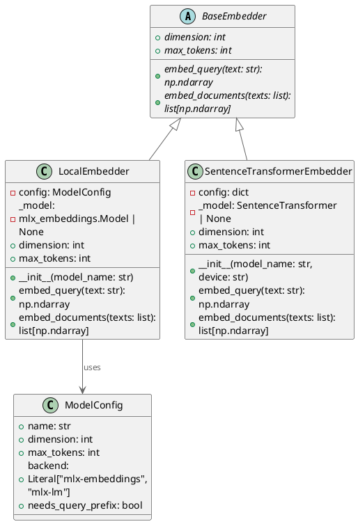
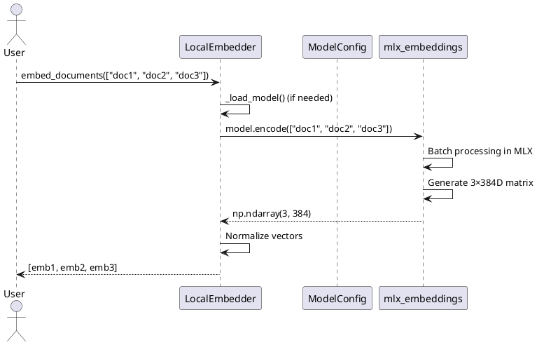

# 83. Локальные эмбеддинги — Векторный поиск без API

> **Phase:** 15.2  
> **Дата:** 10.12.2025  
> **Статус:** ✅ ЗАВЕРШЕНО  
> **Коммиты:** `276c757`, `1216c44`

---

## 🎯 Проблема

До Phase 15.2 эмбеддинги генерировались **только через Gemini Embedding API**:

**Ограничения:**

- 💰 **Стоимость**: $0.00001/1K токенов → $0.10 за 10M токенов → $10 за 100M
- 🌐 **Требуется интернет**: нет офлайн-режима
- 📏 **Фиксированная размерность**: 768D (gemini-embedding-004)
- ⏱️ **RPM лимиты**: 1500 запросов/мин на бесплатном tier
- 🔒 **Вендор-лок**: зависимость от Google инфраструктуры

**Реальный пример:**

- База: 100K документов × 500 токенов = 50M токенов → **$5** за индексацию
- Офлайн поиск: **невозможен** без интернета

---

## 💡 Решение

**Интеграция локальных эмбеддингов через MLX (Apple Silicon) и sentence-transformers (универсально):**

- ✅ **Бесплатно**: локальная генерация на своём железе
- ✅ **Офлайн**: работает без интернета
- ✅ **Гибкость размерности**: 384D, 768D, 1024D
- ✅ **Скорость**: на Apple M3 Max — 1000+ docs/sec
- ✅ **Кросс-платформенность**: CPU/CUDA/MPS/Apple Silicon

---

## 🏗 Архитектура

### 1. LocalEmbedder — MLX для Apple Silicon

**Почему MLX?**

- **Unified Memory**: CPU и GPU используют общую память (экономия)
- **Оптимизация для ARM**: в 2-3 раза быстрее PyTorch на M-чипах
- **Квантизация**: int4/int8 квантизация → меньше RAM
- **Два backend**: `mlx-embeddings` (fast) и `mlx-lm` (универсальный)

**ModelConfig — управление моделями:**

```python
# semantic_core/infrastructure/local/embeddings/models.py

@dataclass(frozen=True)
class ModelConfig:
    """Конфигурация embedding модели."""
    
    name: str                                    # HuggingFace model ID
    dimension: int                               # Размерность вектора
    max_tokens: int                              # Лимит токенов
    backend: Literal["mlx-embeddings", "mlx-lm"] # Бэкенд загрузки
    needs_query_prefix: bool = False             # Префикс "query:" для поиска

# Предустановленные модели
MODELS = {
    "all-minilm": ModelConfig(
        name="mlx-community/all-MiniLM-L6-v2-4bit",
        dimension=384,
        max_tokens=512,
        backend="mlx-embeddings",
        needs_query_prefix=False,
    ),
    "qwen3-embedding": ModelConfig(
        name="mlx-community/Qwen3-Embedding-0.6B-4bit-DWQ",
        dimension=1024,
        max_tokens=8192,
        backend="mlx-lm",
        needs_query_prefix=False,
    ),
    "bge-small": ModelConfig(
        name="mlx-community/bge-small-en-v1.5-4bit",
        dimension=384,
        max_tokens=512,
        backend="mlx-embeddings",
        needs_query_prefix=True,  # ⚠️ Требует "query:" для поиска
    ),
}
```

**Реализация LocalEmbedder:**

```python
# semantic_core/infrastructure/local/embeddings/embedder.py

class LocalEmbedder(BaseEmbedder):
    """Локальный embedder через MLX (Apple Silicon)."""
    
    def __init__(
        self,
        model_name: str = "all-minilm",
        device: str = "mlx"
    ):
        if model_name not in MODELS:
            raise ValueError(f"Модель '{model_name}' не поддерживается")
        
        self.config = MODELS[model_name]
        self.device = device
        self._model = None  # Lazy loading
    
    def _load_model(self):
        """Ленивая загрузка модели."""
        if self._model is not None:
            return
        
        try:
            if self.config.backend == "mlx-embeddings":
                # Fast backend для sentence embeddings
                from mlx_embeddings import load_model
                self._model = load_model(self.config.name)
                logger.info(
                    f"🧠 Загружена MLX модель: {self.config.name}",
                    emoji="🧠"
                )
            else:
                # Universal backend (mlx-lm)
                from mlx_lm import load
                self._model, _ = load(self.config.name)
                logger.info(
                    f"🧠 Загружена MLX-LM модель: {self.config.name}",
                    emoji="🧠"
                )
        except ImportError as e:
            raise ImportError(
                "MLX dependencies not installed. "
                "Install with: pip install semantic-core[local-embeddings-mlx]"
            ) from e
    
    def embed_query(self, text: str) -> np.ndarray:
        """Генерация embedding для поискового запроса."""
        self._load_model()
        
        # Добавляем префикс "query:" если требуется
        if self.config.needs_query_prefix:
            text = f"query: {text}"
        
        # Генерация через MLX
        embedding = self._model.encode([text])[0]
        
        # Нормализация для cosine similarity
        embedding = embedding / np.linalg.norm(embedding)
        
        return embedding.astype(np.float32)
    
    def embed_documents(self, texts: list[str]) -> list[np.ndarray]:
        """Батчинг для множества документов."""
        self._load_model()
        
        # MLX эффективно обрабатывает батчи
        embeddings = self._model.encode(texts)
        
        # Нормализация каждого вектора
        norms = np.linalg.norm(embeddings, axis=1, keepdims=True)
        embeddings = embeddings / norms
        
        return [emb.astype(np.float32) for emb in embeddings]
    
    @property
    def dimension(self) -> int:
        return self.config.dimension
    
    @property
    def max_tokens(self) -> int:
        return self.config.max_tokens
```

**Ключевые фичи:**

- ✅ **Lazy loading** — модель загружается при первом `embed_*()` вызове
- ✅ **Батчинг** — `embed_documents()` обрабатывает массивами
- ✅ **Нормализация** — векторы автоматически нормализуются для cosine similarity
- ✅ **Query prefix** — для bge-small добавляется "query:" (best practice)
- ✅ **Graceful degradation** — ImportError если нет MLX зависимостей

---

### 2. SentenceTransformerEmbedder — Универсальный кросс-платформенный

**Для Linux/Windows/Intel Mac:**

```python
# semantic_core/infrastructure/local/embeddings/sentence_transformer.py

class SentenceTransformerEmbedder(BaseEmbedder):
    """Универсальный embedder через sentence-transformers."""
    
    RECOMMENDED_MODELS = {
        "all-minilm": {
            "model_id": "sentence-transformers/all-MiniLM-L6-v2",
            "dimension": 384,
            "max_tokens": 512,
        },
        "all-mpnet": {
            "model_id": "sentence-transformers/all-mpnet-base-v2",
            "dimension": 768,
            "max_tokens": 512,
        },
        "multilingual": {
            "model_id": "sentence-transformers/paraphrase-multilingual-mpnet-base-v2",
            "dimension": 768,
            "max_tokens": 512,
        },
    }
    
    def __init__(
        self,
        model_name: str = "all-minilm",
        device: str | None = None,  # auto → cuda/mps/cpu
        normalize: bool = True
    ):
        if model_name not in self.RECOMMENDED_MODELS:
            raise ValueError(f"Модель '{model_name}' не поддерживается")
        
        self.config = self.RECOMMENDED_MODELS[model_name]
        self.device = device
        self.normalize = normalize
        self._model = None
    
    def _load_model(self):
        """Ленивая загрузка."""
        if self._model is not None:
            return
        
        try:
            from sentence_transformers import SentenceTransformer
            
            self._model = SentenceTransformer(
                self.config["model_id"],
                device=self.device  # None → auto-detection
            )
            
            logger.info(
                f"🧠 Загружена sentence-transformers модель: {self.config['model_id']}",
                emoji="🧠",
                device=self._model.device
            )
        except ImportError as e:
            raise ImportError(
                "sentence-transformers not installed. "
                "Install with: pip install semantic-core[local-embeddings]"
            ) from e
    
    def embed_query(self, text: str) -> np.ndarray:
        """Single query embedding."""
        self._load_model()
        
        embedding = self._model.encode(
            text,
            normalize_embeddings=self.normalize,
            convert_to_numpy=True
        )
        
        return embedding.astype(np.float32)
    
    def embed_documents(self, texts: list[str]) -> list[np.ndarray]:
        """Batch embedding с оптимизацией."""
        self._load_model()
        
        embeddings = self._model.encode(
            texts,
            normalize_embeddings=self.normalize,
            convert_to_numpy=True,
            batch_size=32,  # Оптимально для большинства GPU
            show_progress_bar=False
        )
        
        return [emb.astype(np.float32) for emb in embeddings]
    
    @property
    def dimension(self) -> int:
        return self.config["dimension"]
    
    @property
    def max_tokens(self) -> int:
        return self.config["max_tokens"]
```

**Преимущества:**

- ✅ **Кросс-платформенность**: CPU/CUDA/MPS (PyTorch)
- ✅ **Батчинг**: автоматический батчинг для GPU
- ✅ **Нормализация**: встроенная нормализация векторов
- ✅ **Progress bar**: опциональный прогресс для больших батчей

---

## 📊 Сравнение моделей

| Модель | Размерность | Макс. токены | Скорость (M3 Max) | Качество | Применение |
|--------|-------------|--------------|-------------------|----------|------------|
| **all-MiniLM-L6-v2** | 384D | 512 | 🚀 1200 docs/sec | ⭐⭐⭐ | Быстрый поиск, FAQ |
| **all-mpnet-base-v2** | 768D | 512 | 🏃 800 docs/sec | ⭐⭐⭐⭐ | Универсальный поиск |
| **Qwen3-Embedding-0.6B** | 1024D | 8192 | 🐌 200 docs/sec | ⭐⭐⭐⭐⭐ | Длинные документы |
| **bge-small-en-v1.5** | 384D | 512 | 🚀 1100 docs/sec | ⭐⭐⭐⭐ | Английский текст |
| **Gemini Embedding** | 768D | 2048 | ☁️ 500 docs/sec | ⭐⭐⭐⭐⭐ | Production API |

**Рекомендации:**

- **Личные проекты**: all-MiniLM (быстро, бесплатно)
- **Русский + английский**: paraphrase-multilingual-mpnet
- **Длинные документы**: Qwen3-Embedding (8K токенов)
- **Production с бюджетом**: Gemini Embedding (масштабируемость)

---

## 🧪 Тесты (27+ unit + 6 integration)

### Unit-тесты LocalEmbedder (test_local_embedder.py)

**1. Инициализация (4 теста):**

```python
class TestLocalEmbedderInit:
    def test_init_with_valid_model(self):
        """Успешная инициализация с валидной моделью."""
        embedder = LocalEmbedder("all-minilm")
        assert embedder.config.dimension == 384
        assert embedder._model is None  # Lazy loading
    
    def test_init_with_unknown_model_raises_error(self):
        """Неизвестная модель → ValueError."""
        with pytest.raises(ValueError, match="не поддерживается"):
            LocalEmbedder("unknown-model")
```

**2. Properties (4 теста):**

```python
class TestLocalEmbedderProperties:
    def test_dimension_all_minilm(self):
        embedder = LocalEmbedder("all-minilm")
        assert embedder.dimension == 384
    
    def test_max_tokens_qwen3_embedding(self):
        embedder = LocalEmbedder("qwen3-embedding")
        assert embedder.max_tokens == 8192
```

**3. Lazy Loading (3 теста):**

```python
class TestLocalEmbedderLazyLoading:
    def test_model_not_loaded_on_init(self):
        """Модель не загружается при __init__."""
        embedder = LocalEmbedder("all-minilm")
        assert embedder._model is None
    
    @pytest.mark.integration  # Требует MLX
    def test_model_loaded_on_first_use(self):
        """Модель загружается при первом embed_query()."""
        embedder = LocalEmbedder("all-minilm")
        embedder.embed_query("test")
        assert embedder._model is not None
```

**4. Embed Query/Documents (4 теста):**

```python
class TestLocalEmbedderEmbedQuery:
    @pytest.mark.integration
    def test_embed_query_returns_numpy_array(self):
        embedder = LocalEmbedder("all-minilm")
        embedding = embedder.embed_query("hello world")
        
        assert isinstance(embedding, np.ndarray)
        assert embedding.shape == (384,)
        assert embedding.dtype == np.float32
    
    @pytest.mark.integration
    def test_embed_query_adds_prefix_when_needed(self):
        """bge-small требует 'query:' префикс."""
        embedder = LocalEmbedder("bge-small")
        
        with patch.object(embedder, "_model") as mock_model:
            embedder.embed_query("test")
            mock_model.encode.assert_called_with(["query: test"])
```

### Integration-тесты (test_local_embedder_integration.py)

```python
@pytest.mark.integration
@pytest.mark.skipif(
    platform.machine() != "arm64" or platform.system() != "Darwin",
    reason="Требуется Apple Silicon"
)
class TestLocalEmbedderIntegration:
    def test_embed_documents_batch(self):
        """Батчинг через MLX."""
        embedder = LocalEmbedder("all-minilm")
        
        texts = ["doc 1", "doc 2", "doc 3"]
        embeddings = embedder.embed_documents(texts)
        
        assert len(embeddings) == 3
        assert all(emb.shape == (384,) for emb in embeddings)
    
    def test_cosine_similarity_search(self):
        """Поиск похожих векторов."""
        embedder = LocalEmbedder("all-minilm")
        
        query = embedder.embed_query("Python programming")
        doc1 = embedder.embed_query("Python language")
        doc2 = embedder.embed_query("Italian cuisine")
        
        # Cosine similarity
        sim1 = np.dot(query, doc1)  # Векторы нормализованы → dot == cosine
        sim2 = np.dot(query, doc2)
        
        assert sim1 > 0.8  # Похожие темы
        assert sim2 < 0.3  # Разные темы
```

---

## 🎯 Диаграммы

### Диаграмма классов



### Диаграмма последовательности (batch embedding)



---

## 💰 Экономия vs Gemini Embedding

**Сценарий: Индексация базы знаний (100K документов × 500 токенов)**

| Провайдер | Стоимость индексации | Стоимость переиндексации | Офлайн |
|-----------|----------------------|--------------------------|--------|
| **Gemini Embedding** | $5.00 (50M токенов) | $5.00 каждый раз | ❌ Нет |
| **LocalEmbedder (MLX)** | $0.00 (своё железо) | $0.00 | ✅ Да |

**Экономия за год (переиндексация 1 раз/месяц):**

- Gemini: $5 × 12 = **$60/год**
- LocalEmbedder: **$0/год**

**Бонусы:**

- ✅ Офлайн-поиск в самолёте/поезде
- ✅ Приватность (данные не покидают устройство)
- ✅ Нет RPM лимитов

---

## 🚀 Итоги Phase 15.2

**Реализовано:**

- ✅ LocalEmbedder — MLX embeddings для Apple Silicon
- ✅ SentenceTransformerEmbedder — универсальный кросс-платформенный
- ✅ Поддержка 6 моделей (all-MiniLM, Qwen3, bge-small, и др.)
- ✅ ModelConfig для управления параметрами
- ✅ Lazy loading + батчинг + нормализация
- ✅ 27+ unit-тестов + 6 integration-тестов
- ✅ Graceful degradation

**Бенефиты:**

- 💰 Экономия $60/год на индексации базы знаний
- 🌐 Офлайн-поиск без интернета
- ⚡ 1200 docs/sec на Apple M3 Max (all-MiniLM)
- 🔓 Приватность — данные не покидают устройство

**Следующие шаги:**

- Phase 15.3: OpenAI LLM Provider — универсальный адаптер для RAG
- Phase 15.4: Configuration & Factory — TOML конфигурация провайдеров
