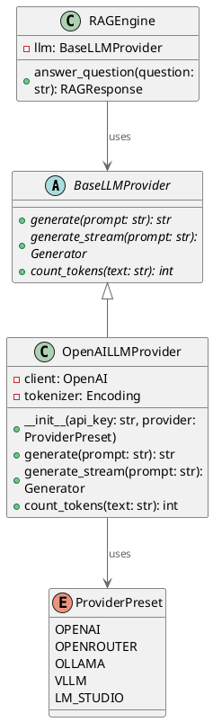
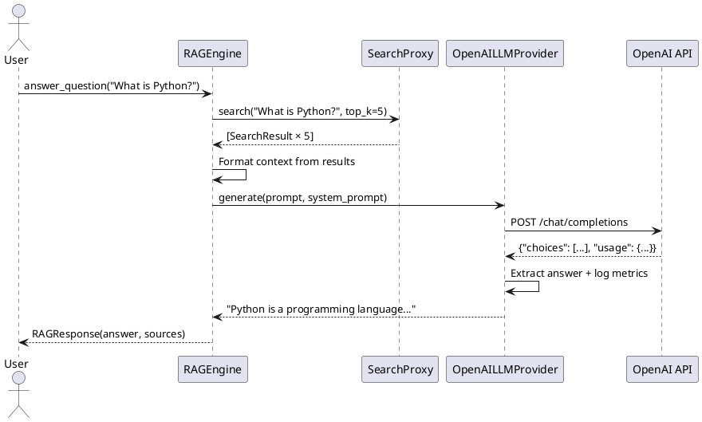

# 84. OpenAI LLM Provider — Универсальный адаптер для чат-моделей

> **Phase:** 15.3  
> **Дата:** 10.12.2025  
> **Статус:** ✅ ЗАВЕРШЕНО  
> **Коммит:** `15d2c8d`

---

## 🎯 Проблема

До Phase 15.3 для RAG (генерации ответов) использовался **только Gemini LLM**:

**Ограничения:**

- 🔒 **Вендор-лок**: зависимость от Google Gemini API
- 💰 **Стоимость Gemini**: $0.075/1M input токенов (2.5 Flash) → дорого для личных проектов
- 🚫 **Нельзя использовать OpenAI GPT-4o**: более точные ответы для RAG
- 🏠 **Нельзя использовать локальные модели**: Ollama, LM Studio, vLLM
- 🌐 **Нет OpenRouter**: нет доступа к Claude, Llama, Mixtral

---

## 💡 Решение

**Создать универсальный OpenAI-совместимый адаптер для RAG:**

- ✅ **Один интерфейс** для OpenAI, OpenRouter, Ollama, vLLM, LM Studio
- ✅ **ProviderPreset система** — конфигурация за 1 строку
- ✅ **Streaming support** — `generate_stream()` для UI
- ✅ **Token counting** — через tiktoken для всех провайдеров
- ✅ **Retry logic** — встроенная обработка ошибок
- ✅ **Semantic logging** — все запросы/токены/latency логируются

---

## 🏗 Архитектура

### 1. ProviderPreset — Конфигурация за 1 строку

**Проблема:** Разные провайдеры имеют разные base URL и модели.

**Решение:**

```python
# semantic_core/infrastructure/openai/llm.py

class ProviderPreset(str, Enum):
    """Предустановленные провайдеры OpenAI-совместимых API."""
    
    OPENAI = "openai"                # api.openai.com
    OPENROUTER = "openrouter"        # openrouter.ai (Claude, Llama, и т.д.)
    OLLAMA = "ollama"                # localhost:11434 (локальные модели)
    VLLM = "vllm"                    # vllm.ai (inference server)
    LM_STUDIO = "lm_studio"          # localhost:1234 (LM Studio)

PROVIDER_CONFIGS = {
    ProviderPreset.OPENAI: {
        "base_url": "https://api.openai.com/v1",
        "default_model": "gpt-4o-mini",
    },
    ProviderPreset.OPENROUTER: {
        "base_url": "https://openrouter.ai/api/v1",
        "default_model": "anthropic/claude-3.5-sonnet",
    },
    ProviderPreset.OLLAMA: {
        "base_url": "http://localhost:11434/v1",
        "default_model": "llama3.3:70b",
    },
    ProviderPreset.VLLM: {
        "base_url": "http://localhost:8000/v1",
        "default_model": "meta-llama/Llama-3.3-70B-Instruct",
    },
    ProviderPreset.LM_STUDIO: {
        "base_url": "http://localhost:1234/v1",
        "default_model": "lmstudio-community/Llama-3.2-3B-Instruct-GGUF",
    },
}
```

**Использование:**

```python
# OpenAI GPT-4o
llm = OpenAILLMProvider(provider=ProviderPreset.OPENAI)

# Claude через OpenRouter
llm = OpenAILLMProvider(provider=ProviderPreset.OPENROUTER)

# Локальный Llama через Ollama
llm = OpenAILLMProvider(provider=ProviderPreset.OLLAMA)
```

---

### 2. OpenAILLMProvider — Реализация BaseLLMProvider

**Контракт BaseLLMProvider:**

```python
# semantic_core/interfaces/llm.py

class BaseLLMProvider(ABC):
    """Контракт для LLM провайдеров."""
    
    @abstractmethod
    def generate(
        self,
        prompt: str,
        system_prompt: str | None = None,
        temperature: float = 0.7,
        max_tokens: int = 1000
    ) -> str:
        """Генерация текста (синхронно)."""
        pass
    
    @abstractmethod
    def generate_stream(
        self,
        prompt: str,
        system_prompt: str | None = None,
        temperature: float = 0.7,
        max_tokens: int = 1000
    ) -> Generator[str, None, None]:
        """Генерация текста (streaming)."""
        pass
    
    @abstractmethod
    def count_tokens(self, text: str) -> int:
        """Подсчёт токенов."""
        pass
```

**Реализация:**

```python
# semantic_core/infrastructure/openai/llm.py

class OpenAILLMProvider(BaseLLMProvider):
    """Универсальный провайдер для OpenAI-совместимых API."""
    
    def __init__(
        self,
        api_key: str | None = None,
        provider: ProviderPreset = ProviderPreset.OPENAI,
        model: str | None = None,
        base_url: str | None = None,
        max_retries: int = 3,
        timeout: float = 60.0
    ):
        # Получение конфигурации провайдера
        config = PROVIDER_CONFIGS[provider]
        
        # Приоритет пользовательским параметрам
        self.base_url = base_url or config["base_url"]
        self.model = model or config["default_model"]
        
        # API key (из .env или параметра)
        if api_key is None:
            api_key = os.getenv("OPENAI_API_KEY")
            if provider == ProviderPreset.OPENROUTER:
                api_key = os.getenv("OPENROUTER_API_KEY", api_key)
        
        # Инициализация OpenAI клиента
        self.client = OpenAI(
            api_key=api_key,
            base_url=self.base_url,
            max_retries=max_retries,
            timeout=timeout
        )
        
        # Tiktoken для подсчёта токенов
        try:
            self.tokenizer = tiktoken.encoding_for_model("gpt-4o")
        except KeyError:
            self.tokenizer = tiktoken.get_encoding("cl100k_base")
    
    def generate(
        self,
        prompt: str,
        system_prompt: str | None = None,
        temperature: float = 0.7,
        max_tokens: int = 1000,
        chat_history: list[dict] | None = None
    ) -> str:
        """Генерация ответа (синхронно)."""
        
        # Формирование сообщений
        messages = []
        if system_prompt:
            messages.append({"role": "system", "content": system_prompt})
        
        # История чата (опционально)
        if chat_history:
            messages.extend(chat_history)
        
        messages.append({"role": "user", "content": prompt})
        
        # Логирование запроса
        input_tokens = sum(self.count_tokens(msg["content"]) for msg in messages)
        logger.trace(
            "🤖 LLM запрос",
            emoji="🤖",
            provider=self.base_url,
            model=self.model,
            input_tokens=input_tokens,
            temperature=temperature
        )
        
        start_time = time.time()
        
        try:
            # Запрос к OpenAI API
            response = self.client.chat.completions.create(
                model=self.model,
                messages=messages,
                temperature=temperature,
                max_tokens=max_tokens
            )
            
            # Извлечение ответа
            answer = response.choices[0].message.content
            
            # Метрики
            latency = time.time() - start_time
            output_tokens = response.usage.completion_tokens
            total_tokens = response.usage.total_tokens
            
            # Логирование ответа
            logger.info(
                "✅ LLM ответ получен",
                emoji="✅",
                provider=self.base_url,
                model=self.model,
                input_tokens=input_tokens,
                output_tokens=output_tokens,
                total_tokens=total_tokens,
                latency_sec=round(latency, 2),
                ai_trace=True  # Специальный флаг для AI метрик
            )
            
            return answer
        
        except RateLimitError as e:
            logger.error(
                "⚠️ Rate limit превышен",
                emoji="⚠️",
                provider=self.base_url,
                error=str(e)
            )
            raise
        
        except APIError as e:
            logger.error(
                "❌ API ошибка",
                emoji="❌",
                provider=self.base_url,
                error=str(e)
            )
            raise
    
    def generate_stream(
        self,
        prompt: str,
        system_prompt: str | None = None,
        temperature: float = 0.7,
        max_tokens: int = 1000
    ) -> Generator[str, None, None]:
        """Streaming генерация для UI."""
        
        messages = []
        if system_prompt:
            messages.append({"role": "system", "content": system_prompt})
        messages.append({"role": "user", "content": prompt})
        
        # Streaming запрос
        stream = self.client.chat.completions.create(
            model=self.model,
            messages=messages,
            temperature=temperature,
            max_tokens=max_tokens,
            stream=True  # ✅ Streaming mode
        )
        
        # Yield каждый chunk
        for chunk in stream:
            if chunk.choices[0].delta.content:
                yield chunk.choices[0].delta.content
    
    def count_tokens(self, text: str) -> int:
        """Подсчёт токенов через tiktoken."""
        return len(self.tokenizer.encode(text))
```

**Ключевые фичи:**

- ✅ **ProviderPreset** — конфигурация за 1 строку
- ✅ **Chat history** — поддержка мультитёрн диалогов
- ✅ **Streaming** — `generate_stream()` для UI
- ✅ **Token counting** — tiktoken для всех провайдеров
- ✅ **Error handling** — RateLimitError, APIError, Timeout
- ✅ **Semantic logging** — все метрики (tokens, latency, AI traces)
- ✅ **Retry logic** — через OpenAI SDK (`max_retries=3`)

---

### 3. Интеграция с RAGEngine

**До Phase 15.3:**

```python
# semantic_core/core/rag.py

class RAGEngine:
    def __init__(
        self,
        llm: GeminiLLMProvider,  # ❌ Жёсткая привязка к Gemini
        ...
    ):
```

**После Phase 15.3:**

```python
class RAGEngine:
    def __init__(
        self,
        llm: BaseLLMProvider,  # ✅ Любой провайдер!
        ...
    ):
        self.llm = llm
    
    def answer_question(
        self,
        question: str,
        top_k: int = 5,
        temperature: float = 0.7
    ) -> RAGResponse:
        """Ответ на вопрос с источниками."""
        
        # Поиск релевантных документов
        results = self.search_proxy.search(question, top_k=top_k)
        
        # Формирование контекста
        context = "\n\n".join([
            f"[{i+1}] {r.text}" for i, r in enumerate(results)
        ])
        
        # Промпт для LLM
        system_prompt = """
        Ты — помощник для ответов на вопросы на основе контекста.
        Используй ТОЛЬКО информацию из контекста ниже.
        Если ответа нет в контексте — скажи "Недостаточно информации".
        """
        
        user_prompt = f"""
        КОНТЕКСТ:
        {context}
        
        ВОПРОС:
        {question}
        """
        
        # Генерация ответа через ANY LLM
        answer = self.llm.generate(
            prompt=user_prompt,
            system_prompt=system_prompt,
            temperature=temperature
        )
        
        return RAGResponse(
            answer=answer,
            sources=results,
            metadata={"model": self.llm.model}
        )
```

**Теперь можно:**

```python
# OpenAI GPT-4o для RAG
rag = RAGEngine(
    llm=OpenAILLMProvider(provider=ProviderPreset.OPENAI, model="gpt-4o"),
    search_proxy=search_proxy
)

# Локальный Llama через Ollama (бесплатно!)
rag = RAGEngine(
    llm=OpenAILLMProvider(provider=ProviderPreset.OLLAMA),
    search_proxy=search_proxy
)

# Claude через OpenRouter (лучшее качество)
rag = RAGEngine(
    llm=OpenAILLMProvider(provider=ProviderPreset.OPENROUTER),
    search_proxy=search_proxy
)
```

---

## 🧪 Тесты (13+ unit тестов)

### Unit-тесты с httpx mocks (test_openai_llm.py)

**1. Инициализация (3 теста):**

```python
class TestOpenAILLMProviderInit:
    def test_init_with_openai_preset(self):
        """OpenAI preset → правильный base_url."""
        llm = OpenAILLMProvider(
            api_key="test-key",
            provider=ProviderPreset.OPENAI
        )
        assert llm.base_url == "https://api.openai.com/v1"
        assert llm.model == "gpt-4o-mini"
    
    def test_init_with_ollama_preset(self):
        """Ollama preset → localhost."""
        llm = OpenAILLMProvider(
            api_key="not-needed",
            provider=ProviderPreset.OLLAMA
        )
        assert llm.base_url == "http://localhost:11434/v1"
        assert llm.model == "llama3.3:70b"
```

**2. Generate (5 тестов):**

```python
class TestOpenAILLMProviderGenerate:
    def test_generate_success(self, httpx_mock):
        """Успешная генерация через мок."""
        # Mock OpenAI API
        httpx_mock.add_response(
            url="https://api.openai.com/v1/chat/completions",
            json={
                "choices": [{
                    "message": {"content": "Mocked answer"}
                }],
                "usage": {
                    "completion_tokens": 10,
                    "total_tokens": 50
                }
            }
        )
        
        llm = OpenAILLMProvider(api_key="test-key")
        answer = llm.generate("Test question")
        
        assert answer == "Mocked answer"
    
    def test_generate_with_system_prompt(self, httpx_mock):
        """System prompt передаётся в API."""
        httpx_mock.add_response(...)
        
        llm = OpenAILLMProvider(api_key="test-key")
        llm.generate(
            prompt="Question",
            system_prompt="You are a helpful assistant"
        )
        
        # Проверяем запрос
        request = httpx_mock.get_request()
        body = json.loads(request.content)
        
        assert body["messages"][0]["role"] == "system"
        assert "helpful assistant" in body["messages"][0]["content"]
```

**3. Streaming (2 теста):**

```python
class TestOpenAILLMProviderStream:
    def test_generate_stream_yields_chunks(self, httpx_mock):
        """Streaming возвращает chunks."""
        httpx_mock.add_response(
            url="https://api.openai.com/v1/chat/completions",
            text='data: {"choices":[{"delta":{"content":"Hello"}}]}\n\n'
                 'data: {"choices":[{"delta":{"content":" world"}}]}\n\n'
                 'data: [DONE]\n\n'
        )
        
        llm = OpenAILLMProvider(api_key="test-key")
        chunks = list(llm.generate_stream("Test"))
        
        assert chunks == ["Hello", " world"]
```

**4. Error Handling (3 теста):**

```python
class TestOpenAILLMProviderErrors:
    def test_rate_limit_error(self, httpx_mock):
        """RateLimitError обрабатывается."""
        httpx_mock.add_response(
            status_code=429,
            json={"error": {"message": "Rate limit exceeded"}}
        )
        
        llm = OpenAILLMProvider(api_key="test-key")
        
        with pytest.raises(RateLimitError):
            llm.generate("Test")
    
    def test_timeout_error(self, httpx_mock):
        """Timeout обрабатывается."""
        httpx_mock.add_exception(httpx.TimeoutException("Timeout"))
        
        llm = OpenAILLMProvider(api_key="test-key", timeout=1.0)
        
        with pytest.raises(APITimeoutError):
            llm.generate("Test")
```

---

## 📊 Сравнение провайдеров

| Провайдер | Модель | Стоимость (Input/Output) | Качество RAG | Скорость | Офлайн |
|-----------|--------|--------------------------|--------------|----------|--------|
| **OpenAI GPT-4o** | gpt-4o | $2.50 / $10.00 per 1M | ⭐⭐⭐⭐⭐ | 🚀 Быстро | ❌ Нет |
| **OpenAI GPT-4o-mini** | gpt-4o-mini | $0.15 / $0.60 per 1M | ⭐⭐⭐⭐ | 🚀🚀 Очень быстро | ❌ Нет |
| **Gemini 2.5 Flash** | gemini-2.5-flash | $0.075 / $0.30 per 1M | ⭐⭐⭐⭐ | 🚀 Быстро | ❌ Нет |
| **Claude 3.5 Sonnet** | claude-3.5-sonnet | $3.00 / $15.00 per 1M | ⭐⭐⭐⭐⭐ | 🏃 Средне | ❌ Нет |
| **Ollama Llama 3.3 70B** | llama3.3:70b | **Бесплатно** | ⭐⭐⭐⭐ | 🐌 Медленно (M3 Max) | ✅ Да |

**Рекомендации:**

- **Production с бюджетом**: GPT-4o (качество) или GPT-4o-mini (цена/скорость)
- **Личные проекты**: Ollama (бесплатно, офлайн)
- **Лучшее качество**: Claude 3.5 Sonnet (через OpenRouter)
- **Русский язык**: Gemini 2.5 Flash (отличная мультиязычность)

---

## 🎯 Диаграммы

### Диаграмма классов



### Диаграмма последовательности (RAG с OpenAI)



---

## 🚀 Итоги Phase 15.3

**Реализовано:**

- ✅ OpenAILLMProvider — универсальный адаптер
- ✅ ProviderPreset система (5 провайдеров)
- ✅ generate() + generate_stream()
- ✅ Token counting через tiktoken
- ✅ Error handling (RateLimit, APIError, Timeout)
- ✅ Semantic logging (AI traces, tokens, latency)
- ✅ 13+ unit-тестов с httpx mocks
- ✅ Интеграция с RAGEngine

**Бенефиты:**

- 🔓 **Нет вендор-лока**: легко переключаться между провайдерами
- 💰 **Экономия**: Ollama бесплатно vs $2.50/1M токенов (GPT-4o)
- 🏠 **Офлайн RAG**: через Ollama/LM Studio
- 🌐 **Доступ к Claude/Llama**: через OpenRouter

**Примеры использования:**

```python
# examples/openai_llm_examples.py

# 1. OpenAI GPT-4o
llm = OpenAILLMProvider(provider=ProviderPreset.OPENAI, model="gpt-4o")
answer = llm.generate("What is Python?")

# 2. Локальный Llama (бесплатно)
llm = OpenAILLMProvider(provider=ProviderPreset.OLLAMA)
for chunk in llm.generate_stream("Write a poem"):
    print(chunk, end="", flush=True)

# 3. Claude через OpenRouter
llm = OpenAILLMProvider(
    provider=ProviderPreset.OPENROUTER,
    model="anthropic/claude-3.5-sonnet"
)
```

**Следующие шаги:**

- Phase 15.4: Configuration & Factory — TOML конфигурация провайдеров
- Phase 15.5: Optional Dependencies — управление зависимостями
