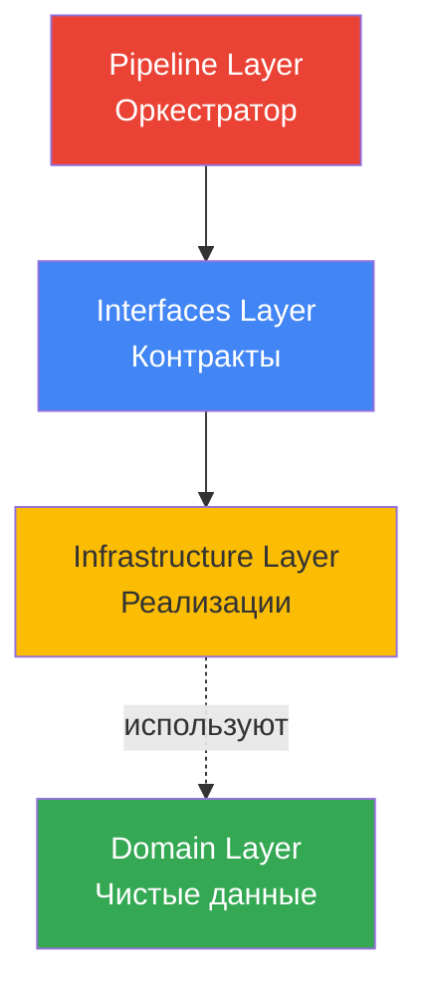
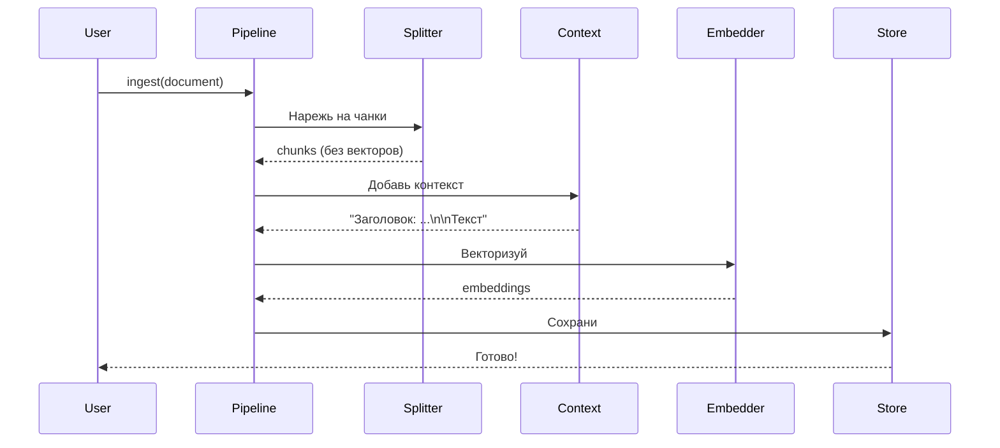

# 🏗️ SOLID Рефакторинг: от прототипа к библиотеке

> Как мы разделили код на независимые слои

---

## 🎯 Проблема: всё связано напрямую

Представь: ты написал рабочий прототип. Векторный поиск работает, Gemini генерирует эмбеддинги, SQLite хранит данные. Всё отлично!

Но потом понимаешь:

- Хочешь попробовать OpenAI вместо Gemini → **нужно переписывать половину кода**
- Решил перейти с SQLite на PostgreSQL → **переделывать интеграцию с БД**
- Нужно протестировать без затрат на API → **невозможно, всё завязано на реальный Gemini**

**Проблема:** Бизнес-логика намертво привязана к конкретным технологиям.

```
Note модель → напрямую использует → EmbeddingGenerator (Gemini)
                                   → database.py (SQLite)
                                   → HybridSearchMixin (Peewee ORM)
```

Изменить что-то одно = сломать всё остальное!

---

## 💡 Решение: разделение ответственности

Мы разбили систему на **4 независимых слоя**, где каждый знает только о своих задачах:



**Ключевая идея:** Слои общаются через **интерфейсы**, а не напрямую!

---

## 📦 Слой 1: Domain (что храним)

Самый простой слой — **чистые объекты данных**. Никаких зависимостей от БД или API!

### Зачем это нужно?

Раньше у нас были ORM модели:

```python
class Note(Model):  # ← Привязка к Peewee!
    title = CharField()
    content = TextField()
```

**Проблема:** Такой объект нельзя вернуть из API (Peewee-специфичный), нельзя использовать без БД.

**Решение:** Используем простые dataclass:

- `Document` — исходный документ (title, content, metadata)
- `Chunk` — фрагмент документа (text, index, embedding)
- `SearchResult` — результат поиска (document, score, match_type)

Теперь эти объекты можно:
- ✅ Сериализовать в JSON
- ✅ Передавать между слоями
- ✅ Тестировать без БД
- ✅ Использовать с любой ORM (или вообще без неё)

---

## 📋 Слой 2: Interfaces (как общаться)

Это **контракты** — правила игры, которым должны подчиняться все реализации.

### Зачем интерфейсы?

Допустим, ты хочешь поменять Gemini на OpenAI. Без интерфейсов:

```python
# В 20 местах кода
embedder = GeminiEmbedder(api_key="...")
vector = embedder.embed_document(text)  # ← Специфичный метод!
```

Теперь тебе нужно найти ВСЕ места и переписать. А если методы называются по-другому? Всё сломается!

**С интерфейсами:**

```python
class BaseEmbedder(ABC):
    @abstractmethod
    def embed_documents(self, texts: list[str]) -> list[np.ndarray]:
        """Любая AI-модель ОБЯЗАНА реализовать этот метод"""
```

Теперь **и Gemini, и OpenAI** должны реализовать одинаковые методы:

```python
gemini = GeminiEmbedder(...)      # ✅ Работает
openai = OpenAIEmbedder(...)      # ✅ Тоже работает
fake = FakeEmbedder(...)          # ✅ Для тестов работает!
```

Код пайплайна **не меняется** — ему всё равно, кто именно генерирует векторы!

### Наши интерфейсы

1. **BaseEmbedder** — генерирует векторы (Gemini, OpenAI, Local Models)
2. **BaseVectorStore** — хранит и ищет (SQLite, PostgreSQL, Qdrant)
3. **BaseSplitter** — режет текст (Simple, Markdown, Code-aware)
4. **BaseContextStrategy** — обогащает чанки (Basic, Hierarchical, No-context)

---

## ⚙️ Слой 3: Infrastructure (как делаем)

Здесь живут **реальные адаптеры** к технологиям: Gemini API, SQLite, Peewee ORM.

### Пример: GeminiEmbedder

Реализует интерфейс `BaseEmbedder`, но внутри использует Google API:

**Что он делает:**
- Конфигурирует Gemini API
- Отправляет запросы с правильным task_type
- Нормализует векторы
- Обрабатывает ошибки сети

**Что он НЕ знает:**
- Как хранятся данные (это задача Store)
- Как режется текст (это задача Splitter)
- Кто его вызывает (это задача Pipeline)

### Пример: PeeweeVectorStore

Реализует интерфейс `BaseVectorStore`, но внутри работает с SQLite:

**Что он делает:**
- Создаёт внутренние ORM модели (`DocumentModel`, `ChunkModel`)
- Инициализирует vec0 и fts5 таблицы
- Выполняет SQL запросы для поиска
- Преобразует результаты обратно в Domain DTO

**Ключевой момент:** Снаружи никто не видит Peewee! Пользователь работает с `Document` и `Chunk`, а не с `DocumentModel`.

---

## 🎼 Слой 4: Pipeline (кто командует)

Это **дирижёр оркестра** — собирает все компоненты вместе.

### Dependency Injection

Вместо того, чтобы создавать зависимости внутри:

```python
# ❌ ПЛОХО
class SemanticCore:
    def __init__(self):
        self.embedder = GeminiEmbedder()  # Жёстко зашито!
```

Мы **передаём их извне**:

```python
# ✅ ХОРОШО
class SemanticCore:
    def __init__(
        self,
        embedder: BaseEmbedder,    # ← Любой!
        store: BaseVectorStore,     # ← Любой!
        ...
    ):
```

Теперь можно:
- Использовать Gemini в продакшене
- Использовать FakeEmbedder в тестах
- Переключиться на OpenAI одной строкой

### Поток данных



**Каждый делает своё, никто не лезет в чужие дела!**

---

## ✅ Что мы получили

### 1. Гибкость

Хочешь заменить Gemini на OpenAI?

```python
# Было
core = SemanticCore(embedder=GeminiEmbedder(...), ...)

# Стало
core = SemanticCore(embedder=OpenAIEmbedder(...), ...)
```

Всё! Остальной код **не меняется**.

### 2. Тестируемость

Хочешь протестировать без денег на API?

```python
class FakeEmbedder(BaseEmbedder):
    def embed_documents(self, texts):
        return [random.rand(768) for _ in texts]

core = SemanticCore(embedder=FakeEmbedder(), ...)  # Бесплатно!
```

### 3. Переносимость

Хочешь использовать в другом проекте?

```python
# Копируешь semantic_core/ целиком
# Подключаешь свои компоненты:
embedder = MyCustomEmbedder()
store = MyRedisStore()
core = SemanticCore(embedder=embedder, store=store, ...)
```

Работает сразу!

---

## 🎓 SOLID на практике

### Single Responsibility (Одна задача)

- `SimpleSplitter` — **только** режет текст
- `GeminiEmbedder` — **только** векторизует
- `PeeweeVectorStore` — **только** хранит

Никто не делает чужую работу!

### Open/Closed (Открыт для расширения)

Добавить новый сплиттер:

```python
class MarkdownSplitter(BaseSplitter):
    def split(self, document):
        # Режем по заголовкам...
```

**Ничего не меняем** в Pipeline или Store!

### Liskov Substitution (Взаимозаменяемость)

Любой класс, реализующий `BaseEmbedder`, работает одинаково:

```python
def process(embedder: BaseEmbedder):  # ← Неважно, кто конкретно
    vectors = embedder.embed_documents(texts)
```

### Interface Segregation (Минимальные интерфейсы)

`BaseEmbedder` имеет всего 2 метода — больше и не нужно!

### Dependency Inversion (Зависим от абстракций)

Pipeline зависит от `BaseEmbedder`, а не от `GeminiEmbedder` напрямую.

---

## 🔮 Что дальше?

Эта архитектура — **фундамент** для следующих фаз:

- **Фаза 2:** Markdown парсинг по заголовкам
- **Фаза 3:** Async batch processing
- **Фаза 4:** Мультимодальность (изображения, видео)

Каждая фаза просто **добавляет новые реализации** интерфейсов, не ломая старый код!

---

**← [Назад: Parent-Child Retrieval](09_parent_child_retrieval.md)**

**↑ [К оглавлению](00_overview.md)**

**→ Дальше: Фаза 2 (когда будет готова)** 🚀
