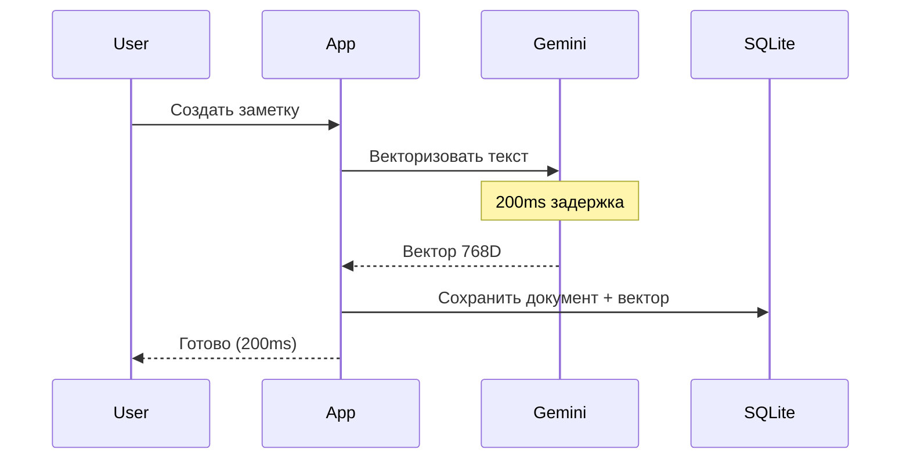
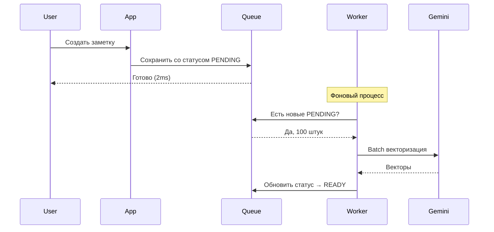
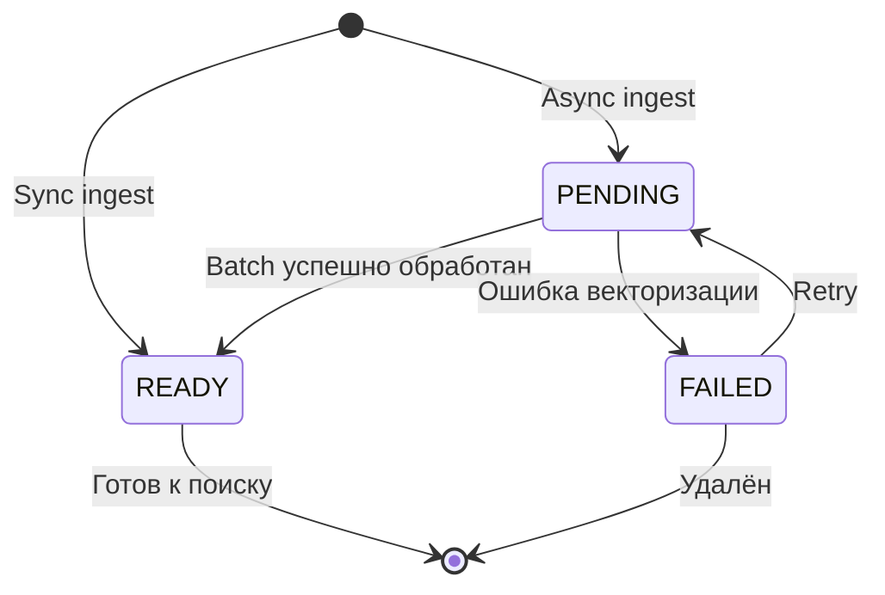

# ⚡ Async Processing: От синхронной блокировки к очереди

> Почему сохранение документов больше не блокирует UI

---

## 📌 Что это такое?

**Async режим** — это возможность сохранить документ в базу данных **без мгновенной векторизации**. Текст сохраняется, а эмбеддинги создаются позже в фоновом процессе.

Простая идея: **разделить запись в БД и обращение к API**.

---

## 🎯 Зачем это нужно?

**Проблема: Блокировка UI**

Представь пользователя, который импортирует 1000 статей из RSS:

```
Пользователь нажимает "Импорт" → UI замирает на 2 минуты
```

Почему так долго? **Каждая статья векторизуется синхронно:**

1. Текст отправляется в Gemini API
2. Ждём ответа (~200ms на статью)
3. Сохраняем вектор в БД

**1000 статей × 200ms = 200 секунд = 3+ минуты блокировки!**

Пользователь думает: "Приложение зависло?" и закрывает окно.

---

**Решение: Отложенная векторизация**

```
Пользователь нажимает "Импорт" → Готово за 2 секунды!
```

Что происходит:

1. **Сразу:** Тексты сохраняются в БД со статусом `PENDING`
2. **Позже:** Фоновый worker обрабатывает очередь и создаёт векторы

**Аналогия:** Как быстрая касса в супермаркете — ты кладёшь товары в корзину (быстро), а оплата происходит позже на отдельной кассе.

---

## 🔍 Как это работает?

### Sync режим (старый подход)



**Проблема:** Пользователь **ждёт** ответа от Gemini API.

---

### Async режим (новый подход)



**Преимущество:** Пользователь **не ждёт** API. UI остаётся отзывчивым.

---

## 📊 Сравнение режимов

| Критерий | Sync режим | Async режим |
|----------|------------|-------------|
| **Скорость сохранения** | 🐢 200ms/документ | 🚀 2ms/документ |
| **Блокировка UI** | ❌ Да, на время API | ✅ Нет |
| **Доступность поиска** | ✅ Сразу после сохранения | ⚠️ После обработки очереди |
| **Стоимость** | 💰 $0.025/1M tokens | 💰💰 $0.0125/1M tokens (50% дешевле) |
| **Use case** | Интерактивные операции | Массовая загрузка |

---

## 🔄 Статусы чанков

Каждый чанк проходит жизненный цикл:



### Описание статусов

| Статус | Значение | Вектор в БД? | Доступен для поиска? |
|--------|----------|--------------|----------------------|
| **PENDING** | Ожидает векторизации | ❌ Нет | ❌ Нет |
| **READY** | Вектор создан | ✅ Да | ✅ Да |
| **FAILED** | Ошибка обработки | ❌ Нет | ❌ Нет |

---

## ⚠️ Важные нюансы

### 1. Когда использовать sync, а когда async?

**Sync режим:**

- ✅ Пользователь создаёт 1-5 документов вручную
- ✅ Нужен **мгновенный поиск** после сохранения
- ✅ Интерактивные операции (создание заметки, статьи)

**Async режим:**

- ✅ Импорт больших объёмов (100+ документов)
- ✅ CI/CD пайплайны (векторизация документации)
- ✅ Ночная переиндексация базы знаний
- ✅ Когда UI не должен блокироваться

**Аналогия:** Sync — как экспресс-доставка (дорого, быстро). Async — как обычная почта (дешевле, медленнее).

---

### 2. Сохранение текста для векторизации

**Проблема:** В async режиме векторизация откладывается, но **как запомнить текст** для будущей обработки?

**Решение:** Специальное поле `_vector_source` в JSON metadata:

```json
{
  "source_id": 123,
  "author": "Alice",
  "_vector_source": "Document: Python Tutorial\n\nSection: Basics\n\nChunk: Variables..."
}
```

**Почему не в `chunk.content`?**

- `chunk.content` — это **оригинальный текст** (без контекста)
- `_vector_source` — **обогащённый текст** с breadcrumbs для лучшего поиска

**Пример:**

```
chunk.content = "Variables store data in memory."

_vector_source = """
Document: Python Tutorial
Section 1: Basics
Subsection 1.2: Variables

Variables store data in memory.
"""
```

Gemini получает контекст (название документа + секция) → **более точные векторы**.

---

### 3. Что происходит с поиском в PENDING чанках?

**Вопрос:** Пользователь создал 100 документов в async режиме и сразу ищет. Что найдёт?

**Ответ:** Только те документы, которые уже обработаны (статус `READY`).

**SQL фильтр:**

```sql
SELECT * FROM chunks_vec
WHERE embedding_status = 'READY'  -- Только готовые векторы
```

**Решение для UX:**

Показывать индикатор прогресса:

```
Поиск: "Python tutorial"
Найдено: 20 результатов
⚠️ Ещё 80 документов в обработке...
```

---

### 4. Переключение режима на лету

**Можно ли смешивать sync и async?**

**Да!** Режим выбирается **для каждого вызова** `ingest()`:

```python
# Срочный документ — синхронно
core.ingest(urgent_doc, mode='sync')

# Массовая загрузка — асинхронно
for doc in archive:
    core.ingest(doc, mode='async')
```

**Важно:** Чанки с разными статусами **мирно сосуществуют** в одной БД.

---

## 🎓 Аналогия из жизни

Представь ресторан с двумя типами заказов:

**Sync режим** — "К столу" (Dine-in):

- Ты садишься, заказываешь, **ждёшь** приготовления
- Получаешь еду горячей, сразу ешь
- Дороже (обслуживание)

**Async режим** — "Предзаказ на доставку" (Takeout):

- Ты оформляешь заказ онлайн, **уходишь**
- Через 30 минут возвращаешься — еда готова
- Дешевле (нет обслуживания за столом)

---

## 🔗 Следующий шаг

Теперь ты понимаешь **почему** нужен async режим. Но **как именно** экономятся деньги через Batch API?

→ [**21. Google Batch API: 50% Cost Savings**](21_batch_api_economics.md)

---

**← [Назад к оглавлению](00_overview.md)**
